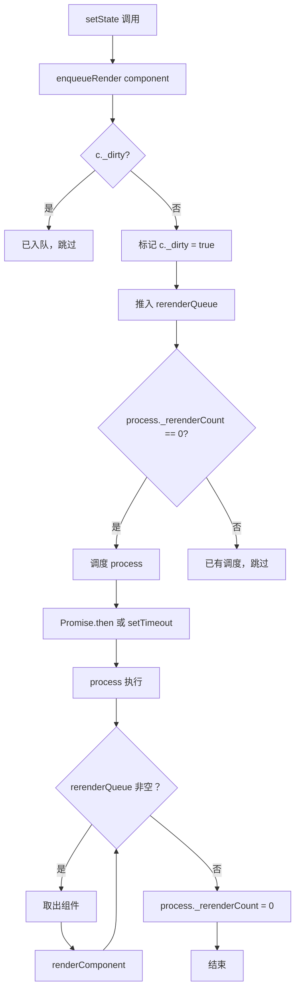
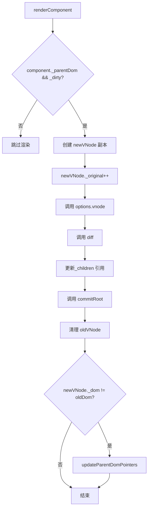
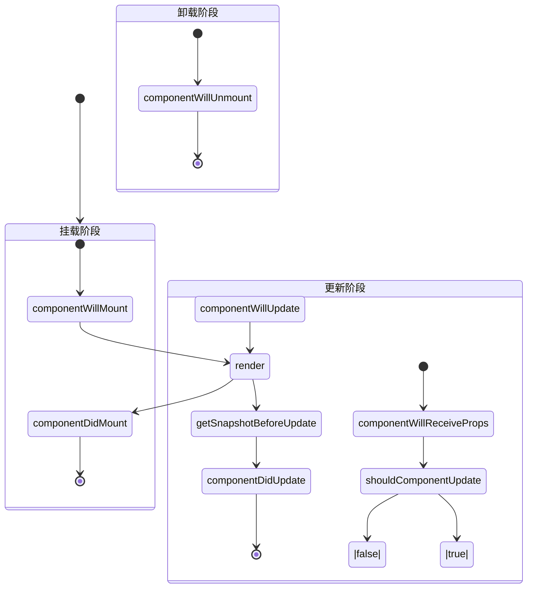
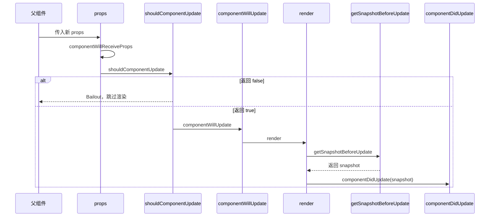

# 第 6 章：Component 组件与生命周期实现

> **本章是《Preact 源码解析》系列的第 6 章**，聚焦于 Component 基类的完整实现。我们将深入理解类组件的工作原理、setState 异步批处理机制，以及 8 个生命周期钩子的调用时机。

---

## 6.1 Component 基类结构

### 6.1.1 BaseComponent 定义

```javascript
// 文件：src/component.js
// 类：BaseComponent - 所有类组件的基类

export function BaseComponent(props, context) {
  this.props = props;
  this.context = context;
}
```

**核心属性**（实例化时初始化）：

| 属性 | 来源 | 作用 |
|------|------|------|
| `props` | 构造函数参数 | 父组件传入的属性 |
| `context` | 构造函数参数 | 从祖先组件继承的上下文 |
| `state` | 组件内部定义 | 组件状态（初始为空对象） |
| `base` | 渲染时设置 | 指向组件的根 DOM 节点 |
| `_vnode` | 渲染时设置 | 指向当前 VNode |
| `_parentDom` | 渲染时设置 | 父 DOM 容器 |
| `_globalContext` | 渲染时设置 | 全局 Context |

**内部属性**（Preact 使用，不建议访问）：

| 属性 | 作用 |
|------|------|
| `_nextState` | 下一次 state（用于批量更新） |
| `_dirty` | 是否需要重新渲染 |
| `_force` | 是否强制更新（跳过 shouldComponentUpdate） |
| `_renderCallbacks` | 渲染回调队列 |
| `_stateCallbacks` | state 回调队列 |
| `_processingException` | 错误处理标志 |

### 6.1.2 组件实例化过程

```javascript
// 文件：src/diff/index.js
// 组件实例化代码

if (oldVNode._component) {
  // 复用旧组件实例
  c = newVNode._component = oldVNode._component;
} else {
  // 实例化新组件
  if (isClassComponent) {
    // 类组件：调用构造函数
    newVNode._component = c = new newType(newProps, componentContext);
  } else {
    // 函数组件：包装成 BaseComponent
    newVNode._component = c = new BaseComponent(newProps, componentContext);
    c.constructor = newType;
    c.render = doRender;  // 包装 render 函数
  }
  
  // 初始化状态
  if (!c.state) c.state = {};
  c._globalContext = globalContext;
  isNew = c._dirty = true;  // 标记为新组件
  c._renderCallbacks = [];
  c._stateCallbacks = [];
}
```

**类组件 vs 函数组件**：

| 方面 | 类组件 | 函数组件 |
|------|--------|---------|
| 实例化 | `new Component()` | `new BaseComponent()` |
| render 方法 | 用户定义 | `doRender` 包装 |
| 状态管理 | `this.state` | Hooks |
| 生命周期 | 支持 | 不支持（用 useEffect） |

---

## 6.2 setState 异步批处理

### 6.2.1 setState 完整实现

```javascript
// 文件：src/component.js
// 方法：BaseComponent.prototype.setState

BaseComponent.prototype.setState = function (update, callback) {
  let s;
  
  // ========== 步骤 1: 克隆 state（如果需要）==========
  
  if (this._nextState != NULL && this._nextState != this.state) {
    s = this._nextState;  // 使用已有的 nextState
  } else {
    s = this._nextState = assign({}, this.state);  // 克隆当前 state
  }
  
  // ========== 步骤 2: 处理 update 函数 ==========
  
  if (typeof update == 'function') {
    // 支持函数式更新：setState((state, props) => newState)
    update = update(assign({}, s), this.props);
  }
  
  // ========== 步骤 3: 合并 state ==========
  
  if (update) {
    assign(s, update);  // 浅合并
  }
  
  // ========== 步骤 4: 跳过 null 更新 ==========
  
  if (update == NULL) return;
  
  // ========== 步骤 5: 入队渲染 ==========
  
  if (this._vnode) {
    if (callback) {
      this._stateCallbacks.push(callback);
    }
    enqueueRender(this);  // 关键：异步批处理
  }
};
```

**关键点解析**：

### 6.2.2 为什么需要 _nextState？

```javascript
// 场景：多次 setState 调用

this.setState({ count: 1 });  // 第 1 次
this.setState({ count: 2 });  // 第 2 次
this.setState({ count: 3 });  // 第 3 次

// 第 1 次调用：
// _nextState = null → 克隆 state → _nextState = { count: 1 }
// enqueueRender(component)

// 第 2 次调用：
// _nextState != null → 直接使用 _nextState
// _nextState = { count: 2 }（覆盖）
// enqueueRender(component) - 不会重复入队

// 第 3 次调用：
// _nextState != null → 直接使用 _nextState
// _nextState = { count: 3 }（覆盖）
// enqueueRender(component) - 不会重复入队

// 最终：只渲染一次，state = { count: 3 }
```

**设计优势**：

| 方面 | 无 _nextState | 有 _nextState |
|------|-------------|--------------|
| 多次 setState | 多次渲染 | 一次渲染 |
| 性能 | 较差 | 优秀 |
| state 合并 | 可能丢失 | 正确合并 |

### 6.2.3 enqueueRender 批处理机制

```javascript
// 文件：src/component.js
// 函数：enqueueRender() - 入队渲染

let rerenderQueue = [];
let prevDebounce;

const defer =
  typeof Promise == 'function'
    ? Promise.prototype.then.bind(Promise.resolve())
    : setTimeout;

export function enqueueRender(c) {
  if (
    (!c._dirty &&           // 组件还未标记为脏
      (c._dirty = true) &&  // 标记为脏
      rerenderQueue.push(c) &&  // 入队
      !process._rerenderCount++) ||  // 增加计数
    prevDebounce != options.debounceRendering
  ) {
    prevDebounce = options.debounceRendering;
    (prevDebounce || defer)(process);  // 异步执行 process
  }
}
```

**执行流程**：



**批处理示例**：

```javascript
// 用户代码
this.setState({ count: 1 });  // ①
this.setState({ count: 2 });  // ②
this.setState({ count: 3 });  // ③

// 执行流程：

// ① setState({ count: 1 })
// - _nextState = { count: 1 }
// - _dirty = true
// - rerenderQueue = [component]
// - process._rerenderCount = 1
// - 调度 process() ← 异步

// ② setState({ count: 2 })
// - _nextState = { count: 2 }（覆盖）
// - _dirty = true（已标记）
// - rerenderQueue 不增加（已在队中）
// - process._rerenderCount = 1（不增加）
// - 不调度（已有调度）

// ③ setState({ count: 3 })
// - _nextState = { count: 3 }（覆盖）
// - _dirty = true（已标记）
// - rerenderQueue 不增加
// - process._rerenderCount = 1
// - 不调度

// 异步执行 process()
// - rerenderQueue = [component]
// - 取出 component
// - renderComponent(component)
// - 最终 state = { count: 3 }
// - 只渲染一次！
```

### 6.2.4 process 批量渲染

```javascript
// 文件：src/component.js
// 函数：process() - 批量处理渲染队列

const depthSort = (a, b) => a._vnode._depth - b._vnode._depth;

function process() {
  let c, l = 1;
  
  while (rerenderQueue.length) {
    // 保持队列按深度排序
    if (rerenderQueue.length > l) {
      rerenderQueue.sort(depthSort);
    }
    
    c = rerenderQueue.shift();  // 取出队首
    l = rerenderQueue.length;
    
    renderComponent(c);  // 渲染组件
  }
  
  process._rerenderCount = 0;
}
```

**为什么需要深度排序？**

```jsx
// 场景：父子组件同时更新

<Parent>        // depth = 0
  <Child />     // depth = 1
</Parent>

// 如果 Parent 和 Child 都调用了 setState
// rerenderQueue = [Parent, Child]

// 深度排序后
// rerenderQueue = [Parent (depth=0), Child (depth=1)]

// 渲染顺序：先父后子
// 原因：父组件渲染可能改变子组件的 props
```

---

## 6.3 renderComponent 渲染流程

### 6.3.1 完整实现

```javascript
// 文件：src/component.js
// 函数：renderComponent() - 渲染单个组件

function renderComponent(component) {
  if (component._parentDom && component._dirty) {
    let oldVNode = component._vnode,
      oldDom = oldVNode._dom,
      commitQueue = [],
      refQueue = [],
      newVNode = assign({}, oldVNode);
    
    // 增加 _original，用于 diff 优化
    newVNode._original = oldVNode._original + 1;
    
    // 调用 vnode 钩子
    if (options.vnode) options.vnode(newVNode);
    
    // 调用 diff
    diff(
      component._parentDom,
      newVNode,
      oldVNode,
      component._globalContext,
      component._parentDom.namespaceURI,
      oldVNode._flags & MODE_HYDRATE ? [oldDom] : NULL,
      commitQueue,
      oldDom == NULL ? getDomSibling(oldVNode) : oldDom,
      !!(oldVNode._flags & MODE_HYDRATE),
      refQueue
    );
    
    newVNode._original = oldVNode._original;
    newVNode._parent._children[newVNode._index] = newVNode;
    
    // 执行 commit
    commitRoot(commitQueue, newVNode, refQueue);
    
    oldVNode._dom = oldVNode._parent = null;
    
    if (newVNode._dom != oldDom) {
      updateParentDomPointers(newVNode);
    }
  }
}
```

**执行流程**：



---

## 6.4 生命周期详解

### 6.4.1 生命周期总览



### 6.4.2 挂载阶段生命周期

```javascript
// 文件：src/diff/index.js
// 挂载阶段生命周期调用

if (isNew) {
  // ========== componentWillMount ==========
  if (
    isClassComponent &&
    newType.getDerivedStateFromProps == NULL &&
    c.componentWillMount != NULL
  ) {
    c.componentWillMount();
  }
  
  // ========== componentDidMount ==========
  if (isClassComponent && c.componentDidMount != NULL) {
    c._renderCallbacks.push(c.componentDidMount);
    // 加入 commitQueue，延迟执行
  }
}
```

**调用时机**：

| 生命周期 | 调用时机 | DOM 状态 | 典型用途 |
|---------|---------|---------|---------|
| `componentWillMount` | render 之前 | 未创建 | ❌ 已废弃，不推荐使用 |
| `componentDidMount` | DOM 创建后 | 已挂载 | ✅ 发起请求、订阅事件 |

**示例**：

```javascript
class MyComponent extends Component {
  componentDidMount() {
    // ✅ 安全：DOM 已挂载
    this.refs.input.focus();
    
    // ✅ 安全：可以发起网络请求
    fetch('/api/data').then(res => res.json()).then(data => {
      this.setState({ data });
    });
    
    // ✅ 安全：可以订阅事件
    window.addEventListener('resize', this.handleResize);
  }
  
  componentWillUnmount() {
    // ✅ 清理：取消订阅
    window.removeEventListener('resize', this.handleResize);
  }
  
  render() {
    return <input ref="input" />;
  }
}
```

### 6.4.3 更新阶段生命周期

```javascript
// 文件：src/diff/index.js
// 更新阶段生命周期调用

else {
  // ========== componentWillReceiveProps ==========
  if (
    isClassComponent &&
    newType.getDerivedStateFromProps == NULL &&
    newProps !== oldProps &&
    c.componentWillReceiveProps != NULL
  ) {
    c.componentWillReceiveProps(newProps, componentContext);
  }
  
  // ========== shouldComponentUpdate ==========
  if (
    newVNode._original == oldVNode._original ||
    (
      !c._force &&
      c.shouldComponentUpdate != NULL &&
      c.shouldComponentUpdate(newProps, c._nextState, componentContext) === false
    )
  ) {
    // Bailout：跳过渲染
    newVNode._dom = oldVNode._dom;
    newVNode._children = oldVNode._children;
    break outer;
  }
  
  // ========== componentWillUpdate ==========
  if (c.componentWillUpdate != NULL) {
    c.componentWillUpdate(newProps, c._nextState, componentContext);
  }
  
  // ========== getSnapshotBeforeUpdate ==========
  if (isClassComponent && !isNew && c.getSnapshotBeforeUpdate != NULL) {
    snapshot = c.getSnapshotBeforeUpdate(oldProps, oldState);
  }
  
  // ========== componentDidUpdate ==========
  if (isClassComponent && c.componentDidUpdate != NULL) {
    c._renderCallbacks.push(() => {
      c.componentDidUpdate(oldProps, oldState, snapshot);
    });
  }
}
```

**调用顺序**：



**生命周期对比表**：

| 生命周期 | 调用时机 | 可调用 setState? | 典型用途 |
|---------|---------|-----------------|---------|
| `componentWillReceiveProps` | props 变化时 | ✅ | 根据 props 更新 state |
| `shouldComponentUpdate` | 渲染前 | ❌ | 性能优化 |
| `componentWillUpdate` | render 之前 | ❌ | ❌ 已废弃 |
| `getSnapshotBeforeUpdate` | DOM 更新前 | ❌ | 捕获滚动位置等 |
| `componentDidUpdate` | DOM 更新后 | ✅ | 根据更新执行副作用 |

### 6.4.4 getSnapshotBeforeUpdate 详解

```javascript
// 调用时机：render 之后，DOM 更新之前
snapshot = c.getSnapshotBeforeUpdate(oldProps, oldState);

// 返回值传递给 componentDidUpdate
c._renderCallbacks.push(() => {
  c.componentDidUpdate(oldProps, oldState, snapshot);
});
```

**典型用途**：

```javascript
class ChatList extends Component {
  getSnapshotBeforeUpdate(prevProps, prevState) {
    // 捕获滚动位置
    if (prevProps.messages.length < this.props.messages.length) {
      const list = this.listRef;
      return list.scrollHeight - list.scrollTop;
    }
    return null;
  }
  
  componentDidUpdate(prevProps, prevState, snapshot) {
    // 恢复滚动位置
    if (snapshot !== null) {
      const list = this.listRef;
      list.scrollTop = list.scrollHeight - snapshot;
    }
  }
  
  render() {
    return <div ref={ref => this.listRef = ref}>...</div>;
  }
}
```

---

## 6.5 forceUpdate 强制更新

### 6.5.1 实现原理

```javascript
// 文件：src/component.js
// 方法：BaseComponent.prototype.forceUpdate

BaseComponent.prototype.forceUpdate = function (callback) {
  if (this._vnode) {
    // 设置强制更新标志
    this._force = true;
    
    if (callback) {
      this._renderCallbacks.push(callback);
    }
    
    enqueueRender(this);  // 入队渲染
  }
};
```

**与 setState 的区别**：

| 方面 | setState | forceUpdate |
|------|---------|-------------|
| state 变化 | ✅ | ❌ |
| shouldComponentUpdate | 会调用 | **跳过** |
| 使用场景 | 常规更新 | 强制重新渲染 |

### 6.5.2 使用场景

```javascript
class ForceUpdateExample extends Component {
  render() {
    return <div>{Date.now()}</div>;
  }
}

const component = render(<ForceUpdateExample />, container);

// 强制更新（跳过 shouldComponentUpdate）
component.forceUpdate();

// ⚠️ 注意：通常不需要使用 forceUpdate
// 优先使用 setState 管理状态
```

---

## 6.6 本章小结

| 知识点 | 核心内容 |
|--------|---------|
| **BaseComponent** | 所有类组件的基类，提供 props、context、setState |
| **setState** | 异步批处理，通过 _nextState 合并多次更新 |
| **enqueueRender** | 入队渲染，Promise.then 或 setTimeout 异步执行 |
| **process** | 批量处理渲染队列，按深度排序 |
| **componentDidMount** | DOM 挂载后调用，发起请求、订阅事件 |
| **shouldComponentUpdate** | 性能优化，返回 false 跳过渲染 |
| **getSnapshotBeforeUpdate** | 捕获 DOM 更新前的状态 |
| **forceUpdate** | 强制更新，跳过 shouldComponentUpdate |

---

## 📖 下一章预告

**第 7 章：Hooks 实现原理与状态管理**

我们将深入 Hooks 系统：

- useState 完整实现
- useEffect 执行时机
- useReducer 原理
- Hooks 为什么不能条件调用

---

**本章源码阅读清单**：

| 文件 | 行数 | 阅读重点 |
|------|------|---------|
| `src/component.js` | 200+ 行 | setState + enqueueRender + forceUpdate |
| `src/diff/index.js` | 600+ 行 | 生命周期调用 |
| `src/diff/children.js` | 400+ 行 | 参考 |

---

> ✅ **第 6 章完成**  
> 📁 文件位置：`/home/admin/.openclaw/workspace-source-code/output/preactAnalysis/ch06-component-lifecycle.md`  
> ⏭️ 继续第 7 章...
