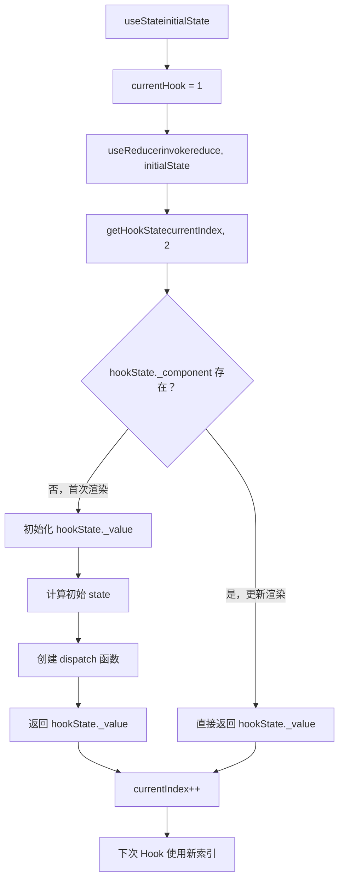
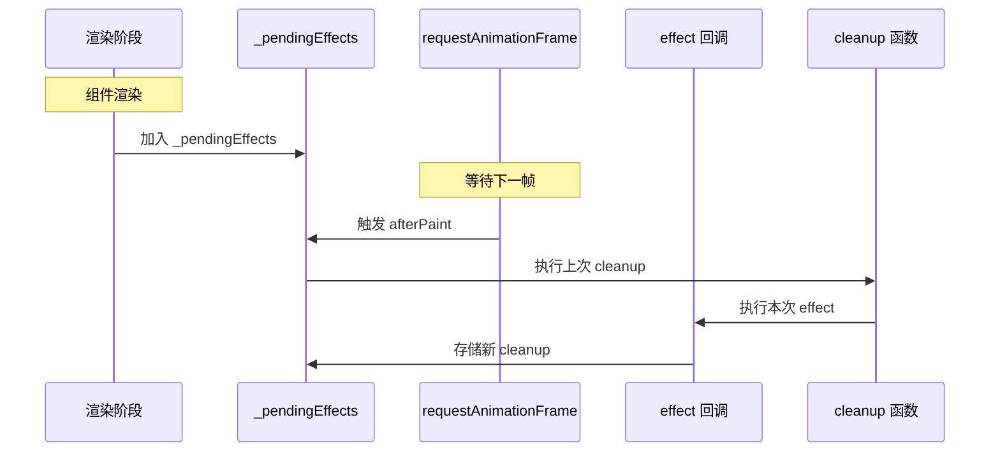

# 第 7 章：Hooks 实现原理与状态管理

> **本章是《Preact 源码解析》系列的第 7 章**，深入 Preact Hooks 的完整实现。我们将理解 useState、useEffect、useReducer 等核心 Hooks 的工作原理，以及 Hooks 为什么不能条件调用。

---

## 7.1 Hooks 的设计哲学

### 7.1.1 为什么需要 Hooks？

**类组件的问题**：

```javascript
// 问题 1: 逻辑复用困难
class MouseTracker extends Component {
  state = { x: 0, y: 0 };
  
  handleMove = (e) => {
    this.setState({ x: e.clientX, y: e.clientY });
  };
  
  componentDidMount() {
    window.addEventListener('mousemove', this.handleMove);
  }
  
  componentWillUnmount() {
    window.removeEventListener('mousemove', this.handleMove);
  }
  
  render() {
    return <div>x: {this.state.x}, y: {this.state.y}</div>;
  }
}

// 如果想复用鼠标跟踪逻辑怎么办？
// 需要使用 HOC 或 Render Props，代码复杂
```

```javascript
// 问题 2: 生命周期分散逻辑
class Chat extends Component {
  componentDidMount() {
    this.fetchMessages();
    this.setupPolling();
  }
  
  componentDidUpdate(prevProps) {
    if (prevProps.threadId !== this.props.threadId) {
      this.fetchMessages();  // 重复逻辑
    }
  }
  
  componentWillUnmount() {
    this.cleanupPolling();
  }
  
  render() { /* ... */ }
}
// 相关逻辑分散在多个生命周期中
```

**Hooks 的解决方案**：

```javascript
// 使用 Hooks
function useMousePosition() {
  const [position, setPosition] = useState({ x: 0, y: 0 });
  
  useEffect(() => {
    const handleMove = (e) => {
      setPosition({ x: e.clientX, y: e.clientY });
    };
    
    window.addEventListener('mousemove', handleMove);
    return () => window.removeEventListener('mousemove', handleMove);
  }, []);
  
  return position;
}

// 逻辑复用：直接调用函数
function MouseTracker() {
  const { x, y } = useMousePosition();
  return <div>x: {x}, y: {y}</div>;
}
```

### 7.1.2 Hooks 的核心设计
| 设计原则 | 说明 |
|---------|------|
| **顺序调用** | Hooks 必须按固定顺序调用 |
| **组件作用域** | Hooks 只能在函数组件或自定义 Hook 中调用 |
| **状态隔离** | 每个组件实例有独立的 Hooks 状态 |
| **延迟执行** | useEffect 在 DOM 更新后执行 |

---

## 7.2 Hooks 数据结构

### 7.2.1 Hook 状态存储

```javascript
// 文件：hooks/src/index.js
// Hook 状态存储在组件实例上

const hooks =
  currentComponent.__hooks ||
  (currentComponent.__hooks = {
    _list: [],         // Hook 数组
    _pendingEffects: []  // 待执行的 effect
  });
```

**组件上的 Hooks 结构**：

```javascript
component.__hooks = {
  _list: [
    // useState Hook
    {
      _value: [0, setState],  // [state, dispatcher]
      _pendingArgs: undefined,
      _nextValue: undefined
    },
    // useEffect Hook
    {
      _value: () => cleanup,  // cleanup 函数
      _pendingArgs: [dep1, dep2],  // 依赖数组
      _nextValue: undefined
    },
    // useReducer Hook
    {
      _value: [state, dispatch],
      _reducer: reducer,
      _component: component
    }
  ],
  _pendingEffects: []  // 待执行的 effect
};
```

### 7.2.2 getHookState 函数

```javascript
// 文件：hooks/src/index.js
// 函数：getHookState() - 获取指定索引的 Hook 状态

function getHookState(index, type) {
  if (options._hook) {
    options._hook(currentComponent, index, currentHook || type);
  }
  currentHook = 0;
  
  const hooks =
    currentComponent.__hooks ||
    (currentComponent.__hooks = {
      _list: [],
      _pendingEffects: []
    });
  
  // 如果索引超出范围，扩展数组
  if (index >= hooks._list.length) {
    hooks._list.push({});
  }
  
  return hooks._list[index];
}
```

**关键设计**：
| 设计 | 说明 |
|------|------|
| **按索引访问** | `hooks._list[index]` |
| **自动扩展** | 索引超出时自动 push 新对象 |
| **类型标记** | `type` 用于调试和验证 |

---

## 7.3 useState 实现

### 7.3.1 完整源码

```javascript
// 文件：hooks/src/index.js
// Hook: useState

export function useState(initialState) {
  currentHook = 1;  // 标记 Hook 类型
  return useReducer(invokeOrReturn, initialState);
}

// Hook: useReducer
export function useReducer(reducer, initialState, init) {
  const hookState = getHookState(currentIndex++, 2);
  hookState._reducer = reducer;
  
  if (!hookState._component) {
    hookState._value = [
      !init ? invokeOrReturn(undefined, initialState) : init(initialState),
      action => {
        const currentValue = hookState._nextValue
          ? hookState._nextValue[0]
          : hookState._value[0];
        const nextValue = hookState._reducer(currentValue, action);
        
        if (currentValue !== nextValue) {
          hookState._nextValue = [nextValue, hookState._value[1]];
          hookState._component.setState({});
        }
      }
    ];
    hookState._component = currentComponent;
  }
  
  return hookState._value;
}

// 辅助函数
function invokeOrReturn(arg, f) {
  return typeof f == 'function' ? f(arg) : f;
}
```

### 7.3.2 执行流程



### 7.3.3 dispatch 函数详解

```javascript
// dispatch 函数
action => {
  // 步骤 1: 获取当前 state
  const currentValue = hookState._nextValue
    ? hookState._nextValue[0]
    : hookState._value[0];
  
  // 步骤 2: 计算新 state
  const nextValue = hookState._reducer(currentValue, action);
  
  // 步骤 3: 如果 state 变化，触发更新
  if (currentValue !== nextValue) {
    hookState._nextValue = [nextValue, hookState._value[1]];
    hookState._component.setState({});
  }
}
```

**为什么使用 _nextValue？**

```javascript
// 场景：多次 dispatch

const [count, setCount] = useState(0);

setCount(1);  // ①
setCount(2);  // ②
setCount(3);  // ③

// ① setCount(1)
// - currentValue = 0
// - nextValue = 1
// - 0 !== 1 → _nextValue = [1, dispatch]
// - setState({}) → 入队渲染

// ② setCount(2)
// - currentValue = _nextValue[0] = 1（不是 0！）
// - nextValue = 2
// - 1 !== 2 → _nextValue = [2, dispatch]（覆盖）
// - setState({}) → 已在队中，不重复入队

// ③ setCount(3)
// - currentValue = _nextValue[0] = 2
// - nextValue = 3
// - 2 !== 3 → _nextValue = [3, dispatch]（覆盖）

// 渲染时：
// - state = 3
// - 只渲染一次！
```

### 7.3.4 useState 示例

```javascript
function Counter() {
  const [count, setCount] = useState(0);
  
  return (
    <div>
      <p>Count: {count}</p>
      <button onClick={() => setCount(count + 1)}>
        Increment
      </button>
    </div>
  );
}

// 首次渲染：
// - hooks._list[0] = { _value: [0, dispatch] }
// - 返回 [0, dispatch]

// 点击按钮：
// - dispatch(1)
// - _nextValue = [1, dispatch]
// - setState({}) → 入队
// - 渲染：count = 1
```

---

## 7.4 useEffect 实现

### 7.4.1 完整源码

```javascript
// 文件：hooks/src/index.js
// Hook: useEffect

export function useEffect(callback, deps) {
  currentHook = 5;
  
  const hookState = getHookState(currentIndex++, 5);
  hookState._value = callback;
  hookState._pendingArgs = deps;
  
  // 将组件加入待执行队列
  if (currentComponent.__hooks._pendingEffects.length == 0) {
    afterPaint(afterPaintEffects.push(currentComponent));
  }
}

// afterPaint 实现
function afterPaint(effect) {
  if (typeof requestAnimationFrame == 'function') {
    requestAnimationFrame(() => {
      afterPaintEffects.splice(afterPaintEffects.indexOf(effect), 1);
      effect();
    });
  } else {
    setTimeout(effect);
  }
}

// invokeEffect 执行 effect
function invokeEffect(hook) {
  const result = hook._value();
  if (result) {
    hook._value = result;  // 存储 cleanup 函数
  }
  return result;
}

// invokeCleanup 执行 cleanup
function invokeCleanup(hook) {
  if (typeof hook._value == 'function') {
    hook._value();
  }
}
```

### 7.4.2 执行时机



### 7.4.3 依赖数组处理

```javascript
// 文件：hooks/src/index.js
// options._render 钩子中处理依赖

options._render = vnode => {
  currentComponent = vnode._component;
  currentIndex = 0;  // 重置索引
  
  const hooks = currentComponent.__hooks;
  if (hooks) {
    if (previousComponent === currentComponent) {
      // 更新渲染
      hooks._pendingEffects = [];
      currentComponent._renderCallbacks = [];
      
      // 更新 Hook 值
      hooks._list.some(hookItem => {
        if (hookItem._nextValue) {
          hookItem._value = hookItem._nextValue;
        }
        hookItem._pendingArgs = hookItem._nextValue = undefined;
      });
    } else {
      // 新组件，执行 cleanup
      hooks._pendingEffects.some(invokeCleanup);
      hooks._pendingEffects.some(invokeEffect);
      hooks._pendingEffects = [];
      currentIndex = 0;
    }
  }
  previousComponent = currentComponent;
};
```

**依赖数组对比逻辑**：

```javascript
// options.diffed 钩子中处理依赖对比

options.diffed = vnode => {
  const c = vnode._component;
  if (c && c.__hooks) {
    if (c.__hooks._pendingEffects.length) {
      afterPaint(afterPaintEffects.push(c));
    }
    
    // 更新依赖
    c.__hooks._list.some(hookItem => {
      if (hookItem._pendingArgs) {
        hookItem._args = hookItem._pendingArgs;
      }
      hookItem._pendingArgs = undefined;
    });
  }
  previousComponent = currentComponent = null;
};
```

### 7.4.4 useEffect 示例

```javascript
function Example() {
  const [count, setCount] = useState(0);
  
  // 无依赖数组：每次渲染都执行
  useEffect(() => {
    console.log('Effect 无依赖，count:', count);
  });
  
  // 空依赖数组：只执行一次
  useEffect(() => {
    console.log('Effect 空依赖，只执行一次');
  }, []);
  
  // 有依赖数组：依赖变化时执行
  useEffect(() => {
    console.log('Effect 有依赖，count:', count);
    return () => {
      console.log('Cleanup', count);
    };
  }, [count]);
  
  return <button onClick={() => setCount(count + 1)}>{count}</button>;
}

// 首次渲染：
// - Effect 无依赖：执行
// - Effect 空依赖：执行
// - Effect 有依赖：执行

// 点击按钮（count: 0 → 1）：
// - Effect 无依赖：执行
// - Effect 空依赖：不执行
// - Effect 有依赖：依赖变化，执行 cleanup(0)，然后执行 effect(1)
```

---

## 7.5 useContext 实现

### 7.5.1 完整源码

```javascript
// 文件：hooks/src/index.js
// Hook: useContext

export function useContext(context) {
  const provider = globalContext[context._id];
  
  if (provider) {
    const hookState = getHookState(currentIndex++, 9);
    
    // 订阅 Context 变化
    if (!hookState._component) {
      provider.sub(currentComponent);
      hookState._component = currentComponent;
    }
    
    return provider.props.value;
  }
  
  return context._defaultValue;
}
```

### 7.5.2 Context 工作原理

```javascript
// 文件：src/create-context.js
// 函数：createContext

export function createContext(defaultValue, contextId) {
  const context = {
    _id: contextId || '__cC' + (contextId++),
    _defaultValue: defaultValue
  };
  
  context.Provider = class ContextProvider extends Component {
    constructor(props, context) {
      super(props, context);
      this.subs = [];  // 订阅者数组
    }
    
    componentDidMount() {
      // 将订阅者加入全局 context
      this.context[context._id] = this;
      this.subs.some(sub => {
        sub.setState({});  // 触发更新
      });
    }
    
    componentWillUnmount() {
      delete this.context[context._id];
    }
    
    render(props) {
      return props.children;
    }
  };
  
  return context;
}
```

### 7.5.3 useContext 示例

```javascript
const ThemeContext = createContext('light');

function ThemedButton() {
  const theme = useContext(ThemeContext);
  return <button className={theme}>Themed Button</button>;
}

function App() {
  return (
    <ThemeContext.Provider value="dark">
      <ThemedButton />
    </ThemeContext.Provider>
  );
}
```

---

## 7.6 为什么 Hooks 不能条件调用？

### 7.6.1 问题示例

```javascript
// ❌ 错误用法
function BrokenComponent({ condition }) {
  const [state1, setState1] = useState(0);  // 索引 0
  
  if (condition) {
    const [state2, setState2] = useState(1);  // 索引 1（有时存在）
  }
  
  const [state3, setState3] = useState(2);  // 索引 2 或 1？
  
  return <div>{state1}, {state3}</div>;
}
```

### 7.6.2 问题分析

```javascript
// 首次渲染：condition = true
// hooks._list = [
//   { _value: [0, dispatch1] },  // 索引 0: state1
//   { _value: [1, dispatch2] },  // 索引 1: state2
//   { _value: [2, dispatch3] }   // 索引 2: state3
// ]

// 第二次渲染：condition = false
// hooks._list = [
//   { _value: [0, dispatch1] },  // 索引 0: state1 ✓
//   { _value: [1, dispatch2] },  // 索引 1: 原本 state2，现在 state3 错用！❌
//   { _value: [2, dispatch3] }   // 索引 2: 越界
// ]

// 结果：state3 读取了 state2 的值！
```

### 7.6.3 正确用法

```javascript
// ✅ 正确用法
function WorkingComponent({ condition }) {
  const [state1, setState1] = useState(0);  // 索引 0
  const [state2, setState2] = useState(1);  // 索引 1
  const [state3, setState3] = useState(2);  // 索引 2
  
  // 条件逻辑放在 Hook 内部
  const value = condition ? state2 : state3;
  
  return <div>{state1}, {value}</div>;
}
```

### 7.6.4 ESLint 规则

```javascript
// eslint-plugin-react-hooks
{
  "rules": {
    "react-hooks/rules-of-hooks": "error",  // 检查 Hooks 规则
    "react-hooks/exhaustive-deps": "warn"   // 检查依赖数组
  }
}
```

**规则检查**：
| 规则 | 检查内容 |
|------|---------|
| `rules-of-hooks` | Hooks 不能条件调用、不能在循环中调用 |
| `exhaustive-deps` | useEffect 依赖数组必须完整 |

---

## 7.7 自定义 Hook

### 7.7.1 实现原理

```javascript
// 自定义 Hook 本质是函数，调用其他 Hooks

function useLocalStorage(key, initialValue) {
  // 使用 useState
  const [storedValue, setStoredValue] = useState(() => {
    try {
      const item = window.localStorage.getItem(key);
      return item ? JSON.parse(item) : initialValue;
    } catch (error) {
      return initialValue;
    }
  });
  
  // 使用 useEffect
  useEffect(() => {
    try {
      window.localStorage.setItem(key, JSON.stringify(storedValue));
    } catch (error) {
      console.log(error);
    }
  }, [key, storedValue]);
  
  return [storedValue, setStoredValue];
}
```

### 7.7.2 使用示例

```javascript
function App() {
  // 使用自定义 Hook
  const [name, setName] = useLocalStorage('name', '');
  
  return (
    <input
      value={name}
      onChange={e => setName(e.target.value)}
      placeholder="Enter your name"
    />
  );
}
```

---

## 7.8 本章小结
| 知识点 | 核心内容 |
|--------|---------|
| **Hooks 数据结构** | `__hooks._list` 数组存储所有 Hook 状态 |
| **useState** | 基于 useReducer 实现，通过 _nextValue 合并更新 |
| **useEffect** | 延迟到 DOM 更新后执行，支持 cleanup 函数 |
| **useContext** | 订阅 Context Provider，值变化时触发更新 |
| **条件调用问题** | Hooks 按索引访问，条件调用会导致索引错乱 |
| **自定义 Hook** | 组合内置 Hooks，复用状态逻辑 |

---

## 📖 下一章预告

**第 8 章：总结与最佳实践**

系列最终章，我们将：

- 回顾整个 Preact 架构
- 对比 Preact vs React
- 生产环境最佳实践
- 性能优化技巧

---

**本章源码阅读清单**：
| 文件 | 行数 | 阅读重点 |
|------|------|---------|
| `hooks/src/index.js` | 350+ 行 | useState + useEffect + useContext |
| `src/create-context.js` | 50 行 | Context 实现 |
| `src/component.js` | 200+ 行 | setState 批处理 |

---

> ✅ **第 7 章完成**  
> 📁 文件位置：`/home/admin/.openclaw/workspace-source-code/output/preactAnalysis/ch07-hooks-implementation.md`  
> ⏭️ 继续第 8 章（最终章）...
