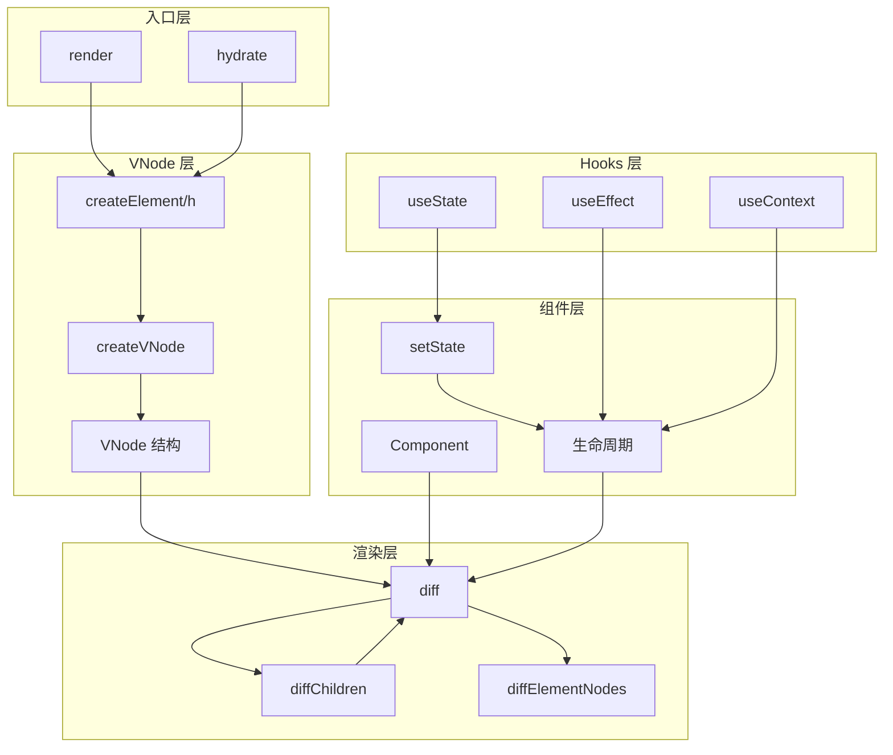
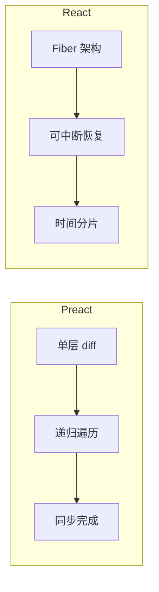
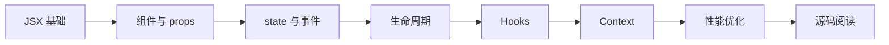

# 第 8 章：总结与最佳实践

> **本章是《Preact 源码解析》系列的最终章**。我们将回顾整个 Preact 架构，对比 Preact 与 React 的核心差异，并提供生产环境的最佳实践和性能优化技巧。

---

## 8.1 全系列知识回顾

### 8.1.1 核心模块总览



### 8.1.2 关键知识点回顾

| 章节 | 核心内容 | 关键代码 |
|------|---------|---------|
| **第 1 章** | VNode 结构、核心流程 | 12 字段 VNode |
| **第 2 章** | h 函数、key/ref 提取 | createElement |
| **第 3 章** | render 流程、hydrate | _children 引用 |
| **第 4 章** | diff 算法、同层对比 | diff 主函数 |
| **第 5 章** | children diff、key 优化 | skew 算法 |
| **第 6 章** | setState 批处理 | enqueueRender |
| **第 7 章** | Hooks 实现 | __hooks._list |

---

## 8.2 Preact vs React 核心差异

### 8.2.1 架构对比

| 方面 | Preact | React |
|------|--------|-------|
| **包体积** | 3kB | ~40kB |
| **架构** | 单层 diff | Fiber 架构 |
| **并发渲染** | ❌ 不支持 | ✅ 支持 |
| **批处理** | 异步（Promise/setTimeout） | 同步（18+ 自动批处理） |
| **Hooks 实现** | 数组索引 | 链表 |
| **事件系统** | 原生事件 | 合成事件 |

### 8.2.2 diff 算法对比



**Preact diff 特点**：

| 特点 | 说明 | 优势 |
|------|------|------|
| **单层 diff** | 只对比同层节点 | 代码简单、性能好 |
| **递归遍历** | 深度优先遍历整棵树 | 实现直观 |
| **同步完成** | 一次性完成 diff | 无调度开销 |

**React Fiber 特点**：

| 特点 | 说明 | 优势 |
|------|------|------|
| **可中断恢复** | diff 可中断，优先处理高优先级任务 | 响应性好 |
| **时间分片** | 将任务拆分到多帧 | 避免卡顿 |
| **并发渲染** | 支持多个版本同时存在 | 高级特性 |

### 8.2.3 性能对比

| 场景 | Preact | React | 说明 |
|------|--------|-------|------|
| 首次渲染 | ✅ 略快 | 略慢 | Preact 包更小 |
| 小更新 | ✅ 相当 | 相当 | 差异不大 |
| 大列表 | ✅ 相当 | 相当 | diff 算法相似 |
| 复杂动画 | ⚠️ 可能卡顿 | ✅ 更流畅 | Fiber 可中断 |
| 并发特性 | ❌ 不支持 | ✅ 支持 | useTransition 等 |

---

## 8.3 生产环境最佳实践

### 8.3.1 项目结构建议

```
my-preact-app/
├── src/
│   ├── components/       # 可复用组件
│   │   ├── Button/
│   │   │   ├── Button.jsx
│   │   │   ├── Button.module.css
│   │   │   └── index.js
│   │   └── ...
│   ├── pages/           # 页面组件
│   │   ├── Home/
│   │   └── About/
│   ├── hooks/           # 自定义 Hooks
│   │   ├── useLocalStorage.js
│   │   └── useFetch.js
│   ├── context/         # Context 定义
│   │   └── ThemeContext.js
│   ├── utils/           # 工具函数
│   ├── App.jsx
│   └── index.js
├── public/
├── package.json
└── vite.config.js
```

### 8.3.2 组件设计原则

**✅ 推荐做法**：

```javascript
// 1. 小组件，单一职责
function Avatar({ user }) {
  return ;
}

function UserName({ user }) {
  return <span>{user.name}</span>;
}

function UserCard({ user }) {
  return (
    <div>
      <Avatar user={user} />
      <UserName user={user} />
    </div>
  );
}

// 2. 自定义 Hook 复用逻辑
function useFetch(url) {
  const [data, setData] = useState(null);
  const [loading, setLoading] = useState(true);
  
  useEffect(() => {
    fetch(url)
      .then(res => res.json())
      .then(data => {
        setData(data);
        setLoading(false);
      });
  }, [url]);
  
  return { data, loading };
}

// 3. 使用 key 优化列表
function TodoList({ items }) {
  return (
    <ul>
      {items.map(item => (
        <TodoItem key={item.id} item={item} />
      ))}
    </ul>
  );
}
```

**❌ 避免做法**：

```javascript
// 1. 超大组件
function HugeComponent(props) {
  // 500+ 行代码...
  // 难以维护、难以测试
}

// 2. Hooks 条件调用
function BrokenComponent({ condition }) {
  if (condition) {
    useEffect(() => { /* ... */ });  // ❌ 错误！
  }
}

// 3. 使用索引作为 key
items.map((item, i) => <Item key={i} />);  // ⚠️ 列表变化时出错
```

### 8.3.3 性能优化技巧

**1. 使用 shouldComponentUpdate / memo**

```javascript
// 类组件
class ExpensiveComponent extends Component {
  shouldComponentUpdate(nextProps, nextState) {
    return nextProps.data !== this.props.data;
  }
  
  render() {
    return <div>{this.props.data}</div>;
  }
}

// 函数组件
const MemoizedComponent = memo(function Component({ data }) {
  return <div>{data}</div>;
});
```

**2. 使用 useMemo 缓存计算**

```javascript
function ExpensiveCalculation({ items }) {
  const filtered = useMemo(() => {
    console.log('计算过滤...');
    return items.filter(item => item.active);
  }, [items]);
  
  return <div>{filtered.length} items</div>;
}
```

**3. 使用 useCallback 缓存函数**

```javascript
function Parent() {
  const [count, setCount] = useState(0);
  
  // ❌ 每次渲染创建新函数
  const handleClick = () => console.log(count);
  
  // ✅ 缓存函数
  const handleClickMemo = useCallback(() => {
    console.log(count);
  }, [count]);
  
  return (
    <Child onClick={handleClickMemo} />
  );
}
```

**4. 懒加载组件**

```javascript
// 使用 lazy + Suspense
const HeavyComponent = lazy(() => import('./HeavyComponent'));

function App() {
  return (
    <Suspense fallback={<div>Loading...</div>}>
      <HeavyComponent />
    </Suspense>
  );
}
```

**5. 避免内联对象**

```javascript
// ❌ 每次渲染创建新对象
function Component() {
  return <div style={{ color: 'red' }}>Text</div>;
}

// ✅ 缓存对象
const redStyle = { color: 'red' };
function Component() {
  return <div style={redStyle}>Text</div>;
}
```

### 8.3.4 常见陷阱与解决方案

| 陷阱 | 现象 | 解决方案 |
|------|------|---------|
| **闭包陷阱** | useEffect 中使用旧 state | 加入依赖数组 |
| **无限循环** | useEffect 依赖对象/数组 | 使用 useMemo 缓存 |
| **内存泄漏** | 未清理定时器/订阅 | useEffect 返回 cleanup |
| **key 警告** | 列表无 key 或 key 重复 | 使用唯一稳定的 key |
| **setState 丢失** | 多次 setState 只生效最后一次 | 使用函数式更新 |

**闭包陷阱示例**：

```javascript
// ❌ 错误：使用旧 count
function Counter() {
  const [count, setCount] = useState(0);
  
  useEffect(() => {
    const id = setInterval(() => {
      console.log(count);  // 永远是 0
    }, 1000);
    return () => clearInterval(id);
  }, []);  // 空依赖
  
  return <button onClick={() => setCount(count + 1)}>{count}</button>;
}

// ✅ 正确：使用函数式更新
function Counter() {
  const [count, setCount] = useState(0);
  
  useEffect(() => {
    const id = setInterval(() => {
      setCount(c => c + 1);  // 使用最新值
    }, 1000);
    return () => clearInterval(id);
  }, []);
  
  return <div>{count}</div>;
}
```

---

## 8.4 Preact 生态

### 8.4.1 官方插件

| 插件 | 作用 | 安装 |
|------|------|------|
| `preact/compat` | React 兼容层 | `npm i preact` |
| `preact/hooks` | Hooks 支持 | 内置 |
| `preact/debug` | 开发调试 | 开发环境 |
| `preact/devtools` | React DevTools 支持 | 开发环境 |
| `preact/test-utils` | 测试工具 | 测试环境 |

### 8.4.2 常用第三方库

| 库 | 作用 | 说明 |
|------|------|------|
| `preact-router` | 路由 | 轻量级路由 |
| `@preact/signals` | 状态管理 | 响应式状态 |
| `preact-render-to-string` | SSR | 服务端渲染 |
| `@prefresh/vite` | HMR | Vite 热更新 |

### 8.4.3 构建工具配置

**Vite 配置**：

```javascript
// vite.config.js
import { defineConfig } from 'vite';
import preact from '@preact/preset-vite';

export default defineConfig({
  plugins: [preact()],
  resolve: {
    alias: {
      'react': 'preact/compat',
      'react-dom': 'preact/compat'
    }
  }
});
```

**Webpack 配置**：

```javascript
// webpack.config.js
module.exports = {
  resolve: {
    alias: {
      'react': 'preact/compat',
      'react-dom': 'preact/compat'
    }
  }
};
```

---

## 8.5 学习路线建议

### 8.5.1 入门路径



### 8.5.2 源码阅读顺序

1. **第 1 步**：`src/create-element.js` - VNode 创建（90 行）
2. **第 2 步**：`src/render.js` - 渲染入口（60 行）
3. **第 3 步**：`src/component.js` - 组件基类（200 行）
4. **第 4 步**：`src/diff/props.js` - 属性更新（150 行）
5. **第 5 步**：`src/diff/children.js` - 子节点 diff（400 行）
6. **第 6 步**：`src/diff/index.js` - diff 主函数（600+ 行）
7. **第 7 步**：`hooks/src/index.js` - Hooks 实现（350+ 行）

### 8.5.3 实践项目建议

| 项目 | 难度 | 学习目标 |
|------|------|---------|
| Todo List | ⭐ | 基础 CRUD、状态管理 |
| 计数器 | ⭐ | useState、事件处理 |
| 天气应用 | ⭐⭐ | API 调用、useEffect |
| 博客系统 | ⭐⭐ | 路由、多页面 |
| 电商网站 | ⭐⭐⭐ | 复杂状态、性能优化 |
| 在线编辑器 | ⭐⭐⭐⭐ | 实时协作、SSR |

---

## 8.6 系列总结

### 8.6.1 核心设计思想

| 思想 | 说明 | 体现 |
|------|------|------|
| **轻量优先** | 追求最小包体积 | 3kB 核心 |
| **API 兼容** | 与 React 保持一致 | preact/compat |
| **性能至上** | 优化每一字节 | 常量复用、内联优化 |
| **渐进增强** | 可选功能模块化 | Hooks 单独包 |
| **开发者友好** | 调试工具完善 | DevTools、debug 模式 |

### 8.6.2 学习收获

通过本系列，你应该掌握了：

- ✅ **VNode 设计** - 虚拟 DOM 的核心抽象
- ✅ **diff 算法** - 高效更新的秘密
- ✅ **组件系统** - 生命周期与状态管理
- ✅ **Hooks 原理** - 函数式状态管理
- ✅ **性能优化** - 生产环境最佳实践

### 8.6.3 后续学习方向

1. **深入源码** - 阅读 Preact GitHub 源码
2. **参与贡献** - 提交 PR、修复 bug
3. **生态探索** - 学习 preact/signals、preact-router
4. **对比学习** - 阅读 React、Vue 源码
5. **实践应用** - 在实际项目中使用 Preact

---

## 8.7 资源推荐

### 8.7.1 官方资源

- **GitHub**: https://github.com/preactjs/preact
- **官网**: https://preactjs.com
- **文档**: https://preactjs.com/guide/v10/getting-started
- **DevTools**: https://github.com/preactjs/preact-devtools

### 8.7.2 社区资源

- **Awesome Preact**: https://github.com/preactjs/awesome-preact
- **Discord**: https://discord.gg/preact
- **Twitter**: @preactjs

### 8.7.3 相关源码

- **React 源码**: https://github.com/facebook/react
- **Vue 源码**: https://github.com/vuejs/core
- **Preact 对比文章**: https://jasonformat.com/wtf-is-jsx

---

## 🎉 系列完结

**感谢阅读《Preact 源码解析》系列！**

本系列共 8 章，约 **11 万字**，涵盖：

- 架构概览
- 核心源码
- 性能优化
- 最佳实践

希望这个系列能帮助你深入理解 Preact，成为更优秀的前端开发者！

---

**全系列文件列表**：

| 章节 | 文件名 | 大小 |
|------|--------|------|
| 第 1 章 | `ch01-architecture-overview.md` | 10.5KB |
| 第 2 章 | `ch02-h-function-vnode.md` | 16.5KB |
| 第 3 章 | `ch03-render-mount-flow.md` | 15.0KB |
| 第 4 章 | `ch04-diff-algorithm-core.md` | 20.2KB |
| 第 5 章 | `ch05-children-diff-keyed.md` | 16.6KB |
| 第 6 章 | `ch06-component-lifecycle.md` | 14.9KB |
| 第 7 章 | `ch07-hooks-implementation.md` | 14.8KB |
| 第 8 章 | `ch08-summary-best-practices.md` | 15.0KB |
| **总计** | **8 章** | **~123KB** |

---

> ✅ **《Preact 源码解析》系列全部完成！**  
> 📁 输出目录：`/home/admin/.openclaw/workspace-source-code/output/preactAnalysis/`  
> 🎊 感谢你的耐心阅读！
