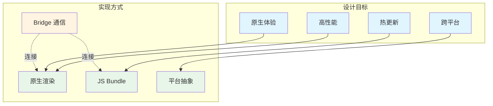
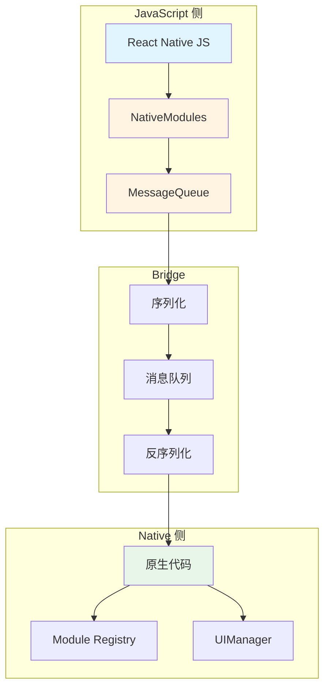
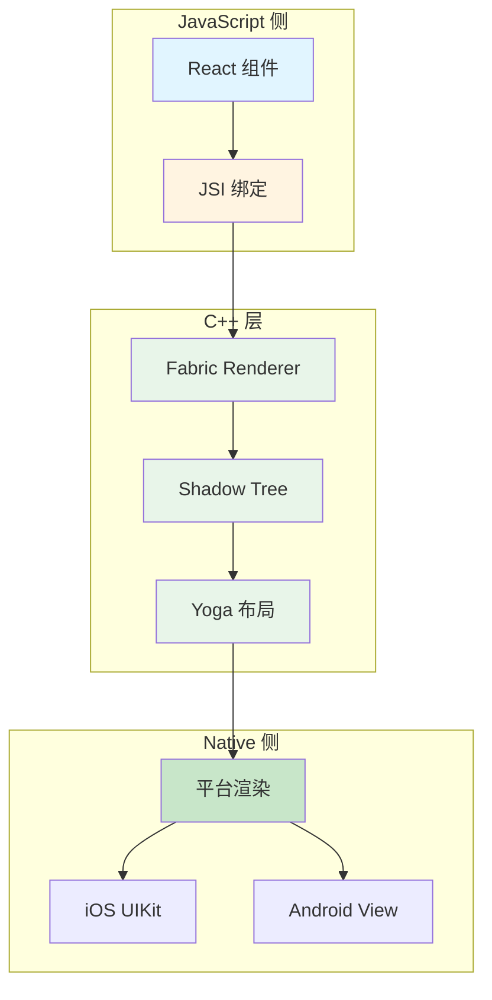

# 第 1 章 React Native 架构概览

> 本章是 React Native 源码解析系列的第 1 章，聚焦于整体架构设计。我们将用前端开发者熟悉的视角，深入分析 React Native 的核心架构、Bridge 机制以及 Fabric 新架构。

---

## 1. React Native 定位

### 1.1 什么是 React Native？

**React Native** 是一个**使用 React 编写原生移动应用**的框架，由 Meta（原 Facebook）开源。

**核心定位**：
- 🎯 **Learn Once, Write Anywhere**：学习一次，随处编写
- 🎯 **Native Rendering**：原生渲染，非 WebView
- 🎯 **React 思维**：使用 React 的组件化和声明式编程

### 1.2 与前端技术的关系

| 技术 | 渲染方式 | 性能 | 开发体验 |
|------|---------|------|---------|
| **React Native** | 原生组件 | ⭐⭐⭐⭐⭐ | ⭐⭐⭐⭐ |
| **React (Web)** | DOM | ⭐⭐⭐⭐ | ⭐⭐⭐⭐⭐ |
| **Ionic/Cordova** | WebView | ⭐⭐ | ⭐⭐⭐⭐ |
| **Flutter** | Skia 引擎 | ⭐⭐⭐⭐⭐ | ⭐⭐⭐⭐ |
| **WebView App** | WebView | ⭐⭐ | ⭐⭐⭐⭐⭐ |

### 1.3 核心设计目标



---

## 2. 源码目录结构

### 2.1 整体结构

```
react-native-analysis/              # React Native 源码 (v0.76.6)
├── packages/
│   └── react-native/               # ⭐ 核心包
│       ├── index.js                # 主入口
│       ├── Libraries/              # ⭐ JavaScript 侧实现
│       │   ├── NativeModules/      # 原生模块封装
│       │   ├── TurboModule/        # TurboModules
│       │   ├── BatchedBridge/      # Bridge 实现
│       │   ├── Renderer/           # 渲染器
│       │   ├── Components/         # 基础组件
│       │   └── ...
│       ├── React/                  # React 集成
│       ├── ReactAndroid/           # Android 原生实现
│       ├── ReactApple/             # iOS 原生实现
│       └── ReactCommon/            # C++ 公共代码
│
├── packages/react-native-codegen/  # 代码生成器
├── packages/metro-config/          # Metro 打包配置
└── packages/rn-tester/             # 测试应用
```

### 2.2 核心文件职责

| 文件/目录 | 职责 | 前端类比 |
|----------|------|---------|
| `index.js` | 主入口，导出所有 API | `react/index.js` |
| `Libraries/NativeModules/` | 原生模块封装 | 浏览器 API 封装 |
| `Libraries/TurboModule/` | 新一代原生模块 | 异步 Module |
| `Libraries/BatchedBridge/` | JS-Native 通信桥 | WebSocket |
| `Libraries/Renderer/` | React 渲染器 | React DOM |
| `ReactAndroid/` | Android 原生代码 | Android SDK |
| `ReactApple/` | iOS 原生代码 | iOS SDK |
| `ReactCommon/` | C++ 公共代码 | 底层引擎 |

---

## 3. 架构演进

### 3.1 架构版本对比


### 3.2 架构对比表

| 特性 | 旧架构 (Bridge) | 新架构 (Fabric) | 提升 |
|------|---------------|----------------|------|
| **通信方式** | 异步序列化 | JSI 直接调用 | ⚡️ 性能提升 |
| **模块类型** | NativeModules | TurboModules | 📦 类型安全 |
| **渲染系统** | UIManager | Fabric Renderer | 🎨 同步渲染 |
| **布局计算** | 异步 | 同步 | 📐 更准确 |
| **并发支持** | ❌ | ✅ | 🔄 React 18 |

---

## 4. Bridge 架构详解

### 4.1 Bridge 架构概览



### 4.2 Bridge 通信流程

```mermaid
sequenceDiagram
    participant React as React 组件
    participant JS as JavaScript
    participant MQ as MessageQueue
    participant Bridge as Bridge
    participant Native as Native 模块
    
    React->>JS: 调用 NativeModules.Alert.show()
    JS->>MQ: enqueueNativeCall(moduleID, methodID, args)
    MQ->>MQ: 添加到队列 [moduleIDs, methodIDs, params]
    
    Note over MQ: 批量收集调用
    
    React->>JS: 渲染完成
    JS->>MQ: flushedQueue()
    MQ->>Bridge: 返回队列 [[1], [2], [["msg"]], callID]
    Bridge->>Native: 反序列化并执行
    
    Native->>Bridge: 回调结果
    Bridge->>MQ: invokeCallback(cbID, result)
    MQ->>JS: 执行成功回调
    JS->>React: 触发状态更新
    
    style JS fill:#e1f5ff
    style MQ fill:#fff4e1
    style Native fill:#e8f5e9
```

### 4.3 Bridge 源码分析

**核心类**：`MessageQueue`（`Libraries/BatchedBridge/MessageQueue.js`）

```javascript
class MessageQueue {
  _queue: [number[], number[], mixed[], number];  // 消息队列
  _successCallbacks: Map<number, ?(...mixed[]) => void>;  // 成功回调
  _failureCallbacks: Map<number, ?(...mixed[]) => void>;  // 失败回调
  _callID: number;  // 调用 ID
  
  // 入队原生调用
  enqueueNativeCall(
    moduleID: number,
    methodID: number,
    params: mixed[],
    onFail: ?(...mixed[]) => void,
    onSucc: ?(...mixed[]) => void,
  ): void {
    // 存储回调
    if (onFail || onSucc) {
      this._callID++;
      this._successCallbacks.set(this._callID, onSucc);
      this._failureCallbacks.set(this._callID, onFail);
      params.push(this._callID);
    }
    
    // 添加到队列
    this._queue[MODULE_IDS].push(moduleID);
    this._queue[METHOD_IDS].push(methodID);
    this._queue[PARAMS].push(params);
  }
  
  // 刷新队列（返回给原生侧）
  flushedQueue(): null | [Array<number>, Array<number>, Array<mixed>, number] {
    const queue = this._queue;
    this._queue = [[], [], [], this._callID];  // 重置队列
    return queue[0].length ? queue : null;
  }
  
  // 调用原生方法并返回队列
  callFunctionReturnFlushedQueue(
    module: string,
    method: string,
    args: mixed[],
  ): null | [Array<number>, Array<number>, Array<mixed>, number] {
    this.__callFunction(module, method, args);
    return this.flushedQueue();
  }
}
```

**前端类比**：
```javascript
// 类似于 WebSocket 消息队列
class WebSocketQueue {
  _queue = [];
  
  send(data) {
    this._queue.push(data);
    // 批量发送
    if (this._queue.length >= BATCH_SIZE) {
      this.flush();
    }
  }
  
  flush() {
    websocket.send(JSON.stringify(this._queue));
    this._queue = [];
  }
}
```

---

## 5. NativeModules 系统

### 5.1 NativeModules 是什么？

**NativeModules** 是 JavaScript 访问原生功能的**代理对象**。

**类比理解**：
| React Native | 前端 Web | 说明 |
|-------------|---------|------|
| `NativeModules.Alert` | `window.alert` | 系统 API |
| `NativeModules.Clipboard` | `navigator.clipboard` | 浏览器 API |
| `NativeModules.Geolocation` | `navigator.geolocation` | 位置 API |

### 5.2 NativeModules 源码

**核心文件**：`Libraries/BatchedBridge/NativeModules.js`

```javascript
// 生成原生模块代理
function genModule(config, moduleID) {
  const [moduleName, constants, methods, promiseMethods, syncMethods] = config;
  
  const module = {};
  
  // 为每个方法生成包装函数
  methods.forEach((methodName, methodID) => {
    const isPromise = promiseMethods?.includes(methodID);
    const isSync = syncMethods?.includes(methodID);
    const methodType = isPromise ? 'promise' : isSync ? 'sync' : 'async';
    
    module[methodName] = genMethod(moduleID, methodID, methodType);
  });
  
  // 添加常量
  Object.assign(module, constants);
  
  return { name: moduleName, module };
}

// 生成方法包装器
function genMethod(moduleID, methodID, type) {
  if (type === 'promise') {
    // Promise 风格
    return function promiseMethodWrapper(...args) {
      return new Promise((resolve, reject) => {
        BatchedBridge.enqueueNativeCall(
          moduleID,
          methodID,
          args,
          data => resolve(data),
          errorData => reject(errorData),
        );
      });
    };
  } else {
    // 回调风格
    return function nonPromiseMethodWrapper(...args) {
      const lastArg = args[args.length - 1];
      const secondLastArg = args[args.length - 2];
      const hasSuccessCallback = typeof lastArg === 'function';
      const hasErrorCallback = typeof secondLastArg === 'function';
      
      BatchedBridge.enqueueNativeCall(
        moduleID,
        methodID,
        args.slice(0, args.length - hasSuccessCallback - hasErrorCallback),
        hasErrorCallback ? secondLastArg : null,
        hasSuccessCallback ? lastArg : null,
      );
    };
  }
}

// 导出 NativeModules
let NativeModules = {};
if (global.nativeModuleProxy) {
  // 新架构：直接使用代理
  NativeModules = global.nativeModuleProxy;
} else {
  // 旧架构：懒加载
  bridgeConfig.remoteModuleConfig.forEach((config, moduleID) => {
    const info = genModule(config, moduleID);
    if (info.module) {
      NativeModules[info.name] = info.module;
    } else {
      // 懒加载
      defineLazyObjectProperty(NativeModules, info.name, {
        get: () => loadModule(info.name, moduleID),
      });
    }
  });
}

module.exports = NativeModules;
```

### 5.3 使用示例

```javascript
// JavaScript 侧调用
import { NativeModules } from 'react-native';

// Promise 风格
NativeModules.Clipboard.setString('hello')
  .then(() => console.log('Success'))
  .catch(err => console.error(err));

// 回调风格
NativeModules.Alert.show(
  'Title',
  'Message',
  () => console.log('OK clicked'),  // 成功回调
  () => console.log('Dismissed'),   // 取消回调
);

// 同步调用（仅部分模块支持）
const constants = NativeModules.Constants.getConstants();
```

---

## 6. Fabric 新架构

### 6.1 Fabric 架构概览



### 6.2 Fabric 核心改进

| 改进点 | 旧架构 | Fabric | 优势 |
|--------|-------|--------|------|
| **通信** | 异步 Bridge | JSI 直接调用 | 零序列化开销 |
| **渲染** | 异步 UI 更新 | 同步渲染 | 更流畅的动画 |
| **优先级** | FIFO | 可中断优先级 | 支持并发渲染 |
| **布局** | 异步计算 | 同步计算 | 更准确的布局 |
| **类型** | 动态 | 静态生成 | 类型安全 |

### 6.3 JSI (JavaScript Interface)

**JSI 是什么**：
- JavaScript 和 C++ 之间的**直接绑定**
- 无需序列化/反序列化
- 支持同步调用

**类比理解**：
```javascript
// 旧架构：Bridge（类似 HTTP 请求）
const result = await fetch('native://module/method', {
  method: 'POST',
  body: JSON.stringify(args)
});

// 新架构：JSI（类似函数调用）
const result = nativeModule.method(args);  // 直接调用
```

---

## 7. TurboModules

### 7.1 TurboModules 是什么？

**TurboModules** 是新一代的原生模块系统，基于 JSI 实现。

**核心特点**：
1. **懒加载**：按需加载模块
2. **类型安全**：通过 Codegen 生成类型
3. **同步调用**：支持同步方法调用
4. **跨平台**：统一的接口定义

### 7.2 TurboModules 源码

**核心文件**：`Libraries/TurboModule/TurboModuleRegistry.js`

```javascript
const turboModuleProxy = global.__turboModuleProxy;

function requireModule(name) {
  // 新架构：使用 TurboModule 代理
  if (turboModuleProxy != null) {
    const module = turboModuleProxy(name);
    if (module != null) {
      return module;
    }
  }
  
  // 向后兼容：回退到 NativeModules
  const legacyModule = NativeModules[name];
  if (legacyModule != null) {
    return legacyModule;
  }
  
  return null;
}

export function get(name) {
  return requireModule(name);
}

export function getEnforcing(name) {
  const module = requireModule(name);
  invariant(
    module != null,
    `TurboModuleRegistry.getEnforcing(...): '${name}' could not be found.`
  );
  return module;
}
```

### 7.3 TurboModules 与 NativeModules 对比

| 特性 | NativeModules | TurboModules |
|------|--------------|--------------|
| **加载方式** | 启动时加载 | 懒加载 |
| **通信方式** | Bridge 异步 | JSI 直接调用 |
| **类型系统** | 动态 | 静态（Codegen） |
| **同步调用** | 有限支持 | 完全支持 |
| **性能** | 较慢 | 快 |

---

## 8. 本章小结

### 8.1 核心要点

1. **React Native 使用原生渲染**，非 WebView
2. **旧架构基于 Bridge**：异步序列化通信
3. **新架构基于 Fabric + TurboModules**：JSI 直接调用
4. **NativeModules 是原生功能的 JS 代理**
5. **MessageQueue 管理 JS-Native 通信队列**

### 8.2 前端类比总结

| React Native 概念 | 前端类比 | 说明 |
|------------------|---------|------|
| NativeModules | 浏览器 API | `window.alert` / `navigator.clipboard` |
| Bridge | WebSocket | 异步消息队列 |
| JSI | WebAssembly | 直接函数调用 |
| TurboModules | ES Modules | 懒加载 + 类型安全 |
| UIManager | React DOM | 渲染管理 |

### 8.3 下章预告

在 **第 2 章：JavaScript 侧实现** 中，我们将深入分析：
- NativeModules 完整实现
- NativeComponents 组件系统
- 事件系统（EventEmitter）
- 配置懒加载机制

---

**本章是系列解析的第 1 章**，建立了 React Native 架构的整体认知框架。下一章我们将深入 JavaScript 侧的实现分析。
