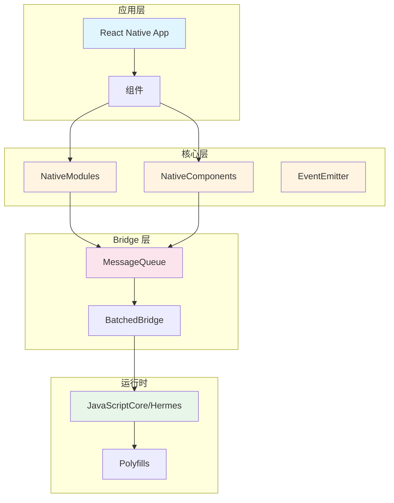
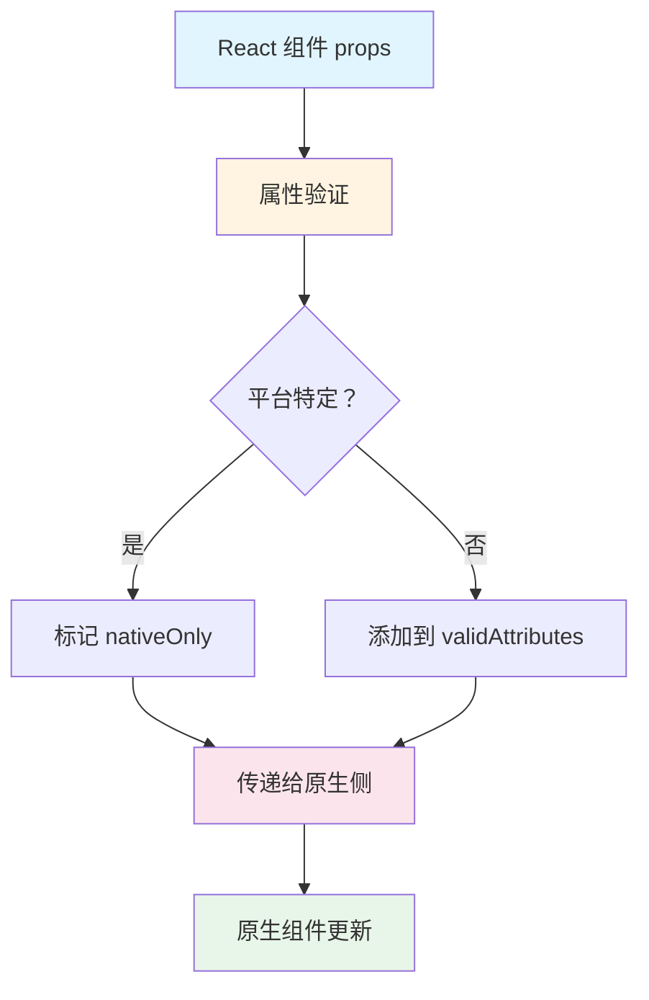

# 第 2 章 JavaScript 侧实现

> 本章是 React Native 源码解析系列的第 2 章，聚焦于 JavaScript 侧的完整实现。我们将深入分析 NativeModules、NativeComponents、事件系统以及配置懒加载机制。

---

## 1. JavaScript 侧架构概览

### 1.1 整体架构



### 1.2 核心模块职责

| 模块 | 文件路径 | 职责 | 前端类比 |
|------|---------|------|---------|
| **NativeModules** | `Libraries/BatchedBridge/NativeModules.js` | 原生模块代理 | `window.*` API |
| **NativeComponents** | `Libraries/Components/*` | 原生组件封装 | DOM 组件 |
| **EventEmitter** | `Libraries/EventEmitter/` | 事件发射器 | `EventEmitter` |
| **MessageQueue** | `Libraries/BatchedBridge/MessageQueue.js` | 消息队列 | 任务队列 |

---

## 2. NativeModules 深度分析

### 2.1 模块注册机制

**源码位置**：`Libraries/BatchedBridge/NativeModules.js`

```javascript
// 全局代理对象
global.__fbGenNativeModule = genModule;

// 生成模块
function genModule(config, moduleID) {
  if (!config) {
    return null;
  }

  const [moduleName, constants, methods, promiseMethods, syncMethods] = config;
  
  const module = {};
  
  // 生成方法包装器
  methods && methods.forEach((methodName, methodID) => {
    const isPromise = promiseMethods?.includes(methodID);
    const isSync = syncMethods?.includes(methodID);
    const methodType = isPromise ? 'promise' : isSync ? 'sync' : 'async';
    
    module[methodName] = genMethod(moduleID, methodID, methodType);
  });

  // 合并常量
  Object.assign(module, constants);

  // 添加 getConstants 方法
  if (module.getConstants == null) {
    module.getConstants = () => constants || Object.freeze({});
  }

  return { name: moduleName, module };
}
```

**前端类比**：
```javascript
// 类似于动态创建对象
function createModule(config) {
  const [name, constants, methods] = config;
  const module = {};
  
  methods.forEach((method, id) => {
    module[method] = function(...args) {
      // 调用 Bridge
      return callBridge(name, method, args);
    };
  });
  
  Object.assign(module, constants);
  return module;
}
```

### 2.2 方法包装器详解

**源码位置**：`Libraries/BatchedBridge/NativeModules.js`

```javascript
function genMethod(moduleID, methodID, type) {
  let fn = null;
  
  if (type === 'promise') {
    // Promise 风格包装
    fn = function promiseMethodWrapper(...args) {
      const enqueueingFrameError = new Error();  // 捕获堆栈
      
      return new Promise((resolve, reject) => {
        BatchedBridge.enqueueNativeCall(
          moduleID,
          methodID,
          args,
          data => resolve(data),
          errorData => reject(
            updateErrorWithErrorData(errorData, enqueueingFrameError)
          ),
        );
      });
    };
  } else {
    // 回调风格包装
    fn = function nonPromiseMethodWrapper(...args) {
      const lastArg = args.length > 0 ? args[args.length - 1] : null;
      const secondLastArg = args.length > 1 ? args[args.length - 2] : null;
      
      const hasSuccessCallback = typeof lastArg === 'function';
      const hasErrorCallback = typeof secondLastArg === 'function';
      
      // 验证回调参数
      hasErrorCallback && invariant(
        hasSuccessCallback,
        'Cannot have a non-function arg after a function arg.',
      );
      
      const onSuccess = hasSuccessCallback ? lastArg : null;
      const onFail = hasErrorCallback ? secondLastArg : null;
      const callbackCount = hasSuccessCallback + hasErrorCallback;
      
      // 移除回调参数
      const newArgs = args.slice(0, args.length - callbackCount);
      
      if (type === 'sync') {
        // 同步调用
        return BatchedBridge.callNativeSyncHook(
          moduleID,
          methodID,
          newArgs,
          onFail,
          onSuccess,
        );
      } else {
        // 异步调用
        BatchedBridge.enqueueNativeCall(
          moduleID,
          methodID,
          newArgs,
          onFail,
          onSuccess,
        );
      }
    };
  }
  
  fn.type = type;
  return fn;
}
```

**调用流程**：
```mermaid
sequenceDiagram
    participant User as 用户代码
    participant Wrapper as 方法包装器
    participant Bridge as BatchedBridge
    participant MQ as MessageQueue
    
    User->>Wrapper: NativeModules.Alert.show(msg)
    Wrapper->>Wrapper: 检查参数类型
    Wrapper->>Bridge: enqueueNativeCall(moduleID, methodID, args)
    Bridge->>MQ: 添加到队列
    MQ->>MQ: 存储回调函数
    
    Note over User,MQ: 批量收集调用
    
    User->>Bridge: flushedQueue()
    Bridge->>MQ: 获取并清空队列
    MQ-->>Bridge: 返回队列数据
    Bridge-->>User: 返回队列供原生侧执行
    
    style Wrapper fill:#fff4e1
    style Bridge fill:#fce4ec
    style MQ fill:#fce4ec
```

### 2.3 懒加载机制

**源码位置**：`Libraries/BatchedBridge/NativeModules.js`

```javascript
let NativeModules = {};

if (global.nativeModuleProxy) {
  // 新架构：直接使用代理
  NativeModules = global.nativeModuleProxy;
} else {
  // 旧架构：懒加载
  const bridgeConfig = global.__fbBatchedBridgeConfig;
  
  bridgeConfig.remoteModuleConfig.forEach((config, moduleID) => {
    const info = genModule(config, moduleID);
    if (!info) return;

    if (info.module) {
      // 已有模块配置，直接赋值
      NativeModules[info.name] = info.module;
    } else {
      // 无配置，定义懒加载 getter
      defineLazyObjectProperty(NativeModules, info.name, {
        get: () => loadModule(info.name, moduleID),
      });
    }
  });
}

// 懒加载函数
function loadModule(name, moduleID) {
  invariant(
    global.nativeRequireModuleConfig,
    "Can't lazily create module without nativeRequireModuleConfig",
  );
  const config = global.nativeRequireModuleConfig(name);
  const info = genModule(config, moduleID);
  return info && info.module;
}
```

**前端类比**：
```javascript
// 类似于 Object.defineProperty 懒加载
const modules = {};
Object.defineProperty(modules, 'Clipboard', {
  get: () => {
    if (!this._clipboard) {
      this._clipboard = loadModule('Clipboard');
    }
    return this._clipboard;
  }
});

// 使用时自动加载
modules.Clipboard.setString('hello');
```

---

## 3. NativeComponents 组件系统

### 3.1 组件注册机制

**源码位置**：`Libraries/Components/View/View.js`

```javascript
// View 组件示例
import React from 'react';
import { createNativeComponentProxy } from 'react-native/Libraries/ReactNative/createNativeComponentProxy';

// 创建原生组件代理
const RCTView = createNativeComponentProxy('RCTView', {
  nativeOnly: {
    nativeBackgroundAndroid: true,
    nativeForegroundAndroid: true,
    focusable: true,
  },
});

// View 组件
function View(props, ref) {
  return <RCTView {...props} ref={ref} />;
}

// Forward ref
const ViewWithRef = React.forwardRef(View);

// 添加 displayName
ViewWithRef.displayName = 'View';

export default ViewWithRef;
```

**前端类比**：
```javascript
// 类似于 React DOM 的组件创建
const RCTView = React.createElement.bind(null, 'RCTView');

function View(props, ref) {
  return <RCTView {...props} ref={ref} />;
}

// 类似于
// const Div = React.createElement.bind(null, 'div');
// function MyDiv(props) { return <Div {...props} />; }
```

### 3.2 组件属性处理

**源码位置**：`Libraries/Components/View/ViewConfig.js`

```javascript
// View 配置
const ViewConfig = {
  uiViewClassName: 'RCTView',
  validAttributes: {
    // 基础属性
    accessibilityLabel: true,
    accessible: true,
    focusable: true,
    
    // 样式
    style: {
      flex: true,
      flexDirection: true,
      justifyContent: true,
      alignItems: true,
      // ... 更多样式属性
    },
    
    // 事件
    onClick: true,
    onAccessibilityTap: true,
    
    // 平台特定属性
    nativeBackgroundAndroid: {
      nativeOnly: true,
    },
  },
};

export default ViewConfig;
```

**属性处理流程**：


### 3.3 核心组件列表

| 组件 | 文件路径 | 原生对应 |
|------|---------|---------|
| **View** | `Libraries/Components/View/View.js` | UIView / ViewGroup |
| **Text** | `Libraries/Text/Text.js` | UILabel / TextView |
| **Image** | `Libraries/Image/Image.js` | UIImageView / ImageView |
| **ScrollView** | `Libraries/Components/ScrollView/ScrollView.js` | UIScrollView / ScrollView |
| **TextInput** | `Libraries/Components/TextInput/TextInput.js` | UITextField / EditText |
| **FlatList** | `Libraries/Lists/FlatList.js` | 虚拟列表封装 |
| **Modal** | `Libraries/Modal/Modal.js` | Modal / Dialog |

---

## 4. 事件系统

### 4.1 EventEmitter 实现

**源码位置**：`Libraries/EventEmitter/NativeEventEmitter.js`

```javascript
import EmitterSubscription from './EmitterSubscription';

class NativeEventEmitter extends EventEmitter {
  constructor(nativeModule) {
    super();
    this._nativeModule = nativeModule;
    this._eventHandlers = new Map();
  }

  // 添加监听器
  addListener(
    eventType: string,
    listener: Function,
    context?: Object,
  ): EmitterSubscription {
    // 如果是第一次订阅，通知原生侧开始监听
    if (this._eventHandlers.size === 0) {
      this._nativeModule?.startObserving?.(eventType);
    }

    // 添加监听器
    const subscription = super.addListener(eventType, listener, context);
    this._eventHandlers.set(eventType, subscription);

    // 返回取消订阅函数
    return subscription;
  }

  // 移除监听器
  removeSubscription(subscription: EmitterSubscription) {
    super.removeSubscription(subscription);

    const { eventType } = subscription;
    const handlers = this._eventHandlers.get(eventType);

    // 如果没有监听器了，通知原生侧停止监听
    if (!handlers || handlers.length === 0) {
      this._nativeModule?.stopObserving?.(eventType);
      this._eventHandlers.delete(eventType);
    }
  }

  // 获取监听器数量
  listenerCount(eventType: string): number {
    return super.listenerCount(eventType);
  }
}

export default NativeEventEmitter;
```

**前端类比**：
```javascript
// 类似于 Node.js 的 EventEmitter
const emitter = new EventEmitter();

// 添加监听
emitter.addListener('event', (data) => {
  console.log(data);
});

// 发射事件
emitter.emit('event', { foo: 'bar' });

// 移除监听
emitter.removeListener('event', listener);
```

### 4.2 事件发射流程

```mermaid
sequenceDiagram
    participant Native as 原生侧
    participant NEE as NativeEventEmitter
    participant Listener as 监听器
    
    Note over NEE: 初始化
    Native->>NEE: 事件发生
    NEE->>NEE: 查找监听器
    NEE->>Listener: 调用回调函数
    
    Note over NEE,Listener: 订阅流程
    Listener->>NEE: addListener(eventType, callback)
    NEE->>NEE: 检查是否是第一次订阅
    NEE->>Native: startObserving(eventType)
    NEE->>Listener: 返回 subscription
    
    Note over NEE,Listener: 取消订阅
    Listener->>NEE: removeSubscription()
    NEE->>NEE: 检查是否还有监听器
    NEE->>Native: stopObserving(eventType)
    
    style NEE fill:#fff4e1
    style Native fill:#e8f5e9
```

### 4.3 常用事件模块

**设备事件**：
```javascript
import { DeviceEventEmitter } from 'react-native';

// 监听设备事件
DeviceEventEmitter.addListener('keyboardWillShow', (e) => {
  console.log('Keyboard will show:', e);
});

// 发射事件（原生侧调用）
DeviceEventEmitter.emit('customEvent', { data: 'value' });
```

**原生模块事件**：
```javascript
import { NativeEventEmitter, NativeModules } from 'react-native';

const { MyNativeModule } = NativeModules;
const emitter = new NativeEventEmitter(MyNativeModule);

// 订阅原生模块事件
const subscription = emitter.addListener('onDataUpdate', (data) => {
  console.log('Data updated:', data);
});

// 取消订阅
subscription.remove();
```

---

## 5. 配置系统

### 5.1 Bridge 配置

**源码位置**：`Libraries/BatchedBridge/NativeModules.js`

```javascript
// 全局配置对象
const bridgeConfig = global.__fbBatchedBridgeConfig;

// 配置结构
bridgeConfig = {
  // 远程模块配置
  remoteModuleConfig: [
    // [模块名，常量，方法列表，Promise 方法 ID, 同步方法 ID]
    ['Alert', { constants }, ['show', 'dismiss'], [0], []],
    ['Clipboard', {}, ['setString', 'getString'], [0, 1], []],
    // ...
  ],
  
  // 队列配置
  queueConfig: {
    remoteModuleConfig: [...],
  },
};
```

**配置注入时机**：
```mermaid
sequenceDiagram
    participant App as App 启动
    participant Native as 原生侧
    participant JS as JavaScript
    participant Config as 配置对象
    
    App->>Native: 启动应用
    Native->>Native: 扫描原生模块
    Native->>Config: 生成 __fbBatchedBridgeConfig
    Native->>JS: 注入全局配置
    JS->>JS: 解析配置创建 NativeModules
    JS-->>App: 应用就绪
    
    style Config fill:#fff4e1
    style JS fill:#e1f5ff
    style Native fill:#e8f5e9
```

### 5.2 懒加载属性定义

**源码位置**：`Libraries/Utilities/defineLazyObjectProperty.js`

```javascript
function defineLazyObjectProperty(object, propertyName, descriptor) {
  const { get, set } = descriptor;
  
  Object.defineProperty(object, propertyName, {
    get: function() {
      // 第一次访问时调用 getter
      const value = get.call(this);
      
      // 缓存值，下次直接返回
      Object.defineProperty(this, propertyName, {
        value,
        writable: true,
        enumerable: true,
        configurable: true,
      });
      
      return value;
    },
    set: set
      ? function(value) {
          set.call(this, value);
        }
      : undefined,
    enumerable: true,
    configurable: true,
  });
}

// 使用示例
defineLazyObjectProperty(NativeModules, 'Clipboard', {
  get: () => loadModule('Clipboard', moduleID),
});

// 第一次访问时加载
NativeModules.Clipboard.setString('hello');  // 触发加载

// 后续访问直接使用缓存
NativeModules.Clipboard.getString();  // 不触发加载
```

**前端类比**：
```javascript
// 类似于 Vue 的 computed 缓存
const obj = {};
let _cachedValue;

Object.defineProperty(obj, 'lazyProp', {
  get: () => {
    if (_cachedValue === undefined) {
      _cachedValue = expensiveComputation();
    }
    return _cachedValue;
  }
});
```

---

## 6. Polyfills 系统

### 6.1 Polyfills 是什么？

**Polyfills** 是为 JavaScript 运行时提供标准 API 兼容层的模块。

**必要性**：
- JavaScriptCore/Hermes 不支持所有 Web API
- 需要 `fetch`、`Promise`、`Map` 等标准 API
- 保证 React 和第三方库正常工作

### 6.2 Polyfills 列表

**源码位置**：`packages/polyfills/`

| Polyfill | 文件 | 用途 |
|---------|------|------|
| **console** | `console.js` | 控制台输出 |
| **error-guard** | `error-guard.js` | 错误处理 |
| **Object.es7** | `Object.es7.js` | Object 扩展方法 |
| **Promise** | `Promise.js` | Promise 实现 |
| **Set/Map** | `collections.js` | 集合类型 |
| **fetch** | `fetch.js` | 网络请求 |
| **XMLHttpRequest** | `XMLHttpRequest.js` | HTTP 请求 |
| **URL** | `URL.js` | URL 解析 |

### 6.3 加载机制

**源码位置**：`rn-get-polyfills.js`

```javascript
function getPolyfills(
  platform: 'ios' | 'android' | 'web',
  options?: { customPolyfills?: string[] },
): string[] {
  const polyfills = [
    require.resolve('./packages/polyfills/console.js'),
    require.resolve('./packages/polyfills/error-guard.js'),
    require.resolve('./packages/polyfills/Object.es7.js'),
    require.resolve('./packages/polyfills/Promise.js'),
    require.resolve('./packages/polyfills/collections.js'),
    require.resolve('./packages/polyfills/fetch.js'),
    require.resolve('./packages/polyfills/XMLHttpRequest.js'),
    // ...
  ];
  
  // 添加自定义 polyfills
  if (options?.customPolyfills) {
    polyfills.push(...options.customPolyfills);
  }
  
  return polyfills;
}

module.exports = getPolyfills;
```

---

## 7. 本章小结

### 7.1 核心要点

1. **NativeModules 是原生功能的 JS 代理**，支持懒加载
2. **方法包装器**支持 Promise、回调、同步三种调用方式
3. **NativeComponents** 封装原生组件，类似 React DOM
4. **EventEmitter** 管理事件订阅，自动通知原生侧
5. **配置系统**通过全局对象注入模块信息
6. **Polyfills** 提供标准 API 兼容层

### 7.2 前端类比总结

| React Native 概念 | 前端类比 | 说明 |
|------------------|---------|------|
| NativeModules | `window.*` API | 全局对象属性 |
| defineLazyObjectProperty | Object.defineProperty | 懒加载属性 |
| NativeEventEmitter | EventEmitter | 事件发射器 |
| ViewConfig | DOM 属性定义 | 组件属性验证 |
| Polyfills | core-js | API 兼容层 |

### 7.3 下章预告

在 **第 3 章：原生侧实现** 中，我们将深入分析：
- Android 原生模块实现
- iOS 原生模块实现
- Module Registry 注册机制
- Bridge 原生侧实现

---

**本章是系列解析的第 2 章**，深入剖析了 JavaScript 侧的完整实现。下一章我们将进入原生侧的实现分析。
