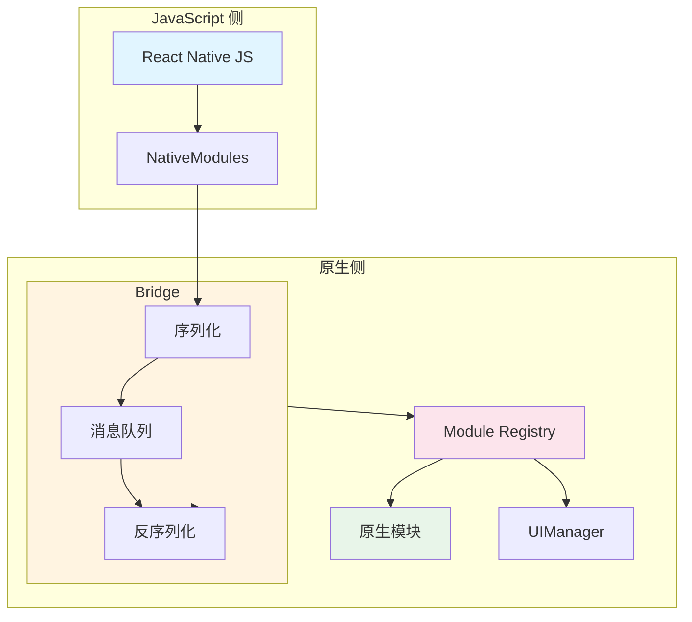
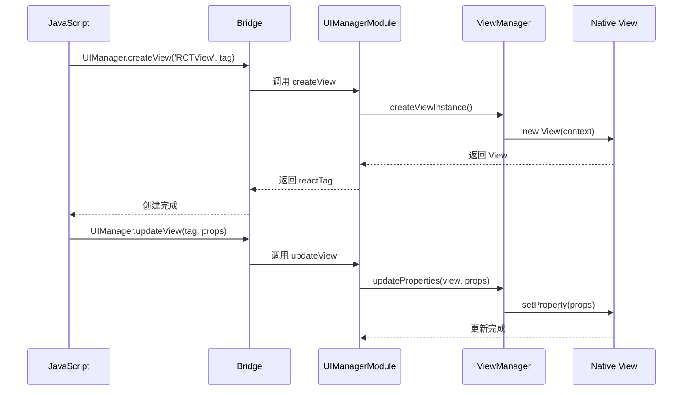
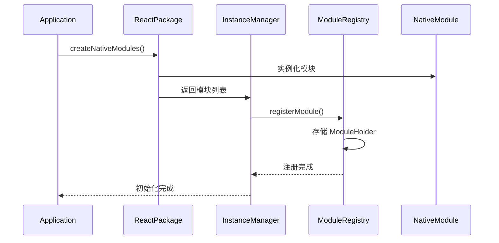
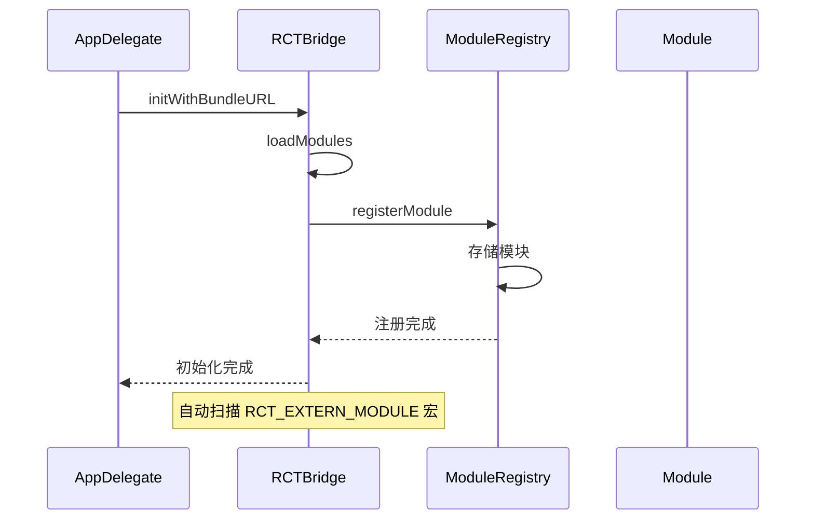

# 第 3 章 原生侧实现

> 本章是 React Native 源码解析系列的第 3 章，聚焦于原生侧（Android/iOS）的完整实现。我们将深入分析 Module Registry、Bridge 原生实现以及平台特定的模块注册机制。

---

## 1. 原生侧架构概览

### 1.1 整体架构



### 1.2 核心组件职责

| 组件 | Android | iOS | 职责 |
|------|---------|-----|------|
| **Bridge** | `ReactBridge.java` | `RCTBridge.m` | JS-Native 通信 |
| **Module Registry** | `ReactContext.java` | `RCTModuleRegistry.mm` | 模块注册管理 |
| **UIManager** | `UIManagerModule.java` | `RCTUIManager.m` | UI 操作管理 |
| **原生模块** | `*.java` | `*.mm` | 平台特定功能 |

---

## 2. Android 原生实现

### 2.1 Android 目录结构

```
ReactAndroid/
├── src/
│   └── main/
│       ├── java/
│       │   └── com/facebook/react/
│       │       ├── ReactAndroid.java      # 入口类
│       │       ├── ReactInstanceManager.java  # 实例管理
│       │       ├── ReactRootView.java     # 根视图
│       │       ├── bridge/                # Bridge 实现
│       │       │   ├── ReactBridge.java
│       │       │   └── MessageQueueThread.java
│       │       ├── module/                # 模块系统
│       │       │   ├── ModuleRegistry.java
│       │       │   └── ReactContextBaseJavaModule.java
│       │       ├── uimanager/             # UI 管理
│       │       │   ├── UIManagerModule.java
│       │       │   └── ViewGroupManager.java
│       │       └── views/                 # 视图组件
│       │           ├── view/
│       │           ├── text/
│       │           └── scroll/
│       └── jni/                           # JNI 绑定
└── hermes-engine/                         # Hermes 引擎
```

### 2.2 Module Registry 实现

**核心类**：`ModuleRegistry.java`

```java
public class ModuleRegistry {
    private final Map<String, ModuleHolder> mModuleHolders;
    
    // 注册模块
    public void registerModule(String name, ModuleHolder holder) {
        mModuleHolders.put(name, holder);
    }
    
    // 获取模块
    public <T extends NativeModule> T getModule(String name, Class<T> desiredType) {
        ModuleHolder holder = mModuleHolders.get(name);
        if (holder == null) {
            return null;
        }
        return holder.getModule(desiredType);
    }
    
    // 获取所有模块配置
    public List<ModuleConfig> getAllModuleConfig() {
        List<ModuleConfig> configs = new ArrayList<>();
        for (ModuleHolder holder : mModuleHolders.values()) {
            configs.add(holder.getConfig());
        }
        return configs;
    }
}
```

**前端类比**：
```javascript
// 类似于 JavaScript 的 Map
class ModuleRegistry {
  constructor() {
    this.modules = new Map();
  }
  
  register(name, module) {
    this.modules.set(name, module);
  }
  
  get(name) {
    return this.modules.get(name);
  }
  
  getAll() {
    return Array.from(this.modules.entries());
  }
}
```

### 2.3 原生模块基类

**核心类**：`ReactContextBaseJavaModule.java`

```java
public abstract class ReactContextBaseJavaModule implements NativeModule {
    private final ReactApplicationContext mReactApplicationContext;
    
    public ReactContextBaseJavaModule(ReactApplicationContext context) {
        mReactApplicationContext = context;
    }
    
    // 获取模块名称
    @Override
    public abstract String getName();
    
    // 获取常量
    @Override
    public Map<String, Object> getConstants() {
        return Collections.emptyMap();
    }
    
    // 获取方法
    @Override
    public List<NativeModuleMethod> getMethods() {
        // 通过反射扫描 @ReactMethod 注解的方法
        List<NativeModuleMethod> methods = new ArrayList<>();
        for (Method method : getClass().getMethods()) {
            if (method.isAnnotationPresent(ReactMethod.class)) {
                methods.add(new NativeModuleMethod(method));
            }
        }
        return methods;
    }
    
    // 调用方法
    @Override
    public void invoke(String methodName, ReadableArray args, Callback callback) {
        // 反射调用对应方法
    }
}
```

**使用示例**：
```java
// 自定义原生模块
public class MyModule extends ReactContextBaseJavaModule {
    
    public MyModule(ReactApplicationContext context) {
        super(context);
    }
    
    @Override
    public String getName() {
        return "MyModule";
    }
    
    @Override
    public Map<String, Object> getConstants() {
        Map<String, Object> constants = new HashMap<>();
        constants.put("VERSION", "1.0.0");
        return constants;
    }
    
    // 暴露给 JavaScript 的方法
    @ReactMethod
    public void showToast(String message, Promise promise) {
        Toast.makeText(getReactApplicationContext(), message, Toast.LENGTH_SHORT).show();
        promise.resolve(null);
    }
    
    // 发送事件到 JavaScript
    private void sendEvent(String eventName, WritableMap params) {
        getReactApplicationContext()
            .getJSModule(DeviceEventManagerModule.RCTDeviceEventEmitter.class)
            .emit(eventName, params);
    }
}
```

### 2.4 UIManager 实现

**核心类**：`UIManagerModule.java`

```java
public class UIManagerModule extends ReactContextBaseJavaModule {
    
    private final Map<String, ViewManager> mViewManagers;
    private final ReactShadowNode mShadowNode;
    
    @Override
    public String getName() {
        return "UIManager";
    }
    
    // 创建视图
    @ReactMethod
    public int createView(String className, int reactTag) {
        ViewManager viewManager = mViewManagers.get(className);
        View view = viewManager.createViewInstance(getReactApplicationContext());
        // 添加到视图树
        return reactTag;
    }
    
    // 更新视图属性
    @ReactMethod
    public void updateView(int reactTag, String className, ReadableMap props) {
        View view = resolveView(reactTag);
        ViewManager viewManager = mViewManagers.get(className);
        viewManager.updateProperties(view, props);
    }
    
    // 添加子视图
    @ReactMethod
    public void manageChildren(
        int viewTag,
        int[] moveFrom,
        int[] moveTo,
        int[] addChildTags,
        int[] addAtIndices,
        int[] removeAt
    ) {
        // 管理子视图层次结构
    }
    
    // 测量视图
    @ReactMethod
    public void measure(int reactTag, Callback callback) {
        View view = resolveView(reactTag);
        int[] location = new int[2];
        view.getLocationOnScreen(location);
        callback.invoke(
            view.getLeft(),
            view.getTop(),
            view.getWidth(),
            view.getHeight(),
            location[0],
            location[1]
        );
    }
}
```

**调用流程**：


---

## 3. iOS 原生实现

### 3.1 iOS 目录结构

```
ReactApple/
├── Libraries/
│   ├── React/
│   │   ├── Base/
│   │   │   ├── RCTBridge.h/m
│   │   │   ├── RCTModuleRegistry.h/m
│   │   │   └── RCTRootView.h/m
│   │   ├── Modules/
│   │   │   ├── RCTAlertManager.h/m
│   │   │   ├── RCTClipboard.h/m
│   │   │   └── RCTUIManager.h/m
│   │   └── Views/
│   │       ├── RCTView.h/m
│   │       ├── RCTTextView.h/m
│   │       └── RCTImageView.h/m
│   └── ...
```

### 3.2 Module Registry 实现

**核心类**：`RCTModuleRegistry.mm`

```objc
@interface RCTModuleRegistry () {
    NSMutableDictionary *_modules;
    NSMutableDictionary *_moduleClassesByName;
}
@end

@implementation RCTModuleRegistry

// 注册模块
- (void)registerModule:(id<RCTBridgeModule>)module
{
    NSString *moduleName = [module class].moduleName;
    _modules[moduleName] = module;
}

// 获取模块
- (id<RCTBridgeModule>)moduleForName:(NSString *)name
{
    id<RCTBridgeModule> module = _modules[name];
    if (!module) {
        // 懒加载
        Class moduleClass = _moduleClassesByName[name];
        if (moduleClass) {
            module = [[moduleClass alloc] init];
            [self registerModule:module];
        }
    }
    return module;
}

// 获取所有模块配置
- (NSArray *)moduleConfig
{
    NSMutableArray *config = [NSMutableArray array];
    for (NSString *name in _modules.allKeys) {
        id<RCTBridgeModule> module = _modules[name];
        [config addObject:[self configForModule:module]];
    }
    return config;
}

@end
```

**前端类比**：
```javascript
// 类似于 JavaScript 的对象
class ModuleRegistry {
  constructor() {
    this.modules = {};
  }
  
  register(module) {
    const name = module.constructor.moduleName;
    this.modules[name] = module;
  }
  
  get(name) {
    if (!this.modules[name]) {
      // 懒加载
      const ModuleClass = this.moduleClasses[name];
      this.modules[name] = new ModuleClass();
    }
    return this.modules[name];
  }
}
```

### 3.3 原生模块协议

**核心协议**：`RCTBridgeModule.h`

```objc
@protocol RCTBridgeModule <NSObject>

@required
// 模块名称
+ (NSString *)moduleName;

@optional
// 方法列表
- (NSArray<NSString *> *)supportedMethods;

// 常量
- (NSDictionary *)constantsToExport;

// 方法实现
RCT_EXPORT_METHOD(showAlert:(NSString *)message
                  resolver:(RCTPromiseResolveBlock)resolve
                  rejecter:(RCTPromiseRejectBlock)reject)
{
    // 实现代码
    resolve(@{@"success": @YES});
}

// 队列配置
- (dispatch_queue_t)methodQueue;

// 初始化
- (void)invalidate;

@end
```

**使用示例**：
```objc
// 自定义原生模块
#import <React/RCTBridgeModule.h>

@interface RCTMyModule : NSObject <RCTBridgeModule>
@end

@implementation RCTMyModule

// 模块名称
RCT_EXPORT_MODULE()  // 默认使用类名

// 常量
- (NSDictionary *)constantsToExport {
    return @{
        @"VERSION": @"1.0.0",
        @"MAX_ITEMS": @100
    };
}

// 方法实现
RCT_EXPORT_METHOD(showToast:(NSString *)message
                  resolver:(RCTPromiseResolveBlock)resolve
                  rejecter:(RCTPromiseRejectBlock)reject)
{
    dispatch_async(dispatch_get_main_queue(), ^{
        // 显示 Toast
        [self showToast:message];
        resolve(@{@"success": @YES});
    });
}

// 发送事件到 JavaScript
- (void)sendEvent:(NSString *)name body:(id)body
{
    [self.bridge.eventSender sendEventWithName:name body:body];
}

@end
```

### 3.4 UIManager 实现

**核心类**：`RCTUIManager.m`

```objc
@interface RCTUIManager : NSObject <RCTBridgeModule>
@end

@implementation RCTUIManager

RCT_EXPORT_MODULE()

// 创建视图
RCT_EXPORT_METHOD(createView:(NSString *)className
                        tag:(NSNumber *)reactTag
                   props:(NSDictionary *)props)
{
    RCTViewManager *viewManager = [self viewManagerForClassName:className];
    UIView *view = [viewManager view];
    view.tag = [reactTag integerValue];
    
    // 设置属性
    [self setProps:props forView:view];
    
    // 添加到视图树
    [self addView:view toParentWithTag:reactTag];
}

// 更新视图属性
RCT_EXPORT_METHOD(updateView:(NSNumber *)reactTag
                        className:(NSString *)className
                        props:(NSDictionary *)props)
{
    UIView *view = [self viewForReactTag:reactTag];
    RCTViewManager *viewManager = [self viewManagerForClassName:className];
    [viewManager updateProperties:view withProps:props];
}

// 测量视图
RCT_EXPORT_METHOD(measure:(NSNumber *)reactTag
                 callback:(RCTResponseSenderBlock)callback)
{
    UIView *view = [self viewForReactTag:reactTag];
    CGRect frame = [view convertRect:view.bounds toView:nil];
    callback(@@[
        @(view.frame.origin.x),
        @(view.frame.origin.y),
        @(view.frame.size.width),
        @(view.frame.size.height),
        @(frame.origin.x),
        @(frame.origin.y)
    ]);
}

@end
```

---

## 4. Bridge 原生实现

### 4.1 Android Bridge

**核心类**：`ReactBridge.java`

```java
public class ReactBridge {
    private final MessageQueueThread mMessageQueueThread;
    private final ModuleRegistry mModuleRegistry;
    
    // 调用 JavaScript 函数
    public void callFunction(String module, String method, ReadableArray args) {
        mMessageQueueThread.runOnQueue(() -> {
            // 序列化参数
            String json = argsToJson(args);
            // 调用 JS
            invokeJavaScript(module, method, json);
        });
    }
    
    // 调用 JavaScript 回调
    public void invokeCallback(int callbackId, ReadableArray args) {
        mMessageQueueThread.runOnQueue(() -> {
            invokeJavaScriptCallback(callbackId, args);
        });
    }
    
    // 刷新队列
    public ReadableArray flushedQueue() {
        return mModuleRegistry.getFlushedQueue();
    }
    
    // 同步调用
    public Object callSyncHook(int moduleID, int methodID, ReadableArray args) {
        NativeModule module = mModuleRegistry.getModule(moduleID);
        return module.invoke(methodID, args);
    }
}
```

### 4.2 iOS Bridge

**核心类**：`RCTBridge.m`

```objc
@interface RCTBridge () {
    RCTModuleRegistry *_moduleRegistry;
    RCTMessageThread *_messageThread;
}
@end

@implementation RCTBridge

// 调用 JavaScript 函数
- (void)callFunctionOnModule:(NSString *)module
                      method:(NSString *)method
                       args:(NSArray *)args
{
    [_messageThread runAsync:^{
        // 序列化参数
        NSString *json = [self serializeArgs:args];
        // 调用 JS
        [self evaluateScript:[NSString stringWithFormat:
            @"__fbBatchedBridge.callFunctionReturnFlushedQueue('%@', '%@', %@)",
            module, method, json]];
    }];
}

// 调用 JavaScript 回调
- (void)invokeCallback:(NSNumber *)callbackId
                  args:(NSArray *)args
{
    [_messageThread runAsync:^{
        [self evaluateScript:[NSString stringWithFormat:
            @"__fbBatchedBridge.invokeCallbackAndReturnFlushedQueue(%@, %@)",
            callbackId, [self serializeArgs:args]]];
    }];
}

// 刷新队列
- (NSArray *)flushedQueue
{
    return [_moduleRegistry flushedQueue];
}

// 同步调用
- (id)callSyncHook:(NSNumber *)moduleID
          methodID:(NSNumber *)methodID
              args:(NSArray *)args
{
    id<RCTBridgeModule> module = [_moduleRegistry moduleForID:moduleID];
    return [module invoke:methodID.intValue withArgs:args];
}

@end
```

---

## 5. 模块注册流程

### 5.1 Android 注册流程



**代码示例**：
```java
// 自定义 Package
public class MyPackage implements ReactPackage {
    @Override
    public List<NativeModule> createNativeModules(ReactApplicationContext context) {
        List<NativeModule> modules = new ArrayList<>();
        modules.add(new MyModule(context));
        modules.add(new AnotherModule(context));
        return modules;
    }
    
    @Override
    public List<ViewManager> createViewManagers(ReactApplicationContext context) {
        return Collections.emptyList();
    }
}

// 注册 Package
public class MainApplication extends Application implements ReactApplication {
    @Override
    protected List<ReactPackage> getPackages() {
        return Arrays.asList(
            new MainReactPackage(),
            new MyPackage()  // 添加自定义 Package
        );
    }
}
```

### 5.2 iOS 注册流程



**代码示例**：
```objc
// AppDelegate.m
#import <React/RCTBridge.h>
#import <React/RCTRootView.h>

- (BOOL)application:(UIApplication *)application
    didFinishLaunchingWithOptions:(NSDictionary *)launchOptions
{
    RCTBridge *bridge = [[RCTBridge alloc] initWithDelegate:self
                                             launchOptions:launchOptions];
    
    RCTRootView *rootView = [[RCTRootView alloc] initWithBridge:bridge
                                                     moduleName:@"MyApp"
                                              initialProperties:nil];
    
    // ...
    return YES;
}

// 模块注册（使用宏）
RCT_EXTERN_MODULE(MyModule, NSObject)
RCT_EXTERN_METHOD(showToast:(NSString *)message
                  resolver:(RCTPromiseResolveBlock)resolve
                  rejecter:(RCTPromiseRejectBlock)reject)
```

---

## 6. 本章小结

### 6.1 核心要点

1. **Module Registry 管理所有原生模块**，支持懒加载
2. **Android 使用 Java 实现**，通过 `@ReactMethod` 注解暴露方法
3. **iOS 使用 Objective-C 实现**，通过 `RCT_EXPORT_METHOD` 宏暴露方法
4. **UIManager 统一管理视图操作**，包括创建、更新、测量
5. **Bridge 负责 JS-Native 通信**，支持异步和同步调用
6. **模块注册通过 Package/Protocol**，自动扫描和注册

### 6.2 前端类比总结

| React Native 概念 | 前端类比 | 说明 |
|------------------|---------|------|
| Module Registry | Module Bundler | 模块管理 |
| @ReactMethod | export function | 方法导出 |
| RCT_EXPORT_METHOD | export function | 方法导出 |
| UIManager | React DOM | 视图管理 |
| Bridge | HTTP Client | 通信层 |

### 6.3 下章预告

在 **第 4 章：渲染系统** 中，我们将深入分析：
- Shadow Tree 原理
- Yoga 布局引擎
- Fabric 渲染器
- 视图层级管理

---

**本章是系列解析的第 3 章**，深入剖析了原生侧的完整实现。下一章我们将进入渲染系统的分析。
