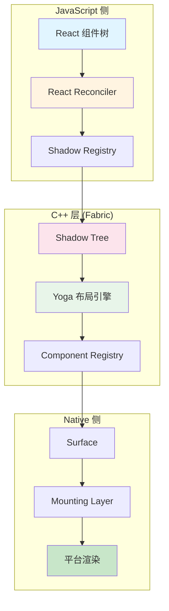
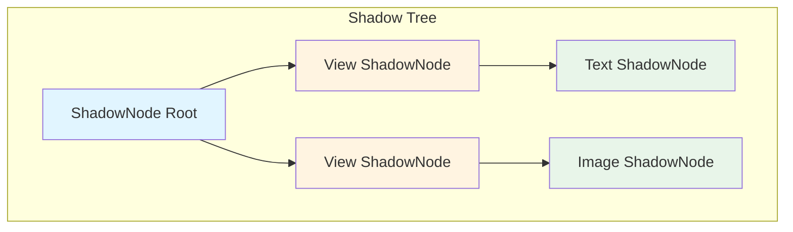
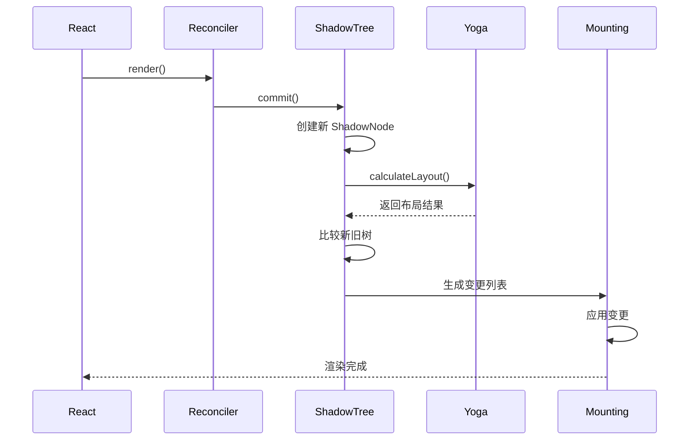
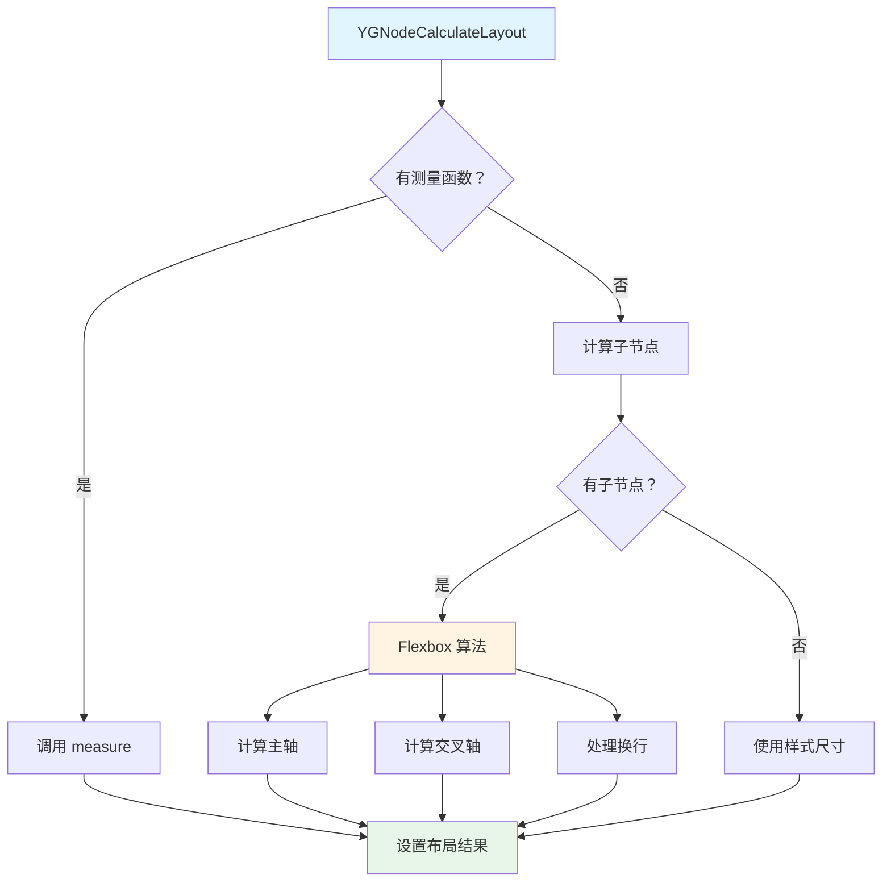
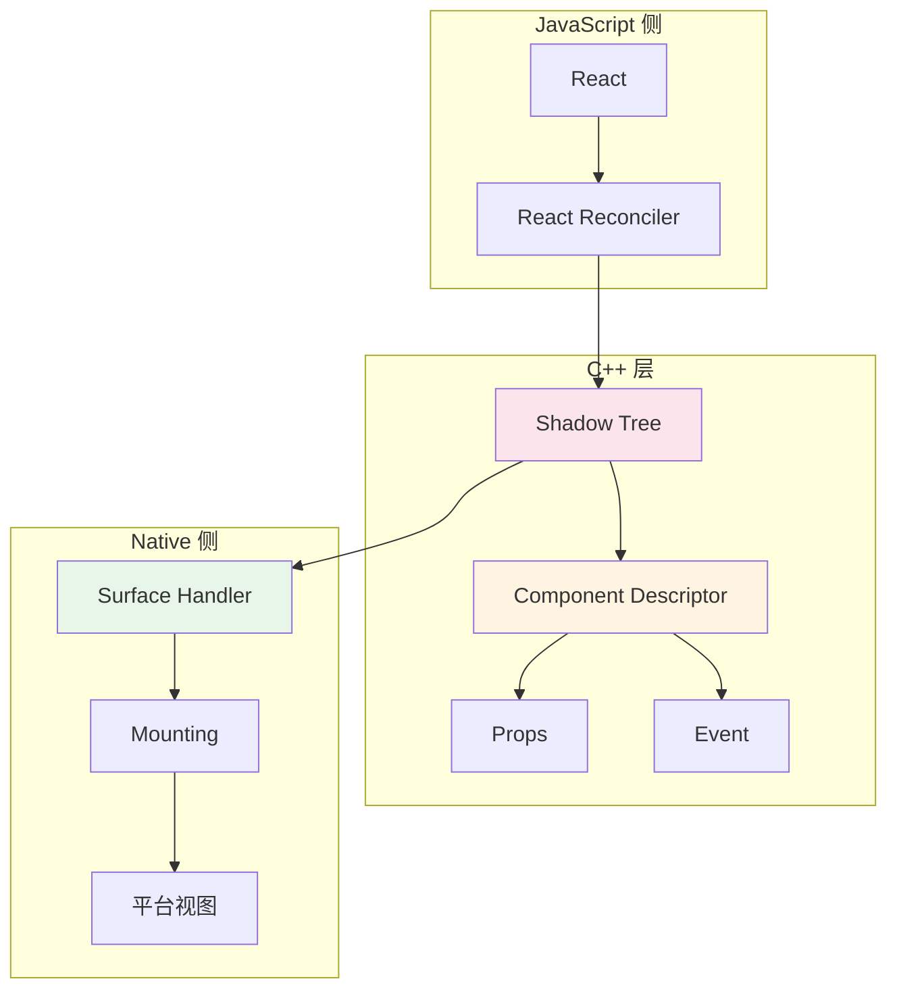
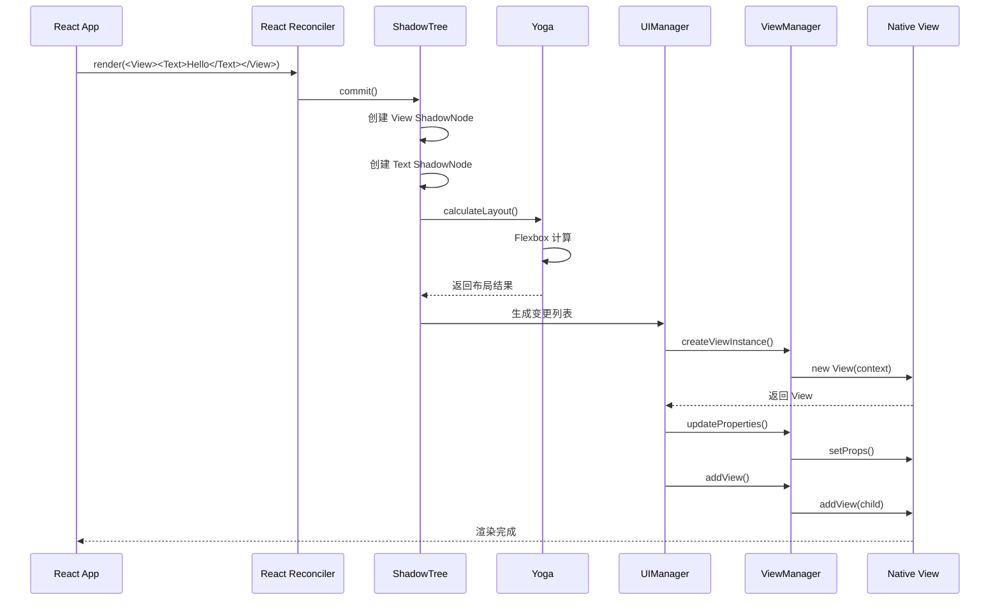

# 第 4 章 渲染系统

> 本章是 React Native 源码解析系列的第 4 章，聚焦于渲染系统的完整实现。我们将深入分析 Shadow Tree、Yoga 布局引擎、Fabric 渲染器以及视图层级管理机制。

---

## 1. 渲染系统架构概览

### 1.1 整体架构



### 1.2 架构演进对比
| 特性 | 旧架构 | 新架构 (Fabric) |
|------|-------|----------------|
| **渲染器** | UIManager | Fabric Renderer |
| **布局计算** | 异步 | 同步 |
| **树结构** | 扁平化 | Shadow Tree |
| **优先级** | FIFO | 可中断优先级 |
| **并发支持** | ❌ | ✅ React 18 |

---

## 2. Shadow Tree 原理

### 2.1 什么是 Shadow Tree？

**Shadow Tree** 是 React Native 在 C++ 层维护的**虚拟视图树**，用于：
- 布局计算（Yoga）
- 视图更新优化
- 跨线程渲染

**类比理解**：

| React Native | React Web | 说明 |
|-------------|-----------|------|
| Shadow Tree | Virtual DOM | 虚拟树结构 |
| Yoga | 浏览器布局引擎 | 布局计算 |
| Mounting | ReactDOM.commit | 提交到原生 |

### 2.2 Shadow Tree 结构



**源码位置**：`ReactCommon/react/renderer/components/`

```cpp
// ShadowNode 基类
class ShadowNode {
public:
    using Shared = std::shared_ptr<const ShadowNode>;
    using List = std::vector<Shared>;
    
    // 节点属性
    const ShadowNodeFamily& getFamily() const;
    const Props& getProps() const;
    const LayoutMetrics& getLayoutMetrics() const;
    
    // 子节点
    const ShadowNode::List& getChildren() const;
    
    // 克隆（不可变更新）
    virtual ShadowNode::Shared clone(
        ShadowNodeFamily::Shared family,
        ShadowNode::List children,
        Props::Shared props
    ) const;
};

// View ShadowNode
class ViewShadowNode : public ShadowNode {
public:
    static std::string const kComponentName = "View";
    
    // 布局计算
    void layout(LayoutContext context);
    
    // 获取 Yoga 节点
   YGNode& getYogaNode();
};
```

### 2.3 Shadow Tree 更新流程



**源码位置**：`ReactCommon/react/renderer/core/ShadowTree.cpp`

```cpp
class ShadowTree {
public:
    // 提交更新
    void commit(ShadowNodeFamily::Shared family, ShadowNode::Shared root) {
        // 1. 获取当前状态
        ShadowTreeRevision revision = getState();
        
        // 2. 计算布局
        root->layout(LayoutContext{...});
        
        // 3. 生成变更列表
        ShadowViewMutationList mutations = 
            collectViewMutations(revision.root, root);
        
        // 4. 应用到原生侧
        _delegate->shadowTreeDidCommit(root, mutations);
        
        // 5. 更新状态
        setState({root, revision.revision + 1});
    }
    
    // 收集视图变更
    ShadowViewMutationList collectViewMutations(
        ShadowNode::Shared oldRoot,
        ShadowNode::Shared newRoot
    ) {
        ShadowViewMutationList mutations;
        collectViewMutationsRecursive(
            oldRoot, newRoot, mutations, 0);
        return mutations;
    }
};
```

---

## 3. Yoga 布局引擎

### 3.1 什么是 Yoga？

**Yoga** 是一个**跨平台的 Flexbox 布局引擎**，由 Facebook 开源。

**核心特点**：
- 🎯 高性能：C++ 实现
- 🎯 跨平台：iOS/Android/Web
- 🎯 Flexbox 兼容：支持 CSS Flexbox 大部分特性
- 🎯 可嵌入：可集成到任何项目

**类比理解**：

| Yoga | 浏览器 | 说明 |
|------|-------|------|
| YGNode | DOM Node | 布局节点 |
| YGConfig | 浏览器设置 | 布局配置 |
| YGNodeCalculateLayout | 浏览器布局 | 布局计算 |

### 3.2 Yoga 节点结构

**源码位置**：`yoga/YGNode.cpp`

```cpp
// Yoga 节点
struct YGNode {
    // 样式属性
    YGStyle style;
    
    // 布局结果
    YGLayout layout;
    
    // 子节点
    std::vector<YGNodeRef> children;
    
    // 父节点
    YGNodeRef parent;
    
    // 上下文
    void* context;
    
    // 测量函数
    YGMeasureFunc measure;
    
    // 基线函数
    YGBaselineFunc baseline;
};

// 样式属性
struct YGStyle {
    YGDirection direction;
    YGFlexDirection flexDirection;
    YGJustify justifyContent;
    YGAlign alignContent;
    YGAlign alignItems;
    YGAlign alignSelf;
    YGPositionType position;
    YGWrap flexWrap;
    YGDisplay display;
    
    YGValue width;
    YGValue height;
    
    YGValue margin[4];
    YGValue padding[4];
    YGValue border[4];
    
    float flexGrow;
    float flexShrink;
    float flexBasis;
    
    // ... 更多属性
};

// 布局结果
struct YGLayout {
    float position[4];  // top, right, bottom, left
    float dimensions[2]; // width, height
    float margin[4];
    float border[4];
    float padding[4];
    
    YGDirection direction;
    bool hadOverflow;
};
```

### 3.3 布局计算流程



**源码位置**：`yoga/YGNode.cpp`

```cpp
// 布局计算入口
void YGNodeCalculateLayout(
    YGNodeRef node,
    float availableWidth,
    float availableHeight,
    YGDirection parentDirection
) {
    // 1. 重置布局
    YGNodeResetLayout(node);
    
    // 2. 如果有测量函数，使用测量
    if (node->measure != nullptr) {
        YGSize size = node->measure(
            node,
            availableWidth,
            availableHeight,
            node->context
        );
        node->layout.dimensions[0] = size.width;
        node->layout.dimensions[1] = size.height;
        return;
    }
    
    // 3. Flexbox 布局计算
    YGLayoutNodeInternal(
        node,
        availableWidth,
        availableHeight,
        parentDirection
    );
}

// Flexbox 布局核心算法
static void YGLayoutNodeInternal(
    YGNodeRef node,
    float availableWidth,
    float availableHeight,
    YGDirection parentDirection
) {
    // ① 计算主轴方向
    YGFlexDirection mainAxis = YGResolveFlexDirection(
        node->style.flexDirection,
        node->style.direction
    );
    
    // ② 收集子节点
    std::vector<YGNodeRef> children = node->children;
    
    // ③ 计算 flex 基础值
    for (YGNodeRef child : children) {
        calculateFlexBasis(child);
    }
    
    // ④ 收集 flex 项
    std::vector<YGCollectFlexItemsRowResult> flexLines;
    collectFlexItemsRow(children, mainAxis, flexLines);
    
    // ⑤ 计算每行的布局
    for (auto& line : flexLines) {
        // 计算主轴分布
        distributeMainAxisSpace(line);
        
        // 计算交叉轴对齐
        alignCrossAxis(line);
        
        // 设置子节点位置
        for (YGNodeRef child : line.children) {
            setChildPosition(child);
        }
    }
}
```

### 3.4 React Native 中的 Yoga 使用

**源码位置**：`ReactCommon/react/renderer/components/view/ViewShadowNode.cpp`

```cpp
class ViewShadowNode {
public:
    // 创建 Yoga 节点
    ViewShadowNode() {
        _yogaNode = YGNodeNew();
        
        // 设置测量函数（如果需要）
        YGNodeSetMeasureFunc(_yogaNode, measureFunction);
        
        // 设置上下文
        YGNodeSetContext(_yogaNode, this);
    }
    
    // 应用样式到 Yoga
    void updateProps(const Props& props) {
        const auto& viewProps = static_cast<const ViewProps&>(props);
        
        // Flexbox 属性
        YGNodeStyleSetFlexDirection(
            _yogaNode,
            convertFlexDirection(viewProps.flexDirection)
        );
        YGNodeStyleSetJustifyContent(
            _yogaNode,
            convertJustify(viewProps.justifyContent)
        );
        YGNodeStyleSetAlignItems(
            _yogaNode,
            convertAlign(viewProps.alignItems)
        );
        
        // 尺寸属性
        YGNodeStyleSetWidth(_yogaNode, viewProps.width.value);
        YGNodeStyleSetHeight(_yogaNode, viewProps.height.value);
        
        // 边距
        YGNodeStyleSetMargin(
            _yogaNode,
            YGEdgeTop,
            viewProps.marginTop.value
        );
        // ... 其他边距
    }
    
    // 布局计算
    void layout(LayoutContext context) {
        YGNodeCalculateLayout(
            _yogaNode,
            context.availableWidth,
            context.availableHeight,
            YGDirectionLTR
        );
        
        // 获取布局结果
        const YGLayout& layout = _yogaNode->layout;
        
        // 应用到 ShadowNode
        _layoutMetrics = {
            .frame = {
                .origin = {layout.position[YGEdgeLeft], 
                          layout.position[YGEdgeTop]},
                .size = {layout.dimensions[YGDimensionWidth],
                        layout.dimensions[YGDimensionHeight]}
            }
        };
    }
    
private:
    YGNodeRef _yogaNode;
    LayoutMetrics _layoutMetrics;
};
```

---

## 4. Fabric 渲染器

### 4.1 Fabric 架构



### 4.2 Component Descriptor

**源码位置**：`ReactCommon/react/renderer/core/ComponentDescriptor.h`

```cpp
// Component Descriptor 基类
class ComponentDescriptor {
public:
    using Shared = std::shared_ptr<const ComponentDescriptor>;
    
    // 组件名称
    virtual ComponentName const getComponentName() const = 0;
    
    // 创建 ShadowNode
    virtual ShadowNode::Shared createShadowNode(
        ShadowNodeFamily::Shared family,
        ShadowNode::Shared parentShadowNode,
        Props::Shared props
    ) const = 0;
    
    // 克隆 ShadowNode
    virtual ShadowNode::Shared cloneShadowNode(
        ShadowNode::Shared shadowNode,
        ShadowNode::List children,
        Props::Shared props
    ) const = 0;
};

// View Component Descriptor
class ViewComponentDescriptor : public ComponentDescriptor {
public:
    ComponentName const getComponentName() const override {
        return "View";
    }
    
    ShadowNode::Shared createShadowNode(
        ShadowNodeFamily::Shared family,
        ShadowNode::Shared parentShadowNode,
        Props::Shared props
    ) const override {
        return std::make_shared<ViewShadowNode>(
            ViewShadowNode::Handle{family},
            ViewShadowNode::Data{parentShadowNode, props}
        );
    }
};
```

### 4.3 Surface Handler

**源码位置**：`ReactCommon/react/renderer/uimanager/UIManager.cpp`

```cpp
class UIManager {
public:
    // 创建 Surface
    void createSurface(
        SurfaceId surfaceId,
        const SurfaceHandler& surfaceHandler
    ) {
        _surfaceRegistry.registerSurface(surfaceId, surfaceHandler);
    }
    
    // 启动渲染
    void startSurface(
        SurfaceId surfaceId,
        const std::string& moduleName,
        const folly::dynamic& initialProps
    ) {
        auto& surfaceHandler = _surfaceRegistry[surfaceId];
        surfaceHandler.start(moduleName, initialProps);
    }
    
    // 提交更新
    void commitSurface(
        SurfaceId surfaceId,
        ShadowNode::Shared root
    ) {
        auto& surfaceHandler = _surfaceRegistry[surfaceId];
        surfaceHandler.commit(root);
    }
    
    // 处理事件
    void dispatchEvent(
        SurfaceId surfaceId,
        EventTarget::Shared target,
        const Event& event
    ) {
        auto& surfaceHandler = _surfaceRegistry[surfaceId];
        surfaceHandler.dispatchEvent(target, event);
    }
};
```

---

## 5. 视图层级管理

### 5.1 视图注册

**源码位置**：`ReactAndroid/src/main/java/com/facebook/react/uimanager/UIManagerModule.java`

```java
public class UIManagerModule {
    private final Map<String, ViewManager> mViewManagers;
    
    // 注册 ViewManager
    public void registerViewManager(ViewManager viewManager) {
        String name = viewManager.getName();
        mViewManagers.put(name, viewManager);
    }
    
    // 获取 ViewManager
    public ViewManager getViewManager(String name) {
        return mViewManagers.get(name);
    }
    
    // 获取所有 ViewManager 名称
    public List<String> getViewManagerNames() {
        return new ArrayList<>(mViewManagers.keySet());
    }
}
```

### 5.2 ViewManager 基类

**源码位置**：`ReactAndroid/src/main/java/com/facebook/react/uimanager/ViewManager.java`

```java
public abstract class ViewManager<T extends View, P extends BaseViewManager> {
    
    // 创建视图实例
    public abstract T createViewInstance(ThemedReactContext context);
    
    // 获取视图名称
    public abstract String getName();
    
    // 更新属性
    public void updateProperties(T view, ReadableMap props) {
        for (Map.Entry<String, Object> entry : props.toHashMap().entrySet()) {
            updateProperty(view, entry.getKey(), entry.getValue());
        }
    }
    
    // 更新单个属性
    protected void updateProperty(T view, String propName, Object value) {
        // 通过反射或注解处理
    }
    
    // 添加子视图
    public void addView(T parent, View child, int index) {
        if (parent instanceof ViewGroup) {
            ((ViewGroup) parent).addView(child, index);
        }
    }
    
    // 移除子视图
    public void removeViewAt(T parent, int index) {
        if (parent instanceof ViewGroup) {
            ((ViewGroup) parent).removeViewAt(index);
        }
    }
    
    // 获取导出视图属性
    public Map<String, Object> getExportedCustomDirectEventTypeConstants() {
        return null;
    }
    
    // 获取导出样式属性
    public Map<String, Object> getExportedCustomBubblingEventTypeConstants() {
        return null;
    }
}
```

### 5.3 自定义 ViewManager

```java
// 自定义 ViewManager
public class CustomViewManager extends ViewGroupManager<ViewGroup> {
    
    @Override
    public String getName() {
        return "CustomView";
    }
    
    @Override
    public ViewGroup createViewInstance(ThemedReactContext context) {
        return new ViewGroup(context) {
            @Override
            protected void onLayout(boolean changed, int l, int t, int r, int b) {
                // 自定义布局逻辑
            }
        };
    }
    
    // 导出自定义属性
    @ReactProp(name = "customColor")
    public void setCustomColor(ViewGroup view, String color) {
        view.setBackgroundColor(Color.parseColor(color));
    }
    
    // 导出事件
    @Override
    public Map<String, Object> getExportedCustomDirectEventTypeConstants() {
        return MapBuilder.of(
            "onCustomEvent", MapBuilder.of("registrationName", "onCustomEvent")
        );
    }
}

// 注册 ViewManager
public class CustomPackage implements ReactPackage {
    @Override
    public List<ViewManager> createViewManagers(ReactApplicationContext context) {
        return Arrays.asList(new CustomViewManager());
    }
    
    @Override
    public List<NativeModule> createNativeModules(ReactApplicationContext context) {
        return Collections.emptyList();
    }
}
```

---

## 6. 渲染流程完整时序



---

## 7. 本章小结

### 7.1 核心要点

1. **Shadow Tree 是 C++ 层的虚拟视图树**，用于布局和更新优化
2. **Yoga 是 Flexbox 布局引擎**，负责计算视图位置和尺寸
3. **Fabric 渲染器**支持同步渲染和并发更新
4. **Component Descriptor** 定义组件的创建和克隆逻辑
5. **ViewManager** 管理原生视图的创建和属性更新
6. **Surface Handler** 管理渲染表面的生命周期

### 7.2 前端类比总结
| React Native 概念 | 前端类比 | 说明 |
|------------------|---------|------|
| Shadow Tree | Virtual DOM | 虚拟树结构 |
| Yoga | 浏览器布局引擎 | 布局计算 |
| Component Descriptor | Component Type | 组件定义 |
| Mounting | ReactDOM.commit | 提交更新 |
| ViewManager | DOM Factory | 视图工厂 |
| Surface | Render Target | 渲染目标 |

### 7.3 性能优化建议
| 优化点 | 方法 | 效果 |
|--------|------|------|
| **减少层级** | 使用 FlatList | 减少视图数量 |
| **避免重布局** | 固定尺寸 | 减少 Yoga 计算 |
| **使用纯组件** | React.memo | 减少重渲染 |
| **批量更新** | 合并 setState | 减少 Bridge 调用 |
| **图片优化** | 使用合适尺寸 | 减少内存占用 |

---

**本章是系列解析的第 4 章**，深入剖析了渲染系统的完整实现。下一章我们将总结架构设计亮点和最佳实践。
