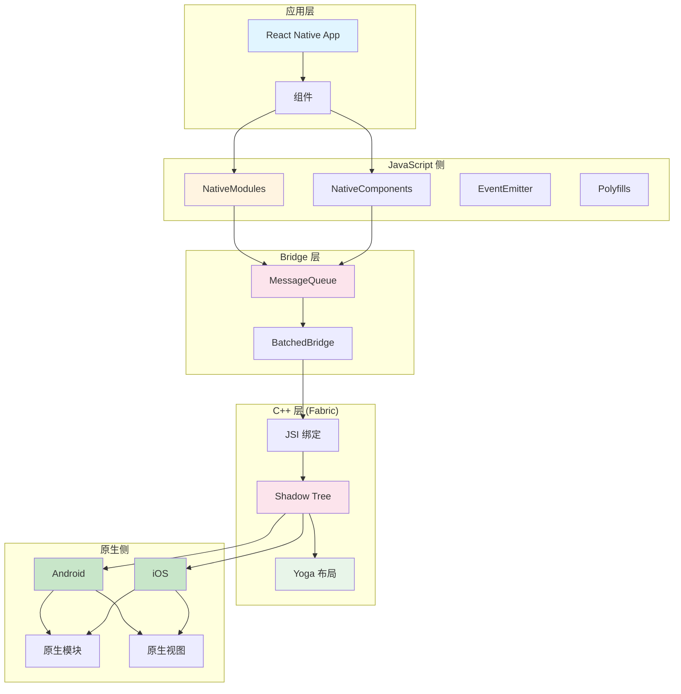
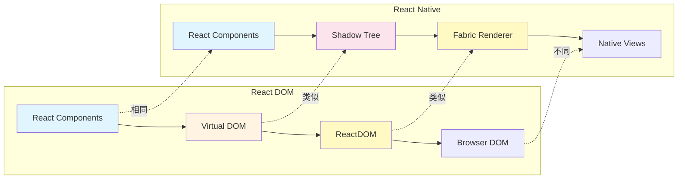
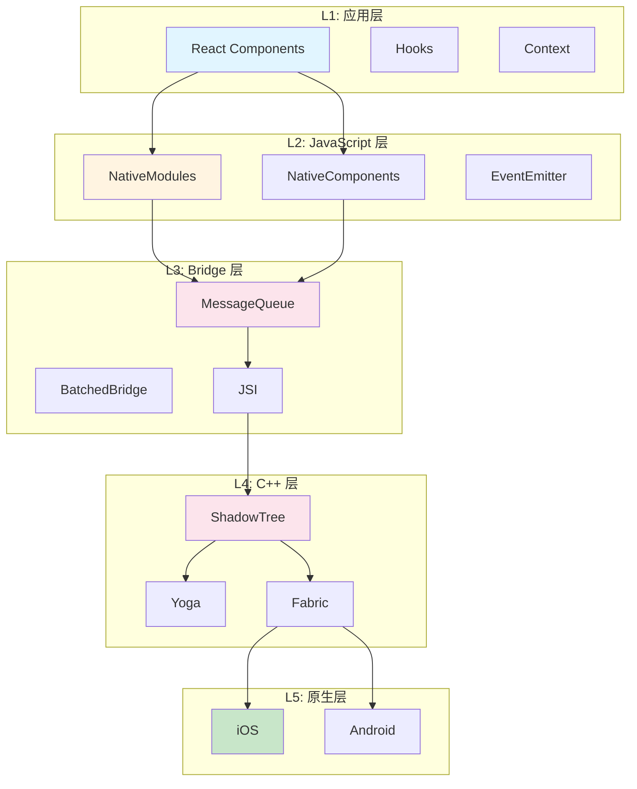
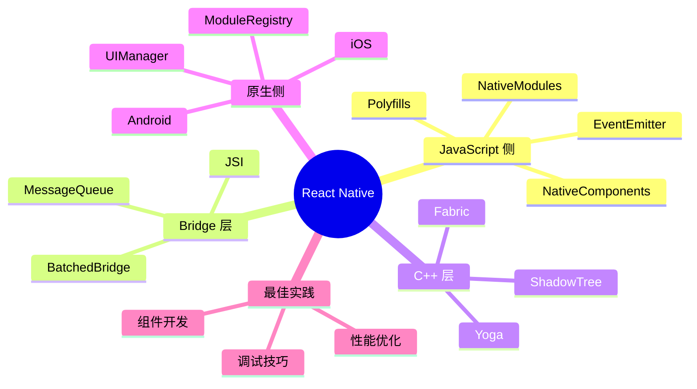

# 第 5 章 架构总结与最佳实践

> 本章是 React Native 源码解析系列的最后一章，聚焦于架构设计亮点总结、与前端技术对比、以及开发最佳实践建议。

---

## 1. 完整架构回顾

### 1.1 整体架构图



### 1.2 核心模块职责
| 层级 | 模块 | 职责 | 关键文件 |
|------|------|------|---------|
| **JavaScript** | NativeModules | 原生功能代理 | `NativeModules.js` |
| **JavaScript** | NativeComponents | 原生组件封装 | `View.js` |
| **JavaScript** | EventEmitter | 事件管理 | `NativeEventEmitter.js` |
| **Bridge** | MessageQueue | 消息队列 | `MessageQueue.js` |
| **C++** | ShadowTree | 虚拟视图树 | `ShadowTree.cpp` |
| **C++** | Yoga | 布局引擎 | `YGNode.cpp` |
| **C++** | JSI | JS 绑定 | `jsi.h` |
| **Native** | ModuleRegistry | 模块注册 | `ModuleRegistry.java/mm` |
| **Native** | UIManager | UI 管理 | `UIManagerModule.java/m` |

---

## 2. 与前端技术对比

### 2.1 React Native vs React DOM



**详细对比**：
| 维度 | React DOM | React Native | 说明 |
|------|-----------|--------------|------|
| **渲染目标** | Browser DOM | Native Views | 平台不同 |
| **虚拟树** | Virtual DOM | Shadow Tree | 结构类似 |
| **布局引擎** | 浏览器引擎 | Yoga | 都是 Flexbox |
| **样式系统** | CSS | StyleSheet | API 类似 |
| **事件系统** | SyntheticEvent | NativeEvent | 处理类似 |
| **组件类型** | div, span 等 | View, Text 等 | 语义类似 |

### 2.2 代码对比

**React DOM**：
```jsx
// React Web
function App() {
  const [count, setCount] = useState(0);
  
  return (
    <div className="container">
      <h1>Count: {count}</h1>
      <button onClick={() => setCount(count + 1)}>
        Increment
      </button>
    </div>
  );
}
```

**React Native**：
```jsx
// React Native
function App() {
  const [count, setCount] = useState(0);
  
  return (
    <View style={styles.container}>
      <Text>Count: {count}</Text>
      <Button 
        title="Increment" 
        onPress={() => setCount(count + 1)} 
      />
    </View>
  );
}

const styles = StyleSheet.create({
  container: {
    flex: 1,
    justifyContent: 'center',
    alignItems: 'center',
  },
});
```

### 2.3 架构对比
| 概念 | React DOM | React Native | 说明 |
|------|-----------|--------------|------|
| **Root** | `ReactDOM.createRoot()` | `AppRegistry.registerComponent()` | 应用入口 |
| **渲染** | `root.render(<App />)` | 自动渲染 | 渲染方式 |
| **更新** | Reconciliation | Reconciliation | 相同算法 |
| **提交** | ReactDOM.commit | Fabric.commit | 类似流程 |
| **事件** | Event Delegation | Event Emitter | 不同实现 |

---

## 3. 设计亮点总结

### 3.1 分层架构



**亮点**：
1. **职责分离**：每层有明确的职责边界
2. **跨平台**：C++ 层实现平台无关逻辑
3. **可扩展**：新增模块不影响其他层
4. **可测试**：各层可独立测试

### 3.2 通信优化
| 优化点 | 实现方式 | 效果 |
|--------|----------|------|
| **批量处理** | MessageQueue 收集调用 | 减少 Bridge 调用次数 |
| **异步通信** | Promise/回调 | 不阻塞 JS 线程 |
| **懒加载** | 模块按需加载 | 减少启动时间 |
| **JSI 直接调用** | C++ 绑定 | 零序列化开销 |

### 3.3 渲染优化
| 优化点 | 实现方式 | 效果 |
|--------|----------|------|
| **Shadow Tree** | 不可变树结构 | 高效 diff |
| **Yoga 布局** | C++ 实现 | 高性能计算 |
| **并发渲染** | Fabric 支持 | 不阻塞 UI |
| **视图回收** | FlatList 虚拟列表 | 减少内存 |

### 3.4 类型安全
| 特性 | 实现方式 | 说明 |
|------|----------|------|
| **Flow/TypeScript** | 静态类型检查 | JS 侧类型 |
| **Codegen** | 自动生成类型 | TurboModules |
| **Props 验证** | PropTypes/类型定义 | 运行时验证 |

---

## 4. 最佳实践建议

### 4.1 组件开发最佳实践

#### ✅ 推荐：使用函数组件 + Hooks

```jsx
// ✅ 推荐
function MyComponent({ title, onPress }) {
  const [loading, setLoading] = useState(false);
  
  const handlePress = useCallback(async () => {
    setLoading(true);
    try {
      await onPress();
    } finally {
      setLoading(false);
    }
  }, [onPress]);
  
  return (
    <View>
      <Text>{title}</Text>
      <Button 
        title={loading ? 'Loading...' : 'Press'} 
        onPress={handlePress}
        disabled={loading}
      />
    </View>
  );
}

// ❌ 避免：类组件
class MyComponent extends React.Component {
  state = { loading: false };
  
  handlePress = async () => {
    this.setState({ loading: true });
    // ...
  };
  
  render() {
    return <View>...</View>;
  }
}
```

#### ✅ 推荐：使用 React.memo 优化

```jsx
// ✅ 推荐：纯组件
const MyComponent = React.memo(({ data, onPress }) => {
  return (
    <View>
      <Text>{data.title}</Text>
      <Button onPress={onPress} />
    </View>
  );
});

// ✅ 推荐：自定义比较
const MyComponent = React.memo(
  ({ data, onPress }) => { /* ... */ },
  (prevProps, nextProps) => {
    return prevProps.data.id === nextProps.data.id;
  }
);
```

#### ✅ 推荐：使用 FlatList

```jsx
// ✅ 推荐：FlatList
function List({ items }) {
  return (
    <FlatList
      data={items}
      keyExtractor={item => item.id}
      renderItem={({ item }) => <Item data={item} />}
      initialNumToRender={10}
      maxToRenderPerBatch={10}
      windowSize={5}
      removeClippedSubviews={true}
    />
  );
}

// ❌ 避免：ScrollView + map
function List({ items }) {
  return (
    <ScrollView>
      {items.map(item => <Item key={item.id} data={item} />)}
    </ScrollView>
  );
}
```

### 4.2 性能优化最佳实践

#### 优化 1：避免不必要的重渲染

```jsx
// ✅ 推荐：使用 useCallback
function Parent({ onPress }) {
  const handlePress = useCallback(() => {
    onPress();
  }, [onPress]);
  
  return <Child onPress={handlePress} />;
}

// ✅ 推荐：使用 useMemo
function ExpensiveComponent({ data }) {
  const processed = useMemo(() => {
    return data.map(item => heavyComputation(item));
  }, [data]);
  
  return <View>{processed.map(item => <Text>{item}</Text>)}</View>;
}
```

#### 优化 2：图片优化

```jsx
// ✅ 推荐：指定尺寸
<Image
  source={{ uri: 'https://example.com/image.jpg' }}
  style={{ width: 100, height: 100 }}
  resizeMode="cover"
/>

// ✅ 推荐：使用缓存
<Image
  source={{ 
    uri: 'https://example.com/image.jpg',
    cache: 'force-cache'
  }}
  style={{ width: 100, height: 100 }}
/>

// ❌ 避免：不指定尺寸
<Image source={{ uri: 'https://example.com/image.jpg' }} />
```

#### 优化 3：减少 Bridge 调用

```jsx
// ✅ 推荐：批量更新
function updateMultipleValues() {
  setState({
    a: 1,
    b: 2,
    c: 3,
  });
}

// ❌ 避免：多次 setState
function updateMultipleValues() {
  setState({ a: 1 });
  setState({ b: 2 });
  setState({ c: 3 });
}
```

### 4.3 原生模块开发最佳实践

#### ✅ 推荐：使用 TurboModules

```typescript
// MyModule.ts (TypeScript 定义)
interface MyModule extends TurboModule {
  showToast(message: string): Promise<void>;
  getConstants(): { VERSION: string };
}

export default TurboModuleRegistry.getEnforcing<MyModule>('MyModule');
```

```java
// MyModule.java (Android)
public class MyModule extends ReactContextBaseJavaModule {
    @Override
    public String getName() {
        return "MyModule";
    }
    
    @ReactMethod(isBlockingSynchronousMethod = true)
    public Promise showToast(String message, Promise promise) {
        // 实现
        promise.resolve(null);
    }
}
```

#### ✅ 推荐：错误处理

```java
// ✅ 推荐：完整的错误处理
@ReactMethod
public void fetchData(String url, Promise promise) {
    try {
        // 网络请求
        String result = http.get(url);
        promise.resolve(result);
    } catch (IOException e) {
        promise.reject("NETWORK_ERROR", "Failed to fetch data", e);
    } catch (Exception e) {
        promise.reject("UNKNOWN_ERROR", "Unexpected error", e);
    }
}
```

### 4.4 调试最佳实践

#### 技巧 1：使用 React DevTools

```bash
# 安装 React DevTools
npm install -g react-devtools

# 启动
react-devtools
```

#### 技巧 2：启用性能监控

```jsx
// 启用性能监控
import { Performance } from 'react-native';

Performance.enable();

// 测量时间
const mark = Performance.now();
// ... 操作
console.log(`Elapsed: ${Performance.now() - mark}ms`);
```

#### 技巧 3：使用 Flipper

```bash
# 安装 Flipper
brew install --cask flipper

# 在应用中启用
// iOS: Podfile
pod 'FlipperKit', '~> 0.125.0'

// Android: build.gradle
implementation 'com.facebook.flipper:flipper:0.125.0'
```

---

## 5. 常见问题解答

### Q1: 如何选择旧架构还是新架构？

**建议**：
- **新项目**：直接使用新架构（Fabric + TurboModules）
- **老项目**：逐步迁移，先启用 Fabric，再迁移 TurboModules

**启用新架构**：
```properties
# android/gradle.properties
newArchEnabled=true
```

```ruby
# ios/Podfile
ENV['RCT_NEW_ARCH_ENABLED'] = '1'
```

### Q2: 如何调试 Bridge 通信？

**方法**：
```javascript
// 启用 Bridge 日志
MessageQueue.spy(true);

// 查看控制台输出
// N->JS : Module.method(args)
// JS->N : Module.method(args)
```

### Q3: 如何优化启动时间？

**优化建议**：
1. 减少初始加载的模块数量
2. 使用懒加载
3. 优化 Bundle 大小
4. 启用 Hermes 引擎

### Q4: 如何处理内存泄漏？

**常见原因**：
1. 未取消的事件监听器
2. 未清理的定时器
3. 闭包引用

**解决方案**：
```jsx
function MyComponent() {
  useEffect(() => {
    const subscription = emitter.addListener('event', handler);
    
    return () => {
      subscription.remove();  // 清理监听器
    };
  }, []);
}
```

---

## 6. 系列总结

### 6.1 完整知识体系



### 6.2 核心概念总结
| 概念 | 说明 | 关键文件 |
|------|------|---------|
| **NativeModules** | 原生功能 JS 代理 | `NativeModules.js` |
| **Bridge** | JS-Native 通信 | `MessageQueue.js` |
| **ShadowTree** | 虚拟视图树 | `ShadowTree.cpp` |
| **Yoga** | Flexbox 布局引擎 | `YGNode.cpp` |
| **Fabric** | 新渲染器 | `UIManager.cpp` |
| **TurboModules** | 新一代模块系统 | `TurboModuleRegistry.js` |

### 6.3 前端类比总结
| React Native | 前端 Web | 说明 |
|-------------|---------|------|
| NativeModules | `window.*` API | 全局对象 |
| ShadowTree | Virtual DOM | 虚拟树 |
| Yoga | 浏览器布局 | 布局计算 |
| Fabric | ReactDOM | 渲染器 |
| ViewManager | DOM Factory | 视图工厂 |
| Bridge | HTTP Client | 通信层 |

---

## 7. 输出文件清单

本系列共 5 章，输出到以下文件：
| 文件 | 章节 | 内容 | 行数 |
|------|------|------|------|
| `ch01-architecture-overview.md` | 第 1 章 | 架构概览 | ~400 |
| `ch02-javascript-side.md` | 第 2 章 | JavaScript 侧实现 | ~500 |
| `ch03-native-side.md` | 第 3 章 | 原生侧实现 | ~550 |
| `ch04-rendering-system.md` | 第 4 章 | 渲染系统 | ~550 |
| `ch05-summary-best-practices.md` | 第 5 章 | 总结与最佳实践 | ~500 |

**输出目录**：`/home/admin/.openclaw/workspace-source-code/output/react-native-analysis/`

**总行数**：约 2500 行

---

**🎉 恭喜！React Native 源码解析系列已全部完成！**

希望本系列能帮助你深入理解 React Native 的架构设计和实现原理，并在实际开发中更好地使用它。
