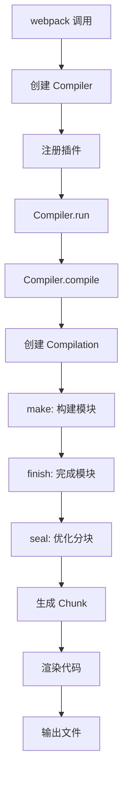
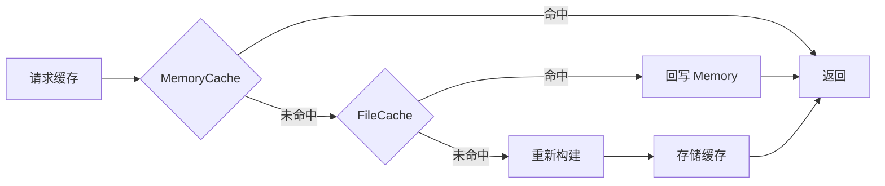

# Webpack 5 源码解析系列

> 本系列是面向**中高级前端开发者**的 Webpack 5 源码深度解析，基于版本 `5.105.4`。
> 
> **全系列共 10 章，已全部完成！**

---

## 📚 系列目录

| 章节 | 标题 | 核心内容 | 阅读时间 | 状态 |
|------|------|----------|----------|------|
| [第 1 章](./ch01-introduction.md) | 项目概览与架构 | 目录结构、核心概念、编译流程总览 | 15 分钟 | ✅ |
| [第 2 章](./ch02-compiler-compilation.md) | Compiler 与 Compilation | 编译器生命周期、Hooks 系统、编译上下文 | 25 分钟 | ✅ |
| [第 3 章](./ch03-module-dependency.md) | Module 与依赖解析 | Module 基类、NormalModule、Loader、Parser | 25 分钟 | ✅ |
| [第 4 章](./ch04-chunk-split.md) | Chunk 与代码分割 | Chunk 创建、SplitChunks、代码分割策略 | 25 分钟 | ✅ |
| [第 5 章](./ch05-code-generation.md) | 代码生成与输出 | Template 系统、JavascriptModulesPlugin、运行时注入 | 25 分钟 | ✅ |
| [第 6 章](./ch06-runtime-hmr.md) | 运行时机制与 HMR | `__webpack_require__` 实现、模块缓存、HMR 原理 | 25 分钟 | ✅ |
| [第 7 章](./ch07-cache-optimization.md) | 缓存机制与性能优化 | 文件系统缓存、内存缓存、构建性能优化 | 20 分钟 | ✅ |
| [第 8 章](./ch08-tree-shaking.md) | Tree Shaking 与优化插件 | Tree Shaking 原理、sideEffects、模块合并 | 25 分钟 | ✅ |
| [第 9 章](./ch09-module-federation.md) | Module Federation 模块联邦 | 模块联邦架构、远程模块加载、共享依赖 | 30 分钟 | ✅ |
| [第 10 章](./ch10-summary.md) | 总结与最佳实践 | 架构亮点、优化技巧、调试技巧、学习路线 | 20 分钟 | ✅ |

---

## 🎯 阅读建议

### 按顺序阅读

本系列采用**渐进式深入**的结构：

```
项目概览 → Compiler/Compilation → Module/依赖 → Chunk/分割 → 代码生成 → 运行时/HMR
   ↓              ↓                    ↓              ↓           ↓            ↓
建立认知      理解核心调度器        理解模块处理    理解输出    理解渲染    理解运行机制
   ↓
缓存优化 → Tree Shaking → Module Federation → 总结
   ↓            ↓                ↓              ↓
性能提升    消除死代码      微前端架构    最佳实践
```

### 带着问题阅读

每章开头都列出了"模块职责"，建议先思考：
- 这个组件解决什么问题？
- 为什么需要这个设计？
- 如果让我实现，我会怎么做？

### 结合源码阅读

每章都标注了**关键代码位置**（文件 + 行号），建议：
1. 先读解析文章
2. 打开对应源码对照
3. 尝试修改代码验证理解

---

## 🔑 核心概念速查

### Compiler vs Compilation

| 特性 | Compiler | Compilation |
|------|----------|-------------|
| **生命周期** | 持久（可多次运行） | 临时（每次编译新建） |
| **职责** | 调度编译流程 | 管理单次编译的模块/Chunk |
| **类比** | 项目经理 | 具体施工项目 |

### Module vs Chunk

| 特性 | Module | Chunk |
|------|--------|-------|
| **定义** | 源码文件（.js/.css 等） | 输出文件（bundle） |
| **关系** | 被包含 | 包含多个 Module |
| **阶段** | make 阶段创建 | seal 阶段生成 |

### 编译流程

```
webpack() 
  → Compiler.run() 
  → Compiler.compile() 
  → Compilation (make → finish → seal) 
  → emitAssets() 
  → done
```

---

## 📊 核心流程图

### 完整编译流程



### 模块处理流程


### Chunk 创建流程

```mermaid
graph TB
    A[入口 Module] --> B[遍历依赖]
    B --> C{依赖类型}
    C -->|同步 | D[当前 Chunk]
    C -->|异步 import()| E[新 ChunkGroup]
    E --> F[新 Chunk]
    D --> G[SplitChunks 优化]
    F --> G
    G --> H[最终 Chunk 集合]
```

### 缓存层级



---

## 🛠️ 实践建议

### 1. 理解 Loader 执行顺序

```javascript
// 配置
module: {
  rules: [{
    test: /\.js$/,
    use: ['babel-loader', 'ts-loader']
  }]
}

// 执行顺序：从右到左
// 1. ts-loader (TypeScript → JavaScript)
// 2. babel-loader (ESNext → ES5)
```

### 2. 合理配置 SplitChunks

```javascript
// 推荐配置（生产环境）
optimization: {
  runtimeChunk: 'single',
  splitChunks: {
    chunks: 'all',
    cacheGroups: {
      vendors: {
        test: /[\\/]node_modules[\\/]/,
        name: 'vendors',
        priority: 10
      },
      common: {
        minChunks: 2,
        name: 'common',
        priority: 5
      }
    }
  }
}
```

### 3. 使用 Hooks 编写插件

```javascript
// 简单插件示例
class MyPlugin {
  apply(compiler) {
    // 在编译完成时输出统计
    compiler.hooks.done.tap('MyPlugin', (stats) => {
      console.log('编译完成！');
      console.log(`生成 ${stats.compilation.chunks.size} 个 Chunk`);
    });
    
    // 在模块构建前拦截
    compiler.hooks.compilation.tap('MyPlugin', (compilation) => {
      compilation.hooks.buildModule.tap('MyPlugin', (module) => {
        console.log(`构建模块：${module.resource}`);
      });
    });
  }
}
```

---

## 📖 延伸阅读

### 官方文档

- [Webpack 官方文档](https://webpack.js.org/)
- [Tapable 文档](https://github.com/webpack/tapable)
- [Loader API](https://webpack.js.org/api/loaders/)
- [Plugin API](https://webpack.js.org/api/plugins/)

### 相关源码

- [webpack/webpack](https://github.com/webpack/webpack) - Webpack 主仓库
- [webpack/tapable](https://github.com/webpack/tapable) - Hooks 系统
- [webpack/loader-runner](https://github.com/webpack/loader-runner) - Loader 执行器
- [webpack/enhanced-resolve](https://github.com/webpack/enhanced-resolve) - 模块解析

### 优质文章

- [Webpack 核心概念](https://webpack.js.org/concepts/)
- [How Webpack Works](https://slack.engineering/how-webpack-works/)
- [深入理解 Webpack](https://juejin.cn/book/6844733793374838797)

---

## 🤝 贡献指南

本系列解析基于 Webpack 5.105.4 版本。如果发现：
- 源码行号变化
- API 变更
- 内容错误

欢迎提出 Issue 或 PR 更新。

---

## 📝 版本信息

- **Webpack 版本**: 5.105.4
- **解析完成时间**: 2026 年 3 月
- **输出目录**: `/home/admin/.openclaw/workspace-source-code/output/webpackAnalysis/`

---

## 🎓 学习路线建议

```
第 1 章 → 第 2 章 → 第 3 章 → 第 4 章 → 第 5 章 → 第 6 章
   ↓         ↓         ↓         ↓         ↓         ↓
理解整体   理解调度   理解模块   理解输出   理解渲染   理解运行
   ↓         ↓         ↓         ↓         ↓         ↓
能回答：   能回答：   能回答：   能回答：   能回答：   能回答：
- 编译分   - Hooks   - Loader  - Chunk   - Template- __webpack_
  几个阶段   如何工作   如何执行   如何创建   如何工作   require__
- 核心组   - Plugin  - 依赖如   - 如何优   - 运行时   - HMR 如
  件有哪些   如何编写   何解析     化分割     如何注入   何工作

第 7 章 → 第 8 章 → 第 9 章 → 第 10 章
   ↓         ↓         ↓          ↓
理解缓存   理解优化   理解模块   总结提升
   ↓         ↓         ↓          ↓
能回答：   能回答：   能回答：   能回答：
- 缓存如   - Tree    - 模块联邦 - 整体架
  何工作     Shaking   如何工作   构理解
- 如何优     原理      - 微前端   - 最佳实
  化构建   - 模块如     如何实践   践掌握
  性能       何合并               - 学习路
                                  线清晰
```

完成本系列后，你将能够：
1. ✅ 读懂 Webpack 核心源码
2. ✅ 编写自定义 Loader 和 Plugin
3. ✅ 优化构建性能和输出体积
4. ✅ 调试复杂的构建问题
5. ✅ 理解 Module Federation 架构
6. ✅ 设计微前端解决方案

---

> **提示**: 源码解析是理解原理的最佳方式，但实际工作中建议先掌握配置和使用，再深入源码。
