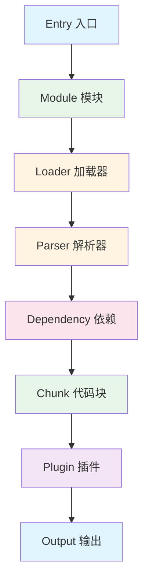
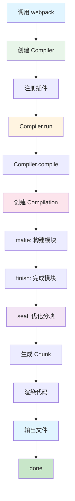

# 第 1 章 Webpack 项目概览与架构设计

> 本章是 Webpack 5 源码系列解析的**第 1 章**，聚焦于建立整体认知框架。在开始深入源码之前，我们需要理解 Webpack 的项目结构、核心模块划分，以及编译流程概览。

---

## 1. Webpack 定位

### 1.1 什么是 Webpack？

**Webpack** 是一个**现代 JavaScript 应用程序的静态模块打包器**（module bundler）。

**核心设计目标**：
- 🎯 **模块打包**：将所有依赖（JS、CSS、图片等）打包成少量文件
- 🎯 **代码分割**：支持按需加载，优化首屏性能
- 🎯 **生态丰富**：通过 Loader 和 Plugin 系统支持各种场景
- 🎯 **开发体验**：支持热更新（HMR）、SourceMap 等开发工具

### 1.2 与其他构建工具对比

| 工具 | 定位 | 特点 |
|------|------|------|
| **Webpack** | 模块打包器 | 生态最丰富，配置最灵活 |
| **Vite** | 开发服务器 + 打包器 | 基于 ESM，开发启动快 |
| **Rollup** | 库打包器 | 输出更简洁，适合库开发 |
| **esbuild** | 打包器 + 压缩器 | Go 编写，速度极快 |
| **Turbopack** | Rust 版 Webpack | Vercel 开发，性能优化 |

### 1.3 核心概念



---

## 2. 源码目录结构

### 2.1 整体结构

```
webpack-5.105.4/
├── lib/                          # ⭐ 核心源码目录（192 个文件）
│   ├── index.js                  # 📍 入口文件，导出所有公共 API
│   ├── webpack.js                # 📍 webpack() 主函数
│   ├── Compiler.js               # 📍 核心编译器（1800+ 行）
│   ├── Compilation.js            # 📍 编译过程（3000+ 行）
│   ├── Module.js                 # 模块基类
│   ├── NormalModule.js           # 普通模块实现
│   ├── Chunk.js                  # Chunk 类
│   ├── ChunkGraph.js             # Chunk-Module 关系图
│   ├── ModuleGraph.js            # Module 依赖关系图
│   ├── ChunkGroup.js             # Chunk 组
│   ├── Entrypoint.js             # 入口点
│   ├── dependencies/             # 依赖类型定义
│   ├── optimize/                 # 优化插件
│   ├── javascript/               # JS 模块处理
│   ├── container/                # Module Federation
│   ├── sharing/                  # 共享模块
│   └── ...                       # 其他功能模块
│
├── bin/                          # CLI 命令行工具
│   └── webpack.js
├── hot/                          # 热更新相关
├── schemas/                      # JSON Schema 定义
├── declarations/                 # TypeScript 类型定义
├── tooling/                      # 构建工具
├── test/                         # 测试用例
└── package.json
```

### 2.2 核心文件职责

| 文件 | 行数 | 职责 | 前端类比 |
|------|------|------|---------|
| `lib/index.js` | 600+ | 导出所有 API | `react/index.js` |
| `lib/webpack.js` | 250+ | webpack() 函数实现 | `ReactDOM.render()` |
| `lib/Compiler.js` | 1800+ | 编译器生命周期管理 | 项目经理 |
| `lib/Compilation.js` | 3000+ | 单次编译过程管理 | 施工项目 |
| `lib/Module.js` | 500+ | 模块基类 | 组件基类 |
| `lib/NormalModule.js` | 1200+ | 普通模块处理 | 标准组件 |
| `lib/Chunk.js` | 800+ | 代码块管理 | 打包结果 |
| `lib/ChunkGraph.js` | 1800+ | Chunk-Module 关系 | 依赖图 |

### 2.3 关键观察

1. **核心逻辑集中在 `lib/` 目录**：约 192 个文件，总代码量约 10 万行
2. **Compiler 和 Compilation 是核心**：两者合计约 5000 行代码
3. **模块化拆分清晰**：dependencies、optimize、javascript 等目录职责明确
4. **使用 Tapable 管理 Hooks**：所有生命周期都通过 Hooks 系统管理

---

## 3. 核心 API 与导出

### 3.1 入口文件分析

**源码位置**：`lib/index.js`

```javascript
// lib/index.js
const webpack = require("./webpack");

module.exports = mergeExports(webpack, {
  // 核心类导出
  get Compiler() { return require("./Compiler"); },
  get Compilation() { return require("./Compilation"); },
  get Module() { return require("./Module"); },
  get Chunk() { return require("./Chunk"); },
  get ChunkGraph() { return require("./ChunkGraph"); },
  
  // 插件导出
  get DefinePlugin() { return require("./DefinePlugin"); },
  get HotModuleReplacementPlugin() { return require("./HotModuleReplacementPlugin"); },
  get SplitChunksPlugin() { return require("./optimize/SplitChunksPlugin"); },
  
  // 工具函数
  get validate() { return require("./validateSchema"); },
  get version() { return require("../package.json").version; }
});
```

**解读**：
- 使用**懒加载**模式导出所有 API
- 通过 `mergeExports` 合并多个导出对象
- 保持向后兼容性，部分 API 已标记为 deprecated

---

## 4. Webpack 核心流程

### 4.1 编译流程总览



### 4.2 核心阶段详解

| 阶段 | Hook | 职责 | 关键代码 |
|------|------|------|---------|
| **初始化** | `initialize` | 初始化 Compiler | `Compiler.constructor` |
| **编译前** | `beforeCompile` | 准备编译参数 | `Compiler.compile` |
| **编译** | `compile` | 创建 Compilation | `Compiler.newCompilation` |
| **构建模块** | `make` | 解析所有模块 | `Compilation.buildModule` |
| **完成构建** | `finishMake` | 完成模块构建 | `Compilation.finish` |
| **优化分块** | `seal` | 优化 Chunk 划分 | `Compilation.seal` |
| **输出** | `emit` | 输出文件 | `Compiler.emitAssets` |
| **完成** | `done` | 编译完成 | `Stats.toJson` |

### 4.3 源码实现

**Compiler.run() 简化版**：

```javascript
// lib/Compiler.js
run(callback) {
  const onCompiled = (err, compilation) => {
    if (err) return callback(err);
    
    // 判断是否需要输出
    if (this.hooks.shouldEmit.call(compilation) === false) {
      const stats = new Stats(compilation);
      this.hooks.done.callAsync(stats, callback);
      return;
    }
    
    // 输出文件
    this.emitAssets(compilation, (err) => {
      if (err) return callback(err);
      
      const stats = new Stats(compilation);
      this.hooks.done.callAsync(stats, callback);
    });
  };
  
  // 触发 beforeRun 和 run hooks
  this.hooks.beforeRun.callAsync(this, (err) => {
    this.hooks.run.callAsync(this, (err) => {
      this.compile(onCompiled);
    });
  });
}
```

**Compiler.compile() 核心逻辑**：

```javascript
// lib/Compiler.js
compile(callback) {
  const params = this.newCompilationParams();
  
  // 触发 beforeCompile hook
  this.hooks.beforeCompile.callAsync(params, (err) => {
    if (err) return callback(err);
    
    this.hooks.compile.call(params);
    
    // 创建新的 Compilation
    const compilation = this.newCompilation(params);
    
    // 触发 make hook（构建模块）
    this.hooks.make.callAsync(compilation, (err) => {
      if (err) return callback(err);
      
      // 完成模块构建
      compilation.finish((err) => {
        if (err) return callback(err);
        
        // 优化分块
        compilation.seal((err) => {
          if (err) return callback(err);
          
          // 触发 afterCompile hook
          this.hooks.afterCompile.callAsync(compilation, callback);
        });
      });
    });
  });
}
```

---

## 5. Hooks 系统（Tapable）

### 5.1 什么是 Tapable？

**Tapable** 是一个类似 EventEmitter 的库，但支持**同步和异步**钩子。

**Webpack 5 使用 Tapable 管理所有生命周期**。

### 5.2 Hook 类型

| Hook 类型 | 执行方式 | 用途 |
|---------|---------|------|
| `SyncHook` | 同步串行 | 不关心返回值 |
| `SyncBailHook` | 同步串行 | 返回值非 undefined 时停止 |
| `AsyncSeriesHook` | 异步串行 | 按顺序执行 |
| `AsyncParallelHook` | 异步并行 | 同时执行 |

### 5.3 Compiler 的主要 Hooks

```javascript
// lib/Compiler.js
this.hooks = {
  // 初始化阶段
  initialize: new SyncHook([]),
  environment: new SyncHook([]),
  afterEnvironment: new SyncHook([]),
  afterPlugins: new SyncHook([compiler]),
  afterResolvers: new SyncHook([compiler]),
  
  // 编译阶段
  beforeCompile: new AsyncSeriesHook([params]),
  compile: new SyncHook([params]),
  make: new AsyncParallelHook([compilation]),
  finishMake: new AsyncSeriesHook([compilation]),
  afterCompile: new AsyncSeriesHook([compilation]),
  
  // 输出阶段
  shouldEmit: new SyncBailHook([compilation]),
  emit: new AsyncSeriesHook([compilation]),
  afterEmit: new AsyncSeriesHook([compilation]),
  
  // 完成阶段
  done: new AsyncSeriesHook([stats]),
  failed: new SyncHook([error])
};
```

### 5.4 Plugin 如何使用 Hooks

```javascript
// 自定义 Plugin 示例
class MyPlugin {
  apply(compiler) {
    // 监听 compilation hook
    compiler.hooks.compilation.tap('MyPlugin', (compilation) => {
      console.log('Compilation 开始');
      
      // 监听模块构建
      compilation.hooks.buildModule.tap('MyPlugin', (module) => {
        console.log(`构建模块：${module.resource}`);
      });
    });
    
    // 监听 done hook
    compiler.hooks.done.tap('MyPlugin', (stats) => {
      console.log(`编译完成，耗时：${stats.endTime - stats.startTime}ms`);
    });
  }
}
```

---

## 6. 关键设计亮点

### 6.1 模块化架构

```
Compiler（编译器）
  ↓ 创建
Compilation（编译过程）
  ↓ 构建
Module（模块）
  ↓ 解析
Dependency（依赖）
  ↓ 优化
Chunk（代码块）
  ↓ 输出
Asset（资源文件）
```

**优点**：
- 职责清晰，每个类只负责一件事
- 易于扩展，可以通过 Plugin 插入各个阶段
- 便于测试，每个模块可以独立测试

### 6.2 基于 Hooks 的插件系统

**设计思想**：**开放封闭原则**（对扩展开放，对修改封闭）

```
Plugin A ──┐
Plugin B ──┼──→ Hook ──→ 执行所有注册的插件
Plugin C ──┘
```

**优点**：
- 插件可以插入到编译的任何阶段
- 插件之间互不干扰
- 官方和第三方插件生态丰富

### 6.3 图算法优化

Webpack 内部使用**图算法**管理模块依赖：

- **ModuleGraph**：模块依赖关系图
- **ChunkGraph**：Chunk-Module 关系图
- **ObjectGraph**：对象序列化图

**优点**：
- 高效的依赖查找
- 支持 Tree Shaking
- 支持 Code Splitting

---

## 7. 本章小结

### 7.1 核心要点

1. **Webpack 是模块打包器**：将所有依赖打包成少量文件
2. **核心在 `lib/` 目录**：Compiler、Compilation、Module 是核心类
3. **Hooks 系统管理生命周期**：所有阶段都通过 Tapable Hooks 管理
4. **编译流程清晰**：初始化 → 编译 → 构建 → 优化 → 输出
5. **插件系统灵活**：通过 Hooks 可以插入到任何阶段

### 7.2 源码阅读清单

| 文件 | 行数 | 阅读重点 |
|------|------|---------|
| `lib/index.js` | 600+ | API 导出结构 |
| `lib/webpack.js` | 250+ | webpack() 函数实现 |
| `lib/Compiler.js` | 1800+ | 编译器生命周期 |
| `lib/Compilation.js` | 3000+ | 编译过程管理 |

---

## 8. 下章预告

**第 2 章：Compiler 与 Compilation 深度解析**

我们将深入分析：
- Compiler 的完整生命周期
- Compilation 如何管理单次编译
- Hooks 系统的实现细节
- Plugin 如何影响编译流程

---

> **本章是系列解析的第 1 章**，建立了 Webpack 架构的整体认知框架。下一章我们将深入 Compiler 和 Compilation 的核心实现。

---

**📁 源码位置**：`/home/admin/.openclaw/workspace-source-code/webpack-source/lib/`  
**📅 分析时间**：2026-03-12  
**📊 Webpack 版本**：5.105.4
