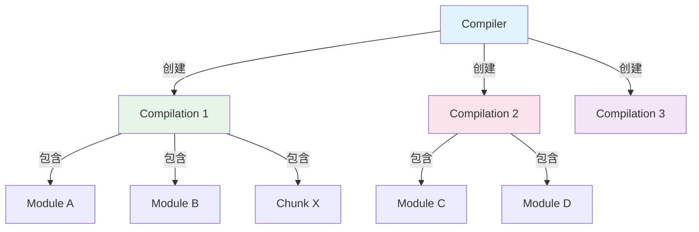
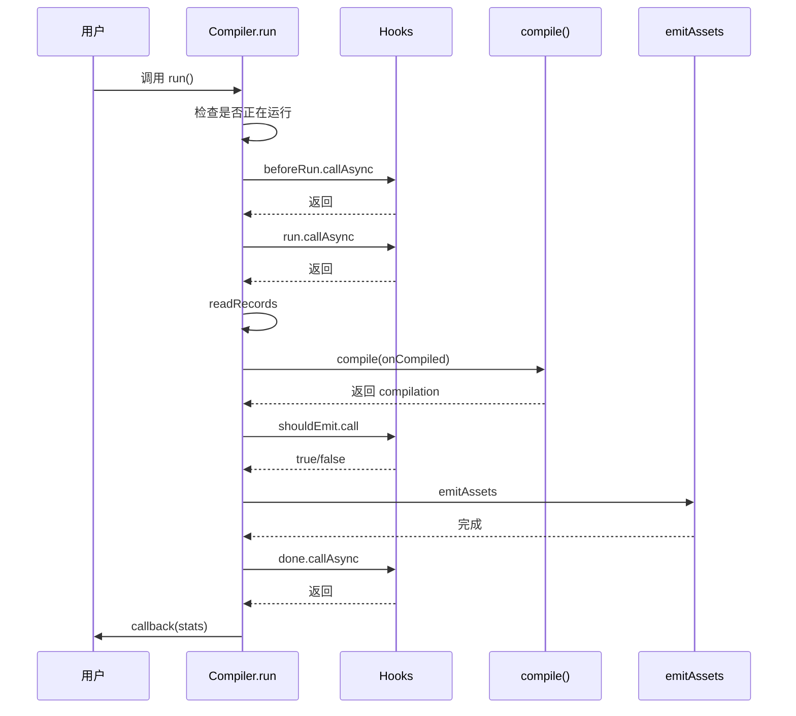
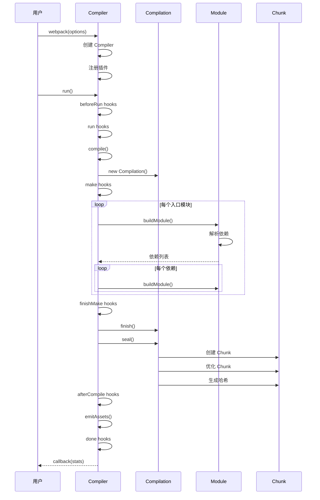
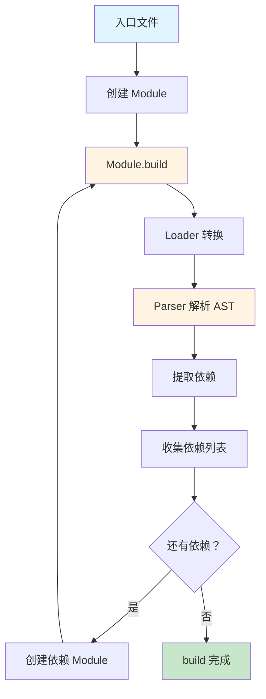
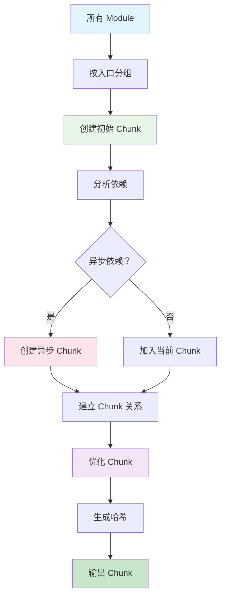

# 第 2 章 Compiler 与 Compilation 深度解析

> 本章是 Webpack 5 源码系列解析的**第 2 章**，聚焦于 Compiler 和 Compilation 的核心实现。这是 Webpack 最核心的两个类，理解它们对于掌握 Webpack 至关重要。

---

## 1. 模块职责

### 1.1 Compiler：编译器（项目经理）

**Compiler** 是 Webpack 的**核心编译器**，负责管理整个编译流程。

**核心职责**：
- 📋 **生命周期管理**：控制编译的各个阶段（初始化、编译、输出、完成）
- 🔌 **插件注册**：加载和管理所有 Plugin
- 🏗️ **Compilation 创建**：每次编译创建新的 Compilation 实例
- 💾 **缓存管理**：管理编译缓存，支持增量编译
- 📁 **文件系统**：管理输入输出文件系统

**类比理解**：
| Webpack | 建筑工程 | 说明 |
|--------|---------|------|
| Compiler | 项目经理 | 负责整体调度和管理 |
| Compilation | 具体施工项目 | 负责具体的编译工作 |
| Plugin | 专业承包商 | 在特定阶段提供专业服务 |

### 1.2 Compilation：编译过程（施工项目）

**Compilation** 代表**单次编译过程**，负责管理本次编译的所有资源。

**核心职责**：
- 📦 **模块构建**：创建和构建所有 Module
- 🔗 **依赖解析**：分析模块间的依赖关系
- 🧩 **Chunk 划分**：将 Module 组织成 Chunk
- 📊 **统计信息**：收集编译统计信息
- 🎨 **资源生成**：生成最终的输出资源

**为什么需要分离？**
- **Compiler 持久**：可以多次运行（watch 模式）
- **Compilation 临时**：每次编译新建，编译完成后销毁
- **职责分离**：Compiler 管调度，Compilation 管执行

### 1.3 关系图



---

## 2. 核心文件解析

### 2.1 Compiler.js：编译器实现

**文件位置**：`lib/Compiler.js`（约 1800 行）

#### 2.1.1 构造函数

```javascript
// lib/Compiler.js L170
class Compiler {
  constructor(context, options = {}) {
    // 1. 初始化 Hooks 系统
    this.hooks = Object.freeze({
      initialize: new SyncHook([]),
      shouldEmit: new SyncBailHook(["compilation"]),
      done: new AsyncSeriesHook(["stats"]),
      beforeRun: new AsyncSeriesHook(["compiler"]),
      run: new AsyncSeriesHook(["compiler"]),
      emit: new AsyncSeriesHook(["compilation"]),
      afterEmit: new AsyncSeriesHook(["compilation"]),
      thisCompilation: new SyncHook(["compilation", "params"]),
      compilation: new SyncHook(["compilation", "params"]),
      beforeCompile: new AsyncSeriesHook(["params"]),
      compile: new SyncHook(["params"]),
      make: new AsyncParallelHook(["compilation"]),
      finishMake: new AsyncSeriesHook(["compilation"]),
      afterCompile: new AsyncSeriesHook(["compilation"]),
      // ... 更多 hooks
    });

    // 2. 基础属性
    this.name = undefined;              // 编译器名称
    this.parentCompilation = undefined; // 父 Compilation（用于子编译）
    this.root = this;                   // 根编译器（多编译器时有用）
    this.outputPath = "";               // 输出路径

    // 3. 文件系统
    this.outputFileSystem = null;       // 输出文件系统
    this.inputFileSystem = null;        // 输入文件系统
    this.watchFileSystem = null;        // 监听文件系统

    // 4. 缓存系统
    this.cache = new Cache();           // 缓存实例
    this.records = {};                  // 编译记录

    // 5. 状态标记
    this.running = false;               // 是否正在运行
    this.idle = false;                  // 是否空闲
    this.watchMode = false;             // 是否监听模式

    // 6. 配置选项
    this.options = options;             // Webpack 配置
    this.context = context;             // 上下文路径
  }
}
```

**关键点**：
1. **Hooks 系统**：所有生命周期都通过 Hooks 管理
2. **文件系统抽象**：支持自定义文件系统（如内存文件系统）
3. **缓存支持**：通过 Cache 类管理编译缓存
4. **状态管理**：running、idle、watchMode 标记当前状态

#### 2.1.2 run 方法：启动编译

```javascript
// lib/Compiler.js L543
run(callback) {
  if (this.running) {
    callback(new ConcurrentCompilationError());
    return;
  }

  const finalCallback = (err, stats) => {
    this.idle = true;
    this.cache.beginIdle();
    this.running = false;
    if (err) {
      this.hooks.failed.call(err);
    }
    if (callback !== undefined) callback(err, stats);
    this.hooks.afterDone.call(stats);
  };

  const startTime = Date.now();
  this.running = true;

  const onCompiled = (err, compilation) => {
    if (err) return finalCallback(err);

    // 判断是否需要输出
    if (this.hooks.shouldEmit.call(compilation) === false) {
      const stats = new Stats(compilation);
      this.hooks.done.callAsync(stats, (err) => {
        if (err) return finalCallback(err);
        return finalCallback(null, stats);
      });
      return;
    }

    // 输出文件
    this.emitAssets(compilation, (err) => {
      if (err) return finalCallback(err);

      // 输出记录
      this.emitRecords((err) => {
        if (err) return finalCallback(err);

        const stats = new Stats(compilation);
        this.hooks.done.callAsync(stats, (err) => {
          if (err) return finalCallback(err);
          this.cache.storeBuildDependencies(compilation.buildDependencies, (err) => {
            if (err) return finalCallback(err);
            return finalCallback(null, stats);
          });
        });
      });
    });
  };

  const run = () => {
    // 触发 beforeRun hooks
    this.hooks.beforeRun.callAsync(this, (err) => {
      if (err) return finalCallback(err);

      // 触发 run hooks
      this.hooks.run.callAsync(this, (err) => {
        if (err) return finalCallback(err);

        // 读取记录
        this.readRecords((err) => {
          if (err) return finalCallback(err);

          // 开始编译
          this.compile(onCompiled);
        });
      });
    });
  };

  if (this.idle) {
    this.cache.endIdle((err) => {
      if (err) return finalCallback(err);
      this.idle = false;
      run();
    });
  } else {
    run();
  }
}
```

**流程解读**：



#### 2.1.3 compile 方法：核心编译

```javascript
// lib/Compiler.js L1349
compile(callback) {
  // 1. 创建编译参数
  const params = this.newCompilationParams();
  
  // 2. 触发 beforeCompile hooks
  this.hooks.beforeCompile.callAsync(params, (err) => {
    if (err) return callback(err);

    // 3. 触发 compile hooks
    this.hooks.compile.call(params);

    // 4. 创建新的 Compilation
    const compilation = this.newCompilation(params);

    const logger = compilation.getLogger("webpack.Compiler");

    // 5. 触发 make hooks（构建模块）
    logger.time("make hook");
    this.hooks.make.callAsync(compilation, (err) => {
      logger.timeEnd("make hook");
      if (err) return callback(err);

      // 6. 触发 finishMake hooks
      logger.time("finish make hook");
      this.hooks.finishMake.callAsync(compilation, (err) => {
        logger.timeEnd("finish make hook");
        if (err) return callback(err);

        process.nextTick(() => {
          // 7. 完成 Compilation
          logger.time("finish compilation");
          compilation.finish((err) => {
            logger.timeEnd("finish compilation");
            if (err) return callback(err);

            // 8. 优化分块（seal）
            logger.time("seal compilation");
            compilation.seal((err) => {
              logger.timeEnd("seal compilation");
              if (err) return callback(err);

              // 9. 触发 afterCompile hooks
              logger.time("afterCompile hook");
              this.hooks.afterCompile.callAsync(compilation, (err) => {
                logger.timeEnd("afterCompile hook");
                if (err) return callback(err);

                return callback(null, compilation);
              });
            });
          });
        });
      });
    });
  });
}
```

**关键点**：
1. **newCompilationParams()**：准备编译所需的参数（NormalModuleFactory、ContextModuleFactory）
2. **newCompilation()**：创建新的 Compilation 实例
3. **make hook**：这是最核心的阶段，所有模块在这里被构建
4. **finish()**：完成模块构建，建立依赖关系
5. **seal()**：优化分块，生成最终的 Chunk

### 2.2 Compilation.js：编译过程

**文件位置**：`lib/Compilation.js`（约 3000 行）

#### 2.2.1 构造函数

```javascript
// lib/Compilation.js
class Compilation {
  constructor(compiler, params) {
    // 1. 基础引用
    this.compiler = compiler;        // 父 Compiler
    this.id = uuid();                // 唯一 ID
    this.name = compiler.name;       // 名称

    // 2. 模块集合
    this.modules = new Set();        // 所有 Module
    this._modules = new Map();       // Module 缓存（resource -> Module）

    // 3. Chunk 集合
    this.chunks = new Set();         // 所有 Chunk
    this.chunkGroups = [];           // Chunk 组
    this.namedChunkGroups = new Map();
    this.namedChunks = new Map();

    // 4. 入口管理
    this.entrypoints = new Map();    // 入口点
    this.asyncEntrypoints = [];      // 异步入口
    this.entries = new Map();        // 入口配置

    // 5. 依赖管理
    this.dependencies = [];          // 所有依赖
    this.moduleDependencies = new WeakMap();

    // 6. 输出资源
    this.assets = {};                // 输出资源（filename -> Source）
    this.emittedAssets = new Set();  // 已输出的资源

    // 7. 优化标记
    this.bail = false;               // 遇到错误是否立即停止
    this.needAdditionalPass = false; // 是否需要额外编译

    // 8. 统计信息
    this.startTime = null;           // 开始时间
    this.endTime = null;             // 结束时间
  }
}
```

**关键点**：
1. **模块管理**：通过 Set 和 Map 管理所有 Module
2. **Chunk 管理**：Chunk 和 ChunkGroup 分离管理
3. **入口管理**：支持多个入口和异步入口
4. **资源管理**：assets 存储所有待输出的资源

#### 2.2.2 buildModule 方法：构建模块

```javascript
// lib/Compilation.js
buildModule(module, callback) {
  // 1. 触发 buildModule hook
  this.hooks.buildModule.call(module);

  // 2. 调用 module.build()
  module.build(
    this.options,
    this,
    this.resolverFactory.get("normal", module.resolveOptions),
    this.inputFileSystem,
    (err) => {
      if (err) {
        this.errors.push(module.buildError);
        return callback(err);
      }

      // 3. 处理依赖
      const dependencies = [];
      
      // 收集所有依赖
      for (const dep of module.dependencies) {
        dependencies.push({
          module: module,
          dependency: dep
        });
      }

      // 4. 触发成功 hook
      this.hooks.succeedBuildModule.call(module);

      callback(null, module);
    }
  );
}
```

**流程**：
1. 触发 `buildModule` hook（Plugin 可以拦截）
2. 调用 `module.build()` 开始构建
3. 构建完成后收集依赖
4. 触发 `succeedBuildModule` hook

#### 2.2.3 seal 方法：优化分块

```javascript
// lib/Compilation.js
seal(callback) {
  // 1. 触发 seal hook
  this.hooks.seal.call(this);

  // 2. 优化 Chunk
  this.optimizeChunks();

  // 3. 优化 Chunk 模块
  this.optimizeChunkModules();

  // 4. 触发优化 hooks
  this.hooks.optimize.call(this);
  this.hooks.optimizeModules.call(this);
  this.hooks.optimizeChunks.call(this);

  // 5. 生成 Chunk 哈希
  this.createChunkHashes();

  // 6. 触发 afterSeal hook
  this.hooks.afterSeal.callAsync(callback);
}
```

**优化阶段**：
1. **optimizeChunks**：合并、拆分 Chunk
2. **optimizeChunkModules**：移除未使用的模块（Tree Shaking）
3. **createChunkHashes**：为每个 Chunk 生成哈希值

---

## 3. 关键流程

### 3.1 完整编译流程



### 3.2 模块构建流程



### 3.3 Chunk 生成流程



---

## 4. 设计模式

### 4.1 命令模式（Command Pattern）

**Compiler** 和 **Compilation** 的关系是典型的命令模式：

```
Compiler（调用者）
  ↓ 创建命令
Compilation（命令对象）
  ↓ 执行
Module、Chunk（接收者）
```

**优点**：
- Compiler 可以创建多个 Compilation（watch 模式）
- Compilation 可以独立执行和销毁
- 支持编译历史记录

### 4.2 观察者模式（Observer Pattern）

**Hooks 系统**本质上是观察者模式的增强版：

```javascript
// Plugin 注册
compiler.hooks.done.tap('MyPlugin', (stats) => {
  console.log('编译完成');
});

// Compiler 触发
this.hooks.done.callAsync(stats, callback);
```

**优点**：
- 插件可以插入到任何阶段
- 插件之间解耦
- 支持同步和异步监听

### 4.3 工厂模式（Factory Pattern）

**Module 创建**使用工厂模式：

```javascript
// NormalModuleFactory
const factory = new NormalModuleFactory();

factory.create({
  context: context,
  request: request
}, (err, module) => {
  // 返回 NormalModule 实例
});
```

**优点**：
- 根据配置创建不同类型的 Module
- 支持自定义 Module 类型
- 便于扩展和测试

---

## 5. 学习要点

### 5.1 值得借鉴的设计

1. **职责分离**：Compiler 管调度，Compilation 管执行
2. **Hooks 系统**：灵活的插件机制
3. **缓存支持**：通过 Cache 类管理编译缓存
4. **文件系统抽象**：支持自定义文件系统
5. **日志系统**：通过 Logger 统一管理日志

### 5.2 关键代码位置

| 功能 | 文件 | 行号 |
|------|------|------|
| Compiler 构造函数 | lib/Compiler.js | L170 |
| Compiler.run | lib/Compiler.js | L543 |
| Compiler.compile | lib/Compiler.js | L1349 |
| Compilation 构造函数 | lib/Compilation.js | L200 |
| Compilation.buildModule | lib/Compilation.js | L1500 |
| Compilation.seal | lib/Compilation.js | L2500 |

### 5.3 可能的改进空间

1. **代码复杂度**：Compilation.js 3000+ 行，可进一步拆分
2. **内存占用**：大型项目编译时内存占用较高
3. **并行优化**：模块构建可以进一步并行化

---

## 6. 本章小结

### 6.1 核心要点

1. **Compiler 是持久对象**：管理整个编译流程，可以多次运行
2. **Compilation 是临时对象**：每次编译新建，编译完成后销毁
3. **Hooks 系统管理生命周期**：所有阶段都通过 Hooks 管理
4. **make 阶段最核心**：所有模块在这里被构建
5. **seal 阶段优化分块**：生成最终的 Chunk 结构

### 6.2 核心流程图

```
Compiler.run()
  ↓
beforeRun → run → compile()
  ↓
new Compilation()
  ↓
make (构建模块)
  ↓
finishMake → finish (完成模块)
  ↓
seal (优化分块)
  ↓
afterCompile → emitAssets → done
```

---

## 7. 下章预告

**第 3 章：Module 与依赖解析**

我们将深入分析：
- Module 基类的实现
- NormalModule 如何处理普通模块
- Loader 链的执行机制
- Parser 如何解析依赖

---

> **本章是系列解析的第 2 章**，深入剖析了 Compiler 和 Compilation 的核心实现。下一章我们将进入 Module 和依赖解析的分析。

---

**📁 源码位置**：`/home/admin/.openclaw/workspace-source-code/webpack-source/lib/Compiler.js, lib/Compilation.js`  
**📅 分析时间**：2026-03-12  
**📊 Webpack 版本**：5.105.4
