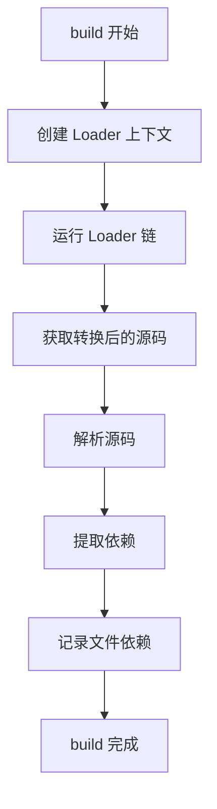
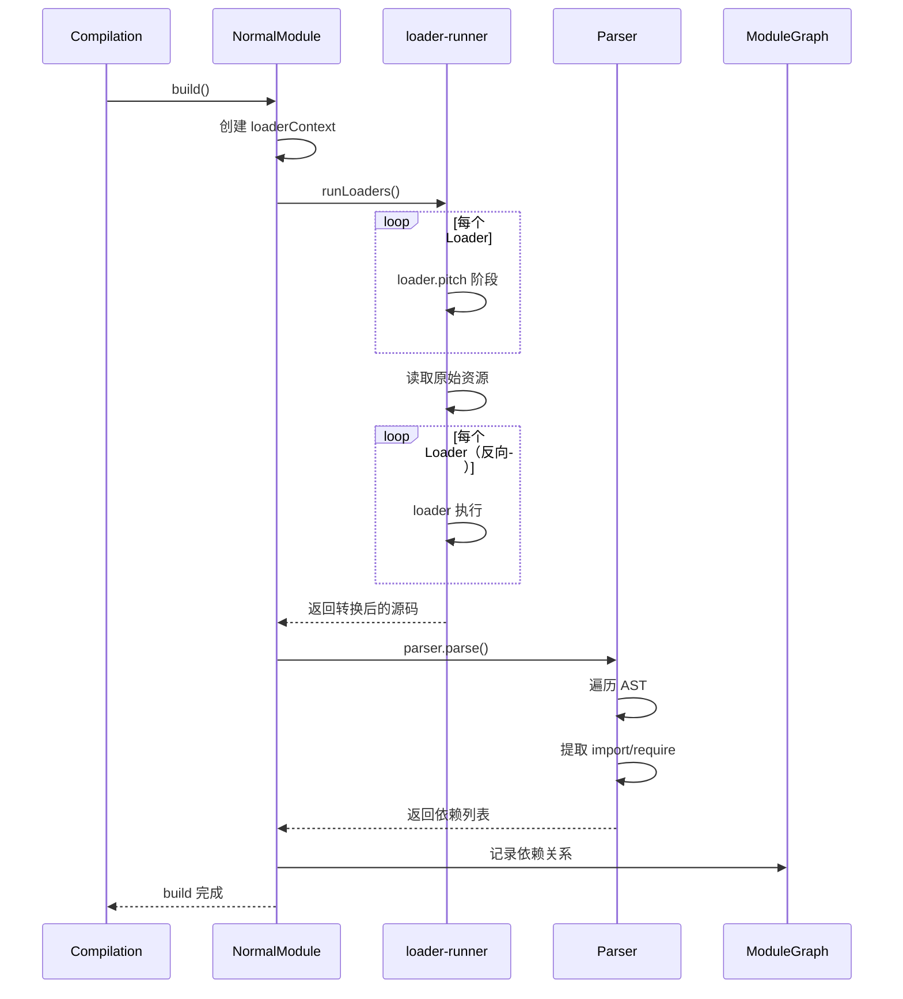
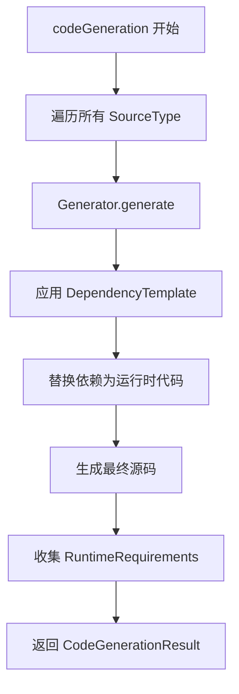

# 第 3 章 Module 与依赖解析

> 本章是 Webpack 5 源码系列解析的**第 3 章**，聚焦于 Module 基类、NormalModule 实现以及依赖解析流程。

---

## 1. 模块职责

### 1.1 Module：所有模块的基类

**Module** 是 Webpack 中所有模块类型的**抽象基类**，定义了模块的通用接口：

- `build()`：构建模块（解析依赖、转换代码）
- `codeGeneration()`：代码生成（生成可执行代码）
- `size()`：计算模块大小（用于优化）
- `libIdent()`：生成库标识符（用于缓存）

**为什么需要抽象基类？**

Webpack 支持多种模块类型：
- JavaScript 模块（`.js`, `.mjs`）
- CSS 模块（`.css`）
- JSON 模块（`.json`）
- 图片/字体等资源模块
- WebAssembly 模块

所有类型都继承自 Module，保证统一的接口。

### 1.2 NormalModule：普通模块的实现

**NormalModule** 是最常用的 Module 实现，负责处理：

- 通过 Loader 转换资源
- 解析 JavaScript 中的 `import`/`require` 依赖
- 生成最终的模块代码

**NormalModule 的工作流程**：

```
原始文件 → Loader 链转换 → 解析依赖 → 生成代码
```

### 1.3 依赖系统

Webpack 的依赖系统负责：

1. **收集依赖**：从模块代码中提取 `import`、`require` 等语句
2. **解析依赖**：将依赖路径解析为实际文件
3. **建立关系**：在 ModuleGraph 中记录模块间的依赖关系

---

## 2. 核心文件解析

### 2.1 Module.js：模块基类

**文件位置**: `lib/Module.js`（约 1200 行）

#### 2.1.1 核心属性

```javascript
// 文件：lib/Module.js L249
// 作用：Module 基类构造函数

class Module extends DependenciesBlock {
  constructor(type, context = null, layer = null) {
    super();

    // 1. 基础信息
    this.type = type;              // 模块类型（如 'javascript/auto'）
    this.context = context;        // 上下文路径
    this.layer = layer;            // 层级（用于 CSS Layers 等）
    this.needId = true;            // 是否需要 ID

    // 2. 唯一标识
    this.debugId = debugId++;      // 调试用 ID

    // 3. 解析配置
    this.resolveOptions = EMPTY_RESOLVE_OPTIONS;
    this.factoryMeta = undefined;

    // 4. SourceMap 配置
    this.useSourceMap = false;
    this.useSimpleSourceMap = false;

    // 5. HMR 支持
    this.hot = false;

    // 6. 构建信息
    this._warnings = undefined;    // 构建警告
    this._errors = undefined;      // 构建错误
    this.buildMeta = undefined;    // 构建元数据（如 exportsType）
    this.buildInfo = undefined;    // 构建信息（如 cacheable）

    // 7. 依赖
    this.presentationalDependencies = undefined;   // 展示依赖
    this.codeGenerationDependencies = undefined;   // 代码生成依赖
  }

  // ==================== 重要 Getter/Setter ====================
  // 注意：这些属性实际存储在 ModuleGraph 中，通过 getter/setter 访问

  get id() {
    return ChunkGraph.getChunkGraphForModule(this, ...).getModuleId(this);
  }

  set id(value) {
    ChunkGraph.getChunkGraphForModule(this, ...).setModuleId(this, value);
  }

  get hash() {
    return ChunkGraph.getChunkGraphForModule(this, ...).getModuleHash(this);
  }

  get issuer() {
    return ModuleGraph.getModuleGraphForModule(this, ...).getIssuer(this);
  }

  // ... 更多属性
}
```

**设计亮点**：

1. **属性分离**：模块自身存储基础信息，动态属性（id、hash 等）存储在 ModuleGraph/ChunkGraph 中
2. **向后兼容**：使用 getter/setter 保持 API 兼容，实际数据存储在图中
3. **类型系统**：`type` 字段区分模块类型，支持扩展

#### 2.1.2 抽象方法

```javascript
// 文件：lib/Module.js L953
// 作用：构建模块（抽象方法，子类必须实现）

build(options, compilation, resolver, fs, callback) {
  const AbstractMethodError = require("./AbstractMethodError");
  throw new AbstractMethodError();
}

// 文件：lib/Module.js L1069
// 作用：代码生成（可被子类覆盖）

codeGeneration(context) {
  // 默认实现：调用 source() 方法（旧 API）
  const sources = new Map();
  for (const type of this.getSourceTypes()) {
    if (type !== UNKNOWN_TYPE) {
      sources.set(
        type,
        this.source(
          context.dependencyTemplates,
          context.runtimeTemplate,
          type
        )
      );
    }
  }
  return {
    sources,
    runtimeRequirements: new Set([
      RuntimeGlobals.module,
      RuntimeGlobals.exports,
      RuntimeGlobals.require
    ])
  };
}

// 文件：lib/Module.js L1036
// 作用：获取模块大小（抽象方法）

size(type) {
  const AbstractMethodError = require("./AbstractMethodError");
  throw new AbstractMethodError();
}
```

**关键点**：

- `build()` 和 `size()` 是抽象方法，子类必须实现
- `codeGeneration()` 有默认实现，但通常被子类覆盖
- 这些方法构成了模块的**核心生命周期**

### 2.2 NormalModule.js：普通模块实现

**文件位置**: `lib/NormalModule.js`（约 2500 行）

#### 2.2.1 核心属性

```javascript
// 文件：lib/NormalModule.js
// 作用：NormalModule 构造函数

class NormalModule extends Module {
  constructor({
    type,
    request,
    userRequest,
    rawRequest,
    loaders,
    resource,
    resourceResolveData,
    context,
    matchResource,
    parser,
    parserOptions,
    generator,
    generatorOptions,
    resolveOptions
  }) {
    super(type, context);

    // 1. 请求信息
    this.request = request;              // 完整请求（包含 loader）
    this.userRequest = userRequest;      // 用户请求（不含 loader）
    this.rawRequest = rawRequest;        // 原始请求
    this.loaders = loaders;              // loader 列表
    this.resource = resource;            // 资源路径

    // 2. 解析和生成器
    this.parser = parser;                // 解析器
    this.parserOptions = parserOptions;  // 解析器配置
    this.generator = generator;          // 生成器
    this.generatorOptions = generatorOptions;

    // 3. 解析配置
    this.resolveOptions = resolveOptions;

    // 4. 构建结果
    this._source = null;                 // 转换后的源码
    this._sourceMap = null;              // SourceMap
    this.buildInfo = {
      cacheable: false,
      fileDependencies: new LazySet(),
      contextDependencies: new LazySet(),
      missingDependencies: new LazySet(),
      buildDependencies: new LazySet()
    };
  }
}
```

#### 2.2.2 build 方法（核心）

```javascript
// 文件：lib/NormalModule.js
// 作用：构建模块（Loader 转换 + 依赖解析）

build(options, compilation, resolver, fs, callback) {
  this.buildMeta = {};
  this.buildInfo = {
    cacheable: false,
    fileDependencies: new LazySet(),
    contextDependencies: new LazySet(),
    missingDependencies: new LazySet(),
    buildDependencies: new LazySet()
  };

  const startTime = Date.now();
  this.buildMeta = {};
  this.buildInfo = {};

  // 1. 触发 beforeBuild 钩子
  if (this.hooks.beforeBuild.call(this) === false) {
    return callback();
  }

  // 2. 创建 Loader 上下文
  const loaderContext = this.createLoaderContext(
    resolver,
    options,
    compilation,
    fs
  );

  // 3. 运行 Loader 链（核心！）
  this.runLoaders(loaderContext, (err, result) => {
    if (err) return callback(err);

    // 4. 处理 Loader 结果
    const source = result.content;
    const sourceMap = result.sourceMap;
    const extraData = result.extraData;

    // 5. 触发 beforeParse 钩子
    this.hooks.beforeParse.call(this);

    // 6. 解析模块（提取依赖）
    this.parse(parserOptions, source, sourceMap, (err) => {
      if (err) return callback(err);

      // 7. 构建完成
      this.buildInfo.cacheable = true;
      this.buildMeta = this.buildMeta || {};
      
      callback();
    });
  });
}
```

**流程解读**：



#### 2.2.3 runLoaders 方法

```javascript
// 文件：lib/NormalModule.js
// 作用：运行 Loader 链

runLoaders(loaderContext, callback) {
  const { runLoaders: runLoadersExternal } = require("loader-runner");
  
  runLoadersExternal(
    {
      resource: this.resource,           // 资源路径
      loaders: this.loaders,             // loader 列表
      context: loaderContext,            // loader 上下文
      processResource: (loaderContext, callback) => {
        // 读取原始资源
        const resource = loaderContext.resource;
        loaderContext.fs.readFile(resource, callback);
      }
    },
    (err, result) => {
      if (err) return callback(err);
      
      // result = {
      //   content: Buffer | String,      // 转换后的内容
      //   sourceMap: Object | undefined, // SourceMap
      //   extraData: Object | undefined  // 额外数据
      // }
      
      callback(null, result);
    }
  );
}
```

**Loader 执行顺序**：

```
Loader 链：[loaderA, loaderB, loaderC]

执行顺序（从右到左）：
1. loaderC.pitch
2. loaderB.pitch
3. loaderA.pitch
4. 读取原始资源
5. loaderA 执行
6. loaderB 执行
7. loaderC 执行
8. 输出最终结果
```

#### 2.2.4 parse 方法

```javascript
// 文件：lib/NormalModule.js
// 作用：解析源码，提取依赖

parse(parserOptions, source, sourceMap, callback) {
  // 1. 触发 parser 钩子
  this.hooks.parser.call(this.parser, parserOptions);

  // 2. 使用 Parser 解析源码
  this.parser.parse(source, {
    source,
    sourceMap,
    current: this,                    // 当前模块
    module: this,
    compilation: this.compilation,
    options: this.parserOptions
  }, (err, dependencies) => {
    if (err) return callback(err);

    // 3. 添加依赖到模块
    for (const dep of dependencies) {
      this.addDependency(dep);
    }

    // 4. 记录构建信息
    this.buildInfo.fileDependencies.add(this.resource);
    
    callback();
  });
}
```

#### 2.2.5 codeGeneration 方法

```javascript
// 文件：lib/NormalModule.js
// 作用：生成最终代码

codeGeneration(context) {
  const { runtimeTemplate, chunkGraph, moduleGraph, runtime } = context;
  
  // 1. 使用 Generator 生成代码
  const sources = new Map();
  
  for (const type of this.getSourceTypes()) {
    const source = this.generator.generate(
      this,
      {
        dependencyTemplates: context.dependencyTemplates,
        runtimeTemplate,
        moduleGraph,
        chunkGraph,
        runtime,
        concatenationScope: context.concatenationScope
      }
    );
    sources.set(type, source);
  }

  // 2. 收集运行时依赖
  const runtimeRequirements = new Set();
  
  // 添加模块自身的运行时需求
  for (const req of this.generator.getRuntimeRequirements(this, runtime)) {
    runtimeRequirements.add(req);
  }
  
  // 添加依赖的运行时需求
  for (const dep of this.dependencies) {
    const reqs = moduleGraph.getConnectionRuntimeRequirements(dep);
    for (const req of reqs) {
      runtimeRequirements.add(req);
    }
  }

  return {
    sources,
    runtimeRequirements,
    data: this.codeGenerationData
  };
}
```

---

## 3. 关键流程

### 3.1 模块构建完整流程



### 3.2 依赖解析流程

```mermaid
graph TB
    A[模块源码] --> B[Parser 解析 AST]
    B --> C{依赖类型}
    C -->|import x from 'y'| D[HarmonyImportDependency]
    C -->|require('y')| E[CommonJSRequireDependency]
    C -->|import('y')| F[ImportDependency]
    C -->|require.context| G[ContextDependency]
    
    D --> H[添加到模块依赖列表]
    E --> H
    F --> H
    G --> H
    
    H --> I[Compilation 处理依赖]
    I --> J[解析依赖路径]
    J --> K[创建新 Module]
    K --> L[递归构建]
```

### 3.3 代码生成流程



---

## 4. 设计模式

### 4.1 策略模式（Parser/Generator）

Webpack 使用**策略模式**分离解析和生成逻辑：

```javascript
// 不同模块类型使用不同的 Parser/Generator
const parser = new JavascriptParser();      // JS 解析器
const generator = new JavascriptGenerator(); // JS 生成器

// CSS 模块
const cssParser = new CssParser();
const cssGenerator = new CssGenerator();

// 统一接口
module.parser = parser;
module.generator = generator;

// 构建时调用
module.build();           // 使用 parser 解析
module.codeGeneration();  // 使用 generator 生成
```

**优点**：
- 易于扩展新模块类型
- 解析和生成逻辑解耦
- 可独立测试和替换

### 4.2 责任链模式（Loader）

Loader 链是典型的**责任链模式**：

```javascript
// 配置
module: {
  rules: [
    {
      test: /\.js$/,
      use: ['babel-loader', 'ts-loader', 'source-map-loader']
    }
  ]
}

// 执行顺序（从右到左）
// 1. source-map-loader（读取已有 SourceMap）
// 2. ts-loader（TypeScript → JavaScript）
// 3. babel-loader（ESNext → ES5）

// Loader 签名
function loader(source) {
  // 处理 source
  return processedSource;
}

// Pitch Loader（在读取资源前执行）
function pitchLoader() {
  // 可以提前返回，跳过后续 loader
  if (someCondition) {
    return '直接返回结果';
  }
  // 否则继续执行
}
```

### 4.3 访问者模式（Parser）

Parser 使用**访问者模式**遍历 AST：

```javascript
// JavascriptParser.js 简化版
class JavascriptParser {
  parse(source, state, callback) {
    const ast = acorn.parse(source, { ecmaVersion: 2022 });
    
    // 遍历 AST
    walkAst(ast, (node) => {
      // 根据节点类型调用不同处理函数
      if (node.type === 'ImportDeclaration') {
        this.handleImportDeclaration(node, state);
      } else if (node.type === 'CallExpression') {
        if (node.callee.name === 'require') {
          this.handleRequire(node, state);
        }
      }
      // ... 其他节点类型
    });
  }
  
  handleImportDeclaration(node, state) {
    const dep = new HarmonyImportDependency(
      node.source.value,
      node.specifiers,
      state.module
    );
    state.module.addDependency(dep);
  }
}
```

---

## 5. 学习要点

### 5.1 值得借鉴的设计

1. **抽象基类**：Module 定义了清晰的接口规范
2. **职责分离**：Parser 负责解析，Generator 负责生成
3. **Loader 机制**：灵活的代码转换管道
4. **依赖抽象**：统一的 Dependency 接口

### 5.2 关键代码位置

| 功能 | 文件 | 行号 |
|------|------|------|
| Module 构造函数 | lib/Module.js | L249 |
| Module.build（抽象） | lib/Module.js | L953 |
| Module.codeGeneration | lib/Module.js | L1069 |
| NormalModule.build | lib/NormalModule.js | 搜索 build( |
| NormalModule.parse | lib/NormalModule.js | 搜索 parse( |
| NormalModule.codeGeneration | lib/NormalModule.js | 搜索 codeGeneration( |

### 5.3 可能的改进空间

1. **代码复杂度**：NormalModule 近 2500 行，可进一步拆分
2. **Loader 调试**：Loader 链错误追踪较困难
3. **Parser 扩展**：自定义语法支持有限

---

## 6. 本章小结

### 6.1 核心要点

1. **Module 是基类**：定义了 build、codeGeneration 等核心接口
2. **NormalModule 是主力**：处理 JS/CSS 等常见模块类型
3. **Loader 链转换**：从右到左执行，支持 pitch 阶段
4. **Parser 提取依赖**：遍历 AST，创建 Dependency 对象
5. **Generator 生成代码**：应用 DependencyTemplate，输出最终代码

### 6.2 关键流程图

```
模块构建流程：
  ↓
创建 NormalModule
  ↓
runLoaders（Loader 链转换）
  ↓
parser.parse（提取依赖）
  ↓
记录到 ModuleGraph
  ↓
build 完成

代码生成流程：
  ↓
generator.generate
  ↓
应用 DependencyTemplate
  ↓
收集 RuntimeRequirements
  ↓
输出 CodeGenerationResult
```

---

## 7. 下章预告

**第 4 章：Chunk 与代码分割**

- Chunk 的创建与优化
- SplitChunksPlugin 原理
- 运行时模块处理
- 代码分割策略

---

> **本章源码引用**:
> - `lib/Module.js` - 模块基类
> - `lib/NormalModule.js` - 普通模块实现
> - `lib/dependencies/` - 各种依赖类型
> - `lib/javascript/JavascriptParser.js` - JS 解析器
> - `lib/javascript/JavascriptGenerator.js` - JS 生成器
