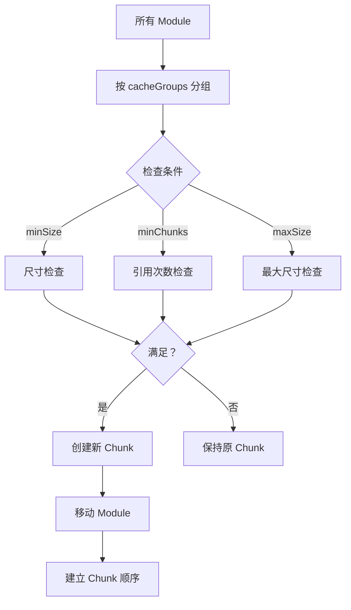
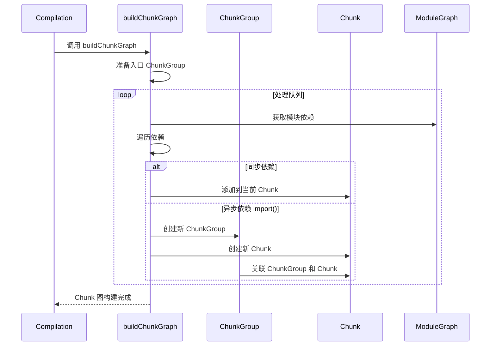
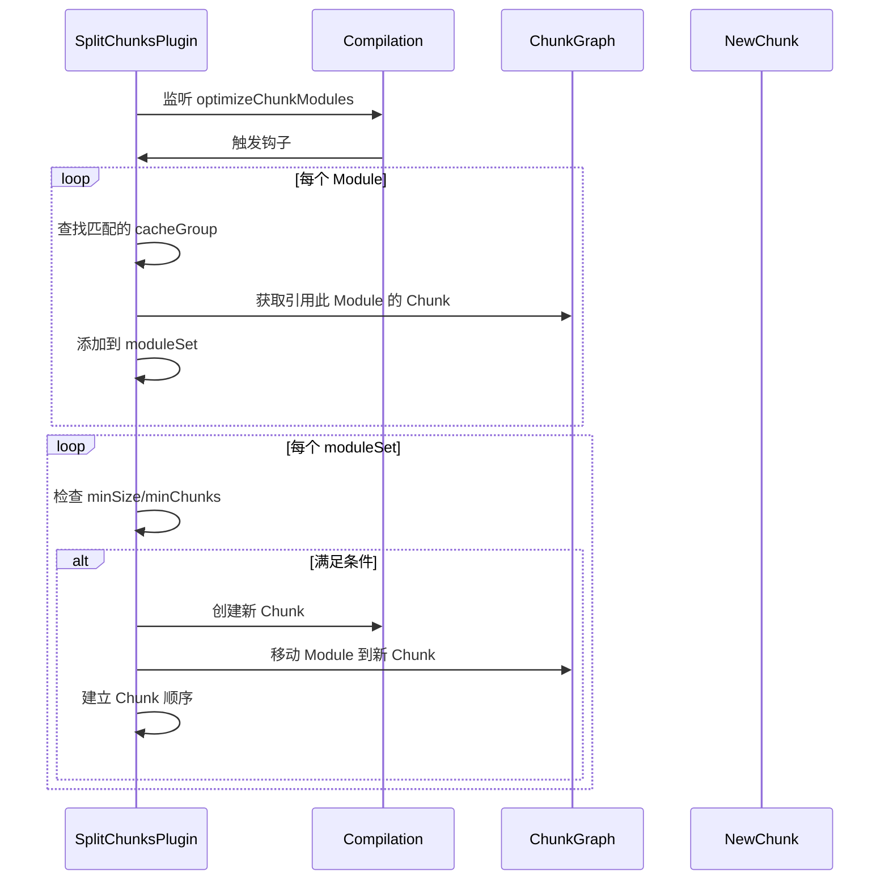

# 第 4 章 Chunk 与代码分割

> 本章是 Webpack 5 源码系列解析的**第 4 章**，聚焦于 Chunk 的创建、优化以及代码分割策略。

---

## 1. 模块职责

### 1.1 Chunk：代码块

**Chunk** 是 Webpack 输出文件的**基本单位**，代表最终生成的一个 bundle。

**核心职责**：
- 包含一组 Module
- 对应一个输出文件（如 `main.js`、`vendor.js`）
- 有独立的哈希值
- 可配置加载策略（同步/异步）

**为什么需要 Chunk？**

想象一个大型应用：
- 如果把所有代码打包成一个文件 → 首次加载慢
- 如果拆分成多个 Chunk → 按需加载，提升性能

### 1.2 ChunkGroup：Chunk 组

**ChunkGroup** 是 Chunk 的**逻辑分组**，用于管理 Chunk 之间的关系。

**典型场景**：
- **Entrypoint**：入口 ChunkGroup，包含初始 Chunk
- **Async ChunkGroup**：异步 ChunkGroup，对应 `import()` 动态导入

### 1.3 代码分割的意义

代码分割（Code Splitting）是 Webpack 最强大的功能之一：

| 分割策略 | 说明 | 配置方式 |
|---------|------|---------|
| **入口分割** | 每个入口生成独立 Chunk | `entry: { main: './a.js', admin: './b.js' }` |
| **动态导入** | `import()` 自动生成异步 Chunk | `import('./module.js')` |
| **SplitChunks** | 提取公共代码 | `optimization.splitChunks` |
| **运行时分割** | 运行时代码单独成块 | `optimization.runtimeChunk` |

---

## 2. 核心文件解析

### 2.1 Chunk.js：代码块类

**文件位置**: `lib/Chunk.js`（约 800 行）

#### 2.1.1 核心属性

```javascript
// 文件：lib/Chunk.js L73
// 作用：Chunk 构造函数

class Chunk {
  constructor(name, backCompat = true) {
    // 1. 标识信息
    this.id = null;                    // Chunk ID（编译后分配）
    this.ids = null;                   // 历史 ID 列表（用于缓存）
    this.debugId = debugId++;          // 调试 ID
    this.name = name;                  // Chunk 名称
    this.idNameHints = new SortableSet(); // ID 命名提示

    // 2. 文件名模板
    this.filenameTemplate = undefined; // JS 文件名模板
    this.cssFilenameTemplate = undefined; // CSS 文件名模板

    // 3. ChunkGroup 引用
    this._groups = new SortableSet(undefined, compareChunkGroupsByIndex);

    // 4. 运行时
    this.runtime = undefined;          // 运行时规格

    // 5. 输出文件
    this.files = new Set();            // JS 文件列表
    this.auxiliaryFiles = new Set();   // 辅助文件（如 SourceMap）

    // 6. 渲染状态
    this.rendered = false;             // 是否已渲染
    this.hash = undefined;             // Chunk 哈希
    this.contentHash = Object.create(null); // 内容哈希
    this.renderedHash = undefined;     // 渲染后的哈希

    // 7. 其他
    this.chunkReason = undefined;      // 创建原因
    this.extraAsync = false;           // 是否额外异步
    this.preventIntegration = false;   // 防止被合并
  }

  // ==================== 重要方法 ====================

  /**
   * 添加 Module 到 Chunk
   * @param {Module} module 
   * @returns {boolean} 是否添加成功
   */
  addModule(module) {
    const chunkGraph = ChunkGraph.getChunkGraphForChunk(this, ...);
    if (chunkGraph.isModuleInChunk(module, this)) return false;
    chunkGraph.connectChunkAndModule(this, module);
    return true;
  }

  /**
   * 移除 Module
   * @param {Module} module 
   */
  removeModule(module) {
    ChunkGraph.getChunkGraphForChunk(this, ...).disconnectChunkAndModule(this, module);
  }

  /**
   * 获取 Chunk 包含的 Module 数量
   * @returns {number}
   */
  getNumberOfModules() {
    return ChunkGraph.getChunkGraphForChunk(this, ...).getNumberOfChunkModules(this);
  }

  /**
   * 获取所有 Module
   * @returns {Iterable<Module>}
   */
  getAllModules() {
    return ChunkGraph.getChunkGraphForChunk(this, ...).getOrderedChunkModulesIterable(this);
  }

  /**
   * 添加 Chunk 到 ChunkGroup
   * @param {ChunkGroup} chunkGroup 
   * @returns {boolean}
   */
  addGroup(chunkGroup) {
    if (this._groups.has(chunkGroup)) return false;
    this._groups.add(chunkGroup);
    return true;
  }

  /**
   * 获取所有 ChunkGroup
   * @returns {Iterable<ChunkGroup>}
   */
  getAllChunkGroups() {
    return this._groups;
  }

  /**
   * 获取所有被引用的 Chunk（包括子 Chunk）
   * @returns {Set<Chunk>}
   */
  getAllReferencedChunks() {
    const chunks = new Set();
    for (const chunkGroup of this.getAllChunkGroups()) {
      for (const child of chunkGroup.childrenIterable) {
        for (const chunk of child.chunks) {
          chunks.add(chunk);
        }
      }
    }
    return chunks;
  }
}
```

**关键点**：

1. **延迟 ID 分配**：`id` 在 seal 阶段才分配，早期为 `null`
2. **多文件支持**：`files` 是 Set，支持多个文件（如 CSS + JS）
3. **图关系**：通过 ChunkGraph 管理 Module 关系，通过 `_groups` 管理 ChunkGroup 关系

### 2.2 buildChunkGraph.js：构建 Chunk 图

**文件位置**: `lib/buildChunkGraph.js`（约 1800 行）

这是 Webpack **最复杂的算法文件**，负责：

1. 从入口 Module 开始遍历依赖图
2. 为每个 `import()` 创建异步 Chunk
3. 建立 ChunkGroup 的父子关系
4. 计算每个 ChunkGroup 可用的 Module 集合

#### 2.2.1 核心算法

```javascript
// 文件：lib/buildChunkGraph.js
// 作用：构建 Chunk 图

const buildChunkGraph = (compilation, chunkGraphInit) => {
  const logger = compilation.getLogger("webpack.buildChunkGraph");
  logger.time("prepare entrypoints");

  // 1. 准备入口
  const chunkGraph = compilation.chunkGraph;
  const moduleGraph = compilation.moduleGraph;
  
  // 为每个入口创建初始队列
  /** @type {Queue} */
  const queue = new Set();
  /** @type {ChunkGroupInfoMap} */
  const chunkGroupInfoMap = new Map();

  // 处理所有入口
  for (const [entrypoint, modules] of chunkGraphInit) {
    const chunk = entrypoint.getEntrypointChunk();
    const runtime = entrypoint.options.runtime || entrypoint.name;
    
    // 创建 ChunkGroupInfo
    const chunkGroupInfo = {
      chunkGroup: entrypoint,
      runtime,
      minAvailableModules: undefined,
      availableModulesToBeMerged: [],
      skippedItems: undefined,
      resultingAvailableModules: undefined,
      children: undefined,
      availableSources: undefined,
      availableChildren: undefined,
      preOrderIndex: 0,
      postOrderIndex: 0,
      chunkLoading: true,
      asyncChunks: true
    };
    
    chunkGroupInfoMap.set(entrypoint, chunkGroupInfo);
    
    // 添加入口 Module 到队列
    for (const module of modules) {
      queue.push({
        action: QUEUE_ACTION.PROCESS_MODULE,
        block: module,
        module: module,
        chunk: chunk,
        chunkGroup: entrypoint,
        chunkGroupInfo: chunkGroupInfo
      });
    }
  }

  logger.timeEnd("prepare entrypoints");
  logger.time("process queue");

  // 2. 处理队列（核心循环）
  let blockChunkGroups = [];
  let chunkGroupsForCombining = [];
  
  while (queue.size > 0 || blockChunkGroups.length > 0) {
    // 2.1 处理主队列
    if (queue.size > 0) {
      const queueItem = /** @type {QueueItem} */ (queue.values().next().value);
      queue.delete(queueItem);
      
      const { block, module, chunk, chunkGroup, chunkGroupInfo } = queueItem;
      
      // 处理模块的依赖
      processDependenciesBlock(
        queueItem,
        block,
        chunk,
        chunkGroup,
        chunkGroupInfo,
        queue,
        blockChunkGroups,
        chunkGroupInfoMap
      );
    }
    
    // 2.2 处理异步 ChunkGroup
    if (queue.size === 0 && blockChunkGroups.length > 0) {
      // 合并异步 ChunkGroup 到主流程
      combineChunkGroups(chunkGroupsForCombining);
      blockChunkGroups = [];
    }
  }

  logger.timeEnd("process queue");
};
```

#### 2.2.2 处理依赖块

```javascript
// 文件：lib/buildChunkGraph.js
// 作用：处理依赖块，创建 Chunk 和 ChunkGroup

const processDependenciesBlock = (
  queueItem,
  block,
  chunk,
  chunkGroup,
  chunkGroupInfo,
  queue,
  blockChunkGroups,
  chunkGroupInfoMap
) => {
  const moduleGraph = compilation.moduleGraph;
  const runtime = chunkGroupInfo.runtime;
  
  // 1. 获取块中的所有模块依赖
  const blockModules = getBlockModules(block, runtime);
  
  for (const [module, connection] of blockModules) {
    // 2. 检查模块是否已在父 Chunk 中可用
    if (isModuleInParentChunks(module, chunkGroupInfo)) {
      // 跳过，模块已在父级可用
      if (chunkGroupInfo.skippedItems === undefined) {
        chunkGroupInfo.skippedItems = new Set();
      }
      chunkGroupInfo.skippedItems.add(module);
      continue;
    }
    
    // 3. 添加模块到 Chunk
    if (!chunkGraph.isModuleInChunk(module, chunk)) {
      chunkGraph.connectChunkAndModule(chunk, module);
    }
    
    // 4. 处理子块（如 import()）
    for (const subBlock of module.blocks) {
      if (subBlock instanceof AsyncDependenciesBlock) {
        // 4.1 异步导入：创建新的 ChunkGroup
        const asyncChunkGroup = createAsyncChunkGroup(
          subBlock,
          chunkGroup,
          chunkGroupInfo
        );
        
        blockChunkGroups.push({
          originChunkGroupInfo: chunkGroupInfo,
          chunkGroup: asyncChunkGroup
        });
        
        // 4.2 添加子模块到队列
        queue.push({
          action: QUEUE_ACTION.PROCESS_MODULE,
          block: subBlock,
          module: module,
          chunk: asyncChunk,
          chunkGroup: asyncChunkGroup,
          chunkGroupInfo: asyncChunkGroupInfo
        });
      } else {
        // 4.3 同步导入：添加到当前队列
        queue.push({
          action: QUEUE_ACTION.PROCESS_MODULE,
          block: subBlock,
          module: module,
          chunk: chunk,
          chunkGroup: chunkGroup,
          chunkGroupInfo: chunkGroupInfo
        });
      }
    }
  }
};
```

**算法流程**：

```mermaid
graph TB
    A[入口 Entry] --> B[创建初始 Chunk]
    B --> C[遍历 Module 依赖]
    C --> D{依赖类型}
    D -->|同步 import| E[添加到当前 Chunk]
    D -->|异步 import()| F[创建新 ChunkGroup]
    F --> G[创建新 Chunk]
    G --> H[添加到队列]
    E --> I[继续遍历子依赖]
    H --> I
    I --> J{还有依赖？}
    J -->|是 | C
    J -->|否 | K[完成]
```

### 2.3 SplitChunksPlugin：代码分割插件

**文件位置**: `lib/optimize/SplitChunksPlugin.js`（约 1200 行）

这是 Webpack **最常用的优化插件**，负责提取公共代码。

#### 2.3.1 核心配置

```javascript
// webpack.config.js
module.exports = {
  optimization: {
    splitChunks: {
      // 1. 作用范围
      chunks: 'all',  // 'async' | 'initial' | 'all'
      
      // 2. 最小尺寸
      minSize: 20000,          // 最小 20KB 才分割
      minRemainingSize: 0,     // 剩余最小尺寸
      minChunks: 1,            // 最小被引用次数
      
      // 3. 最大尺寸
      maxSize: 0,              // 最大尺寸（0 表示不限制）
      maxAsyncRequests: 30,    // 最大异步请求数
      maxInitialRequests: 30,  // 最大初始请求数
      
      // 4. 缓存组（核心！）
      cacheGroups: {
        // 默认 vendors 组
        vendors: {
          test: /[\\/]node_modules[\\/]/,
          priority: -10,
          reuseExistingChunk: true
        },
        
        // 默认 default 组
        default: {
          minChunks: 2,
          priority: -20,
          reuseExistingChunk: true
        },
        
        // 自定义组
        common: {
          name: 'common',
          minChunks: 2,
          priority: 10,
          reuseExistingChunk: true
        }
      }
    }
  }
};
```

#### 2.3.2 分割算法

```javascript
// 文件：lib/optimize/SplitChunksPlugin.js
// 作用：SplitChunks 核心算法

class SplitChunksPlugin {
  apply(compiler) {
    compiler.hooks.thisCompilation.tap("SplitChunksPlugin", (compilation) => {
      const hooks = getCompilationHooks(compilation);
      
      // 在 optimizeChunkModules 阶段执行
      hooks.optimizeChunkModules.tapAsync("SplitChunksPlugin", (chunks, modules, callback) => {
        const chunkGraph = compilation.chunkGraph;
        
        // 1. 收集所有符合条件的 Module
        const moduleSets = new Map();
        
        for (const module of modules) {
          // 检查模块是否满足分割条件
          const cacheGroup = this._findCacheGroup(module, chunks);
          if (!cacheGroup) continue;
          
          // 获取引用此模块的所有 Chunk
          const referringChunks = chunkGraph.getModuleChunksIterable(module);
          
          // 添加到对应的 moduleSet
          const key = this._getCacheGroupKey(cacheGroup);
          if (!moduleSets.has(key)) {
            moduleSets.set(key, new Set());
          }
          moduleSets.get(key).add(module);
        }
        
        // 2. 为每个 moduleSet 创建新的 Chunk
        for (const [key, moduleSet] of moduleSets) {
          const modulesArray = Array.from(moduleSet);
          
          // 检查是否满足 minSize/minChunks
          if (!this._checkMinRequirements(modulesArray)) continue;
          
          // 创建新 Chunk
          const newChunk = compilation.addChunk(this._getChunkName(key));
          
          // 将模块移动到新 Chunk
          for (const module of modulesArray) {
            const oldChunks = chunkGraph.getModuleChunksIterable(module);
            for (const oldChunk of oldChunks) {
              chunkGraph.disconnectChunkAndModule(oldChunk, module);
            }
            chunkGraph.connectChunkAndModule(newChunk, module);
          }
          
          // 建立 Chunk 顺序关系
          this._setupChunkOrder(newChunk, moduleSet);
        }
        
        callback();
      });
    });
  }
  
  /**
   * 查找匹配的缓存组
   */
  _findCacheGroup(module, chunks) {
    for (const cacheGroup of this.cacheGroups) {
      // 检查 test 条件
      if (cacheGroup.test && !cacheGroup.test.test(module.resource)) continue;
      
      // 检查 chunks 类型
      if (cacheGroup.chunks && !this._checkChunksType(chunks, cacheGroup.chunks)) continue;
      
      return cacheGroup;
    }
    return null;
  }
}
```

**分割策略**：



---

## 3. 关键流程

### 3.1 Chunk 创建完整流程



### 3.2 SplitChunks 执行流程



### 3.3 运行时 Chunk 处理

```javascript
// 运行时模块单独成块
optimization: {
  runtimeChunk: 'single'  // 或 'multiple' | true | false
}

// 效果：
// 原始：main.js (包含运行时 + 业务代码)
// 分割后：
//   - runtime.js (运行时)
//   - main.js (业务代码)
```

**为什么需要运行时单独成块？**

- 运行时代码变化频率低
- 可长期缓存
- 多个入口可共享运行时

---

## 4. 设计模式

### 4.1 图遍历算法

Webpack 使用 **BFS（广度优先搜索）** 遍历依赖图：

```javascript
// 简化的 BFS 实现
const queue = new Set();
queue.add(entryModule);

while (queue.size > 0) {
  const module = queue.values().next().value;
  queue.delete(module);
  
  // 处理当前模块
  processModule(module);
  
  // 添加子依赖到队列
  for (const dep of module.dependencies) {
    const childModule = moduleGraph.getModule(dep);
    if (childModule && !visited.has(childModule)) {
      visited.add(childModule);
      queue.add(childModule);
    }
  }
}
```

### 4.2 缓存组策略

SplitChunks 使用**优先级策略**匹配缓存组：

```javascript
// 缓存组优先级
cacheGroups: {
  vendors: { priority: -10 },  // 优先级 -10
  default: { priority: -20 },  // 优先级 -20
  common: { priority: 10 }     // 优先级 10（最高）
}

// 匹配规则：
// 1. 按优先级从高到低检查
// 2. 第一个匹配的缓存组生效
// 3. 可配置 reuseExistingChunk 复用已有 Chunk
```

### 4.3 位运算优化

Webpack 5 使用 **BigInt 位掩码** 优化模块集合操作：

```javascript
// 每个模块分配一个位
const moduleBit = ONE_BIGINT << BigInt(moduleIndex);

// 集合操作使用位运算
const availableModules = moduleBit1 | moduleBit2;  // 并集
const commonModules = moduleBit1 & moduleBit2;     // 交集
const hasModule = (mask, bit) => (mask & bit) !== ZERO_BIGINT;
```

**优点**：
- 集合操作 O(1) 时间复杂度
- 内存占用小
- 适合大规模模块图

---

## 5. 学习要点

### 5.1 值得借鉴的设计

1. **图算法**：BFS 遍历依赖图，清晰高效
2. **位运算优化**：用 BigInt 实现集合操作
3. **缓存组策略**：灵活的代码分割配置
4. **ChunkGroup 抽象**：清晰管理 Chunk 关系

### 5.2 关键代码位置

| 功能 | 文件 | 行号 |
|------|------|------|
| Chunk 构造函数 | lib/Chunk.js | L73 |
| buildChunkGraph | lib/buildChunkGraph.js | 全文 |
| SplitChunksPlugin | lib/optimize/SplitChunksPlugin.js | 全文 |
| processDependenciesBlock | lib/buildChunkGraph.js | 搜索函数名 |

### 5.3 可能的改进空间

1. **算法复杂度**：buildChunkGraph 近 1800 行，可拆分
2. **调试困难**：Chunk 分割逻辑复杂，难以调试
3. **内存占用**：大规模项目位掩码可能占用较多内存

---

## 6. 本章小结

### 6.1 核心要点

1. **Chunk 是输出单位**：包含一组 Module，对应一个输出文件
2. **ChunkGroup 管理关系**：Entrypoint、Async ChunkGroup
3. **buildChunkGraph 构建图**：BFS 遍历依赖，创建 Chunk
4. **SplitChunks 提取公共代码**：按 cacheGroups 配置分割
5. **位运算优化**：BigInt 实现高效集合操作

### 6.2 关键配置示例

```javascript
// 代码分割配置
optimization: {
  // 1. 运行时单独成块
  runtimeChunk: 'single',
  
  // 2. SplitChunks 配置
  splitChunks: {
    chunks: 'all',
    cacheGroups: {
      // 第三方库
      vendors: {
        test: /[\\/]node_modules[\\/]/,
        name: 'vendors',
        priority: 10
      },
      // 公共代码
      common: {
        minChunks: 2,
        name: 'common',
        priority: 5
      }
    }
  }
}
```

---

## 7. 下章预告

**第 5 章：代码生成与输出**

- Template 系统
- JavascriptModulesPlugin
- 运行时代码注入
- 最终文件输出

---

> **本章源码引用**:
> - `lib/Chunk.js` - Chunk 类
> - `lib/ChunkGroup.js` - ChunkGroup 类
> - `lib/buildChunkGraph.js` - Chunk 图构建算法
> - `lib/optimize/SplitChunksPlugin.js` - 代码分割插件
> - `lib/ChunkGraph.js` - Chunk-Module 关系图
