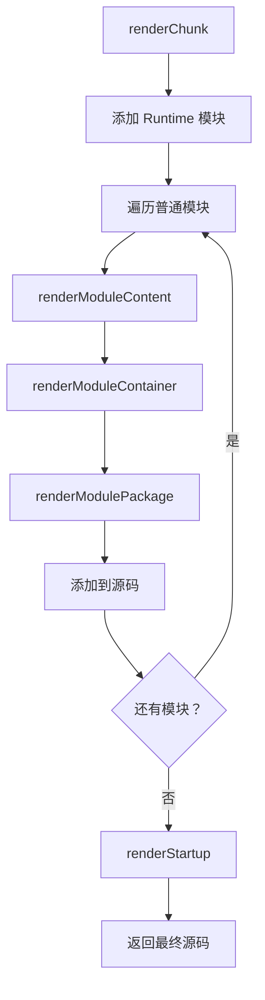
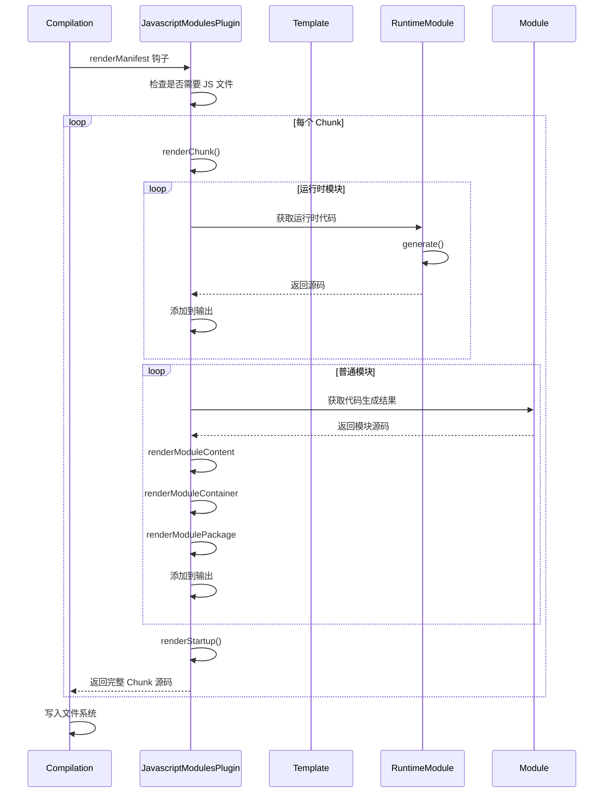
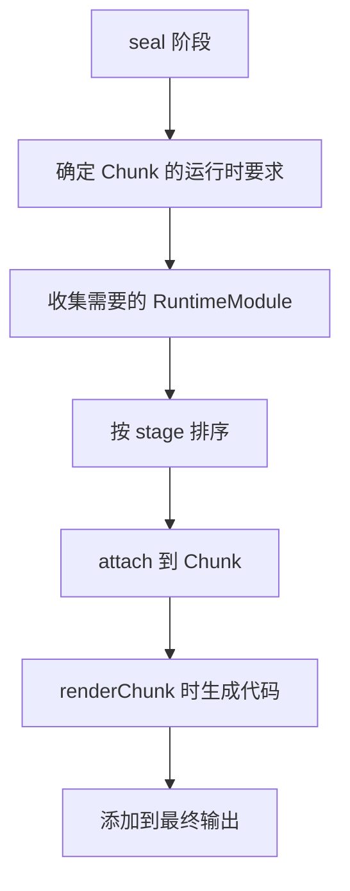

# 第 5 章 代码生成与输出

> 本章是 Webpack 5 源码系列解析的**第 5 章**，聚焦于 Template 系统、JavascriptModulesPlugin、运行时代码注入以及最终文件输出。

---

## 1. 模块职责

### 1.1 Template：代码模板基类

**Template** 是 Webpack 的**代码模板工具类**，负责：

- 生成标识符（`numberToIdentifier`）
- 生成注释（`toComment`、`toNormalComment`）
- 路径规范化（`toPath`）
- 提取函数内容（`getFunctionContent`）

**为什么需要 Template？**

Webpack 需要生成大量运行时代码：
- `__webpack_require__` 函数
- 模块加载逻辑
- Chunk 加载逻辑
- HMR 更新逻辑

Template 提供工具方法，确保生成的代码格式统一、无语法错误。

### 1.2 JavascriptModulesPlugin：JS 模块渲染插件

**JavascriptModulesPlugin** 是**最重要的渲染插件**，负责：

- 渲染 Chunk 为 JavaScript 代码
- 注入运行时要求（RuntimeGlobals）
- 处理模块的工厂函数包装
- 生成启动代码（Startup Code）

**核心地位**：
- 所有 JS 模块最终都通过此插件输出
- 控制代码结构和格式
- 决定运行时依赖

### 1.3 RuntimeModule：运行时模块

**RuntimeModule** 是**特殊类型的 Module**，负责：

- 生成 Webpack 运行时代码
- 无需 build 阶段（直接生成代码）
- 按需附加到 Chunk

**典型运行时模块**：
- `__webpack_require__` 核心函数
- `__webpack_require__.e()` 异步加载
- `__webpack_require__.d()` 导出定义
- HMR 相关逻辑

---

## 2. 核心文件解析

### 2.1 Template.js：模板工具类

**文件位置**: `lib/Template.js`（约 500 行）

#### 2.1.1 核心方法

```javascript
// 文件：lib/Template.js
// 作用：提供代码生成工具方法

class Template {
  /**
   * 从函数提取内容（去除 function() { 和 }）
   * @param {Function} fn 运行时函数
   * @returns {string} 规范化后的函数字符串
   */
  static getFunctionContent(fn) {
    return fn
      .toString()
      .replace(FUNCTION_CONTENT_REGEX, "")  // 去除 function() { 和 }
      .replace(INDENT_MULTILINE_REGEX, "")  // 去除缩进
      .replace(LINE_SEPARATOR_REGEX, "\n"); // 统一换行符
  }

  /**
   * 将字符串转换为合法标识符
   * @param {string} str 输入字符串
   * @returns {string} 标识符
   * 
   * 示例：
   * "my-module" → "_my_module"
   * "123abc" → "_123abc"
   */
  static toIdentifier(str) {
    return str
      .replace(IDENTIFIER_NAME_REPLACE_REGEX, "_$1")
      .replace(IDENTIFIER_ALPHA_NUMERIC_NAME_REPLACE_REGEX, "_");
  }

  /**
   * 生成注释
   * @param {string} str 注释内容
   * @returns {string} 带 webpack 标记的注释
   * 
   * 示例：
   * "hello" → "/*! hello */"
   */
  static toComment(str) {
    return `/*! ${str.replace(COMMENT_END_REGEX, "* /")} */`;
  }

  /**
   * 数字转标识符（用于生成变量名）
   * @param {number} n 数字
   * @returns {string} 单字符或多字符标识符
   * 
   * 示例：
   * 0 → "a"
   * 25 → "z"
   * 26 → "A"
   * 52 → "_"
   * 53 → "$"
   * 54 → "aa"
   */
  static numberToIdentifier(n) {
    if (n >= NUMBER_OF_IDENTIFIER_START_CHARS) {
      // 使用多个字母
      return (
        Template.numberToIdentifier(n % NUMBER_OF_IDENTIFIER_START_CHARS) +
        Template.numberToIdentifierContinuation(
          Math.floor(n / NUMBER_OF_IDENTIFIER_START_CHARS)
        )
      );
    }

    // 小写字母 a-z
    if (n < DELTA_A_TO_Z) {
      return String.fromCharCode(START_LOWERCASE_ALPHABET_CODE + n);
    }
    n -= DELTA_A_TO_Z;

    // 大写字母 A-Z
    if (n < DELTA_A_TO_Z) {
      return String.fromCharCode(START_UPPERCASE_ALPHABET_CODE + n);
    }

    if (n === DELTA_A_TO_Z) return "_";
    return "$";
  }
}
```

**设计亮点**：

1. **标识符生成算法**：使用 a-z、A-Z、_、$ 组合，可生成无限标识符
2. **代码规范化**：统一换行符、缩进，确保输出一致
3. **注释标记**：使用 `/*!` 特殊注释，不会被压缩工具移除

### 2.2 JavascriptModulesPlugin.js：JS 渲染核心

**文件位置**: `lib/javascript/JavascriptModulesPlugin.js`（约 2500 行）

#### 2.2.1 插件结构

```javascript
// 文件：lib/javascript/JavascriptModulesPlugin.js
// 作用：JS 模块渲染插件

class JavascriptModulesPlugin {
  apply(compiler) {
    compiler.hooks.thisCompilation.tap(
      PLUGIN_NAME,
      (compilation, { normalModuleFactory }) => {
        // 1. 获取 Hooks
        const hooks = JavascriptModulesPlugin.getCompilationHooks(compilation);

        // 2. 注册渲染钩子
        compilation.hooks.renderManifest.tap(
          PLUGIN_NAME,
          (result, { chunk, hash, fullHash, outputOptions, codeGenerationResults }) => {
            // 判断是否需要生成 JS 文件
            if (chunkHasJs(chunk, compilation.chunkGraph)) {
              result.push({
                render: () =>
                  this.renderChunk(
                    {
                      chunk,
                      dependencyTemplates: compilation.dependencyTemplates,
                      runtimeTemplate: compilation.runtimeTemplate,
                      moduleGraph: compilation.moduleGraph,
                      chunkGraph: compilation.chunkGraph,
                      codeGenerationResults
                    }
                  ),
                filenameTemplate: outputOptions.chunkFilename,
                pathOptions: {
                  chunk,
                  contentHashType: "javascript"
                },
                identifier: `javascript${chunk.id}`,
                hash: chunk.contentHash.javascript,
                auxiliary: false
              });
            }
            return result;
          }
        );

        // 3. 注册 Chunk 哈希钩子
        compilation.hooks.chunkHash.tap(PLUGIN_NAME, (chunk, hash, context) => {
          hooks.chunkHash.call(chunk, hash, context);
        });

        // 4. 注册模块渲染钩子
        compilation.hooks.renderModulePackage.tap(
          PLUGIN_NAME,
          (source, module, { chunk, dependencyTemplates, runtimeTemplate }) => {
            // 处理模块包装
            return this.renderModulePackage(
              module,
              {
                chunk,
                dependencyTemplates,
                runtimeTemplate,
                moduleGraph: compilation.moduleGraph,
                chunkGraph: compilation.chunkGraph
              }
            );
          }
        );
      }
    );
  }

  /**
   * 渲染 Chunk
   * @param {ChunkRenderContext} renderContext 渲染上下文
   * @returns {Source} 生成的源码
   */
  renderChunk(renderContext) {
    const { chunk, chunkGraph, runtimeTemplate } = renderContext;

    // 1. 创建源码容器
    const source = new ConcatSource();

    // 2. 添加运行时模块
    const runtimeModules = chunkGraph.getChunkRuntimeModulesIterable(chunk);
    for (const module of runtimeModules) {
      const moduleSource = module.source({
        dependencyTemplates: renderContext.dependencyTemplates,
        runtimeTemplate: renderContext.runtimeTemplate,
        moduleGraph: renderContext.moduleGraph,
        chunkGraph: renderContext.chunkGraph,
        runtime: chunk.runtime
      });
      source.add(moduleSource);
    }

    // 3. 添加普通模块（工厂函数包装）
    const modules = chunkGraph.getOrderedChunkModulesIterable(
      chunk,
      compareModulesByFullName
    );
    
    if (modules.length > 0) {
      source.add("\n\n// 模块列表\n");
      source.add(`[${chunk.id}]: (`);
      
      // 模块工厂函数
      source.add("(function(module, exports, __webpack_require__) {\n");
      
      for (const module of modules) {
        const moduleSource = this.renderModule(module, renderContext);
        source.add(moduleSource);
      }
      
      source.add("\n})");
    }

    // 4. 添加启动代码
    const startupSource = this.renderStartup(chunk, renderContext);
    source.add(startupSource);

    return source;
  }

  /**
   * 渲染模块
   * @param {Module} module 模块
   * @param {ModuleRenderContext} renderContext 渲染上下文
   * @returns {Source} 模块源码
   */
  renderModule(module, renderContext) {
    const { chunkGraph, codeGenerationResults } = renderContext;
    
    // 获取模块的代码生成结果
    const moduleSource = codeGenerationResults.getSource(
      module,
      renderContext.chunk.runtime,
      JAVASCRIPT_TYPE
    );

    // 触发渲染钩子（插件可拦截）
    let source = moduleSource;
    source = renderContext.hooks.renderModuleContent.call(
      source,
      module,
      renderContext
    );

    // 包装为工厂函数
    source = renderContext.hooks.renderModuleContainer.call(
      source,
      module,
      renderContext
    );

    // 添加模块元信息
    source = renderContext.hooks.renderModulePackage.call(
      source,
      module,
      renderContext
    );

    return source;
  }

  /**
   * 渲染启动代码
   * @param {Chunk} chunk Chunk
   * @param {StartupRenderContext} renderContext 启动渲染上下文
   * @returns {Source} 启动代码
   */
  renderStartup(chunk, renderContext) {
    const source = new ConcatSource();
    const runtimeRequirements = renderContext.chunkGraph.getTreeRuntimeRequirements(chunk);

    // 添加入口模块执行
    if (runtimeRequirements.has(RuntimeGlobals.startup)) {
      const entryModule = renderContext.chunkGraph.getChunkEntryModule(chunk);
      if (entryModule) {
        const moduleId = renderContext.chunkGraph.getModuleId(entryModule);
        source.add(`\n// 执行入口模块\n`);
        source.add(`var __webpack_exports__ = ${RuntimeGlobals.require}(${moduleId});\n`);
      }
    }

    return source;
  }
}
```

**渲染流程**：



#### 2.2.2 渲染钩子链

```javascript
// 渲染钩子链（Waterfall 模式）
renderModuleContent  // 模块内容渲染
  ↓
renderModuleContainer  // 模块容器包装
  ↓
renderModulePackage  // 模块包元信息
  ↓
renderChunk  // Chunk 级别渲染
  ↓
renderMain  // 主 Chunk 渲染
  ↓
renderContent  // 内容渲染
  ↓
render  // 最终渲染
```

每个钩子都可以修改源码：

```javascript
// 插件示例：在模块内容前添加注释
compilation.hooks.renderModuleContent.tap(
  "MyPlugin",
  (source, module, context) => {
    const newSource = new ConcatSource();
    newSource.add(`/* 模块：${module.identifier()} */\n`);
    newSource.add(source);
    return newSource;
  }
);
```

### 2.3 RuntimeModule.js：运行时模块

**文件位置**: `lib/RuntimeModule.js`（约 250 行）

#### 2.3.1 核心结构

```javascript
// 文件：lib/RuntimeModule.js
// 作用：运行时模块基类

class RuntimeModule extends Module {
  /**
   * @param {string} name 可读名称
   * @param {number=} stage 阶段
   */
  constructor(name, stage = 0) {
    super(WEBPACK_MODULE_TYPE_RUNTIME);
    this.name = name;
    this.stage = stage;
    this.buildMeta = {};
    this.buildInfo = {};
    this.compilation = undefined;
    this.chunk = undefined;
    this.chunkGraph = undefined;
    this.fullHash = false;        // 是否需要完整哈希
    this.dependentHash = false;   // 是否依赖其他哈希
    this._cachedGeneratedCode = undefined;
  }

  /**
   * 附加到 Chunk
   * @param {Compilation} compilation 
   * @param {Chunk} chunk 
   * @param {ChunkGraph} chunkGraph 
   */
  attach(compilation, chunk, chunkGraph = compilation.chunkGraph) {
    this.compilation = compilation;
    this.chunk = chunk;
    this.chunkGraph = chunkGraph;
  }

  /**
   * 标识符（固定格式）
   * @returns {string}
   */
  identifier() {
    return `webpack/runtime/${this.name}`;
  }

  /**
   * 无需构建（运行时模块直接生成代码）
   */
  build(options, compilation, resolver, fs, callback) {
    callback();  // 直接完成
  }

  /**
   * 生成运行时代码（子类实现）
   * @abstract
   * @returns {string | null}
   */
  generate() {
    throw new AbstractMethodError();
  }

  /**
   * 获取生成的代码（带缓存）
   * @returns {string}
   */
  getGeneratedCode() {
    if (this._cachedGeneratedCode !== undefined) {
      return this._cachedGeneratedCode;
    }
    return (this._cachedGeneratedCode = this.generate());
  }

  /**
   * 代码生成
   * @param {CodeGenerationContext} context 
   * @returns {CodeGenerationResult}
   */
  codeGeneration(context) {
    const sources = new Map();
    const generatedCode = this.getGeneratedCode();
    
    if (generatedCode) {
      sources.set(
        WEBPACK_MODULE_TYPE_RUNTIME,
        this.useSourceMap
          ? new OriginalSource(generatedCode, this.identifier())
          : new RawSource(generatedCode)
      );
    }
    
    return {
      sources,
      runtimeRequirements: null
    };
  }
}
```

#### 2.3.2 运行时模块示例

```javascript
// 文件：lib/hmr/HotModuleReplacementRuntimeModule.js
// 作用：HMR 运行时模块

class HotModuleReplacementRuntimeModule extends RuntimeModule {
  constructor() {
    super("hot module replacement");
  }

  generate() {
    return Template.getFunctionContent(function () {
      // __webpack_require__.hmr 实现
      __webpack_require__.hmr = function (moduleId, hotOptions) {
        // HMR 逻辑
        var hot = {
          accept: function (dep, callback) {
            // 热更新接受逻辑
          },
          decline: function (dep) {
            // 热更新拒绝逻辑
          },
          dispose: function (callback) {
            // 处置回调
          },
          addDisposeHandler: function (callback) {
            // 添加处置处理器
          },
          removeDisposeHandler: function (callback) {
            // 移除处置处理器
          },
          // ... 更多 HMR API
        };

        return hot;
      };
    });
  }
}
```

### 2.4 RuntimeGlobals.js：运行时变量常量

**文件位置**: `lib/RuntimeGlobals.js`（约 300 行）

定义了所有运行时需要的全局变量：

```javascript
// 文件：lib/RuntimeGlobals.js
// 作用：运行时全局变量定义

module.exports = {
  // ==================== 核心要求 ====================
  
  // __webpack_require__ 函数本身
  require: "__webpack_require__",
  
  // 模块实例
  module: "module",
  
  // 模块 ID
  moduleId: "module.id",
  
  // 模块导出
  exports: "module.exports",
  
  // ==================== 模块加载 ====================
  
  // 确保 Chunk 加载
  ensureChunk: "__webpack_require__.e",
  
  // Chunk 加载处理器
  ensureChunkHandlers: "__webpack_require__.f",
  
  // 预加载 Chunk
  prefetchChunk: "__webpack_require__.E",
  
  // 加载 Chunk 错误处理
  onChunksLoaded: "__webpack_require__.O",
  
  // ==================== 模块定义 ====================
  
  // 定义导出属性
  definePropertyGetters: "__webpack_require__.d",
  
  // 获取默认导出（兼容处理）
  compatGetDefaultExport: "__webpack_require__.n",
  
  // 创建命名空间对象
  createFakeNamespaceObject: "__webpack_require__.t",
  
  // 模块有默认导出
  hasOwnProperty: "__webpack_require__.o",
  
  // 导出所有
  makeNamespaceObject: "__webpack_require__.r",
  
  // ==================== 异步模块 ====================
  
  // 创建异步模块
  asyncModule: "__webpack_require__.a",
  
  // 异步模块完成符号
  asyncModuleDoneSymbol: "__webpack_require__.aD",
  
  // ==================== 远程模块 ====================
  
  // 远程作用域
  currentRemoteGetScope: "__webpack_require__.R",
  
  // 获取远程作用域
  externalInstallChunk: "__webpack_require__.C",
  
  // ==================== 共享作用域 ====================
  
  // 共享作用域定义
  define: "__webpack_require__.d",
  
  // 共享作用域获取
  share: "__webpack_require__.S",
  
  // 初始化共享作用域
  initializeSharing: "__webpack_require__.I",
  
  // ==================== 其他 ====================
  
  // 入口模块 ID
  entryModuleId: "__webpack_require__.s",
  
  // 模块缓存
  moduleCache: "__webpack_require__.c",
  
  // 已加载的 Chunk
  loadedChunks: "__webpack_require__.l",
  
  // 全局 Webpack 对象
  global: "__webpack_require__.g",
  
  // 基础 URI
  baseURI: "__webpack_require__.b",
  
  // 创建脚本
  createScript: "__webpack_require__.ts",
  
  // 创建脚本 URL
  createScriptUrl: "__webpack_require__.tu",
  
  // CSS 注入
  cssInjectStyle: "__webpack_require__.is"
};
```

**使用场景**：

```javascript
// 在代码生成时收集运行时要求
const runtimeRequirements = new Set();

// 如果需要异步加载
runtimeRequirements.add(RuntimeGlobals.ensureChunk);
runtimeRequirements.add(RuntimeGlobals.ensureChunkHandlers);

// 如果需要模块导出
runtimeRequirements.add(RuntimeGlobals.exports);
runtimeRequirements.add(RuntimeGlobals.definePropertyGetters);

// 最终生成的代码会包含这些变量
// __webpack_require__.e = function(chunkId) { ... }
// __webpack_require__.d = function(exports, name, getter) { ... }
```

---

## 3. 关键流程

### 3.1 代码生成完整流程



### 3.2 运行时模块注入流程



### 3.3 启动代码生成

```javascript
// 启动代码示例（入口 Chunk）

// 运行时模块（__webpack_require__ 定义）
var __webpack_require__ = (function(modules) {
  var installedModules = {};
  
  function __webpack_require__(moduleId) {
    if (installedModules[moduleId]) {
      return installedModules[moduleId].exports;
    }
    
    var module = installedModules[moduleId] = {
      i: moduleId,
      l: false,
      exports: {}
    };
    
    modules[moduleId].call(module.exports, module, module.exports, __webpack_require__);
    module.l = true;
    
    return module.exports;
  }
  
  return __webpack_require__;
})({
  // 模块列表
  './src/index.js': function(module, exports, __webpack_require__) {
    // 模块代码
  }
});

// 执行入口模块
var __webpack_exports__ = __webpack_require__('./src/index.js');
```

---

## 4. 设计模式

### 4.1 模板方法模式

Template 类提供工具方法，子类/调用者组合使用：

```javascript
// Template 提供原子操作
Template.toIdentifier("my-module");  // "_my_module"
Template.toComment("copyright");     // "/*! copyright */"
Template.numberToIdentifier(0);      // "a"

// JavascriptModulesPlugin 组合使用
const source = new ConcatSource();
source.add(Template.toComment("webpack"));
source.add(Template.getFunctionContent(runtimeFunction));
```

### 4.2 责任链模式（渲染钩子）

渲染钩子形成责任链，每个插件可修改源码：

```javascript
// 钩子链
renderModuleContent → renderModuleContainer → renderModulePackage

// 插件 A：添加注释
compilation.hooks.renderModuleContent.tap("PluginA", (source, module) => {
  return new ConcatSource(`/* ${module.identifier()} */\n`, source);
});

// 插件 B：添加包装
compilation.hooks.renderModuleContainer.tap("PluginB", (source, module) => {
  return new ConcatSource("(function() {\n", source, "\n})()");
});

// 最终输出
/* ./src/module.js */
(function() {
  // 模块代码
})()
```

### 4.3 策略模式（运行时模块）

不同运行时需求使用不同的 RuntimeModule：

```javascript
// 按需加载运行时
class EnsureChunkRuntimeModule extends RuntimeModule {
  generate() {
    return `__webpack_require__.e = function(chunkId) { ... }`;
  }
}

// HMR 运行时
class HotModuleReplacementRuntimeModule extends RuntimeModule {
  generate() {
    return `__webpack_require__.hmr = function() { ... }`;
  }
}

// CSS 加载运行时
class CssLoadingRuntimeModule extends RuntimeModule {
  generate() {
    return `__webpack_require__.l.css = function(chunkId) { ... }`;
  }
}
```

---

## 5. 学习要点

### 5.1 值得借鉴的设计

1. **模板工具类**：Template 提供统一的代码生成工具
2. **运行时模块化**：每个运行时功能独立成模块
3. **钩子链扩展**：渲染过程完全可扩展
4. **常量集中管理**：RuntimeGlobals 统一管理变量名

### 5.2 关键代码位置

| 功能 | 文件 | 行号 |
|------|------|------|
| Template 工具方法 | lib/Template.js | L86-180 |
| JavascriptModulesPlugin.apply | lib/javascript/JavascriptModulesPlugin.js | L100+ |
| renderChunk | lib/javascript/JavascriptModulesPlugin.js | 搜索 renderChunk |
| RuntimeModule 基类 | lib/RuntimeModule.js | L40+ |
| RuntimeGlobals 定义 | lib/RuntimeGlobals.js | 全文 |

### 5.3 可能的改进空间

1. **代码复杂度**：JavascriptModulesPlugin 近 2500 行，可拆分
2. **运行时耦合**：运行时模块与主代码耦合度高
3. **调试困难**：生成的代码难以溯源

---

## 6. 本章小结

### 6.1 核心要点

1. **Template 是工具类**：提供标识符生成、注释、代码格式化等方法
2. **JavascriptModulesPlugin 是渲染核心**：控制 Chunk 到 JS 的转换
3. **RuntimeModule 是运行时载体**：按需生成 `__webpack_require__` 等运行时代码
4. **RuntimeGlobals 是常量集**：统一管理所有运行时变量名
5. **钩子链可扩展**：renderModuleContent → renderModuleContainer → renderModulePackage

### 6.2 输出代码结构

```
Chunk 输出文件结构：
┌─────────────────────────────────┐
│ 运行时模块代码                   │
│ - __webpack_require__ 定义      │
│ - __webpack_require__.e 异步加载│
│ - __webpack_require__.d 导出定义│
├─────────────────────────────────┤
│ 模块列表（工厂函数包装）         │
│ [moduleId]: function(...) { ... }│
├─────────────────────────────────┤
│ 启动代码                         │
│ - 执行入口模块                   │
│ - 导出处理                       │
└─────────────────────────────────┘
```

---

## 7. 下章预告

**第 6 章：运行时机制与 HMR**

- `__webpack_require__` 完整实现
- 模块缓存机制
- HMR 热更新原理
- 模块联邦运行时

---

> **本章源码引用**:
> - `lib/Template.js` - 模板工具类
> - `lib/javascript/JavascriptModulesPlugin.js` - JS 渲染插件
> - `lib/RuntimeModule.js` - 运行时模块基类
> - `lib/RuntimeGlobals.js` - 运行时变量常量
> - `lib/hmr/HotModuleReplacementRuntimeModule.js` - HMR 运行时模块
