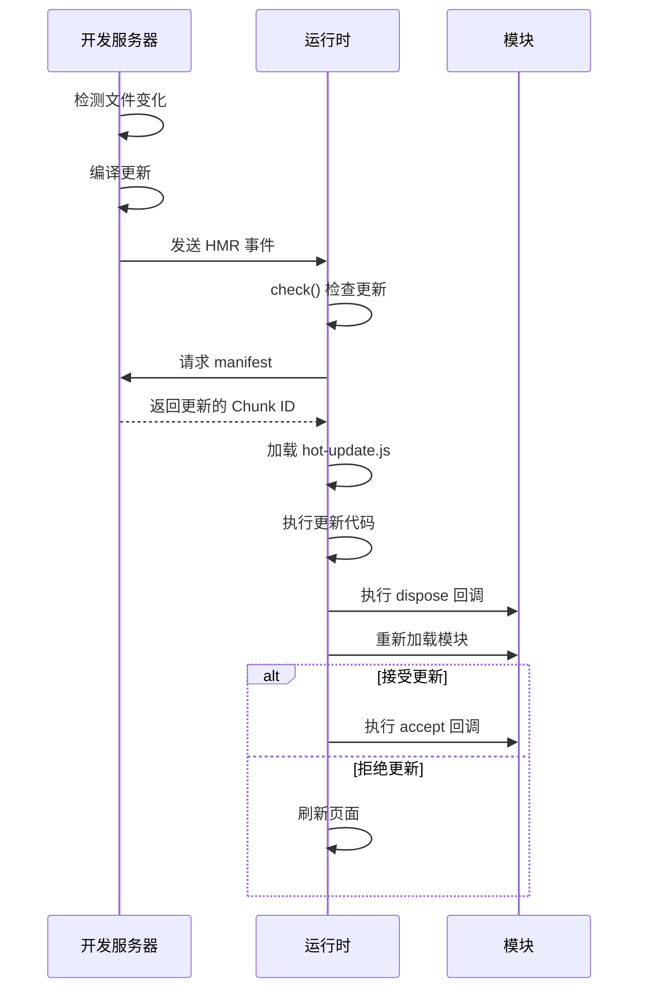
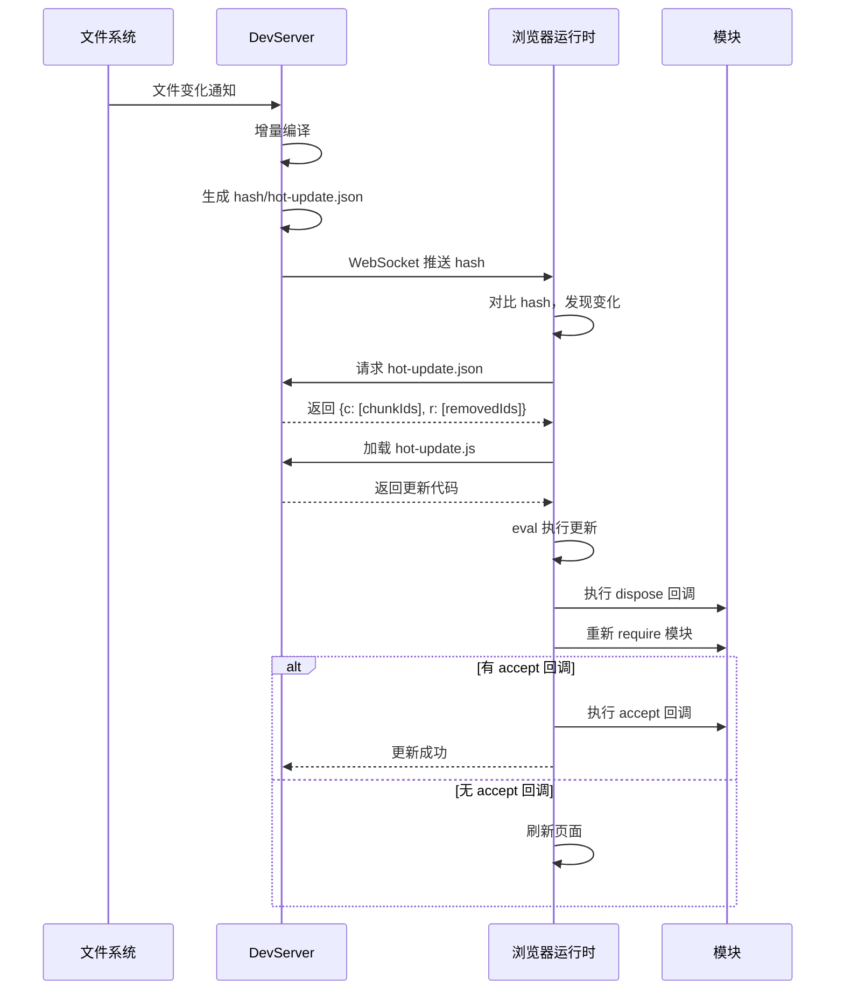
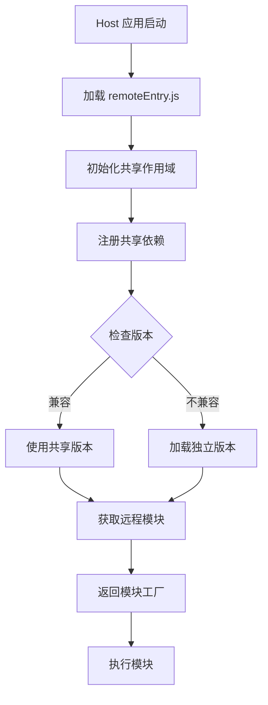

# 第 6 章 运行时机制与 HMR

> 本章是 Webpack 5 源码系列解析的**第 6 章**，聚焦于 `__webpack_require__` 完整实现、模块缓存机制、HMR 热更新原理以及模块联邦运行时。

---

## 1. 模块职责

### 1.1 Webpack 运行时：模块系统的"操作系统"

**Webpack 运行时**是注入到每个 bundle 中的**微型模块系统**，负责：

- 模块缓存管理
- 模块加载与执行
- 异步 Chunk 加载
- 模块导出处理
- HMR 热更新

**为什么需要运行时？**

浏览器没有原生的模块系统（ESM 出现前）：
- 需要手动管理模块依赖
- 需要处理循环依赖
- 需要支持代码分割
- 需要热更新能力

Webpack 运行时就是一个**微型操作系统**，在浏览器中模拟完整的模块系统。

### 1.2 `__webpack_require__`：核心加载函数

**`__webpack_require__`** 是 Webpack 运行时的**核心函数**，等价于 Node.js 的 `require()`：

```javascript
// 使用方式
const module = __webpack_require__(moduleId);

// 内部实现（简化版）
var __webpack_require__ = (function(modules) {
  var installedModules = {};  // 模块缓存
  
  function __webpack_require__(moduleId) {
    // 1. 检查缓存
    if (installedModules[moduleId]) {
      return installedModules[moduleId].exports;
    }
    
    // 2. 创建新模块
    var module = installedModules[moduleId] = {
      i: moduleId,
      l: false,
      exports: {}
    };
    
    // 3. 执行模块函数
    modules[moduleId].call(module.exports, module, module.exports, __webpack_require__);
    
    // 4. 标记为已加载
    module.l = true;
    
    // 5. 返回导出
    return module.exports;
  }
  
  return __webpack_require__;
})(/* 模块列表 */);
```

### 1.3 HMR：热模块替换

**HMR (Hot Module Replacement)** 是 Webpack 的**热更新机制**，允许：

- 运行时更新模块
- 保持应用状态
- 无需刷新页面

**典型场景**：
- 修改 React 组件 → 只更新该组件，state 保持
- 修改 CSS → 即时生效，不刷新
- 修改工具函数 → 热替换，不影响其他模块

---

## 2. 核心文件解析

### 2.1 运行时核心代码（生成的 bundle）

**文件位置**: 生成的 bundle 文件（如 `dist/main.js`）

#### 2.1.1 完整 `__webpack_require__` 实现

```javascript
// 生成的 bundle 中的核心代码
// 作用：Webpack 运行时核心

(function(modules) {
  // ==================== 模块缓存 ====================
  var installedModules = {};

  // ==================== 核心 require 函数 ====================
  function __webpack_require__(moduleId) {
    // 1. 检查模块缓存
    if (installedModules[moduleId]) {
      return installedModules[moduleId].exports;
    }
    
    // 2. 创建新模块对象
    var module = installedModules[moduleId] = {
      id: moduleId,      // 模块 ID
      loaded: false,     // 加载状态
      exports: {}        // 模块导出
    };
    
    // 3. 执行模块函数
    // modules[moduleId] 是模块的工厂函数
    // 调用时传入 module, module.exports, __webpack_require__
    modules[moduleId].call(
      module.exports,
      module,
      module.exports,
      __webpack_require__
    );
    
    // 4. 标记为已加载
    module.loaded = true;
    
    // 5. 返回导出对象
    return module.exports;
  }

  // ==================== 公开模块列表 ====================
  __webpack_require__.m = modules;

  // ==================== 模块缓存 ====================
  __webpack_require__.c = installedModules;

  // ==================== 定义 getter ====================
  // 用于 ES Module 导出
  __webpack_require__.d = function(exports, name, getter) {
    if (!__webpack_require__.o(exports, name)) {
      Object.defineProperty(exports, name, {
        enumerable: true,
        get: getter
      });
    }
  };

  // ==================== 判断是否自有属性 ====================
  __webpack_require__.o = function(object, property) {
    return Object.prototype.hasOwnProperty.call(object, property);
  };

  // ==================== 获取默认导出（兼容处理）====================
  // 处理 ES Module 与 CommonJS 的互操作
  __webpack_require__.n = function(module) {
    var getter = module && module.__esModule ?
      function getDefault() { return module['default']; } :
      function getModuleExports() { return module; };
    
    __webpack_require__.d(getter, 'a', getter);
    return getter;
  };

  // ==================== 创建命名空间对象 ====================
  // 将 CommonJS 模块转换为命名空间对象
  __webpack_require__.t = function(value, mode) {
    if (mode & 1) value = __webpack_require__(value);
    if (mode & 8) return value;
    
    if ((mode & 4) && typeof value === 'object' && value && value.__esModule) {
      return value;
    }
    
    var ns = Object.create(null);
    __webpack_require__.r(ns);
    Object.defineProperty(ns, 'default', { enumerable: true, value: value });
    
    if (mode & 2 && typeof value != 'string') {
      for (var key in value) {
        __webpack_require__.d(ns, key, function(key) { return value[key]; }.bind(null, key));
      }
    }
    
    return ns;
  };

  // ==================== 标记为 ES Module ====================
  __webpack_require__.r = function(exports) {
    if (typeof Symbol !== 'undefined' && Symbol.toStringTag) {
      Object.defineProperty(exports, Symbol.toStringTag, { value: 'Module' });
    }
    Object.defineProperty(exports, '__esModule', { value: true });
  };

  // ==================== 异步 Chunk 加载 ====================
  // 实现代码分割和懒加载
  __webpack_require__.e = function(chunkId) {
    var promises = [];
    
    // 检查是否已加载
    if (INSTALLED_CHUNKS[chunkId] !== undefined) {
      promises.push(INSTALLED_CHUNKS[chunkId]);
    } else if (chunkId !== 0) {
      // 创建 Promise
      var promise = new Promise(function(resolve, reject) {
        INSTALLED_CHUNKS[chunkId] = resolve;
        
        // 创建 script 标签加载 Chunk
        var script = document.createElement('script');
        script.charset = 'utf-8';
        script.timeout = 120;
        script.src = __webpack_require__.p + "chunk." + chunkId + ".js";
        
        // 错误处理
        var error = new Error();
        var onScriptComplete = function(event) {
          script.onerror = script.onload = null;
          clearTimeout(timeout);
          
          var chunk = INSTALLED_CHUNKS[chunkId];
          if (chunk !== undefined) {
            if (event) {
              var errorType = event && (event.type === 'load' ? 'missing' : event.type);
              var realSrc = event && event.target && event.target.src;
              error.message = 'Loading chunk ' + chunkId + ' failed.\n(' + errorType + ': ' + realSrc + ')';
              error.name = 'ChunkLoadError';
              error.type = errorType;
              error.request = realSrc;
              chunk[1](error);
            }
            INSTALLED_CHUNKS[chunkId] = undefined;
          }
        };
        
        var timeout = setTimeout(function() {
          onScriptComplete({ type: 'timeout', target: script });
        }, 120000);
        
        script.onerror = script.onload = onScriptComplete;
        document.head.appendChild(script);
      });
      
      promises.push(INSTALLED_CHUNKS[chunkId] = promise);
    }
    
    return Promise.all(promises);
  };

  // ==================== 启动应用 ====================
  // 执行入口模块
  var __webpack_exports__ = __webpack_require__('./src/index.js');
  
})({
  // 模块列表
  './src/index.js': function(module, exports, __webpack_require__) {
    const moduleA = __webpack_require__('./src/module-a.js');
    module.exports = moduleA;
  },
  
  './src/module-a.js': function(module, exports, __webpack_require__) {
    module.exports = 'Module A';
  }
});
```

**关键点解读**：

1. **模块缓存**：`installedModules` 避免重复加载
2. **模块执行**：`call(module.exports, ...)` 绑定正确的上下文
3. **导出处理**：`__webpack_require__.d`、`__webpack_require__.n` 处理 ES Module
4. **异步加载**：`__webpack_require__.e` 动态创建 script 标签

#### 2.1.2 模块工厂函数格式

```javascript
// 每个模块被包装为工厂函数
{
  './src/module.js': function(module, exports, __webpack_require__) {
    // 原始代码
    import { foo } from './foo.js';
    export const bar = foo();
    
    // 转换后
    var foo = __webpack_require__('./src/foo.js');
    exports.bar = foo();
  }
}
```

### 2.2 HotModuleReplacementPlugin.js：HMR 核心

**文件位置**: `lib/hmr/HotModuleReplacementPlugin.js`（约 800 行）

#### 2.2.1 插件结构

```javascript
// 文件：lib/hmr/HotModuleReplacementPlugin.js
// 作用：HMR 热更新插件

class HotModuleReplacementPlugin {
  apply(compiler) {
    // 1. 配置严格模块错误处理
    if (compiler.options.output.strictModuleErrorHandling === undefined) {
      compiler.options.output.strictModuleErrorHandling = true;
    }

    // 2. 注册 parser 钩子（处理 import.meta.hot）
    compiler.hooks.compilation.tap(
      PLUGIN_NAME,
      (compilation, { normalModuleFactory }) => {
        compilation.hooks.finishModules.tap(
          PLUGIN_NAME,
          (modules) => {
            // 收集所有需要 HMR 的模块
            for (const module of modules) {
              if (module.buildInfo && module.buildInfo.moduleConcatenationBailout) {
                // 标记模块需要 HMR 支持
              }
            }
          }
        );

        // 3. 注册 parser 钩子（处理 module.hot.accept）
        normalModuleFactory.hooks.parser
          .for("javascript/auto")
          .tap(PLUGIN_NAME, (parser) => {
            parser.hooks.call
              .for("module.hot.accept")
              .tap(PLUGIN_NAME, createAcceptHandler(parser, ModuleHotAcceptDependency));
            
            parser.hooks.call
              .for("module.hot.decline")
              .tap(PLUGIN_NAME, createDeclineHandler(parser, ModuleHotDeclineDependency));
          });
      }
    );

    // 4. 注册运行时模块
    compiler.hooks.compilation.tap(PLUGIN_NAME, (compilation) => {
      compilation.hooks.additionalTreeRuntimeRequirements.tap(
        PLUGIN_NAME,
        (chunk, runtimeRequirements) => {
          // 添加 HMR 运行时要求
          runtimeRequirements.add(RuntimeGlobals.module);
          runtimeRequirements.add(RuntimeGlobals.require);
        }
      );

      compilation.hooks.runtimeRequirementInTree
        .for(RuntimeGlobals.hmrRequireContext)
        .tap(PLUGIN_NAME, (chunk) => {
          // 添加 HMR 运行时模块
          const module = new HotModuleReplacementRuntimeModule();
          compilation.addRuntimeModule(chunk, module);
        });
    });

    // 5. 注册主模板钩子（注入 HMR 逻辑）
    compiler.hooks.compilation.tap(PLUGIN_NAME, (compilation) => {
      const mainTemplate = compilation.mainTemplate;

      mainTemplate.hooks.hash.tap(PLUGIN_NAME, (hash) => {
        // HMR 哈希计算
        hash.update("hot");
      });

      mainTemplate.hooks.localVars.tap(PLUGIN_NAME, (source, chunk) => {
        // 添加 HMR 局部变量
        return source + `
          var hot = __webpack_require__.hmrContext;
        `;
      });
    });
  }
}
```

#### 2.2.2 HMR 运行时模块

```javascript
// 文件：lib/hmr/HotModuleReplacementRuntimeModule.js
// 作用：HMR 运行时实现

class HotModuleReplacementRuntimeModule extends RuntimeModule {
  constructor() {
    super("hot module replacement");
  }

  generate() {
    return Template.getFunctionContent(function () {
      // ==================== HMR 上下文 ====================
      __webpack_require__.hmrContext = {
        nextChunkId: 0,
        loadedChunks: new Set(),
        moduleCache: __webpack_require__.c,
        apply: function (options) {
          // 应用更新
          return applyHotUpdate(this, options);
        }
      };

      // ==================== module.hot API ====================
      function createModuleHotObject(moduleId, me) {
        var hot = {
          // 接受更新
          accept: function (dep, callback) {
            if (dep === undefined) {
              // 接受自身更新
              hot._acceptedDependencies = {};
            } else if (typeof dep === "function") {
              // 接受所有依赖
              hot._acceptedDependencies = dep;
            } else {
              // 接受特定依赖
              for (var i = 0; i < dep.length; i++) {
                hot._acceptedDependencies[dep[i]] = callback;
              }
            }
          },

          // 拒绝更新
          decline: function (dep) {
            for (var i = 0; i < dep.length; i++) {
              hot._declinedDependencies[dep[i]] = true;
            }
          },

          // 处置回调
          dispose: function (callback) {
            hot._disposeHandlers.push(callback);
          },

          // 添加处置处理器
          addDisposeHandler: function (callback) {
            hot._disposeHandlers.push(callback);
          },

          // 移除处置处理器
          removeDisposeHandler: function (callback) {
            var idx = hot._disposeHandlers.indexOf(callback);
            if (idx >= 0) hot._disposeHandlers.splice(idx, 1);
          },

          // 检查是否接受更新
          _acceptedDependencies: {},
          _declinedDependencies: {},
          _disposeHandlers: [],

          // 模块 ID
          moduleId: moduleId,
          
          // 检查状态
          status: function () {
            return hot._status;
          },

          // 检查更新
          check: function () {
            return checkForUpdates();
          }
        };

        return hot;
      }

      // ==================== 检查更新 ====================
      function checkForUpdates() {
        // 1. 请求 manifest 文件
        return fetch(__webpack_require__.p + "hot-update.json")
          .then(function (res) { return res.json(); })
          .then(function (manifest) {
            // 2. 获取需要更新的 Chunk
            var chunkIds = manifest.c;
            var removedModules = manifest.r;
            
            // 3. 加载更新的 Chunk
            var promises = [];
            for (var i = 0; i < chunkIds.length; i++) {
              promises.push(
                fetch(__webpack_require__.p + "" + chunkIds[i] + ".hot-update.js")
                  .then(function (res) { return res.text(); })
                  .then(function (code) {
                    // 4. 执行更新代码
                    eval(code);
                  })
              );
            }
            
            return Promise.all(promises);
          });
      }

      // ==================== 应用更新 ====================
      function applyHotUpdate(self, options) {
        var disposedModules = [];
        
        // 1. 执行 dispose 回调
        for (var moduleId in self.moduleCache) {
          var module = self.moduleCache[moduleId];
          if (module.hot && module.hot._disposeHandlers) {
            for (var i = 0; i < module.hot._disposeHandlers.length; i++) {
              module.hot._disposeHandlers[i]();
            }
            disposedModules.push(moduleId);
          }
        }

        // 2. 移除已处置的模块
        for (var i = 0; i < disposedModules.length; i++) {
          delete self.moduleCache[disposedModules[i]];
        }

        // 3. 重新加载更新的模块
        // ...

        return {
          disposedModules: disposedModules
        };
      }

      // ==================== 注入到模块 ====================
      // 为每个模块创建 hot 对象
      __webpack_require__.hmrModule = function (moduleId, module) {
        module.hot = createModuleHotObject(moduleId, module);
      };
    });
  }
}
```

#### 2.2.3 HMR 工作流程

```javascript
// 客户端 HMR 使用示例

// src/index.js
import { component } from './component.js';

// 接受组件更新
if (module.hot) {
  module.hot.accept('./component.js', function () {
    console.log('组件已更新');
    // 重新渲染
    const newComponent = require('./component.js').component;
    document.body.innerHTML = newComponent();
  });
}

document.body.innerHTML = component();
```

**HMR 流程**：



### 2.3 ModuleFederationPlugin：模块联邦

**文件位置**: `lib/container/ModuleFederationPlugin.js`（约 150 行）

#### 2.3.1 插件配置

```javascript
// webpack.config.js
const { ModuleFederationPlugin } = require('webpack').container;

module.exports = {
  plugins: [
    new ModuleFederationPlugin({
      // 1. 应用名称
      name: 'host',
      
      // 2. 暴露的模块（供其他应用使用）
      exposes: {
        './Button': './src/Button.js',
        './Modal': './src/Modal.js'
      },
      
      // 3. 远程应用（使用的其他应用）
      remotes: {
        app1: 'app1@http://localhost:3001/remoteEntry.js',
        app2: 'app2@http://localhost:3002/remoteEntry.js'
      },
      
      // 4. 共享依赖
      shared: {
        react: {
          singleton: true,  // 单例
          requiredVersion: '^17.0.0'
        },
        'react-dom': {
          singleton: true,
          requiredVersion: '^17.0.0'
        }
      }
    })
  ]
};
```

#### 2.3.2 运行时实现

```javascript
// 模块联邦运行时核心逻辑
// 简化版实现

__webpack_require__.f = {};

// 远程模块加载
__webpack_require__.f.remotes = function (chunkId, promises) {
  var remoteId = chunkId.split("/")[0];
  var remote = __webpack_require__.S[remoteId];
  
  if (!remote) return;
  
  // 初始化共享作用域
  __webpack_require__.I(remoteId);
  
  // 获取远程模块
  var factory = remote[chunkId];
  if (factory) {
    promises.push(
      factory().then(function (module) {
        return module;
      })
    );
  }
};

// 共享作用域
__webpack_require__.S = {};

// 初始化共享作用域
__webpack_require__.I = function (scope) {
  if (__webpack_require__.S[scope]) return;
  
  __webpack_require__.S[scope] = {};
  
  // 注册共享模块
  var versions = __webpack_require__.S[scope];
  
  // 检查版本兼容性
  function satisfy(version, range) {
    // 版本匹配逻辑
    return true;
  }
  
  // 获取共享模块
  __webpack_require__.S[scope].get = function (module, version) {
    if (versions[module]) {
      return versions[module][version];
    }
    return null;
  };
};
```

---

## 3. 关键流程

### 3.1 模块加载完整流程

```mermaid
graph TB
    A[__webpack_require__(moduleId)] --> B{检查缓存}
    B -->|已缓存 | C[返回 exports]
    B -->|未缓存 | D[创建模块对象]
    D --> E[执行模块函数]
    E --> F[传入 module/exports/require]
    F --> G[模块内 require 其他模块]
    G --> A
    F --> H[标记 loaded=true]
    H --> I[返回 exports]
```

### 3.2 HMR 更新流程



### 3.3 模块联邦加载流程



---

## 4. 设计模式

### 4.1 单例模式（模块缓存）

```javascript
// 模块缓存是单例
var installedModules = {};  // 全局唯一

function __webpack_require__(moduleId) {
  if (installedModules[moduleId]) {
    return installedModules[moduleId].exports;  // 直接返回缓存
  }
  // ...
}
```

### 4.2 工厂模式（模块创建）

```javascript
// 每个模块都是工厂函数
{
  './src/module.js': function(module, exports, __webpack_require__) {
    // 模块代码
  }
}

// 调用工厂创建模块实例
modules[moduleId].call(module.exports, module, module.exports, __webpack_require__);
```

### 4.3 观察者模式（HMR）

```javascript
// accept 回调是观察者
module.hot.accept('./component.js', function () {
  // 当 component.js 更新时执行
});

// HMR 运行时是观察者中心
hot._acceptedDependencies[dep] = callback;

// 更新时通知所有观察者
for (var dep in hot._acceptedDependencies) {
  hot._acceptedDependencies[dep]();
}
```

---

## 5. 学习要点

### 5.1 值得借鉴的设计

1. **模块缓存**：避免重复加载，提升性能
2. **工厂函数**：模块延迟执行，支持代码分割
3. **HMR API**：优雅的模块热替换接口
4. **共享作用域**：模块联邦的核心创新

### 5.2 关键代码位置

| 功能 | 文件 | 行号 |
|------|------|------|
| `__webpack_require__` | 生成的 bundle | 文件开头 |
| HMR 插件 | lib/hmr/HotModuleReplacementPlugin.js | 全文 |
| HMR 运行时 | lib/hmr/HotModuleReplacementRuntimeModule.js | generate() |
| 模块联邦 | lib/container/ModuleFederationPlugin.js | 全文 |

### 5.3 可能的改进空间

1. **运行时体积**：基础运行时较大，可进一步精简
2. **HMR 复杂度**：循环依赖处理复杂
3. **模块联邦调试**：多应用调试困难

---

## 6. 本章小结

### 6.1 核心要点

1. **`__webpack_require__` 是核心**：模块加载、缓存、导出都通过它
2. **模块缓存避免重复**：`installedModules` 是单例
3. **HMR 是观察者模式**：accept/decline/dispose 回调
4. **模块联邦是共享作用域**：`__webpack_require__.S` 和 `__webpack_require__.I`

### 6.2 运行时变量速查

```javascript
// 核心变量
__webpack_require__          // require 函数
__webpack_require__.c        // 模块缓存
__webpack_require__.m        // 模块列表
__webpack_require__.e        // 异步加载
__webpack_require__.d        // 定义导出
__webpack_require__.n        // 默认导出
__webpack_require__.o        // hasOwnProperty
__webpack_require__.r        // 标记 ES Module
__webpack_require__.t        // 创建命名空间

// HMR 变量
__webpack_require__.hmrContext  // HMR 上下文
module.hot                      // 模块热更新 API

// 模块联邦变量
__webpack_require__.S        // 共享作用域
__webpack_require__.I        // 初始化共享
__webpack_require__.f.remotes  // 远程加载
```

---

## 7. 下章预告

**第 7 章：缓存机制与性能优化**

- 文件系统缓存实现
- 内存缓存策略
- 持久化缓存
- 构建性能优化技巧

---

> **本章源码引用**:
> - 生成的 bundle 文件 - `__webpack_require__` 实现
> - `lib/hmr/HotModuleReplacementPlugin.js` - HMR 插件
> - `lib/hmr/HotModuleReplacementRuntimeModule.js` - HMR 运行时
> - `lib/container/ModuleFederationPlugin.js` - 模块联邦插件
> - `lib/sharing/SharePlugin.js` - 共享插件
