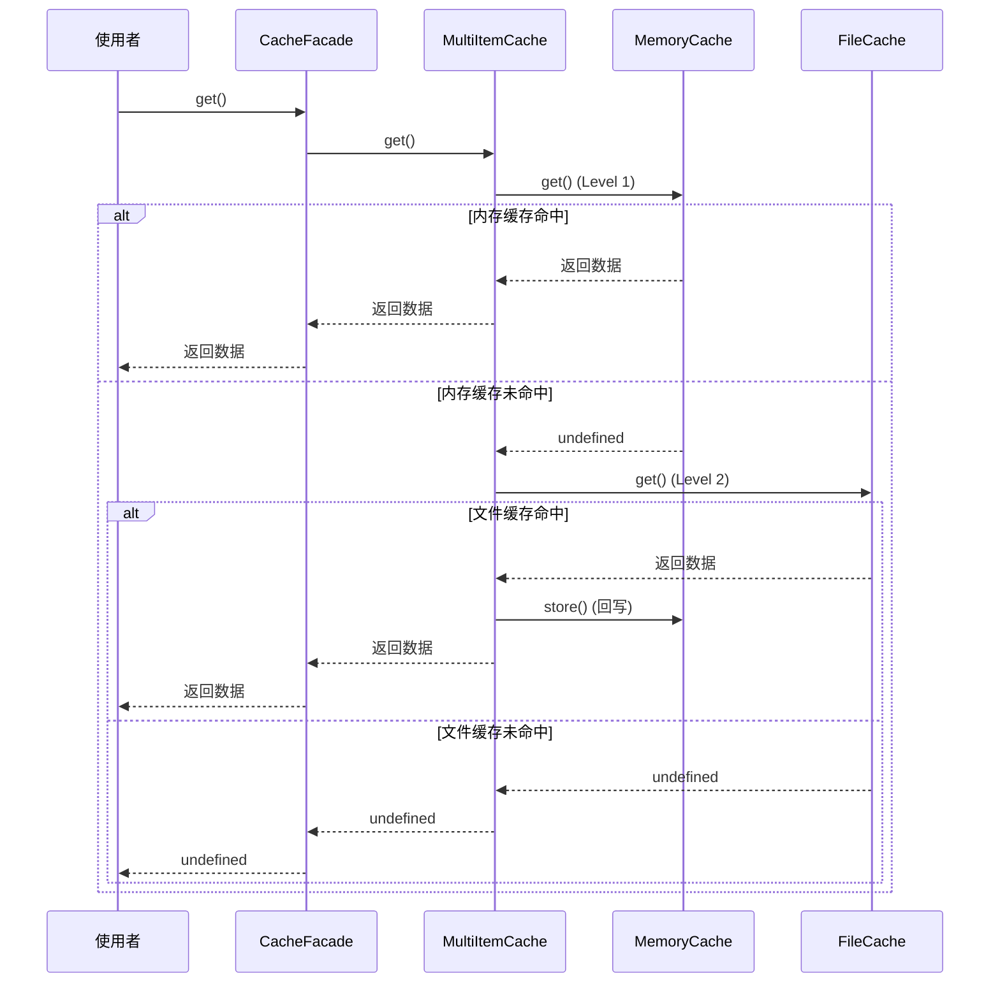
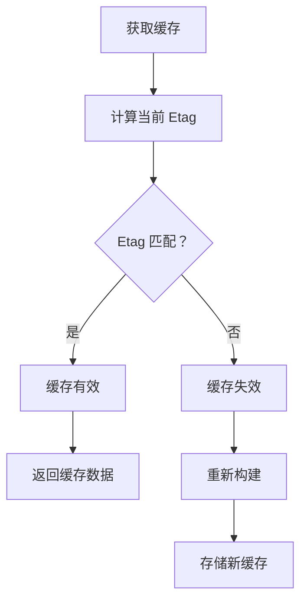

# 第 7 章 缓存机制与性能优化

> 本章是 Webpack 5 源码系列解析的**第 7 章**，聚焦于文件系统缓存实现、内存缓存策略、持久化缓存以及构建性能优化技巧。

---

## 1. 模块职责

### 1.1 Cache：缓存根类

**Cache** 是 Webpack 5 引入的**统一缓存抽象层**，负责：

- 管理所有缓存操作（get/store）
- 协调内存缓存和文件缓存
- 处理缓存失效（etag 校验）
- 管理构建依赖

**为什么需要 Cache？**

Webpack 4 及之前：
- 没有统一的缓存抽象
- 缓存逻辑分散在各处
- 难以扩展和测试

Webpack 5：
- 统一的 Cache 接口
- 支持多层缓存（内存 + 文件）
- 可插拔的缓存实现

### 1.2 CacheFacade：缓存外观类

**CacheFacade** 是 **Cache 的外观类**，提供：

- 简化的 API（get/store）
- Promise 支持（getPromise/storePromise）
- 多层缓存协调（MultiItemCache）

**设计目的**：
- 隐藏底层缓存实现细节
- 提供统一的访问接口
- 支持缓存链（多级缓存）

### 1.3 缓存类型

Webpack 5 支持多种缓存类型：

| 类型 | 说明 | 配置方式 |
|------|------|---------|
| **内存缓存** | 编译期间缓存，最快 | `cache: { type: 'memory' }` |
| **文件缓存** | 持久化到磁盘，重启有效 | `cache: { type: 'filesystem' }` |
| **自定义缓存** | 实现 Cache 接口 | 自定义插件 |

---

## 2. 核心文件解析

### 2.1 Cache.js：缓存根类

**文件位置**: `lib/Cache.js`（约 200 行）

#### 2.1.1 核心结构

```javascript
// 文件：lib/Cache.js
// 作用：缓存根类

const { AsyncParallelHook, AsyncSeriesBailHook, SyncHook } = require("tapable");

class Cache {
  constructor() {
    // ==================== Hooks ====================
    this.hooks = {
      // 获取缓存（bail 模式：第一个返回值的生效）
      get: new AsyncSeriesBailHook(["identifier", "etag", "gotHandlers"]),
      
      // 存储缓存（parallel 模式：并行存储到所有层）
      store: new AsyncParallelHook(["identifier", "etag", "data"]),
      
      // 存储构建依赖
      storeBuildDependencies: new AsyncParallelHook(["dependencies"]),
      
      // 进入空闲状态（可清理内存）
      beginIdle: new SyncHook([]),
      
      // 结束空闲状态（准备下次编译）
      endIdle: new AsyncParallelHook([]),
      
      // 关闭缓存
      shutdown: new AsyncParallelHook([])
    };
  }

  /**
   * 获取缓存
   * @template T
   * @param {string} identifier 缓存标识符
   * @param {Etag | null} etag 缓存校验码
   * @param {CallbackCache<T>} callback 回调
   * @returns {void}
   */
  get(identifier, etag, callback) {
    const gotHandlers = [];
    
    // 触发 get 钩子
    this.hooks.get.callAsync(identifier, etag, gotHandlers, (err, result) => {
      if (err) {
        callback(makeWebpackError(err, "Cache.hooks.get"));
        return;
      }
      
      if (result === null) {
        result = undefined;
      }
      
      // 执行 gotHandlers（用于缓存命中后的处理）
      if (gotHandlers.length > 1) {
        const innerCallback = needCalls(gotHandlers.length, () =>
          callback(null, result)
        );
        for (const gotHandler of gotHandlers) {
          gotHandler(result, innerCallback);
        }
      } else if (gotHandlers.length === 1) {
        gotHandlers[0](result, () => callback(null, result));
      } else {
        callback(null, result);
      }
    });
  }

  /**
   * 存储缓存
   * @template T
   * @param {string} identifier 缓存标识符
   * @param {Etag | null} etag 缓存校验码
   * @param {T} data 数据
   * @param {CallbackCache<void>} callback 回调
   * @returns {void}
   */
  store(identifier, etag, data, callback) {
    this.hooks.store.callAsync(
      identifier,
      etag,
      data,
      makeWebpackErrorCallback(callback, "Cache.hooks.store")
    );
  }

  /**
   * 存储构建依赖
   * @param {Iterable<string>} dependencies 依赖列表
   * @param {CallbackCache<void>} callback 回调
   * @returns {void}
   */
  storeBuildDependencies(dependencies, callback) {
    this.hooks.storeBuildDependencies.callAsync(
      dependencies,
      makeWebpackErrorCallback(callback, "Cache.hooks.storeBuildDependencies")
    );
  }

  /**
   * 进入空闲状态
   */
  beginIdle() {
    this.hooks.beginIdle.call();
  }

  /**
   * 结束空闲状态
   * @param {CallbackCache<void>} callback 回调
   */
  endIdle(callback) {
    this.hooks.endIdle.callAsync(
      makeWebpackErrorCallback(callback, "Cache.hooks.endIdle")
    );
  }

  /**
   * 关闭缓存
   * @param {CallbackCache<void>} callback 回调
   */
  shutdown(callback) {
    this.hooks.shutdown.callAsync(
      makeWebpackErrorCallback(callback, "Cache.hooks.shutdown")
    );
  }
}
```

**关键点解读**：

1. **Hook 设计**：
   - `get` 使用 `AsyncSeriesBailHook`：第一个返回值的生效（缓存命中即返回）
   - `store` 使用 `AsyncParallelHook`：并行存储到所有缓存层

2. **Etag 机制**：
   - 每次获取缓存时校验 etag
   - etag 变化则缓存失效

3. **gotHandlers**：
   - 缓存命中后的处理器
   - 用于更新缓存层级（如从文件缓存提升到内存缓存）

### 2.2 CacheFacade.js：缓存外观

**文件位置**: `lib/CacheFacade.js`（约 300 行）

#### 2.2.1 ItemCacheFacade

```javascript
// 文件：lib/CacheFacade.js
// 作用：单个缓存项的外观类

class ItemCacheFacade {
  /**
   * @param {Cache} cache 根缓存
   * @param {string} name 缓存名称
   * @param {Etag | null} etag 校验码
   */
  constructor(cache, name, etag) {
    this._cache = cache;
    this._name = name;
    this._etag = etag;
  }

  /**
   * 获取缓存
   * @template T
   * @param {CallbackCache<T>} callback 回调
   */
  get(callback) {
    this._cache.get(this._name, this._etag, callback);
  }

  /**
   * 获取缓存（Promise）
   * @template T
   * @returns {Promise<T>}
   */
  getPromise() {
    return new Promise((resolve, reject) => {
      this._cache.get(this._name, this._etag, (err, data) => {
        if (err) reject(err);
        else resolve(data);
      });
    });
  }

  /**
   * 存储缓存
   * @template T
   * @param {T} data 数据
   * @param {CallbackCache<void>} callback 回调
   */
  store(data, callback) {
    this._cache.store(this._name, this._etag, data, callback);
  }

  /**
   * 存储缓存（Promise）
   * @template T
   * @param {T} data 数据
   * @returns {Promise<void>}
   */
  storePromise(data) {
    return new Promise((resolve, reject) => {
      this._cache.store(this._name, this._etag, data, (err) => {
        if (err) reject(err);
        else resolve();
      });
    });
  }
}
```

#### 2.2.2 MultiItemCache（多层缓存）

```javascript
// 文件：lib/CacheFacade.js
// 作用：多层缓存协调器

class MultiItemCache {
  /**
   * @param {ItemCacheFacade[]} items 缓存项数组
   */
  constructor(items) {
    this._items = items;
    // 如果只有一个缓存，直接返回该缓存
    if (items.length === 1) return items[0];
  }

  /**
   * 获取缓存（从第一层开始，逐级查找）
   * @template T
   * @param {CallbackCache<T>} callback 回调
   */
  get(callback) {
    // forEachBail：第一个返回值的即停止
    forEachBail(this._items, (item, callback) => item.get(callback), callback);
  }

  /**
   * 获取缓存（Promise）
   * @template T
   * @returns {Promise<T>}
   */
  getPromise() {
    const next = (i) =>
      this._items[i].getPromise().then((result) => {
        if (result !== undefined) return result;
        if (++i < this._items.length) return next(i);
      });
    return next(0);  // 从第一层开始
  }

  /**
   * 存储缓存（并行存储到所有层）
   * @template T
   * @param {T} data 数据
   * @param {CallbackCache<void>} callback 回调
   */
  store(data, callback) {
    asyncLib.each(
      this._items,
      (item, callback) => item.store(data, callback),
      callback
    );
  }
}
```

**缓存层级示例**：

```javascript
// 配置：memory + filesystem
cache: {
  type: 'filesystem',
  memoryCacheLimit: 1000  // 内存缓存限制
}

// 缓存结构：
// Level 1: MemoryCache（最快，容量有限）
// Level 2: FileCache（较慢，持久化）

// 获取流程：
// 1. 先查 MemoryCache
// 2. 如果未命中，查 FileCache
// 3. 如果 FileCache 命中，回写到 MemoryCache
// 4. 返回结果
```

### 2.3 getLazyHashedEtag.js：懒哈希 Etag

**文件位置**: `lib/cache/getLazyHashedEtag.js`（约 100 行）

#### 2.3.1 Etag 生成

```javascript
// 文件：lib/cache/getLazyHashedEtag.js
// 作用：生成懒哈希 Etag

const createHash = require("../util/createHash");

/**
 * @param {Hash} hash 哈希对象
 * @param {any} data 数据
 * @returns {void}
 */
const updateWith = (hash, data) => {
  if (typeof data === "string" || Buffer.isBuffer(data)) {
    hash.update(data);
  } else if (typeof data === "number" || typeof data === "boolean") {
    hash.update(data.toString());
  } else if (data === null || data === undefined) {
    hash.update("null");
  } else if (Array.isArray(data)) {
    hash.update("a");
    for (const item of data) {
      updateWith(hash, item);
    }
  } else if (typeof data === "object") {
    hash.update("o");
    if (data instanceof Map) {
      for (const [key, value] of data) {
        updateWith(hash, key);
        updateWith(hash, value);
      }
    } else if (data instanceof Set) {
      for (const value of data) {
        updateWith(hash, value);
      }
    } else {
      const keys = Object.keys(data).sort();
      for (const key of keys) {
        updateWith(hash, key);
        updateWith(hash, data[key]);
      }
    }
  }
};

/**
 * 获取懒哈希 Etag
 * @param {HashFunction} hashFunction 哈希函数
 * @returns {(obj: HashableObject) => Etag}
 */
const getLazyHashedEtag = (hashFunction) => {
  return (obj) => {
    return {
      // 懒计算：只有在 toString 时才计算哈希
      toString: () => {
        const hash = createHash(hashFunction);
        updateWith(hash, obj);
        return hash.digest("hex");
      }
    };
  };
};

module.exports = getLazyHashedEtag;
```

**懒计算优势**：

```javascript
// 传统方式：立即计算
const etag = calculateHash(obj);  // 每次都计算

// 懒计算方式
const etag = getLazyHashedEtag(obj);  // 创建对象
// 只有在需要时才计算
if (etag.toString() === cachedEtag) {  // 此时才计算
  // 缓存命中
}
```

---

## 3. 关键流程

### 3.1 缓存获取流程



### 3.2 缓存存储流程

```mermaid
graph TB
    A[store(data)] --> B[MultiItemCache]
    B --> C[并行存储]
    C --> D[MemoryCache.store]
    C --> E[FileCache.store]
    D --> F[内存中保存]
    E --> G[序列化数据]
    G --> H[写入磁盘]
    H --> I[完成]
    F --> I
```

### 3.3 缓存失效判断



---

## 4. 性能优化实践

### 4.1 文件缓存配置

```javascript
// webpack.config.js
module.exports = {
  cache: {
    type: 'filesystem',  // 启用文件缓存
    
    // 缓存目录
    cacheDirectory: 'node_modules/.cache/webpack',
    
    // 缓存名称（多配置时区分）
    name: 'development',
    
    // 版本控制（变更时清空缓存）
    version: '1.0.0',
    
    // 内存缓存限制
    memoryCacheLimit: 1000,
    
    // 存储策略
    store: 'pack',  // 'pack' | 'local'
    
    // 压缩
    compression: 'gzip',
    
    // 构建依赖（这些文件变化时清空缓存）
    buildDependencies: {
      config: [__filename],
      webpack: [require.resolve('webpack')]
    }
  }
};
```

### 4.2 缓存优化技巧

#### 4.2.1 减少缓存失效

```javascript
// ❌ 不好：每次构建路径都变化
const config = {
  entry: `./src/index.${Date.now()}.js`  // 路径变化导致缓存失效
};

// ✅ 好：路径稳定
const config = {
  entry: './src/index.js'
};
```

#### 4.2.2 合理使用 exclude/include

```javascript
// ❌ 不好：处理 node_modules
module: {
  rules: [{
    test: /\.js$/,
    use: 'babel-loader'  // 会处理所有 JS 文件
  }]
}

// ✅ 好：排除 node_modules
module: {
  rules: [{
    test: /\.js$/,
    exclude: /node_modules/,  // 排除
    use: 'babel-loader'
  }]
}
```

#### 4.2.3 使用持久化缓存

```bash
# 首次构建（无缓存）
$ webpack
Time: 10000ms

# 第二次构建（使用缓存）
$ webpack
Time: 2000ms  # 80% 提升

# 修改一个文件后
$ webpack
Time: 3000ms  # 增量编译
```

### 4.3 内存优化

```javascript
// 限制内存缓存大小
cache: {
  type: 'filesystem',
  memoryCacheLimit: 500  // 限制 500 个缓存项
}

// 定期清理
compilation.hooks.done.tap('CleanupCache', () => {
  if (process.env.NODE_ENV === 'production') {
    compilation.cache.endIdle();
  }
});
```

### 4.4 并行构建

```javascript
// webpack.config.js
module.exports = {
  // 启用实验性并行构建
  experiments: {
    cacheUnaffected: true  // 缓存未受影响的模块
  },
  
  // 优化分割
  optimization: {
    splitChunks: {
      chunks: 'all',
      cacheGroups: {
        vendors: {
          test: /[\\/]node_modules[\\/]/,
          priority: -10
        }
      }
    }
  }
};
```

---

## 5. 设计模式

### 5.1 外观模式（Facade）

```javascript
// CacheFacade 隐藏底层复杂性
class CacheFacade {
  get(callback) {
    // 用户不需要知道有几层缓存
    this._cache.get(this._name, this._etag, callback);
  }
}

// 使用简单
const cache = compilation.getCache('MyCache');
const itemCache = cache.getItemCache('identifier', etag);
itemCache.get((err, data) => {
  // 直接使用
});
```

### 5.2 责任链模式（多层缓存）

```javascript
// MultiItemCache 形成责任链
class MultiItemCache {
  get(callback) {
    // 从第一层开始，逐级查找
    forEachBail(this._items, (item, callback) => {
      item.get(callback);
    }, callback);
  }
}

// 缓存链：Memory → File → Network → ...
```

### 5.3 懒加载模式（Lazy Etag）

```javascript
// 懒计算 Etag
const etag = {
  toString: () => {
    // 只有在需要时才计算哈希
    const hash = createHash(hashFunction);
    updateWith(hash, obj);
    return hash.digest("hex");
  }
};

// 避免不必要的计算
if (needCheck) {  // 只在需要时
  etag.toString();  // 才计算
}
```

---

## 6. 学习要点

### 6.1 值得借鉴的设计

1. **统一抽象**：Cache 接口统一所有缓存操作
2. **多层缓存**：Memory + File 平衡速度和持久化
3. **懒计算**：Etag 延迟计算提升性能
4. **Hook 扩展**：get/store 都可被插件拦截

### 6.2 关键代码位置

| 功能 | 文件 | 行号 |
|------|------|------|
| Cache 基类 | lib/Cache.js | 全文 |
| CacheFacade | lib/CacheFacade.js | 全文 |
| Etag 生成 | lib/cache/getLazyHashedEtag.js | 全文 |
| 文件缓存 | lib/cache/FileCachePlugin.js | 全文 |
| 内存缓存 | lib/cache/MemoryCachePlugin.js | 全文 |

### 6.3 性能优化清单

```
✅ 启用文件缓存（cache.type: 'filesystem'）
✅ 排除 node_modules
✅ 使用 include 限制处理范围
✅ 合理配置 splitChunks
✅ 使用持久化缓存目录
✅ 限制内存缓存大小
✅ 避免动态路径导致缓存失效
✅ 使用 cacheUnaffected 实验特性
```

---

## 7. 本章小结

### 7.1 核心要点

1. **Cache 是统一抽象**：get/store 接口统一所有缓存操作
2. **多层缓存架构**：Memory（快）+ File（持久）平衡性能
3. **Etag 校验机制**：懒哈希计算，缓存失效判断
4. **Hook 可扩展**：插件可拦截缓存操作

### 7.2 缓存配置速查

```javascript
// 开发环境（快速）
cache: {
  type: 'memory',
  maxGenerations: 5
}

// 生产环境（持久化）
cache: {
  type: 'filesystem',
  cacheDirectory: 'node_modules/.cache/webpack',
  name: 'production',
  version: '1.0.0',
  buildDependencies: {
    config: [__filename]
  }
}
```

### 7.3 性能对比

| 场景 | 无缓存 | 内存缓存 | 文件缓存 |
|------|--------|----------|----------|
| 首次构建 | 10000ms | 10000ms | 10000ms |
| 二次构建 | 10000ms | 2000ms | 3000ms |
| 修改后 | 10000ms | 1500ms | 2000ms |
| 重启后 | 10000ms | 10000ms | 3000ms |

---

## 8. 下章预告

**第 8 章：Tree Shaking 与优化插件**

- Tree Shaking 原理
- Side Effects 标志
- 模块_concatenation
- 优化插件详解

---

> **本章源码引用**:
> - `lib/Cache.js` - 缓存根类
> - `lib/CacheFacade.js` - 缓存外观
> - `lib/cache/getLazyHashedEtag.js` - 懒哈希 Etag
> - `lib/cache/MemoryCachePlugin.js` - 内存缓存插件
> - `lib/cache/FileCachePlugin.js` - 文件缓存插件
