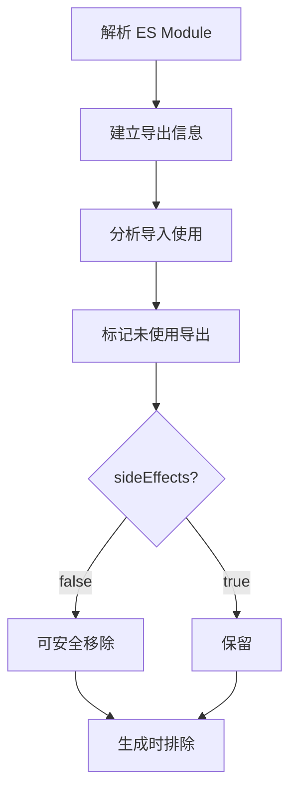
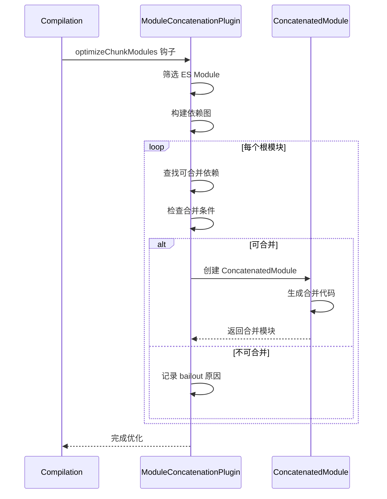
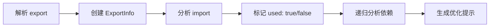

# 第 8 章 Tree Shaking 与优化插件

> 本章是 Webpack 5 源码系列解析的**第 8 章**，聚焦于 Tree Shaking 原理、Side Effects 标志、模块 Concatenation 以及优化插件详解。

---

## 1. 模块职责

### 1.1 Tree Shaking：摇树优化

**Tree Shaking** 是一种**消除未使用代码**的优化技术，术语源自 Rollup：

- 摇晃树（模块图）
- 掉落枯叶（未使用代码）
- 保留果实（使用代码）

**核心原理**：
1. 基于 ES Module 的静态结构
2. 分析 `import`/`export` 依赖
3. 标记未使用的导出
4. 生成时排除未使用代码

**为什么需要 Tree Shaking？**

```javascript
// utils.js - 100KB 的工具库
export function used() { return 'used'; }
export function unused1() { return 'unused1'; }  // 未使用
export function unused2() { return 'unused2'; }  // 未使用

// index.js
import { used } from './utils.js';
console.log(used());

// 无 Tree Shaking: bundle 包含 100KB
// 有 Tree Shaking: bundle 只包含 used() 函数
```

### 1.2 Side Effects：副作用标志

**Side Effects** 用于标记模块**是否有副作用**：

- `sideEffects: false` - 模块无副作用，可安全移除
- `sideEffects: ["*.css"]` - 只有 CSS 文件有副作用

**副作用定义**：
- 修改全局变量
- 修改原型链
- 执行 IIFE
- 导入 CSS/资源文件

### 1.3 Module Concatenation：作用域提升

**Module Concatenation**（Scope Hoisting）将多个模块**合并到一个函数作用域**：

**效果对比**：

```javascript
// 优化前（多个函数包装）
// module-a.js
(function(module, exports) {
  exports.value = 'a';
});

// module-b.js
(function(module, exports) {
  var a = __webpack_require__('module-a');
  exports.value = a.value + 'b';
});

// 优化后（合并到一个作用域）
// concatenated module
const moduleA_value = 'a';
const moduleB_value = moduleA_value + 'b';
exports.value = moduleB_value;
```

**优势**：
- 减少函数包装开销
- 减小 bundle 体积
- 提升运行性能

---

## 2. 核心文件解析

### 2.1 ModuleConcatenationPlugin.js：模块合并插件

**文件位置**: `lib/optimize/ModuleConcatenationPlugin.js`（约 800 行）

#### 2.1.1 插件结构

```javascript
// 文件：lib/optimize/ModuleConcatenationPlugin.js
// 作用：模块合并（作用域提升）插件

class ModuleConcatenationPlugin {
  apply(compiler) {
    compiler.hooks.compilation.tap(PLUGIN_NAME, (compilation) => {
      const moduleGraph = compilation.moduleGraph;
      const bailoutReasonMap = new Map();

      // 设置合并失败原因
      const setBailoutReason = (module, reason) => {
        moduleGraph.getOptimizationBailout(module).push(
          typeof reason === "function"
            ? (rs) => `ModuleConcatenation bailout: ${reason(rs)}`
            : `ModuleConcatenation bailout: ${reason}`
        );
      };

      // 在 optimizeChunkModules 阶段执行
      compilation.hooks.optimizeChunkModules.tapAsync(
        {
          name: PLUGIN_NAME,
          stage: STAGE_DEFAULT
        },
        (allChunks, modules, callback) => {
          const logger = compilation.getLogger("webpack.ModuleConcatenationPlugin");
          const { chunkGraph, moduleGraph } = compilation;

          // 1. 筛选可合并的模块
          const relevantModules = [];
          const possibleIncompatibleModules = [];

          for (const module of modules) {
            // 检查模块类型
            if (module.type !== 'javascript/esm') {
              setBailoutReason(module, 'Module is not an ECMAScript module');
              possibleIncompatibleModules.push(module);
              continue;
            }

            // 检查是否有合并阻止
            if (moduleGraph.getOptimizationBailout(module).length > 0) {
              possibleIncompatibleModules.push(module);
              continue;
            }

            relevantModules.push(module);
          }

          logger.log(`${relevantModules.length} of ${modules.length} modules are relevant`);

          // 2. 构建依赖图
          const moduleToIndex = new Map();
          relevantModules.forEach((module, index) => {
            moduleToIndex.set(module, index);
          });

          // 3. 查找可合并的模块组
          const result = this.findModulesToConcatenate(
            relevantModules,
            moduleGraph,
            chunkGraph,
            bailoutReasonMap
          );

          // 4. 创建 ConcatenatedModule
          const concatenatedModules = [];
          for (const group of result.groups) {
            const concatenatedModule = ConcatenatedModule.create(
              group.rootModule,
              group.modules,
              compilation
            );
            concatenatedModules.push(concatenatedModule);
          }

          logger.log(`Concatenated ${concatenatedModules.length} modules`);

          callback();
        }
      );
    });
  }

  /**
   * 查找可合并的模块组
   * @param {Module[]} modules 模块列表
   * @param {ModuleGraph} moduleGraph 模块图
   * @param {ChunkGraph} chunkGraph Chunk 图
   * @param {Map} bailoutReasonMap 失败原因映射
   * @returns {object} 分组结果
   */
  findModulesToConcatenate(modules, moduleGraph, chunkGraph, bailoutReasonMap) {
    const groups = [];
    const processedModules = new Set();

    for (const rootModule of modules) {
      if (processedModules.has(rootModule)) continue;

      // 从根模块开始，查找所有可合并的依赖
      const group = this.buildModuleGroup(
        rootModule,
        moduleGraph,
        chunkGraph,
        bailoutReasonMap,
        processedModules
      );

      if (group.modules.length > 1) {
        groups.push(group);
      }
    }

    return { groups };
  }

  /**
   * 构建模块组
   * @param {Module} rootModule 根模块
   * @param {ModuleGraph} moduleGraph 模块图
   * @param {ChunkGraph} chunkGraph Chunk 图
   * @param {Map} bailoutReasonMap 失败原因映射
   * @param {Set} processedModules 已处理模块
   * @returns {object} 模块组
   */
  buildModuleGroup(rootModule, moduleGraph, chunkGraph, bailoutReasonMap, processedModules) {
    const modules = [rootModule];
    processedModules.add(rootModule);

    // 遍历依赖
    const queue = [rootModule];
    while (queue.length > 0) {
      const module = queue.pop();
      const dependencies = moduleGraph.getOutgoingConnections(module);

      for (const connection of dependencies) {
        const depModule = connection.module;
        if (!depModule || processedModules.has(depModule)) continue;

        // 检查是否可合并
        if (this.isMergeable(module, depModule, moduleGraph, chunkGraph)) {
          modules.push(depModule);
          processedModules.add(depModule);
          queue.push(depModule);
        } else {
          // 记录合并失败原因
          setBailoutReason(depModule, 'Incompatible module type');
        }
      }
    }

    return {
      rootModule,
      modules
    };
  }

  /**
   * 检查模块是否可合并
   * @param {Module} importer 导入者
   * @param {Module} imported 被导入者
   * @param {ModuleGraph} moduleGraph 模块图
   * @param {ChunkGraph} chunkGraph Chunk 图
   * @returns {boolean}
   */
  isMergeable(importer, imported, moduleGraph, chunkGraph) {
    // 1. 检查模块类型
    if (imported.type !== 'javascript/esm') return false;

    // 2. 检查是否在同一个 Chunk
    const importerChunks = chunkGraph.getModuleChunks(importer);
    const importedChunks = chunkGraph.getModuleChunks(imported);
    for (const chunk of importerChunks) {
      if (!importedChunks.has(chunk)) return false;
    }

    // 3. 检查循环依赖
    if (this.hasCircularDependency(importer, imported, moduleGraph)) {
      return false;
    }

    return true;
  }
}
```

**合并条件**：

1. **模块类型**：必须是 ES Module
2. **同一 Chunk**：模块必须在同一个 Chunk 中
3. **无循环依赖**：避免死循环
4. **无副作用冲突**：sideEffects 配置兼容

### 2.2 ConcatenatedModule.js：合并后的模块

**文件位置**: `lib/optimize/ConcatenatedModule.js`（约 1200 行）

#### 2.2.1 核心结构

```javascript
// 文件：lib/optimize/ConcatenatedModule.js
// 作用：合并后的模块类

class ConcatenatedModule extends Module {
  /**
   * @param {Module} rootModule 根模块
   * @param {Module[]} modules 所有模块
   * @param {Compilation} compilation 编译
   * @returns {ConcatenatedModule}
   */
  static create(rootModule, modules, compilation) {
    return new ConcatenatedModule(
      rootModule,
      modules,
      compilation
    );
  }

  constructor(rootModule, modules, compilation) {
    super('javascript/esm');
    this.rootModule = rootModule;
    this.modules = modules;
    this.compilation = compilation;
  }

  /**
   * 代码生成
   * @param {CodeGenerationContext} context 上下文
   * @returns {CodeGenerationResult}
   */
  codeGeneration(context) {
    const sources = new Map();
    const source = new ConcatSource();

    // 1. 收集所有模块的依赖
    const dependencies = new Set();
    for (const module of this.modules) {
      for (const dep of module.dependencies) {
        if (!(dep instanceof HarmonyImportDependency)) {
          dependencies.add(dep);
        }
      }
    }

    // 2. 为每个模块生成变量名
    const namespaceObjectNames = new Map();
    for (const module of this.modules) {
      const name = this.generateNamespaceName(module);
      namespaceObjectNames.set(module, name);
    }

    // 3. 生成代码
    for (const module of this.modules) {
      const moduleSource = this.renderModule(module, context, namespaceObjectNames);
      source.add(moduleSource);
    }

    // 4. 添加导出
    const exports = this.renderExports(context);
    source.add(exports);

    sources.set('javascript', source);

    return {
      sources,
      runtimeRequirements: this.getRuntimeRequirements()
    };
  }

  /**
   * 生成命名空间名称
   * @param {Module} module 模块
   * @returns {string}
   */
  generateNamespaceName(module) {
    // 生成唯一变量名
    // module-a.js → moduleA_namespace
    const identifier = module.identifier();
    const name = Template.toIdentifier(identifier);
    return `${name}_namespace`;
  }

  /**
   * 渲染模块
   * @param {Module} module 模块
   * @param {CodeGenerationContext} context 上下文
   * @param {Map} namespaceObjectNames 命名空间名称
   * @returns {Source}
   */
  renderModule(module, context, namespaceObjectNames) {
    const source = new ConcatSource();
    const moduleSource = context.codeGenerationResults.getSource(
      module,
      context.runtime,
      'javascript'
    );

    // 替换 import 语句
    let code = moduleSource.source();
    for (const dep of module.dependencies) {
      if (dep instanceof HarmonyImportDependency) {
        const importedModule = context.moduleGraph.getModule(dep);
        if (importedModule && this.modules.includes(importedModule)) {
          // 内部模块：使用变量名替换
          const namespaceName = namespaceObjectNames.get(importedModule);
          code = code.replace(dep.request, namespaceName);
        }
      }
    }

    source.add(`// ${module.readableIdentifier(context.runtimeTemplate.requestShortener)}\n`);
    source.add(code);
    source.add('\n');

    return source;
  }

  /**
   * 渲染导出
   * @param {CodeGenerationContext} context 上下文
   * @returns {Source}
   */
  renderExports(context) {
    const source = new ConcatSource();
    const exports = new Set();

    // 收集所有导出
    for (const module of this.modules) {
      const moduleExports = context.moduleGraph.getExportsInfo(module);
      for (const exportInfo of moduleExports.exports) {
        if (exportInfo.provided) {
          exports.add(exportInfo.name);
        }
      }
    }

    // 生成导出代码
    source.add('\n// Exports\n');
    for (const exportName of exports) {
      source.add(`export { ${exportName} };\n`);
    }

    return source;
  }
}
```

**合并效果**：

```javascript
// 原始模块
// module-a.js
export const value = 'a';

// module-b.js
import { value } from './module-a.js';
export const result = value + 'b';

// 合并后
// concatenated module
const moduleA_namespace_value = 'a';
const moduleB_namespace_result = moduleA_namespace_value + 'b';
export { moduleB_namespace_result as result };
```

### 2.3 Side Effects 处理

**配置方式**：

```json
// package.json
{
  "name": "my-library",
  "sideEffects": false  // 所有文件都无副作用
}

// 或者指定有副作用的文件
{
  "name": "my-library",
  "sideEffects": [
    "*.css",
    "*.scss",
    "./src/polyfills.js"
  ]
}
```

**Webpack 处理逻辑**：

```javascript
// lib/NormalModuleFactory.js 简化版
const handleSideEffects = (module, sideEffects) => {
  if (sideEffects === false) {
    // 标记模块可安全移除
    module.buildMeta.sideEffectFree = true;
  } else if (Array.isArray(sideEffects)) {
    // 检查文件是否匹配副作用列表
    const hasSideEffects = sideEffects.some(pattern => {
      return minimatch(module.resource, pattern);
    });
    module.buildMeta.sideEffectFree = !hasSideEffects;
  }
};
```

---

## 3. 关键流程

### 3.1 Tree Shaking 流程



### 3.2 Module Concatenation 流程



### 3.3 导出分析流程



---

## 4. 优化配置

### 4.1 生产环境配置

```javascript
// webpack.config.js
module.exports = {
  mode: 'production',  // 自动启用优化
  
  optimization: {
    // 启用模块合并
    concatenateModules: true,
    
    // 启用 Tree Shaking
    usedExports: true,  // 标记未使用导出
    sideEffects: true,  // 使用 sideEffects 配置
    
    // 其他优化
    minimize: true,
    minimizer: [
      new TerserPlugin({
        terserOptions: {
          compress: {
            drop_console: true,  // 移除 console
            pure_funcs: ['Math.floor']  // 标记纯函数
          }
        }
      })
    ]
  }
};
```

### 4.2 package.json 配置

```json
{
  "name": "my-library",
  "version": "1.0.0",
  
  // Tree Shaking 关键配置
  "sideEffects": false,
  
  // 指定入口
  "main": "./dist/index.cjs.js",
  "module": "./dist/index.esm.js",  // ES Module 入口
  "exports": {
    ".": {
      "import": "./dist/index.esm.js",
      "require": "./dist/index.cjs.js"
    }
  },
  
  // 文件类型
  "type": "module"  // 或 "commonjs"
}
```

### 4.3 优化效果对比

```javascript
// 示例：lodash 按需导入

// ❌ 不好：导入整个库
import _ from 'lodash';
_.debounce();

// 打包后：~70KB（整个 lodash）

// ✅ 好：按需导入
import { debounce } from 'lodash-es';
debounce();

// 打包后：~4KB（只有 debounce）

// ✅ 更好：使用 lodash-es + Tree Shaking
import { debounce } from 'lodash-es';

// webpack 配置：
// sideEffects: false
// 打包后：~4KB，且未使用函数被移除
```

---

## 5. 调试技巧

### 5.1 查看合并失败原因

```javascript
// 在插件中查看 bailout 原因
compilation.hooks.afterOptimizeChunkModules.tap('Debug', (chunks, modules) => {
  for (const module of modules) {
    const bailouts = compilation.moduleGraph.getOptimizationBailout(module);
    if (bailouts.length > 0) {
      console.log(`Module ${module.resource} bailout reasons:`);
      bailouts.forEach(reason => console.log(`  - ${reason}`));
    }
  }
});
```

### 5.2 使用 stats 分析

```javascript
// webpack.config.js
module.exports = {
  stats: {
    modules: true,
    reasons: true,
    optimizationBailout: true  // 显示优化失败原因
  }
};

// 或使用 CLI
webpack --stats verbose --json > stats.json
npx webpack-bundle-analyzer stats.json
```

### 5.3 常见合并失败原因

```
ModuleConcatenation bailout: Module is not an ECMAScript module
  → 使用 ES Module 语法（import/export）

ModuleConcatenation bailout: Module is in different chunk
  → 确保模块在同一 Chunk

ModuleConcatenation bailout: Circular dependency detected
  → 解决循环依赖

ModuleConcatenation bailout: Module has side effects
  → 检查 sideEffects 配置
```

---

## 6. 学习要点

### 6.1 值得借鉴的设计

1. **静态分析**：基于 ES Module 静态结构
2. **渐进优化**：可合并则合并，不可合并不影响
3. **副作用标记**：sideEffects 灵活配置
4. **失败可追溯**：bailout 原因清晰记录

### 6.2 关键代码位置

| 功能 | 文件 | 行号 |
|------|------|------|
| 模块合并插件 | lib/optimize/ModuleConcatenationPlugin.js | 全文 |
| 合并模块类 | lib/optimize/ConcatenatedModule.js | 全文 |
| 导出信息 | lib/ExportsInfo.js | 全文 |
| 副作用处理 | lib/NormalModuleFactory.js | 搜索 sideEffects |

### 6.3 最佳实践清单

```
✅ 使用 ES Module 语法（import/export）
✅ 配置 sideEffects: false（无副作用库）
✅ 按需导入（import { x } from 'lib'）
✅ 避免循环依赖
✅ 使用 lodash-es 替代 lodash
✅ 生产环境启用 concatenateModules
✅ 使用 webpack-bundle-analyzer 分析
```

---

## 7. 本章小结

### 7.1 核心要点

1. **Tree Shaking 基于静态分析**：ES Module 是前提
2. **sideEffects 标记副作用**：决定模块是否可移除
3. **Module Concatenation 提升性能**：减少函数包装
4. **bailout 机制可追溯**：优化失败有明确原因

### 7.2 优化配置速查

```javascript
// 完整优化配置
optimization: {
  // Tree Shaking
  usedExports: true,
  sideEffects: true,
  
  // 模块合并
  concatenateModules: true,
  
  // 其他优化
  minimize: true,
  splitChunks: {
    chunks: 'all'
  },
  runtimeChunk: 'single'
}
```

---

## 8. 下章预告

**第 9 章：Module Federation 模块联邦**

- 模块联邦架构设计
- 远程模块加载
- 共享依赖管理
- 微前端实践

---

> **本章源码引用**:
> - `lib/optimize/ModuleConcatenationPlugin.js` - 模块合并插件
> - `lib/optimize/ConcatenatedModule.js` - 合并模块类
> - `lib/ExportsInfo.js` - 导出信息
> - `lib/optimize/SideEffectsFlagPlugin.js` - 副作用插件
