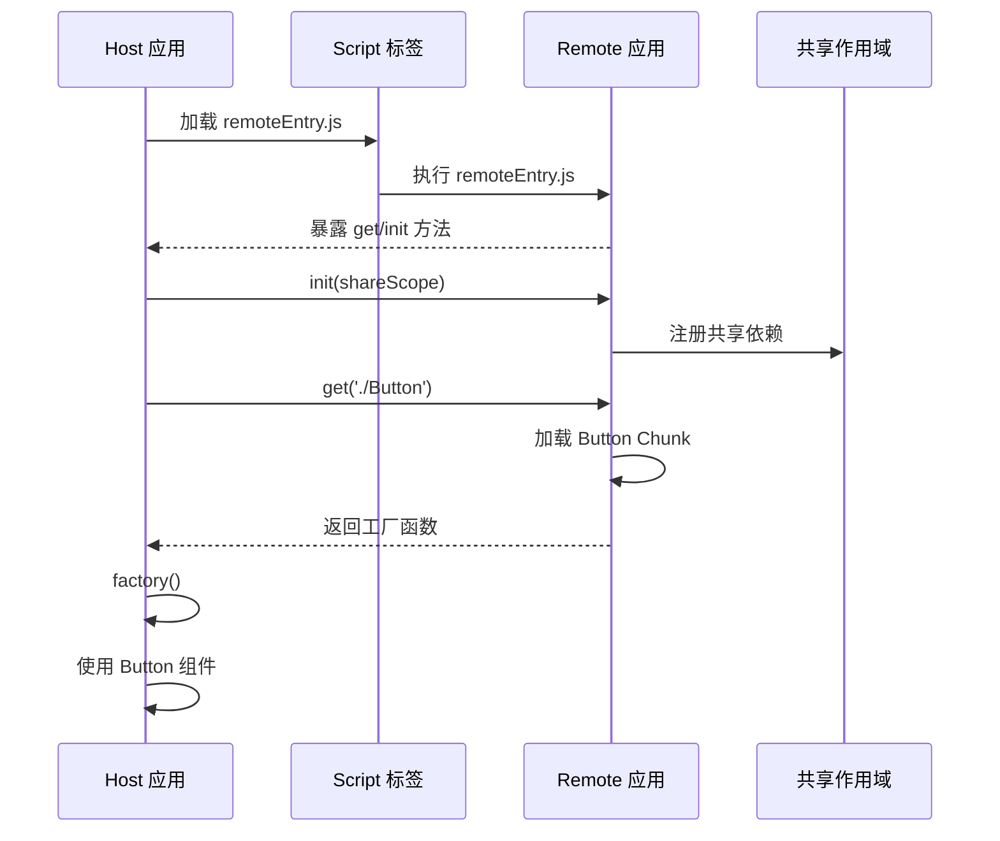
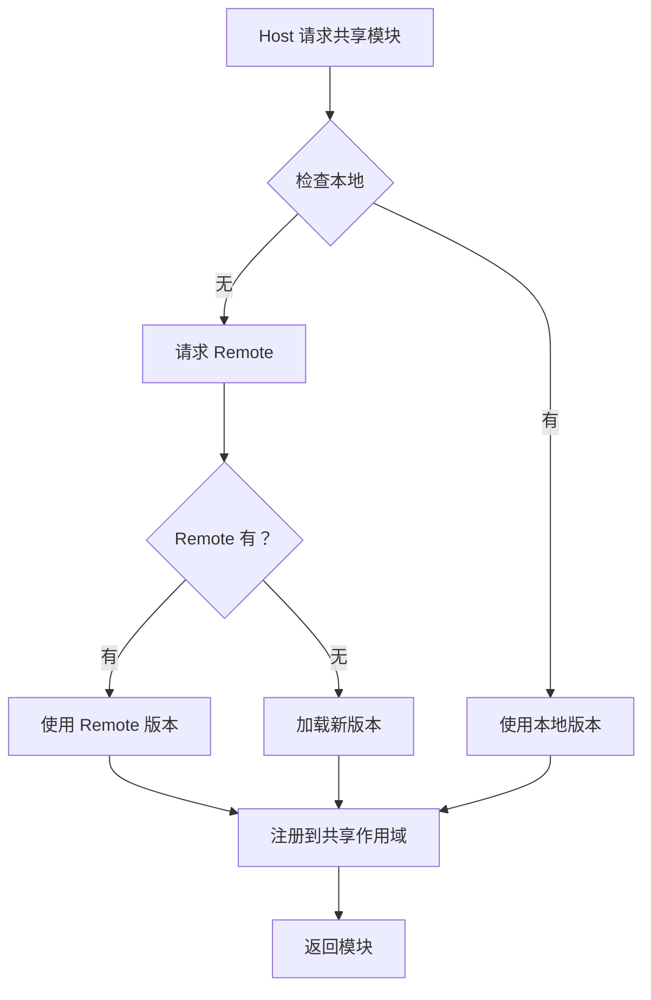

# 第 9 章 Module Federation 模块联邦

> 本章是 Webpack 5 源码系列解析的**第 9 章**，聚焦于模块联邦架构设计、远程模块加载、共享依赖管理以及微前端实践。

---

## 1. 模块职责

### 1.1 Module Federation：模块联邦

**Module Federation** 是 Webpack 5 引入的**革命性特性**，允许多个独立构建的应用**共享代码和运行时**：

**核心概念**：
- **Host（主机）**：消费远程模块的应用
- **Remote（远程）**：提供模块的应用
- **Shared（共享）**：多个应用共享的依赖（如 React）
- **Exposes（暴露）**：Remote 暴露给 Host 的模块

**为什么需要 Module Federation？**

传统微前端方案的问题：
- ❌ 子应用独立部署，无法共享依赖
- ❌ 多个 React 实例，内存浪费
- ❌ 构建产物冗余，加载慢

Module Federation 的优势：
- ✅ 运行时共享依赖
- ✅ 单一 React 实例
- ✅ 独立构建、独立部署

### 1.2 典型架构

```
┌─────────────────┐
│   Host App      │  ← 主应用（容器）
│   (webpack 5)   │
│  port: 3000     │
└────────┬────────┘
         │
         │ 动态加载
         ↓
┌─────────────────┐     ┌─────────────────┐
│  Remote App 1   │     │  Remote App 2   │
│  (webpack 5)    │     │  (webpack 5)    │
│  port: 3001     │     │  port: 3002     │
└─────────────────┘     └─────────────────┘
```

---

## 2. 核心配置

### 2.1 Host 应用配置

```javascript
// host/webpack.config.js
const { ModuleFederationPlugin } = require('webpack').container;

module.exports = {
  entry: './src/index.js',
  output: {
    filename: '[name].[contenthash].js',
    path: __dirname + '/dist',
    publicPath: 'http://localhost:3000/'
  },
  
  plugins: [
    new ModuleFederationPlugin({
      // 1. 应用名称（全局唯一）
      name: 'host',
      
      // 2. 暴露的模块（Host 通常不暴露）
      exposes: {},
      
      // 3. 远程应用
      remotes: {
        // 格式：remoteName@remoteEntryURL
        app1: 'app1@http://localhost:3001/remoteEntry.js',
        app2: 'app2@http://localhost:3002/remoteEntry.js'
      },
      
      // 4. 共享依赖
      shared: {
        react: {
          singleton: true,           // 单例（只加载一个实例）
          requiredVersion: '^17.0.0', // 版本要求
          eager: false               // 懒加载
        },
        'react-dom': {
          singleton: true,
          requiredVersion: '^17.0.0'
        }
      }
    })
  ],
  
  devServer: {
    port: 3000
  }
};
```

### 2.2 Remote 应用配置

```javascript
// remote/webpack.config.js
const { ModuleFederationPlugin } = require('webpack').container;

module.exports = {
  entry: './src/index.js',
  output: {
    filename: '[name].[contenthash].js',
    path: __dirname + '/dist',
    publicPath: 'http://localhost:3001/'  // 远程应用的 URL
  },
  
  plugins: [
    new ModuleFederationPlugin({
      // 1. 应用名称
      name: 'app1',
      
      // 2. 暴露的模块
      exposes: {
        './Button': './src/Button.js',
        './Modal': './src/Modal.js',
        './App': './src/App.js'
      },
      
      // 3. Remote 通常不需要配置 remotes
      remotes: {},
      
      // 4. 共享依赖（与 Host 一致）
      shared: {
        react: {
          singleton: true,
          requiredVersion: '^17.0.0'
        },
        'react-dom': {
          singleton: true,
          requiredVersion: '^17.0.0'
        }
      }
    })
  ],
  
  devServer: {
    port: 3001
  }
};
```

### 2.3 使用远程模块

```javascript
// host/src/index.js
import React from 'react';
import ReactDOM from 'react-dom';

// 动态导入远程模块
import App1 from 'app1/App';
import { Button } from 'app1/Button';

function HostApp() {
  return (
    <div>
      <h1>Host Application</h1>
      
      {/* 使用远程组件 */}
      <App1 />
      <Button>Click Me</Button>
    </div>
  );
}

ReactDOM.render(<HostApp />, document.getElementById('root'));
```

---

## 3. 源码解析

### 3.1 ModuleFederationPlugin.js：核心插件

**文件位置**: `lib/container/ModuleFederationPlugin.js`（约 150 行）

#### 3.1.1 插件结构

```javascript
// 文件：lib/container/ModuleFederationPlugin.js
// 作用：模块联邦核心插件

class ModuleFederationPlugin {
  constructor(options) {
    this.options = options;
  }

  apply(compiler) {
    const { options } = this;
    
    // 1. 配置验证
    compiler.hooks.validate.tap(PLUGIN_NAME, () => {
      compiler.validate(
        () => require("../../schemas/plugins/container/ModuleFederationPlugin.json"),
        this.options
      );
    });

    // 2. 处理 library 配置
    const library = options.library || { type: 'var', name: options.name };
    const remoteType = options.remoteType || 
      (options.library && isValidExternalsType(options.library.type)
        ? options.library.type
        : 'script');
    
    if (library && !compiler.options.output.enabledLibraryTypes.includes(library.type)) {
      compiler.options.output.enabledLibraryTypes.push(library.type);
    }

    // 3. 注册子插件
    compiler.hooks.afterPlugins.tap(PLUGIN_NAME, () => {
      // 3.1 如果有 exposes，注册 ContainerPlugin
      if (options.exposes && 
          (Array.isArray(options.exposes) 
            ? options.exposes.length > 0 
            : Object.keys(options.exposes).length > 0)) {
        new ContainerPlugin({
          name: options.name,
          library,
          filename: options.filename,
          runtime: options.runtime,
          shareScope: options.shareScope,
          exposes: options.exposes
        }).apply(compiler);
      }

      // 3.2 如果有 remotes，注册 ContainerReferencePlugin
      if (options.remotes && 
          (Array.isArray(options.remotes)
            ? options.remotes.length > 0
            : Object.keys(options.remotes).length > 0)) {
        new ContainerReferencePlugin({
          remoteType,
          shareScope: options.shareScope,
          remotes: options.remotes
        }).apply(compiler);
      }

      // 3.3 如果有 shared，注册 SharePlugin
      if (options.shared) {
        new SharePlugin({
          shared: options.shared,
          shareScope: options.shareScope
        }).apply(compiler);
      }

      // 3.4 注册 HoistContainerReferences
      new HoistContainerReferences().apply(compiler);
    });
  }
}
```

**插件职责分离**：
- `ContainerPlugin`：处理 exposes（作为 Remote 提供模块）
- `ContainerReferencePlugin`：处理 remotes（作为 Host 消费模块）
- `SharePlugin`：处理 shared（共享依赖）

### 3.2 ContainerPlugin.js：容器插件

```javascript
// 文件：lib/container/ContainerPlugin.js
// 作用：创建远程容器

class ContainerPlugin {
  apply(compiler) {
    compiler.hooks.thisCompilation.tap(PLUGIN_NAME, (compilation) => {
      // 1. 创建 ContainerEntryModule
      const entryModule = new ContainerEntryModule(
        this.name,
        this.exposes,
        this.shareScope
      );

      // 2. 添加入口
      compilation.addEntry(
        compiler.context,
        entryModule,
        {
          name: this.name,
          filename: this.filename
        },
        (err) => {
          if (err) throw err;
        }
      );

      // 3. 注册运行时模块
      compilation.hooks.additionalTreeRuntimeRequirements.tap(
        PLUGIN_NAME,
        (chunk, runtimeRequirements) => {
          runtimeRequirements.add(RuntimeGlobals.module);
          runtimeRequirements.add(RuntimeGlobals.exports);
          runtimeRequirements.add(RuntimeGlobals.require);
        }
      );
    });
  }
}
```

### 3.3 ContainerEntryModule.js：容器入口模块

```javascript
// 文件：lib/container/ContainerEntryModule.js
// 作用：容器的入口模块

class ContainerEntryModule extends Module {
  constructor(name, exposes, shareScope) {
    super('javascript/dynamic');
    this.name = name;
    this.exposes = exposes;
    this.shareScope = shareScope;
  }

  /**
   * 代码生成
   * @param {CodeGenerationContext} context 上下文
   * @returns {CodeGenerationResult}
   */
  codeGeneration(context) {
    const sources = new Map();
    const source = new ConcatSource();

    // 生成容器代码
    source.add(`var moduleMap = {\n`);
    
    // 遍历暴露的模块
    for (const [exposedName, exposedModule] of Object.entries(this.exposes)) {
      const request = exposedModule.request;
      source.add(`  "${exposedName}": function() {\n`);
      source.add(`    return __webpack_require__.e("${request}").then(() => {\n`);
      source.add(`      return () => __webpack_require__("${request}");\n`);
      source.add(`    });\n`);
      source.add(`  },\n`);
    }
    
    source.add(`};\n\n`);

    // 获取共享作用域
    source.add(`var get = (module, getScope) => {\n`);
    source.add(`  __webpack_require__.R = getScope;\n`);
    source.add(`  getScope = __webpack_require__.o(moduleMap, module) ? 
      moduleMap[module]() : Promise.resolve();\n`);
    source.add(`  getScope.then(get => get());\n`);
    source.add(`  return getScope;\n`);
    source.add(`};\n\n`);

    // 导出 get 方法
    source.add(`export { get };\n`);

    sources.set('javascript', source);

    return {
      sources,
      runtimeRequirements: new Set([
        RuntimeGlobals.module,
        RuntimeGlobals.exports,
        RuntimeGlobals.require
      ])
    };
  }
}
```

### 3.4 生成的 remoteEntry.js

```javascript
// Remote 应用生成的 remoteEntry.js
var app1 = (function() {
  var moduleMap = {
    "./Button": function() {
      return __webpack_require__.e("src_Button_js").then(() => {
        return () => __webpack_require__("./src/Button.js");
      });
    },
    "./Modal": function() {
      return __webpack_require__.e("src_Modal_js").then(() => {
        return () => __webpack_require__("./src/Modal.js");
      });
    }
  };

  var get = (module, getScope) => {
    __webpack_require__.R = getScope;
    getScope = __webpack_require__.o(moduleMap, module) 
      ? moduleMap[module]() 
      : Promise.resolve();
    return getScope.then(get => get());
  };

  // 初始化共享作用域
  var init = (shareScope, initScope) => {
    // 注册共享依赖
    __webpack_require__.I(shareScope, initScope);
  };

  // 导出接口
  return { get, init };
})();
```

**Host 加载 Remote 的流程**：

```javascript
// 1. 加载 remoteEntry.js
const script = document.createElement('script');
script.src = 'http://localhost:3001/remoteEntry.js';
document.head.appendChild(script);

// 2. 等待加载完成
script.onload = () => {
  // 3. 初始化共享作用域
  app1.init('default', __webpack_require__.S.default);
  
  // 4. 获取远程模块
  const Button = app1.get('./Button').then(factory => factory());
  
  // 5. 使用远程模块
  Button.then(ButtonComponent => {
    console.log(ButtonComponent);
  });
};
```

---

## 4. 共享依赖机制

### 4.1 SharePlugin.js：共享插件

```javascript
// 文件：lib/sharing/SharePlugin.js
// 作用：共享依赖管理

class SharePlugin {
  apply(compiler) {
    compiler.hooks.thisCompilation.tap(PLUGIN_NAME, (compilation) => {
      // 1. 注册共享模块
      compilation.hooks.beforeModuleInitialization.tap(
        PLUGIN_NAME,
        (modules) => {
          for (const [name, config] of Object.entries(this.shared)) {
            new ShareRuntimeModule(name, config).apply(compilation);
          }
        }
      );

      // 2. 添加共享运行时
      compilation.hooks.additionalTreeRuntimeRequirements.tap(
        PLUGIN_NAME,
        (chunk, runtimeRequirements) => {
          runtimeRequirements.add(RuntimeGlobals.shareScopeMap);
          runtimeRequirements.add(RuntimeGlobals.initializeSharing);
        }
      );
    });
  }
}
```

### 4.2 共享作用域运行时

```javascript
// 生成的共享作用域代码
__webpack_require__.S = {};  // 共享作用域映射

// 初始化共享作用域
__webpack_require__.I = function(shareScope, initScope) {
  if (!__webpack_require__.S[shareScope]) {
    __webpack_require__.S[shareScope] = {};
  }

  var scope = __webpack_require__.S[shareScope];
  
  // 注册共享模块
  var register = function(name, version, factory, eager) {
    var versions = scope[name] = scope[name] || {};
    var activeVersion = versions[version];
    
    // 检查是否已有更优版本
    if (!activeVersion || 
        (!eager && activeVersion.eager) ||
        versionSatisfies(version, activeVersion.version)) {
      versions[version] = {
        get: factory,
        from: 'default',
        eager: !!eager
      };
    }
  };

  // 注册 React
  register('react', '17.0.2', function() {
    return __webpack_require__('node_modules/react/index.js');
  });

  // 注册 ReactDOM
  register('react-dom', '17.0.2', function() {
    return __webpack_require__('node_modules/react-dom/index.js');
  });
};
```

### 4.3 版本解析逻辑

```javascript
// 版本匹配逻辑
function versionSatisfies(version, range) {
  // 简化版 semver 匹配
  if (range.startsWith('^')) {
    const baseVersion = range.slice(1);
    return version.startsWith(baseVersion.split('.')[0]);
  }
  if (range.startsWith('~')) {
    const baseVersion = range.slice(1);
    const parts = baseVersion.split('.');
    return version.startsWith(parts[0] + '.' + parts[1]);
  }
  return version === range;
}
```

---

## 5. 关键流程

### 5.1 Remote 模块加载流程



### 5.2 共享依赖解析流程



---

## 6. 微前端实践

### 6.1 项目结构

```
micro-frontends/
├── host/                    # 主应用
│   ├── src/
│   │   ├── index.js
│   │   └── App.js
│   ├── webpack.config.js
│   └── package.json
├── app1/                    # 子应用 1
│   ├── src/
│   │   ├── index.js
│   │   ├── Button.js
│   │   └── Modal.js
│   ├── webpack.config.js
│   └── package.json
├── app2/                    # 子应用 2
│   ├── src/
│   │   ├── index.js
│   │   └── Dashboard.js
│   ├── webpack.config.js
│   └── package.json
└── shared/                  # 共享配置
    ├── webpack.shared.js
    └── package.json
```

### 6.2 动态 Remote 配置

```javascript
// host/webpack.config.js
const remotes = process.env.REMOTES || '{}';

module.exports = {
  plugins: [
    new ModuleFederationPlugin({
      name: 'host',
      remotes: {
        // 运行时动态配置
        app1: `promise new Promise(resolve => {
          const script = document.createElement('script');
          script.src = 'http://localhost:3001/remoteEntry.js';
          script.onload = () => resolve('app1');
          document.head.appendChild(script);
        })`,
        // 或使用简化语法
        app2: 'app2@http://localhost:3002/remoteEntry.js'
      }
    })
  ]
};
```

### 6.3 类型共享

```typescript
// shared/types.ts
export interface User {
  id: number;
  name: string;
}

// app1/src/UserList.tsx
import { User } from 'shared/types';

export const UserList = ({ users }: { users: User[] }) => {
  return (
    <ul>
      {users.map(user => (
        <li key={user.id}>{user.name}</li>
      ))}
    </ul>
  );
};

// host/src/App.tsx
import { UserList } from 'app1/UserList';
```

---

## 7. 学习要点

### 7.1 值得借鉴的设计

1. **运行时共享**：突破构建时限制
2. **版本协商**：自动选择兼容版本
3. **懒加载**：按需加载远程模块
4. **独立部署**：各应用可独立发布

### 7.2 关键代码位置

| 功能 | 文件 | 行号 |
|------|------|------|
| 模块联邦插件 | lib/container/ModuleFederationPlugin.js | 全文 |
| 容器插件 | lib/container/ContainerPlugin.js | 全文 |
| 容器入口模块 | lib/container/ContainerEntryModule.js | 全文 |
| 共享插件 | lib/sharing/SharePlugin.js | 全文 |
| 共享运行时 | lib/sharing/ShareRuntimeModule.js | 全文 |

### 7.3 最佳实践清单

```
✅ 使用 singleton: true 确保单例
✅ 配置 requiredVersion 版本范围
✅ Remote 和 Host 共享配置一致
✅ 使用动态 import 懒加载
✅ 配置 publicPath 为完整 URL
✅ 处理 Remote 加载失败
✅ 使用 TypeScript 共享类型
```

---

## 8. 本章小结

### 8.1 核心要点

1. **Module Federation 是运行时共享**：突破构建时限制
2. **Remote Entry 是入口**：暴露 get/init 方法
3. **共享作用域是核心**：`__webpack_require__.S` 和 `__webpack_require__.I`
4. **版本协商自动进行**：semver 范围匹配

### 8.2 配置速查

```javascript
// Host 配置
new ModuleFederationPlugin({
  name: 'host',
  remotes: {
    app1: 'app1@http://localhost:3001/remoteEntry.js'
  },
  shared: {
    react: { singleton: true, requiredVersion: '^17.0.0' }
  }
});

// Remote 配置
new ModuleFederationPlugin({
  name: 'app1',
  exposes: {
    './Button': './src/Button.js'
  },
  shared: {
    react: { singleton: true, requiredVersion: '^17.0.0' }
  }
});
```

---

## 9. 最终章预告

**第 10 章：总结与最佳实践**

- 架构设计亮点总结
- 性能优化技巧汇总
- 调试技巧集合
- 学习路线建议

---

> **本章源码引用**:
> - `lib/container/ModuleFederationPlugin.js` - 模块联邦插件
> - `lib/container/ContainerPlugin.js` - 容器插件
> - `lib/container/ContainerEntryModule.js` - 容器入口模块
> - `lib/sharing/SharePlugin.js` - 共享插件
> - `lib/sharing/ShareRuntimeModule.js` - 共享运行时
