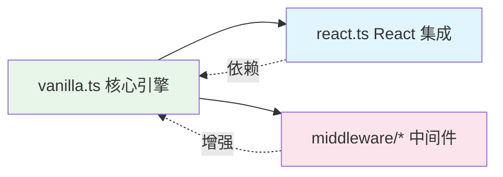
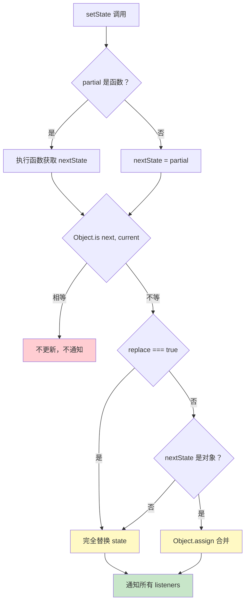
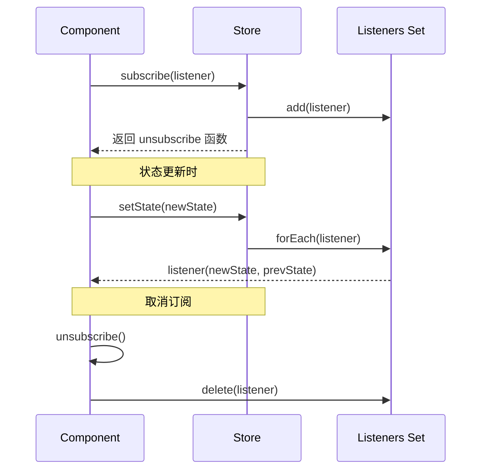

# 第 2 章 核心 Store 创建机制

> 本章是 Zustand 源码解析系列的第 2 章，聚焦于核心 Store 的创建机制。我们将深入分析 `createStore` 函数的实现细节、状态订阅系统以及 `setState` 的合并逻辑。

---

## 1. 模块职责

### 1.1 这个模块做什么？

`vanilla.ts` 是 Zustand 的**核心引擎**，负责：
- 创建 Store 实例
- 管理状态存储
- 实现订阅 - 发布模式
- 提供状态更新与读取 API

### 1.2 为什么需要这个模块？

**设计目标**：
1. **框架无关**：不依赖 React，可在任何 JS 环境中使用
2. **极简 API**：仅 4 个核心方法（`setState`、`getState`、`getInitialState`、`subscribe`）
3. **高性能**：基于 `Set` 的订阅者管理，O(1) 添加/删除

### 1.3 与其他模块的关系



---

## 2. 核心文件解析

### 2.1 `src/vanilla.ts` 完整结构

```typescript
// 文件：src/vanilla.ts
// 作用：Zustand 核心 Store 实现

// ============ 类型定义区 ============
type SetStateInternal<T> = { ... }  // setState 的类型定义
export interface StoreApi<T> { ... } // Store 公共 API
export type ExtractState<S> = ...    // 从 Store 提取状态类型
export type Mutate<S, Ms> = ...      // 中间件类型变换
export type StateCreator<T, ...> = ... // 状态创建函数类型

// ============ 核心实现区 ============
const createStoreImpl = (createState) => { ... }  // Store 创建实现
export const createStore = ...                     // 导出函数
```

---

## 3. 核心实现深度分析

### 3.1 `createStoreImpl` 函数详解

**源码**（`src/vanilla.ts L55-85`）：

```typescript
const createStoreImpl: CreateStoreImpl = (createState) => {
  type TState = ReturnType<typeof createState>
  type Listener = (state: TState, prevState: TState) => void
  
  // ① 状态存储（闭包变量）
  let state: TState
  
  // ② 订阅者集合（使用 Set 保证唯一性）
  const listeners: Set<Listener> = new Set()

  // ③ setState 实现
  const setState: StoreApi<TState>['setState'] = (partial, replace) => {
    const nextState =
      typeof partial === 'function'
        ? (partial as (state: TState) => TState)(state)
        : partial
    
    // ④ 浅比较优化：状态未变化则不通知
    if (!Object.is(nextState, state)) {
      const previousState = state
      
      // ⑤ 状态合并逻辑
      state =
        (replace ?? (typeof nextState !== 'object' || nextState === null))
          ? (nextState as TState)
          : Object.assign({}, state, nextState)
      
      // ⑥ 通知所有订阅者
      listeners.forEach((listener) => listener(state, previousState))
    }
  }

  // ⑦ getState 实现
  const getState: StoreApi<TState>['getState'] = () => state

  // ⑧ getInitialState 实现
  const getInitialState: StoreApi<TState>['getInitialState'] = () =>
    initialState

  // ⑨ subscribe 实现
  const subscribe: StoreApi<TState>['subscribe'] = (listener) => {
    listeners.add(listener)
    // 返回取消订阅函数
    return () => listeners.delete(listener)
  }

  const api = { setState, getState, getInitialState, subscribe }
  
  // ⑩ 执行初始化函数，获取初始状态
  const initialState = (state = createState(setState, getState, api))
  
  return api as any
}
```

### 3.2 关键代码解读
| 步骤 | 代码 | 作用 | 设计亮点 |
|------|------|------|----------|
| ① | `let state: TState` | 闭包存储状态 | 无需 Context，避免 Provider 包裹 |
| ② | `listeners: Set<Listener>` | 订阅者集合 | `Set` 保证订阅者唯一性，O(1) 增删 |
| ③ | `setState` 函数 | 状态更新入口 | 支持函数式更新和部分更新 |
| ④ | `Object.is(nextState, state)` | 浅比较优化 | 状态未变化时不触发重渲染 |
| ⑤ | `Object.assign({}, state, nextState)` | 状态合并 | 默认合并，支持 `replace` 覆盖 |
| ⑥ | `listeners.forEach(...)` | 发布通知 | 同步通知所有订阅者 |
| ⑦ | `getState` | 读取当前状态 | 简单返回闭包变量 |
| ⑧ | `getInitialState` | 读取初始状态 | 用于 SSR hydration |
| ⑨ | `subscribe` | 订阅状态变化 | 返回取消订阅函数 |
| ⑩ | `createState(setState, getState, api)` | 执行初始化 | 传入 API 供初始化函数使用 |

---

## 4. setState 合并逻辑详解

### 4.1 合并策略判断树



### 4.2 合并逻辑源码分析

**关键判断**（`src/vanilla.ts L68-73`）：

```typescript
state =
  (replace ?? (typeof nextState !== 'object' || nextState === null))
    ? (nextState as TState)
    : Object.assign({}, state, nextState)
```

**逻辑拆解**：
| 条件 | `replace` 值 | `nextState` 类型 | 结果 |
|------|-------------|------------------|------|
| 显式替换 | `true` | 任意 | 完全替换 |
| 默认 + 非对象 | `undefined` | `string/number/boolean` | 完全替换 |
| 默认 + null | `undefined` | `null` | 完全替换 |
| 默认 + 对象 | `undefined` | `object` | 合并 |

**示例**：

```typescript
// 初始状态
const store = create(() => ({ 
  count: 0, 
  name: 'bear',
  nested: { value: 1 }
}))

// 示例 1：对象合并（默认）
store.setState({ count: 1 })
// 结果：{ count: 1, name: 'bear', nested: { value: 1 } }

// 示例 2：完全替换
store.setState({ count: 2 }, true)
// 结果：{ count: 2 }（其他字段丢失！）

// 示例 3：函数式更新
store.setState((state) => ({ count: state.count + 1 }))
// 结果：{ count: 3, name: 'bear', nested: { value: 1 } }

// 示例 4：非对象替换
store.setState('string')
// 结果：'string'（完全替换）
```

### 4.3 ⚠️ 注意事项

**嵌套对象合并陷阱**：

```typescript
const store = create(() => ({
  user: { name: 'John', age: 30 }
}))

// ❌ 错误：浅合并会丢失 user.age
store.setState({ user: { name: 'Jane' } })
// 结果：{ user: { name: 'Jane' } }（age 丢失！）

// ✅ 正确：手动展开
store.setState((state) => ({
  user: { ...state.user, name: 'Jane' }
}))
// 结果：{ user: { name: 'Jane', age: 30 } }

// ✅ 或使用 Immer 中间件（第 4 章详解）
```

---

## 5. 订阅系统设计

### 5.1 订阅 - 发布模式实现



### 5.2 订阅系统源码

**核心代码**（`src/vanilla.ts L76-80`）：

```typescript
const subscribe: StoreApi<TState>['subscribe'] = (listener) => {
  listeners.add(listener)
  // Unsubscribe
  return () => listeners.delete(listener)
}
```

**设计亮点**：
1. **返回取消函数**：符合 React `useEffect` 清理模式
2. **Set 数据结构**：自动去重，O(1) 增删
3. **闭包引用**：listener 保持对组件的引用

### 5.3 订阅者类型

```typescript
type Listener = (state: TState, prevState: TState) => void
```

**参数说明**：
- `state`：更新后的新状态
- `prevState`：更新前的旧状态

**使用示例**：

```typescript
const store = create(() => ({ count: 0 }))

// 订阅状态变化
const unsubscribe = store.subscribe((state, prevState) => {
  console.log('Previous:', prevState)
  console.log('Current:', state)
})

// 触发更新
store.setState({ count: 1 })
// 输出：
// Previous: { count: 0 }
// Current: { count: 1 }

// 取消订阅
unsubscribe()
```

---

## 6. 类型系统分析

### 6.1 `StoreApi` 接口定义

**源码**（`src/vanilla.ts L8-13`）：

```typescript
export interface StoreApi<T> {
  setState: SetStateInternal<T>
  getState: () => T
  getInitialState: () => T
  subscribe: (listener: (state: T, prevState: T) => void) => () => void
}
```

### 6.2 `SetStateInternal` 类型技巧

**源码**（`src/vanilla.ts L1-7`）：

```typescript
type SetStateInternal<T> = {
  _(
    partial: T | Partial<T> | { _(state: T): T | Partial<T> }['_'],
    replace?: false,
  ): void
  _(state: T | { _(state: T): T }['_'], replace: true): void
}['_']
```

**类型技巧解析**：
- 使用辅助对象 `_` 定义**重载签名**
- 最后通过 `['_']` 提取联合类型
- 实现函数式更新和部分更新的类型推导

**简化理解**：

```typescript
// 等价于以下重载
interface SetStateInternal<T> {
  (partial: T | Partial<T> | ((state: T) => T | Partial<T>), replace?: false): void
  (state: T | ((state: T) => T), replace: true): void
}
```

### 6.3 `StateCreator` 类型

**源码**（`src/vanilla.ts L24-32`）：

```typescript
export type StateCreator<
  T,
  Mis extends [StoreMutatorIdentifier, unknown][] = [],
  Mos extends [StoreMutatorIdentifier, unknown][] = [],
  U = T,
> = ((
  setState: Get<Mutate<StoreApi<T>, Mis>, 'setState', never>,
  getState: Get<Mutate<StoreApi<T>, Mis>, 'getState', never>,
  store: Mutate<StoreApi<T>, Mis>,
) => U) & { $$storeMutators?: Mos }
```

**类型参数**：
- `T`：状态类型
- `Mis`：输入侧中间件（修改传入的 API）
- `Mos`：输出侧中间件（修改返回的 Store）
- `U`：实际返回的状态类型

---

## 7. 设计模式

### 7.1 闭包模式

Zustand 使用**闭包**存储状态，而非 Context：

```typescript
const createStoreImpl = (createState) => {
  let state: TState  // 闭包变量
  
  return {
    getState: () => state,  // 闭包访问
    setState: (next) => { state = next }
  }
}
```

**优势**：
- ✅ 无需 Provider 包裹
- ✅ 避免 Context 性能问题
- ✅ 模块级单例

### 7.2 订阅 - 发布模式

```typescript
// 发布
listeners.forEach((listener) => listener(state, previousState))

// 订阅
const unsubscribe = subscribe(listener)

// 取消订阅
unsubscribe()
```

### 7.3 函数组合（中间件基础）

```typescript
// 中间件本质是高阶函数
const enhancedCreate = devtools(persist(createState))

// 执行顺序：devtools → persist → createState
```

---

## 8. 学习要点

### 8.1 值得借鉴的设计
| 设计点 | 实现方式 | 可复用场景 |
|--------|----------|------------|
| **闭包存储** | 模块级变量 + 闭包访问 | 任何需要单例状态的场景 |
| **Set 订阅者管理** | `Set<Listener>` | 事件系统、观察者模式 |
| **浅比较优化** | `Object.is` | 避免不必要的更新 |
| **函数式更新** | `setState((state) => ...)` | 依赖前值的更新场景 |
| **取消订阅模式** | 返回 cleanup 函数 | 资源清理、事件移除 |

### 8.2 可能的改进空间
| 问题 | 现状 | 改进建议 |
|------|------|----------|
| **浅合并陷阱** | 嵌套对象会丢失字段 | 文档强调 + 推荐 Immer |
| **同步通知** | `forEach` 同步执行 | 可选异步通知模式 |
| **无批处理** | 多次 `setState` 触发多次通知 | 支持批处理 API |

---

## 9. 本章小结

### 9.1 核心要点

1. **`createStore` 是 Zustand 的核心引擎**，提供 4 个 API：`setState`、`getState`、`getInitialState`、`subscribe`
2. **闭包存储状态**，无需 Context Provider
3. **订阅 - 发布模式**基于 `Set` 实现，O(1) 增删订阅者
4. **`setState` 默认合并对象**，支持 `replace` 完全替换
5. **浅比较优化**：`Object.is` 判断状态是否变化

### 9.2 关键源码位置
| 功能 | 文件 | 行号 |
|------|------|------|
| `createStoreImpl` | `src/vanilla.ts` | L55-85 |
| `setState` | `src/vanilla.ts` | L60-74 |
| `subscribe` | `src/vanilla.ts` | L76-80 |
| `StoreApi` 类型 | `src/vanilla.ts` | L8-13 |
| `StateCreator` 类型 | `src/vanilla.ts` | L24-32 |

### 9.3 下章预告

在 **第 3 章：React 集成层** 中，我们将深入分析：
- `useStore` Hook 如何实现
- `useSyncExternalStore` 的作用
- 为什么 Zustand 能避免"僵尸子组件"问题
- `useShallow` 的性能优化原理

---

**本章是系列解析的第 2 章**，深入剖析了 Zustand 的核心 Store 创建机制。下一章我们将进入 React 集成层的分析。
