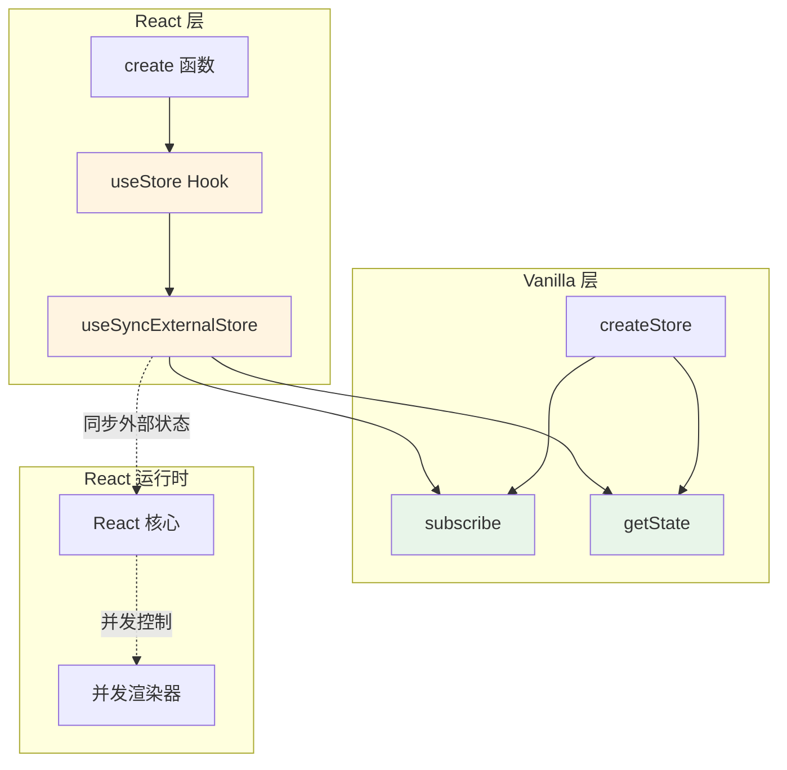
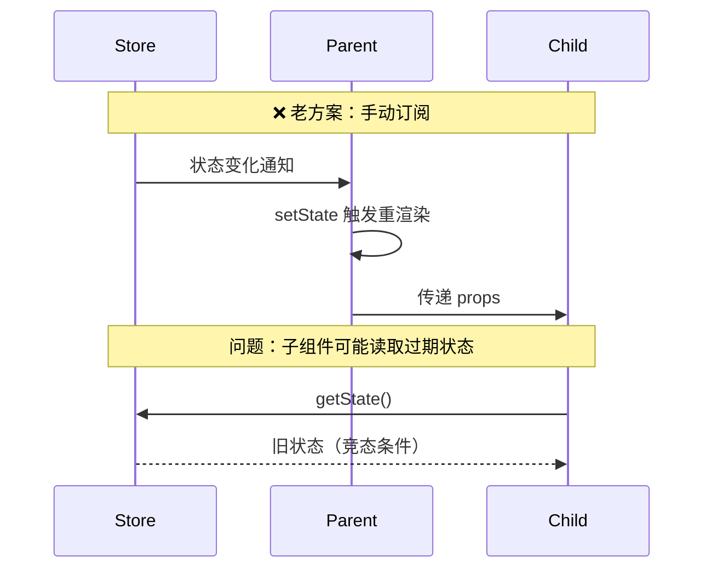
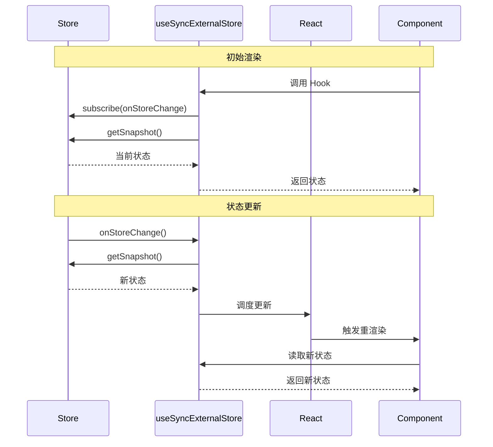
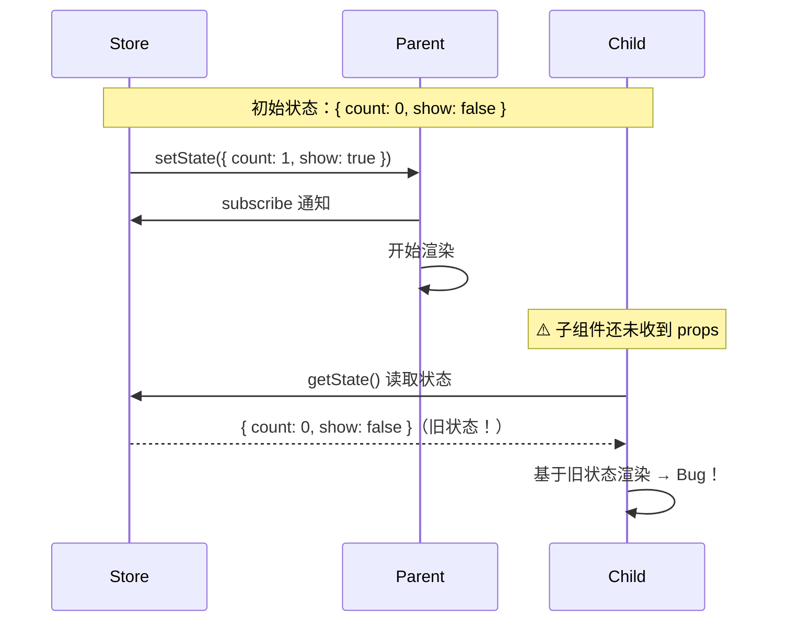

# 第 3 章 React 集成层

> 本章是 Zustand 源码解析系列的第 3 章，聚焦于 React 集成层的实现。我们将深入分析 `useStore` Hook、`useSyncExternalStore` 的作用原理，以及 Zustand 如何解决"僵尸子组件"和并发渲染问题。

---

## 1. 模块职责

### 1.1 这个模块做什么？

`react.ts` 负责将 Vanilla Store 封装为 **React Hook**，核心功能：
- 提供 `useStore` Hook 供组件消费状态
- 利用 `useSyncExternalStore` 实现外部状态同步
- 处理 React 并发渲染下的状态一致性问题

### 1.2 为什么需要这个模块？

**React 特殊挑战**：
1. **并发渲染**：React 18 支持并发模式，组件可能同时渲染多次
2. **僵尸子组件**：父组件先于子组件订阅，导致子组件读取到过期状态
3. **Context 性能问题**：Context 值变化时所有消费者都重渲染

Zustand 的解决方案：**`useSyncExternalStore` + 精准订阅**

### 1.3 与其他模块的关系



---

## 2. 核心文件解析

### 2.1 `src/react.ts` 完整结构

```typescript
// 文件：src/react.ts
// 作用：React 集成层实现

import React from 'react'
import { createStore } from './vanilla.ts'

// ============ 类型定义 ============
type ReadonlyStoreApi<T> = Pick<StoreApi<T>, 'getState' | 'getInitialState' | 'subscribe'>

// ============ useStore Hook ============
const identity = <T>(arg: T): T => arg

export function useStore<S extends ReadonlyStoreApi<unknown>, U>(
  api: S,
  selector: (state: ExtractState<S>) => U = identity as any,
) {
  const slice = React.useSyncExternalStore(
    api.subscribe,
    React.useCallback(() => selector(api.getState()), [api, selector]),
    React.useCallback(() => selector(api.getInitialState()), [api, selector]),
  )
  React.useDebugValue(slice)
  return slice
}

// ============ create 函数 ============
type UseBoundStore<S extends ReadonlyStoreApi<unknown>> = {
  (): ExtractState<S>
  <U>(selector: (state: ExtractState<S>) => U): U
} & S

const createImpl = <T>(createState: StateCreator<T, [], []>) => {
  const api = createStore(createState)
  
  const useBoundStore: any = (selector?: any) => useStore(api, selector)
  
  Object.assign(useBoundStore, api)
  
  return useBoundStore
}

export const create = (<T>(createState: StateCreator<T, [], []> | undefined) =>
  createState ? createImpl(createState) : createImpl) as Create
```

---

## 3. useStore Hook 深度分析

### 3.1 完整实现

**源码**（`src/react.ts L16-27`）：

```typescript
const identity = <T>(arg: T): T => arg

export function useStore<S extends ReadonlyStoreApi<unknown>, U>(
  api: S,
  selector: (state: ExtractState<S>) => U = identity as any,
) {
  const slice = React.useSyncExternalStore(
    api.subscribe,              // ① 订阅函数
    React.useCallback(          // ② 获取当前值
      () => selector(api.getState()),
      [api, selector]
    ),
    React.useCallback(          // ③ 获取初始值（SSR）
      () => selector(api.getInitialState()),
      [api, selector]
    ),
  )
  React.useDebugValue(slice)    // ④ React DevTools 调试支持
  return slice
}
```

### 3.2 关键代码解读
| 步骤 | 代码 | 作用 | 设计亮点 |
|------|------|------|----------|
| ① | `api.subscribe` | 订阅外部状态变化 | 直接复用 Vanilla 层的 subscribe |
| ② | `selector(api.getState())` | 获取当前状态切片 | 支持选择器，精准订阅 |
| ③ | `selector(api.getInitialState())` | SSR 初始值 | 支持服务端渲染 hydration |
| ④ | `useDebugValue(slice)` | DevTools 调试 | 在 React DevTools 中显示状态值 |

### 3.3 `identity` 函数的作用

```typescript
const identity = <T>(arg: T): T => arg
```

**作用**：当用户不传选择器时，返回整个状态对象。

**使用场景**：
```typescript
// 不传选择器：返回整个 state
const state = useStore(api)
// 等价于
const state = useStore(api, identity)

// 传选择器：返回部分 state
const count = useStore(api, (state) => state.count)
```

---

## 4. useSyncExternalStore 详解

### 4.1 什么是 useSyncExternalStore？

`useSyncExternalStore` 是 React 18 引入的新 Hook，用于**同步外部状态**到 React 渲染系统。

**API 签名**：
```typescript
function useSyncExternalStore<Snapshot>(
  subscribe: (onStoreChange: () => void) => () => void,
  getSnapshot: () => Snapshot,
  getServerSnapshot?: () => Snapshot
): Snapshot
```

**参数说明**：
- `subscribe`：订阅函数，接收回调并返回取消订阅函数
- `getSnapshot`：获取当前快照（状态）
- `getServerSnapshot`：服务端渲染时的快照（可选）

### 4.2 为什么需要 useSyncExternalStore？

**历史问题**：在 React 18 之前，外部状态同步存在以下问题：



**React 18 并发渲染挑战**：
1. **撕裂（Tearing）**：组件树不同部分读取到不一致的状态
2. **僵尸子组件**：子组件在父组件更新前渲染，读取到过期状态

### 4.3 useSyncExternalStore 工作原理



### 4.4 Zustand 中的使用

```typescript
const slice = React.useSyncExternalStore(
  // ① 订阅：状态变化时通知 React
  api.subscribe,
  
  // ② 获取当前值：每次读取最新状态
  React.useCallback(() => selector(api.getState()), [api, selector]),
  
  // ③ SSR 初始值：服务端渲染时使用
  React.useCallback(() => selector(api.getInitialState()), [api, selector])
)
```

**关键点**：
1. **订阅与获取分离**：`subscribe` 只负责通知，`getSnapshot` 负责读取
2. **读取最新值**：每次通知后重新调用 `getSnapshot` 获取最新状态
3. **避免撕裂**：React 保证整个组件树读取同一时刻的快照

---

## 5. create 函数实现

### 5.1 完整实现

**源码**（`src/react.ts L38-48`）：

```typescript
type UseBoundStore<S extends ReadonlyStoreApi<unknown>> = {
  (): ExtractState<S>
  <U>(selector: (state: ExtractState<S>) => U): U
} & S

const createImpl = <T>(createState: StateCreator<T, [], []>) => {
  const api = createStore(createState)

  const useBoundStore: any = (selector?: any) => useStore(api, selector)

  Object.assign(useBoundStore, api)

  return useBoundStore
}

export const create = (<T>(createState: StateCreator<T, [], []> | undefined) =>
  createState ? createImpl(createState) : createImpl) as Create
```

### 5.2 关键设计：Hook 与 API 合一

**设计亮点**：`useBoundStore` 既是 Hook，又包含 Store API。

```typescript
// 创建 Store
const useBearStore = create((set) => ({
  bears: 0,
  increase: () => set((state) => ({ bears: state.bears + 1 }))
}))

// 作为 Hook 使用
const bears = useBearStore((state) => state.bears)

// 作为 API 使用（直接访问）
const api = useBearStore
api.setState({ bears: 10 })
api.getState()
api.subscribe(listener)
```

**实现原理**：
```typescript
Object.assign(useBoundStore, api)
// useBoundStore 现在是函数 + 对象的组合体
```

### 5.3 类型定义解析

```typescript
type UseBoundStore<S extends ReadonlyStoreApi<unknown>> = {
  (): ExtractState<S>                              // ① 无选择器：返回整个状态
  <U>(selector: (state: ExtractState<S>) => U): U // ② 有选择器：返回切片
} & S                                              // ③ 合并 Store API
```

**类型合并**：
- `() => ExtractState<S>`：无参调用返回整个状态
- `<U>(selector) => U`：传入选择器返回切片类型
- `& S`：同时具有 Store 的所有 API 方法

---

## 6. 性能优化机制

### 6.1 精准订阅原理

```mermaid
graph TB
    subgraph "组件 A"
        A[useBearStore s => s.bears]
    end
    subgraph "组件 B"
        B[useBearStore s => s.honey]
    end
    subgraph "Store"
        S[Store State]
        L[Listeners Set]
    end
    A -->|订阅 | L
    B -->|订阅 | L
    L -->|通知 | A
    L -->|通知 | B
    S -.->|getState | A
    S -.->|getState | B
    Note over A,B: 当 bears 变化时
    Note over A,B: A 的选择器返回值变化 → A 重渲染
    Note over A,B: B 的选择器返回值不变 → B 不重渲染
    style A fill:#e1f5ff
    style B fill:#e8f5e9
```

### 6.2 选择器比较机制

**React 默认行为**：
```typescript
// useSyncExternalStore 内部逻辑
const prevSnapshot = useRef(null)
const nextSnapshot = getSnapshot()

// 浅比较（Object.is）
if (!Object.is(prevSnapshot.current, nextSnapshot)) {
  // 触发重渲染
}
```

**示例**：
```typescript
// ✅ 原子选择器：高效
const bears = useBearStore((state) => state.bears)
// Object.is(0, 1) → false → 重渲染

// ⚠️ 对象选择器：每次都变
const { bears, honey } = useBearStore((state) => ({
  bears: state.bears,
  honey: state.honey
}))
// Object.is({bears:0}, {bears:0}) → false → 总是重渲染！

// ✅ 使用 useShallow：浅比较优化
import { useShallow } from 'zustand/react/shallow'
const { bears, honey } = useBearStore(
  useShallow((state) => ({ bears: state.bears, honey: state.honey }))
)
// shallowEqual({bears:0}, {bears:0}) → true → 不重渲染
```

### 6.3 useShallow 实现分析

**源码位置**：`src/react/shallow.ts`

```typescript
// 文件：src/react/shallow.ts
import { useRef } from 'react'
import { shallow } from '../shallow'

export function useShallow<T, U>(selector: (state: T) => U) {
  const prev = useRef<U>(undefined)
  
  return (state: T) => {
    const next = selector(state)
    
    if (shallow(prev.current, next)) {
      return prev.current  // 返回缓存值，保持引用相等
    }
    
    prev.current = next
    return next
  }
}
```

**工作原理**：
1. 使用 `useRef` 缓存上一次的选择结果
2. 用 `shallow` 比较新旧值
3. 如果相等，返回缓存值（保持引用相等）
4. 如果不等，更新缓存并返回新值

---

## 7. 解决"僵尸子组件"问题

### 7.1 什么是僵尸子组件？

**问题场景**：


### 7.2 Zustand 的解决方案

**方案 1：useSyncExternalStore 保证一致性**

```typescript
// useSyncExternalStore 内部保证：
// 1. 订阅通知后，立即调用 getSnapshot
// 2. 整个组件树使用同一时刻的快照
// 3. 不会出现父子组件状态不一致

const slice = useSyncExternalStore(
  api.subscribe,
  () => selector(api.getState())  // 总是读取最新值
)
```

**方案 2：选择器传递而非直接读取**

```typescript
// ❌ 错误：子组件直接 getState
function Child() {
  const state = store.getState()  // 可能读取旧值
  return <div>{state.count}</div>
}

// ✅ 正确：通过 Hook 订阅
function Child() {
  const count = useBearStore((state) => state.count)
  return <div>{count}</div>
}
```

---

## 8. traditional.ts：传统模式

### 8.1 为什么需要 traditional？

对于 React 18 以下版本，Zustand 提供 `traditional.ts` 作为兼容方案。

**源码位置**：`src/traditional.ts`

```typescript
// 文件：src/traditional.ts
// 使用 useEffect + useState 模拟外部状态同步

export function useStore<S extends ReadonlyStoreApi<unknown>, U>(
  api: S,
  selector: (state: ExtractState<S>) => U = identity as any,
) {
  const [slice, setSlice] = useState(() => selector(api.getState()))
  
  useEffect(() => {
    const listener = () => {
      setSlice(selector(api.getState()))
    }
    
    const unsubscribe = api.subscribe(listener)
    return unsubscribe
  }, [api, selector])
  
  return slice
}
```

### 8.2 与传统模式对比
| 特性 | useSyncExternalStore | traditional (useEffect) |
|------|---------------------|------------------------|
| React 版本 | 18+ | 16.8+ |
| 并发安全 | ✅ | ❌ |
| 僵尸子组件 | ✅ 已解决 | ⚠️ 可能存在 |
| 代码复杂度 | 低 | 中 |
| 推荐度 | ⭐⭐⭐⭐⭐ | ⭐⭐⭐ |

---

## 9. 学习要点

### 9.1 值得借鉴的设计
| 设计点 | 实现方式 | 可复用场景 |
|--------|----------|------------|
| **Hook + API 合一** | `Object.assign(hook, api)` | 任何需要双模式访问的场景 |
| **useSyncExternalStore** | 订阅 + 快照模式 | 外部状态同步（WebSocket、localStorage 等） |
| **选择器缓存** | `useRef` + 浅比较 | 避免对象选择器导致的重渲染 |
| **SSR 支持** | `getInitialState` | 服务端渲染 hydration |

### 9.2 使用建议
| 场景 | 推荐做法 | 原因 |
|------|----------|------|
| 原子状态 | `useStore(s => s.count)` | 精准订阅，性能最优 |
| 多状态 | `useStore(useShallow(s => ({ a, b })))` | 避免引用变化 |
| 组件外更新 | `store.setState()` | 无需 Hook，直接调用 API |
| SSR | 配置 `getInitialState` | 支持 hydration |

---

## 10. 本章小结

### 10.1 核心要点

1. **`useStore` 基于 `useSyncExternalStore`**：保证并发渲染下的状态一致性
2. **Hook 与 API 合一**：`useBoundStore` 既是 Hook 也是 Store 实例
3. **选择器优化**：原子选择器 + `useShallow` 避免不必要的重渲染
4. **僵尸子组件解决方案**：`useSyncExternalStore` 保证快照一致性
5. **SSR 支持**：通过 `getInitialState` 实现 hydration

### 10.2 关键源码位置
| 功能 | 文件 | 行号 |
|------|------|------|
| `useStore` Hook | `src/react.ts` | L16-27 |
| `createImpl` | `src/react.ts` | L40-46 |
| `useShallow` | `src/react/shallow.ts` | 完整文件 |
| `traditional` 模式 | `src/traditional.ts` | 完整文件 |

### 10.3 下章预告

在 **第 4 章：中间件系统** 中，我们将深入分析：
- 中间件的实现原理（函数组合）
- `persist` 持久化中间件
- `devtools` Redux DevTools 集成
- `immer` 不可变更新中间件

---

**本章是系列解析的第 3 章**，深入剖析了 Zustand 的 React 集成层实现。下一章我们将进入中间件系统的分析。
