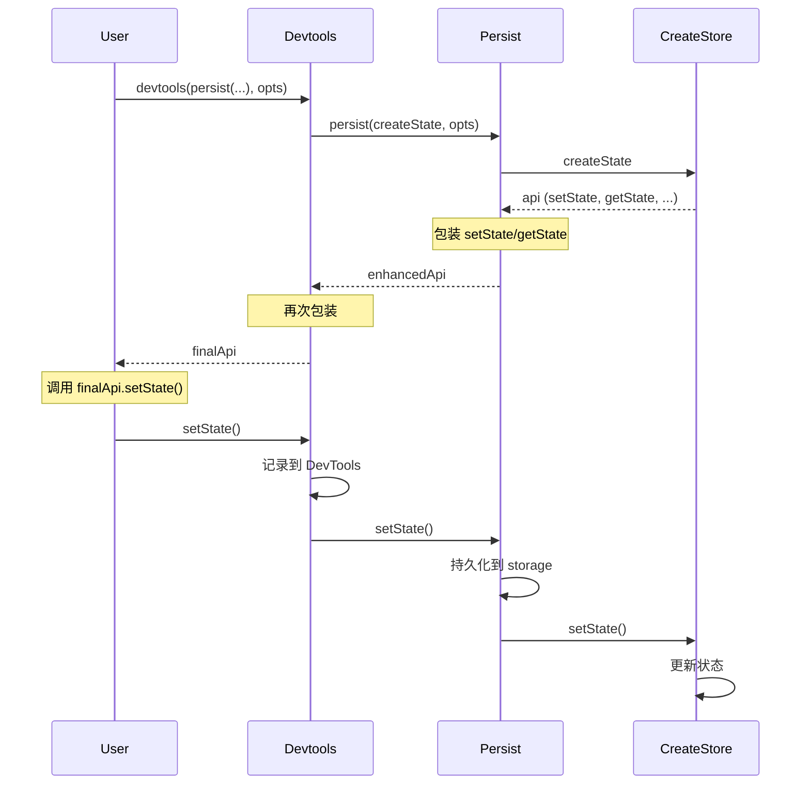
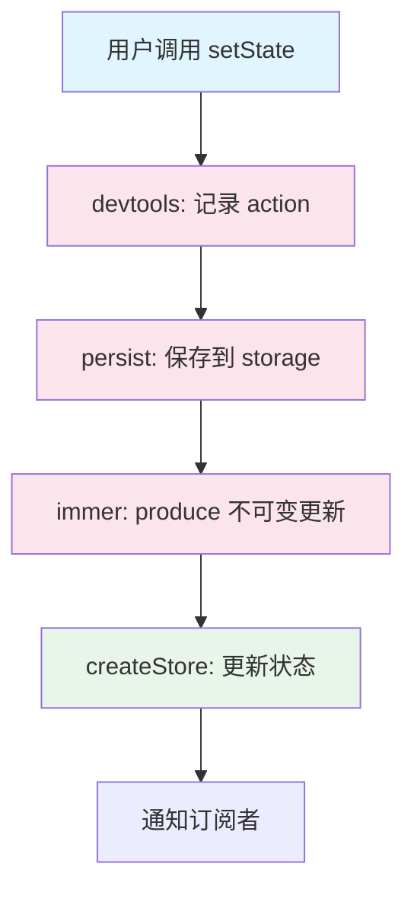

# 第 4 章 中间件系统

> 本章是 Zustand 源码解析系列的第 4 章，聚焦于中间件系统的实现原理。我们将深入分析中间件的函数组合机制，以及 `persist`、`devtools`、`immer` 等核心中间件的源码实现。

---

## 1. 模块职责

### 1.1 中间件系统做什么？

Zustand 的中间件系统是**函数组合（Function Composition）**的实现，用于：
- 增强 Store 的功能（持久化、DevTools、Immer 等）
- 拦截和修改 `setState`、`getState` 行为
- 添加副作用（日志、持久化、同步等）

### 1.2 为什么需要中间件？

**设计目标**：
1. **功能扩展**：在不修改核心代码的前提下添加新功能
2. **按需使用**：只用你需要的中间件，保持轻量
3. **组合灵活**：多个中间件可以嵌套使用

### 1.3 与其他模块的关系

```mermaid
graph TB
    subgraph "核心层"
        createStore[createStore]
    end
    subgraph "中间件层"
        persist[persist]
        devtools[devtools]
        immer[immer]
        combine[combine]
        subscribeWithSelector[subscribeWithSelector]
    end
    subgraph "用户代码"
        user[create(...)]
    end
    user --> devtools
    devtools --> persist
    persist --> immer
    immer --> createStore
    createStore -.->|返回增强 API| immer
    immer -.->|返回增强 API| persist
    persist -.->|返回增强 API| devtools
    devtools -.->|返回增强 API| user
    style createStore fill:#e8f5e9
    style persist fill:#fce4ec
    style devtools fill:#fce4ec
    style immer fill:#fce4ec
```

---

## 2. 中间件系统架构

### 2.1 中间件的本质

**中间件 = 高阶函数**

```typescript
// 中间件签名
type Middleware = <T>(
  initializer: StateCreator<T>,
  options?: Options
) => StateCreator<T>
```

**执行流程**：
```typescript
// 用户代码
const useStore = create(devtools(persist(createState, persistOptions), devtoolsOptions))

// 执行顺序（从外到内）
// 1. devtools 包装 persist 返回的 create 函数
// 2. persist 包装原始 createState
// 3. createStore 执行最终的状态创建
```

### 2.2 中间件组合示意图



---

## 3. persist 中间件详解

### 3.1 功能概述

`persist` 中间件提供**状态持久化**功能：
- 自动将状态保存到 `localStorage`/`sessionStorage`/自定义存储
- 应用启动时自动恢复状态
- 支持版本迁移
- 支持异步存储

### 3.2 核心源码分析

**源码位置**：`src/middleware/persist.ts`

**简化实现**（核心逻辑）：

```typescript
// 文件：src/middleware/persist.ts
export function persist<T, U = T>(
  config: StateCreator<T, [], []>,
  options: PersistOptions<T, U>
): StateCreator<T, [], []> {
  return (set, get, api) => {
    const { name, storage = createJSONStorage(() => localStorage) } = options
    
    // ① 从存储中恢复状态
    let fromStorage: { state: U } | null = null
    try {
      fromStorage = storage.getItem(name)
    } catch (e) {
      // 存储不可用（如 SSR）
    }
    
    // ② 创建状态初始化函数
    const initialState = config(
      // 包装 set：状态变化时持久化
      (partial, replace) => {
        set(partial, replace)
        // 持久化当前状态
        storage.setItem(name, { state: get() })
      },
      get,
      api
    )
    
    // ③ 如果有存储的状态，恢复它
    if (fromStorage) {
      set(fromStorage.state as T)
    }
    
    return initialState
  }
}
```

### 3.3 完整实现关键点

**源码位置**：`src/middleware/persist.ts L130-250`

```typescript
export function persist(config, options) {
  return (set, get, api) => {
    const storage = options.storage ?? createJSONStorage(() => localStorage)
    const name = options.name
    
    // 存储键
    const storageKey = typeof name === 'function' ? name() : name
    
    // ① 状态持久化函数
    const saveState = (state) => {
      try {
        const serialized = options.serialize?.(state) || JSON.stringify(state)
        storage.setItem(storageKey, serialized)
      } catch (e) {
        console.warn('persist middleware: failed to save state', e)
      }
    }
    
    // ② 状态恢复函数
    const rehydrate = async () => {
      try {
        const persistedState = await storage.getItem(storageKey)
        const deserialized = options.deserialize?.(persistedState) || 
                            JSON.parse(persistedState)
        
        // 版本检查
        if (deserialized.version !== options.version) {
          // 执行迁移
          if (options.migrate) {
            const migrated = await options.migrate(
              deserialized.state,
              deserialized.version || 0
            )
            set(migrated)
          }
        } else {
          set(deserialized.state)
        }
        
        // 重 hydration 完成回调
        options.onRehydrateStorage?.(get())?.(get(), undefined)
      } catch (e) {
        options.onRehydrateStorage?.(get())?.(undefined, e)
      }
    }
    
    // ③ 包装 setState
    const setStateWithPersist = (partial, replace) => {
      set(partial, replace)
      saveState(get())
    }
    
    // ④ 开始恢复
    rehydrate()
    
    // ⑤ 执行原始 config
    return config(setStateWithPersist, get, api)
  }
}
```

### 3.4 使用示例

```typescript
import { create } from 'zustand'
import { persist, createJSONStorage } from 'zustand/middleware'

// 基础用法
const useStore = create(
  persist(
    (set) => ({
      bears: 0,
      increase: () => set((state) => ({ bears: state.bears + 1 })),
    }),
    { name: 'bear-storage' }
  )
)

// 自定义存储（sessionStorage）
const useStore = create(
  persist(
    (set) => ({ /* ... */ }),
    {
      name: 'bear-storage',
      storage: createJSONStorage(() => sessionStorage),
    }
  )
)

// 部分持久化（只持久化部分状态）
const useStore = create(
  persist(
    (set) => ({
      bears: 0,
      honey: 0,
      temp: '临时数据', // 不会被持久化
    }),
    {
      name: 'bear-storage',
      partialize: (state) => ({ bears: state.bears }), // 只持久化 bears
    }
  )
)

// 版本迁移
const useStore = create(
  persist(
    (set) => ({
      bears: 0,
      version: 1,
    }),
    {
      name: 'bear-storage',
      version: 2,
      migrate: async (persistedState, version) => {
        if (version === 1) {
          return {
            ...persistedState,
            honey: 0, // 新增字段
            version: 2,
          }
        }
        return persistedState
      },
    }
  )
)
```

### 3.5 设计亮点

| 设计点 | 实现方式 | 优势 |
|--------|----------|------|
| **异步恢复** | `async/await` 处理存储读取 | 支持异步存储（如 IndexedDB） |
| **版本迁移** | `migrate` 函数 | 支持数据结构变更 |
| **错误处理** | `try/catch` + 回调 | 优雅降级，不阻塞应用 |
| **自定义存储** | `storage` 接口 | 支持任意存储后端 |

---

## 4. devtools 中间件详解

### 4.1 功能概述

`devtools` 中间件提供 **Redux DevTools** 集成：
- 在 Redux DevTools 中查看状态变化
- 支持时间旅行调试
- 支持状态回放

### 4.2 核心源码分析

**源码位置**：`src/middleware/devtools.ts`

**简化实现**：

```typescript
// 文件：src/middleware/devtools.ts
export function devtools(config, options = {}) {
  return (set, get, api) => {
    const { name, enabled } = options
    
    // ① 连接 Redux DevTools
    let extension
    let enabledDevtools = enabled
    if (enabledDevtools !== false && typeof window !== 'undefined') {
      extension = window.__REDUX_DEVTOOLS_EXTENSION__?.connect({
        name,
        features: options.features,
      })
    }
    
    // ② 包装 setState
    const setStateWithDevtools = (partial, replace, action) => {
      set(partial, replace)
      
      // 发送状态到 DevTools
      if (extension) {
        extension.send(
          action || { type: actionType || 'anonymous' },
          get()
        )
      }
    }
    
    // ③ 处理 DevTools 发来的动作（时间旅行）
    if (extension) {
      extension.init(get())
      extension.subscribe((message) => {
        if (message.type === 'DISPATCH') {
          if (message.payload.type === 'JUMP_TO_STATE' || 
              message.payload.type === 'JUMP_TO_ACTION') {
            // 恢复到指定状态
            const state = JSON.parse(message.state)
            set(state)
          }
        }
      })
    }
    
    return config(setStateWithDevtools, get, api)
  }
}
```

### 4.3 使用示例

```typescript
import { create } from 'zustand'
import { devtools } from 'zustand/middleware'

// 基础用法
const useStore = create(
  devtools(
    (set) => ({
      bears: 0,
      increase: () => set((state) => ({ bears: state.bears + 1 }), false, 'bears/increase'),
    }),
    { name: 'Bear Store' }
  )
)

// 带命名空间
const useStore = create(
  devtools(
    (set) => ({
      bears: 0,
      increase: () => set((state) => ({ bears: state.bears + 1 }), false, 'INCREASE'),
    }),
    { name: 'Bear Store', enabled: true }
  )
)
```

### 4.4 设计亮点

| 设计点 | 实现方式 | 优势 |
|--------|----------|------|
| **条件连接** | `enabled !== false` 检查 | 生产环境可禁用 |
| **动作命名** | 支持自定义 action 名称 | 调试时清晰可读 |
| **时间旅行** | 监听 `JUMP_TO_STATE` | 支持状态回放 |
| **SSR 安全** | `typeof window !== 'undefined'` | 服务端不报错 |

---

## 5. immer 中间件详解

### 5.1 功能概述

`immer` 中间件提供**可变语法更新不可变数据**：
- 使用 `produce` 函数实现可变语法
- 自动生成不可变更新
- 避免手动展开对象的繁琐

### 5.2 核心源码分析

**源码位置**：`src/middleware/immer.ts`

```typescript
// 文件：src/middleware/immer.ts
import { produce } from 'immer'

export function immer(config) {
  return (set, get, api) => {
    // 包装 setState：使用 immer 的 produce
    const setStateWithImmer = (fn, replace) => {
      if (typeof fn === 'function') {
        // 函数式更新：使用 produce
        set(produce(fn), replace)
      } else {
        // 对象更新：直接 set
        set(fn, replace)
      }
    }
    
    return config(setStateWithImmer, get, api)
  }
}
```

### 5.3 使用示例

```typescript
import { create } from 'zustand'
import { immer } from 'zustand/middleware/immer'

// ❌ 没有 immer：需要手动展开
const useStore = create((set) => ({
  user: { name: 'John', age: 30 },
  updateName: (name) => set((state) => ({
    user: { ...state.user, name }  // 需要展开
  }))
}))

// ✅ 使用 immer：可变语法
const useStore = create(immer((set) => ({
  user: { name: 'John', age: 30 },
  updateName: (name) => set((state) => {
    state.user.name = name  // 直接修改！immer 会生成不可变副本
  })
})))

// 复杂嵌套更新
const useStore = create(immer((set) => ({
  todos: [
    { id: 1, text: 'Learn Zustand', done: false },
    { id: 2, text: 'Learn Immer', done: false },
  ],
  toggleTodo: (id) => set((state) => {
    const todo = state.todos.find(t => t.id === id)
    if (todo) {
      todo.done = !todo.done  // 直接修改嵌套对象
    }
  })
})))
```

### 5.4 设计亮点

| 设计点 | 实现方式 | 优势 |
|--------|----------|------|
| **函数检测** | `typeof fn === 'function'` | 只对函数式更新使用 immer |
| **零配置** | 直接导入使用 | 无需额外配置 |
| **可选依赖** | peerDependencies | 不强制安装 immer |

---

## 6. 其他中间件

### 6.1 combine 中间件

**作用**：组合初始状态和派生状态。

```typescript
import { create } from 'zustand'
import { combine } from 'zustand/middleware'

const useStore = create(
  combine(
    // 初始状态
    { bears: 0 },
    // 派生状态和方法
    (set, get) => ({
      increase: () => set({ bears: get().bears + 1 }),
    })
  )
)
```

### 6.2 subscribeWithSelector 中间件

**作用**：支持带选择器的订阅。

```typescript
import { create } from 'zustand'
import { subscribeWithSelector } from 'zustand/middleware'

const useStore = create(
  subscribeWithSelector((set) => ({
    bears: 0,
    honey: 0,
  }))
)

// 只订阅 bears 的变化
useStore.subscribe(
  (state) => state.bears,  // 选择器
  (bears) => console.log('bears changed:', bears)
)
```

### 6.3 redux 中间件

**作用**：兼容 Redux 的 action/reducer 模式。

```typescript
import { create } from 'zustand'
import { redux } from 'zustand/middleware'

const useStore = create(
  redux(
    (state, action) => {
      switch (action.type) {
        case 'INCREASE':
          return { ...state, bears: state.bears + 1 }
        default:
          return state
      }
    },
    { bears: 0 }
  )
)
```

---

## 7. 中间件类型系统

### 7.1 Mutate 类型

**源码位置**：`src/vanilla.ts L15-22`

```typescript
export type Mutate<S, Ms> = number extends Ms['length' & keyof Ms]
  ? S
  : Ms extends []
    ? S
    : Ms extends [[infer Mi, infer Ma], ...infer Mrs]
      ? Mutate<StoreMutators<S, Ma>[Mi & StoreMutatorIdentifier], Mrs>
      : never
```

**作用**：递归应用中间件类型变换。

### 7.2 StoreMutators 扩展

中间件通过扩展 `StoreMutators` 接口来修改 Store 类型：

```typescript
// devtools 中间件的类型扩展
declare module '../vanilla' {
  interface StoreMutators<S, A> {
    'zustand/devtools': WithDevtools<S>
  }
}
```

### 7.3 类型推导示例

```typescript
// 无中间件
const store = create<BearState>((set) => ({ ... }))
// store 类型：UseBoundStore<StoreApi<BearState>>

// 有 persist 中间件
const store = create(
  persist<BearState>((set) => ({ ... }), { name: 'bear' })
)
// store 类型：UseBoundStore<StoreApi<BearState> & PersistApi>

// 多个中间件
const store = create(
  devtools(
    persist<BearState>((set) => ({ ... }), { name: 'bear' })
  )
)
// store 类型：UseBoundStore<StoreApi<BearState> & PersistApi & DevtoolsApi>
```

---

## 8. 中间件组合顺序

### 8.1 组合原则

```typescript
// 推荐顺序（从外到内）
const useStore = create(
  devtools(           // ① 最外层：调试
    persist(          // ② 中间层：持久化
      immer(          // ③ 内层：不可变更新
        (set) => ({ /* ... */ })
      )
    )
  )
)
```

### 8.2 执行顺序



### 8.3 注意事项

| 问题 | 说明 | 建议 |
|------|------|------|
| persist 在 immer 外层 | persist 保存的是原始状态 | ✅ 推荐 |
| devtools 在最外层 | 记录所有中间件处理后的状态 | ✅ 推荐 |
| 多个 persist | 会导致多次持久化 | ❌ 避免 |

---

## 9. 本章小结

### 9.1 核心要点

1. **中间件 = 高阶函数**：包装 `StateCreator`，增强 Store 功能
2. **函数组合**：多个中间件可以嵌套，从外到内依次执行
3. **persist**：自动持久化状态，支持版本迁移和异步存储
4. **devtools**：集成 Redux DevTools，支持时间旅行调试
5. **immer**：使用可变语法实现不可变更新
6. **类型系统**：通过 `Mutate` 和 `StoreMutators` 实现类型推导

### 9.2 关键源码位置

| 中间件 | 文件 | 行号 |
|--------|------|------|
| persist | `src/middleware/persist.ts` | L130-250 |
| devtools | `src/middleware/devtools.ts` | L80-180 |
| immer | `src/middleware/immer.ts` | 完整文件 |
| combine | `src/middleware/combine.ts` | 完整文件 |
| subscribeWithSelector | `src/middleware/subscribeWithSelector.ts` | 完整文件 |

### 9.3 下章预告

在 **第 5 章：关键流程串联** 中，我们将：
- 完整追踪一次状态更新的全流程
- 分析从 `setState` 到组件重渲染的每个环节
- 绘制完整的时序图和流程图

---

**本章是系列解析的第 4 章**，深入剖析了 Zustand 的中间件系统实现。下一章我们将串联所有知识点，完整追踪状态更新流程。
