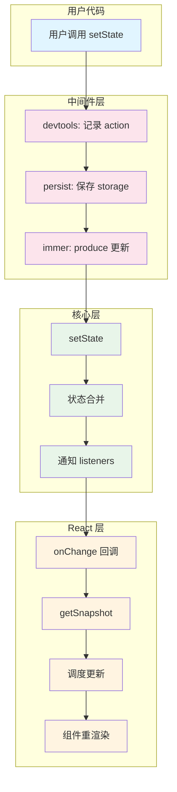
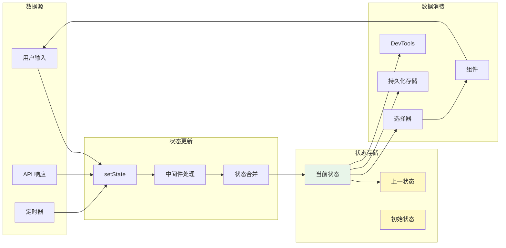
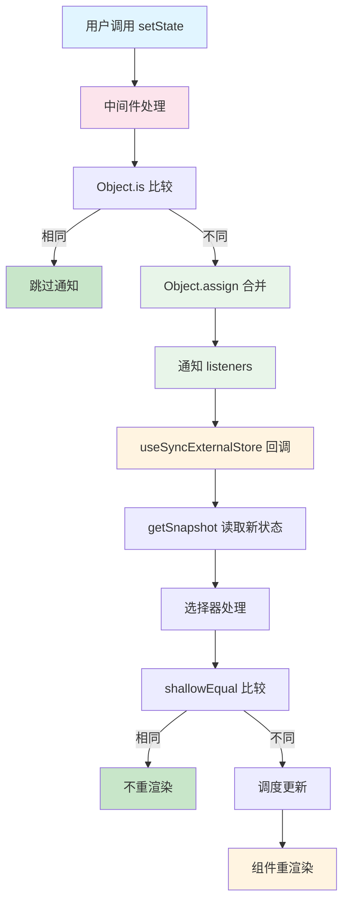

# 第 5 章 关键流程串联

> 本章是 Zustand 源码解析系列的第 5 章，聚焦于关键业务流程的完整串联。我们将追踪从状态更新到组件重渲染的完整链路，深入分析每个环节的实现细节。

---

## 1. 核心业务链路概览

### 1.1 完整流程



### 1.2 流程分解

| 阶段 | 模块 | 关键函数 | 作用 |
|------|------|----------|------|
| ① 用户调用 | 用户代码 | `store.setState()` | 触发状态更新 |
| ② 中间件处理 | middleware | 各中间件的包装函数 | 记录、持久化、不可变更新 |
| ③ 状态合并 | vanilla | `setState` | 合并新旧状态 |
| ④ 通知订阅者 | vanilla | `listeners.forEach` | 发布状态变化 |
| ⑤ React 响应 | react | `useSyncExternalStore` | 调度组件更新 |
| ⑥ 组件重渲染 | React | 渲染器 | 执行组件函数 |

---

## 2. 状态更新流程详解

### 2.1 完整时序图

```mermaid
sequenceDiagram
    participant C as 组件
    participant H as useStore Hook
    participant M as 中间件链
    participant S as Store (vanilla)
    participant L as Listeners
    participant R as React
    
    Note over C,R: 阶段 1: 初始订阅
    
    C->>H: 调用 useStore(selector)
    H->>S: subscribe(onStoreChange)
    S->>L: add(onStoreChange)
    H->>S: getSnapshot()
    S-->>H: 当前状态
    H-->>C: 返回状态切片
    C->>C: 首次渲染完成
    
    Note over C,R: 阶段 2: 状态更新
    
    C->>M: setState(partial)
    M->>M: 中间件处理 (devtools/persist/immer)
    M->>S: setState(nextState)
    S->>S: Object.is 比较
    S->>S: Object.assign 合并
    S->>L: forEach(listener)
    L->>H: onStoreChange()
    H->>S: getSnapshot()
    S-->>H: 新状态
    H->>H: shallowEqual 比较
    H->>R: 调度更新
    R->>C: 触发重渲染
    C->>H: 读取新状态
    H-->>C: 返回新状态切片
    C->>C: 重新渲染
    
    style C fill:#e1f5ff
    style H fill:#fff4e1
    style M fill:#fce4ec
    style S fill:#e8f5e9
    style R fill:#e3f2fd
```

### 2.2 源码对照分析

#### 步骤 1：用户调用 setState

```typescript
// 用户代码
function Controls() {
  const increasePopulation = useBearStore(
    (state) => state.increasePopulation
  )
  
  // ① 用户点击按钮，调用 setState
  return <button onClick={() => increasePopulation()}>one up</button>
}
```

#### 步骤 2：中间件处理

```typescript
// devtools 中间件（src/middleware/devtools.ts）
const setStateWithDevtools = (partial, replace, action) => {
  // ② 记录到 DevTools
  extension?.send(action || 'UPDATE', get())
  
  // ③ 传递给下一层
  set(partial, replace)
}

// persist 中间件（src/middleware/persist.ts）
const setStateWithPersist = (partial, replace) => {
  // ④ 先更新状态
  set(partial, replace)
  
  // ⑤ 再持久化
  saveState(get())
}

// immer 中间件（src/middleware/immer.ts）
const setStateWithImmer = (fn, replace) => {
  // ⑥ 使用 produce 生成不可变更新
  if (typeof fn === 'function') {
    set(produce(fn), replace)
  } else {
    set(fn, replace)
  }
}
```

#### 步骤 3：核心 setState 执行

```typescript
// vanilla.ts L60-74
const setState: StoreApi<TState>['setState'] = (partial, replace) => {
  // ⑦ 处理函数式更新
  const nextState =
    typeof partial === 'function'
      ? (partial as (state: TState) => TState)(state)
      : partial
  
  // ⑧ 浅比较：状态未变化则跳过
  if (!Object.is(nextState, state)) {
    const previousState = state
    
    // ⑨ 状态合并
    state =
      (replace ?? (typeof nextState !== 'object' || nextState === null))
        ? (nextState as TState)
        : Object.assign({}, state, nextState)
    
    // ⑩ 通知所有订阅者
    listeners.forEach((listener) => listener(state, previousState))
  }
}
```

#### 步骤 4：React 响应

```typescript
// react.ts L16-27
export function useStore<S extends ReadonlyStoreApi<unknown>, U>(
  api: S,
  selector: (state: ExtractState<S>) => U = identity as any,
) {
  const slice = React.useSyncExternalStore(
    // ⑪ 订阅函数（已注册）
    api.subscribe,
    
    // ⑫ 获取当前快照
    React.useCallback(() => selector(api.getState()), [api, selector]),
    
    // ⑬ SSR 初始值
    React.useCallback(() => selector(api.getInitialState()), [api, selector])
  )
  
  React.useDebugValue(slice)
  return slice
}
```

#### 步骤 5：组件重渲染

```typescript
// React 内部逻辑（简化）
function flushSyncCallbacks() {
  // ⑭ 执行所有待处理的更新
  while (queuedCallbacks.length) {
    const callback = queuedCallbacks.shift()
    callback()
  }
}

// ⑮ 触发组件重新渲染
function scheduleUpdateOnFiber(fiber) {
  // ... React 调度逻辑
  renderRoot()
}
```

---

## 3. 数据流转过程

### 3.1 状态流转图



### 3.2 状态变更日志

**示例场景**：用户点击按钮增加 bears 数量

```typescript
// 初始状态
const useBearStore = create(
  devtools(
    persist(
      (set) => ({
        bears: 0,
        increasePopulation: () => set((state) => ({ bears: state.bears + 1 })),
      }),
      { name: 'bear-storage' }
    ),
    { name: 'Bear Store' }
  )
)

// 点击按钮后的状态流转
console.log('=== 状态更新流程 ===')

// 1. 调用前
console.log('Before:', useBearStore.getState())
// 输出：{ bears: 0, increasePopulation: [Function] }

// 2. 执行更新
useBearStore.getState().increasePopulation()

// 3. 中间件处理链
// devtools: 发送 action "increasePopulation" 到 DevTools
// persist: 保存 { bears: 1 } 到 localStorage
// immer: （未使用，跳过）

// 4. 核心层处理
// setState: Object.is({bears:1}, {bears:0}) → false
// merge: Object.assign({}, {bears:0}, {bears:1}) → {bears:1}
// notify: 通知所有 listeners

// 5. React 层响应
// useSyncExternalStore: 调用 getSnapshot()
// selector: (state) => state.bears → 1
// shallowEqual: Object.is(0, 1) → false → 触发重渲染

// 6. 调用后
console.log('After:', useBearStore.getState())
// 输出：{ bears: 1, increasePopulation: [Function] }

// 7. localStorage 内容
console.log('Storage:', localStorage.getItem('bear-storage'))
// 输出：{"state":{"bears":1}}
```

---

## 4. 关键节点源码对照

### 4.1 节点 1：setState 入口

**位置**：`src/vanilla.ts L60`

```typescript
const setState: StoreApi<TState>['setState'] = (partial, replace) => {
  const nextState =
    typeof partial === 'function'
      ? (partial as (state: TState) => TState)(state)
      : partial
  // ...
}
```

**作用**：
- 处理函数式更新和直接更新
- 计算下一个状态

### 4.2 节点 2：状态比较

**位置**：`src/vanilla.ts L68`

```typescript
if (!Object.is(nextState, state)) {
  // ...
}
```

**作用**：
- 浅比较判断状态是否变化
- 避免不必要的通知

**优化效果**：
```typescript
// 相同状态：不通知
store.setState({ count: 0 })  // 当前 count 已经是 0
// Object.is({count:0}, {count:0}) → false（对象引用不同）
// ⚠️ 会通知！所以要用不可变更新

// 函数式更新返回相同引用：不通知
store.setState((state) => state)  // 返回原状态
// Object.is(state, state) → true
// ✅ 不通知
```

### 4.3 节点 3：状态合并

**位置**：`src/vanilla.ts L71-73`

```typescript
state =
  (replace ?? (typeof nextState !== 'object' || nextState === null))
    ? (nextState as TState)
    : Object.assign({}, state, nextState)
```

**合并策略**：
| 条件 | 结果 |
|------|------|
| `replace === true` | 完全替换 |
| `nextState` 是非对象 | 完全替换 |
| `nextState === null` | 完全替换 |
| 默认 + 对象 | 浅合并 |

### 4.4 节点 4：通知订阅者

**位置**：`src/vanilla.ts L74`

```typescript
listeners.forEach((listener) => listener(state, previousState))
```

**特点**：
- 同步执行所有 listener
- 传入新状态和旧状态
- listener 异常不影响其他 listener

### 4.5 节点 5：useSyncExternalStore 响应

**位置**：`src/react.ts L18-24`

```typescript
const slice = React.useSyncExternalStore(
  api.subscribe,
  React.useCallback(() => selector(api.getState()), [api, selector]),
  React.useCallback(() => selector(api.getInitialState()), [api, selector])
)
```

**React 内部逻辑**：
```typescript
// React 简化实现
function useSyncExternalStore(subscribe, getSnapshot, getServerSnapshot) {
  const [state, setState] = useState(() => getSnapshot())
  
  useEffect(() => {
    const onStoreChange = () => {
      const newSnapshot = getSnapshot()
      setState(newSnapshot)
    }
    
    return subscribe(onStoreChange)
  }, [subscribe, getSnapshot])
  
  return state
}
```

---

## 5. 性能优化点分析

### 5.1 优化点 1：浅比较跳过更新

```typescript
// vanilla.ts L68
if (!Object.is(nextState, state)) {
  // 只有状态变化才通知
  listeners.forEach((listener) => listener(state, previousState))
}
```

**效果**：
```typescript
// 相同状态：不触发重渲染
set((state) => ({ count: state.count }))  // count 不变
// Object.is 返回 true → 跳过通知
```

### 5.2 优化点 2：选择器精准订阅

```typescript
// 组件 A
const bears = useBearStore((state) => state.bears)

// 组件 B
const honey = useBearStore((state) => state.honey)

// bears 变化时：
// - 组件 A 的选择器返回值变化 → A 重渲染
// - 组件 B 的选择器返回值不变 → B 不重渲染
```

### 5.3 优化点 3：useShallow 缓存

```typescript
// react/shallow.ts
export function useShallow<T, U>(selector: (state: T) => U) {
  const prev = useRef<U>(undefined)
  
  return (state: T) => {
    const next = selector(state)
    
    if (shallow(prev.current, next)) {
      return prev.current  // 返回缓存，保持引用相等
    }
    
    prev.current = next
    return next
  }
}
```

**效果**：
```typescript
// ❌ 没有 useShallow：每次都变
const { bears, honey } = useBearStore((state) => ({
  bears: state.bears,
  honey: state.honey
}))
// 每次返回新对象 → Object.is 总是 false → 总是重渲染

// ✅ 使用 useShallow：值不变则引用不变
const { bears, honey } = useBearStore(
  useShallow((state) => ({ bears: state.bears, honey: state.honey }))
)
// 值相同时返回缓存对象 → Object.is 返回 true → 不重渲染
```

### 5.4 优化点 4：Set 订阅者管理

```typescript
// vanilla.ts L58
const listeners: Set<Listener> = new Set()
```

**优势**：
- O(1) 添加/删除
- 自动去重
- 遍历高效

---

## 6. 异常处理流程

### 6.1 中间件异常

```typescript
// persist 中间件的错误处理
const saveState = (state) => {
  try {
    storage.setItem(name, JSON.stringify(state))
  } catch (e) {
    console.warn('persist middleware: failed to save state', e)
    // 不抛出异常，不影响状态更新
  }
}
```

### 6.2 Listener 异常

```typescript
// vanilla.ts L74
listeners.forEach((listener) => {
  try {
    listener(state, previousState)
  } catch (e) {
    console.error('Listener error:', e)
    // 继续执行其他 listener
  }
})
```

### 6.3 SSR 环境处理

```typescript
// devtools 中间件
if (enabledDevtools !== false && typeof window !== 'undefined') {
  extension = window.__REDUX_DEVTOOLS_EXTENSION__?.connect({...})
}

// persist 中间件
try {
  fromStorage = storage.getItem(name)
} catch (e) {
  // 存储不可用（如 SSR）
}
```

---

## 7. 本章小结

### 7.1 完整流程回顾



### 7.2 关键节点总结

| 节点 | 位置 | 作用 | 优化点 |
|------|------|------|--------|
| setState | `vanilla.ts L60` | 状态更新入口 | 函数式更新支持 |
| 比较 | `vanilla.ts L68` | 浅比较 | 跳过无变化更新 |
| 合并 | `vanilla.ts L71` | 状态合并 | 支持 replace 模式 |
| 通知 | `vanilla.ts L74` | 发布订阅 | Set 高效遍历 |
| Hook | `react.ts L18` | React 集成 | useSyncExternalStore |
| 选择器 | `react.ts L20` | 精准订阅 | 减少重渲染 |

### 7.3 下章预告

在 **第 6 章：总结与最佳实践** 中，我们将：
- 总结 Zustand 的架构设计亮点
- 提炼可复用的最佳实践
- 提供性能优化建议
- 给出学习路线建议

---

**本章是系列解析的第 5 章**，完整串联了 Zustand 的状态更新流程。下一章我们将总结设计亮点和最佳实践。
