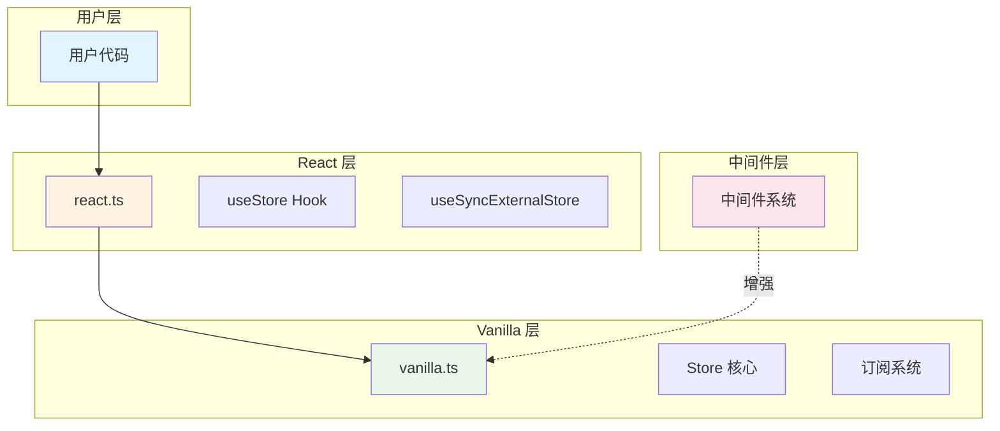
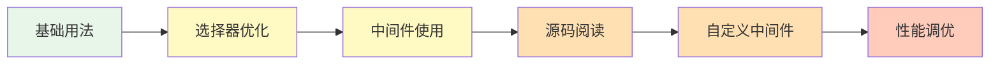

# 第 6 章 总结与最佳实践

> 本章是 Zustand 源码解析系列的最后一章，聚焦于架构设计亮点总结、代码规范与最佳实践、性能优化技巧以及学习建议。

---

## 1. 架构设计亮点总结

### 1.1 分层架构

Zustand 采用清晰的**三层架构**：



**设计优势**：

| 层次 | 职责 | 优势 |
|------|------|------|
| **Vanilla 层** | 核心 Store 逻辑 | 框架无关，可复用 |
| **React 层** | Hook 封装 | 专注 React 集成 |
| **中间件层** | 功能扩展 | 按需使用，灵活组合 |

### 1.2 订阅 - 发布模式

**核心实现**：
```typescript
// 订阅者管理
const listeners: Set<Listener> = new Set()

// 订阅
const subscribe = (listener) => {
  listeners.add(listener)
  return () => listeners.delete(listener)
}

// 发布
const notify = () => {
  listeners.forEach((listener) => listener(state, prevState))
}
```

**设计优势**：
- ✅ 解耦：状态存储与状态消费完全解耦
- ✅ 高效：`Set` 实现 O(1) 增删
- ✅ 灵活：支持多个订阅者

### 1.3 闭包存储

**核心实现**：
```typescript
const createStoreImpl = (createState) => {
  let state: TState  // 闭包变量
  
  return {
    getState: () => state,
    setState: (next) => { state = next }
  }
}
```

**设计优势**：
- ✅ 无需 Provider：避免 Context 包裹
- ✅ 模块级单例：自然的全局状态
- ✅ 避免 Context 性能问题：不触发整树更新

### 1.4 函数组合中间件

**核心实现**：
```typescript
// 中间件 = 高阶函数
const enhanced = devtools(persist(immer(createState)))

// 执行顺序：devtools → persist → immer → createState
```

**设计优势**：
- ✅ 可扩展：无限添加新功能
- ✅ 按需使用：只用需要的中间件
- ✅ 无侵入：不修改核心代码

### 1.5 useSyncExternalStore 集成

**核心实现**：
```typescript
const slice = useSyncExternalStore(
  api.subscribe,
  () => selector(api.getState()),
  () => selector(api.getInitialState())
)
```

**设计优势**：
- ✅ 并发安全：解决 React 18 并发渲染问题
- ✅ 避免撕裂：保证组件树状态一致性
- ✅ SSR 支持：通过 `getServerSnapshot`

---

## 2. 代码规范与最佳实践

### 2.1 Store 创建规范

#### ✅ 推荐：使用 TypeScript

```typescript
// 定义状态类型
interface BearState {
  bears: number
  honey: number
  increase: () => void
}

// 创建 Store
const useBearStore = create<BearState>((set) => ({
  bears: 0,
  honey: 0,
  increase: () => set((state) => ({ bears: state.bears + 1 })),
}))
```

#### ✅ 推荐：分离状态和方法

```typescript
// 清晰的结构
const useStore = create((set) => ({
  // 状态
  bears: 0,
  honey: 0,
  
  // 方法
  increase: () => set((state) => ({ bears: state.bears + 1 })),
  reset: () => set({ bears: 0, honey: 0 }),
}))
```

#### ❌ 避免：在 Store 中定义复杂逻辑

```typescript
// ❌ 不推荐
const useStore = create((set, get) => ({
  bears: 0,
  complexLogic: () => {
    // 50 行复杂逻辑...
    // 难以测试和维护
  }
}))

// ✅ 推荐：提取到外部
function calculateBears(state: BearState): number {
  // 纯函数，易于测试
}

const useStore = create((set, get) => ({
  bears: 0,
  complexLogic: () => {
    const result = calculateBears(get())
    set({ bears: result })
  }
}))
```

### 2.2 组件使用规范

#### ✅ 推荐：使用选择器

```typescript
// ✅ 精准订阅
const bears = useBearStore((state) => state.bears)
const increase = useBearStore((state) => state.increase)

// ❌ 避免：订阅整个状态
const state = useBearStore()  // 任何变化都触发重渲染
```

#### ✅ 推荐：多状态使用 useShallow

```typescript
import { useShallow } from 'zustand/react/shallow'

// ✅ 使用 useShallow
const { bears, honey } = useBearStore(
  useShallow((state) => ({ bears: state.bears, honey: state.honey }))
)

// ❌ 避免：直接返回对象
const { bears, honey } = useBearStore((state) => ({
  bears: state.bears,
  honey: state.honey
}))  // 每次都返回新对象，触发重渲染
```

#### ✅ 推荐：方法解耦

```typescript
// ✅ 方法在组件外调用
function Controls() {
  const increase = useBearStore((state) => state.increase)
  return <button onClick={increase}>Increase</button>
}

// ✅ 或者在组件内直接调用
function Controls() {
  return (
    <button onClick={() => useBearStore.getState().increase()}>
      Increase
    </button>
  )
}
```

### 2.3 中间件使用规范

#### ✅ 推荐：正确的嵌套顺序

```typescript
// ✅ 推荐顺序（从外到内）
const useStore = create(
  devtools(           // 调试工具（最外层）
    persist(          // 持久化
      immer(          // 不可变更新
        (set) => ({ /* ... */ })
      ),
      { name: 'store' }
    ),
    { name: 'My Store' }
  )
)
```

#### ✅ 推荐：persist 配置

```typescript
// ✅ 完整的 persist 配置
const useStore = create(
  persist(
    (set) => ({
      bears: 0,
      version: 1,
    }),
    {
      name: 'bear-storage',
      storage: createJSONStorage(() => localStorage),
      partialize: (state) => ({ bears: state.bears }), // 只持久化部分
      version: 2,
      migrate: async (persistedState, version) => {
        // 版本迁移逻辑
        return persistedState
      },
      onRehydrateStorage: (state) => {
        console.log('rehydration started')
        return (state, error) => {
          if (error) {
            console.log('rehydration failed', error)
          } else {
            console.log('rehydration succeeded', state)
          }
        }
      },
    }
  )
)
```

### 2.4 异步操作规范

#### ✅ 推荐：async/await

```typescript
const useStore = create((set, get) => ({
  fishies: {},
  fetch: async (pond: string) => {
    const response = await fetch(pond)
    const fishies = await response.json()
    set({ fishies })
  },
}))
```

#### ✅ 推荐：错误处理

```typescript
const useStore = create((set, get) => ({
  data: null,
  loading: false,
  error: null,
  
  fetchData: async () => {
    set({ loading: true, error: null })
    try {
      const response = await fetch('/api/data')
      const data = await response.json()
      set({ data, loading: false })
    } catch (error) {
      set({ error: error.message, loading: false })
    }
  },
}))
```

---

## 3. 性能优化技巧

### 3.1 选择器优化

#### 技巧 1：原子选择器

```typescript
// ✅ 原子选择器：性能最优
const count = useStore((state) => state.count)
const name = useStore((state) => state.name)

// ⚠️ 对象选择器：需要 useShallow
const { count, name } = useStore(
  useShallow((state) => ({ count: state.count, name: state.name }))
)
```

#### 技巧 2：避免内联对象

```typescript
// ❌ 避免：内联对象创建
const data = useStore((state) => ({
  items: state.items,
  total: state.total
}))

// ✅ 推荐：使用 useShallow
const data = useStore(
  useShallow((state) => ({
    items: state.items,
    total: state.total
  }))
)
```

### 3.2 渲染优化

#### 技巧 1：组件拆分

```typescript
// ❌ 避免：大组件订阅多个状态
function BearPage() {
  const bears = useBearStore((state) => state.bears)
  const honey = useBearStore((state) => state.honey)
  const name = useBearStore((state) => state.name)
  // ... 大量 JSX
  
  return (/* ... */)
}

// ✅ 推荐：拆分为小组件
function BearCount() {
  const bears = useBearStore((state) => state.bears)
  return <span>{bears}</span>
}

function HoneyCount() {
  const honey = useBearStore((state) => state.honey)
  return <span>{honey}</span>
}

function BearPage() {
  return (
    <>
      <BearCount />
      <HoneyCount />
      {/* ... */}
    </>
  )
}
```

#### 技巧 2：使用 React.memo

```typescript
// ✅ 配合 React.memo 进一步优化
const BearCount = React.memo(() => {
  const bears = useBearStore((state) => state.bears)
  return <span>{bears}</span>
})
```

### 3.3 批量更新

```typescript
// ❌ 避免：多次 setState
const updateAll = () => {
  set({ bears: 1 })
  set({ honey: 2 })
  set({ name: 'John' })
}

// ✅ 推荐：单次 setState
const updateAll = () => {
  set({ bears: 1, honey: 2, name: 'John' })
}

// ✅ 或者：函数式批量更新
const updateAll = () => {
  set((state) => ({
    bears: state.bears + 1,
    honey: state.honey + 2,
    name: 'John'
  }))
}
```

### 3.4 计算值优化

#### 技巧 1：使用选择器计算

```typescript
// ✅ 在选择器中计算（仅当依赖变化时重新计算）
const total = useStore((state) => 
  state.items.reduce((sum, item) => sum + item.price, 0)
)
```

#### 技巧 2：使用派生状态

```typescript
// ✅ 使用中间状态存储计算结果
const useStore = create((set, get) => ({
  items: [],
  total: 0,
  addItem: (item) => {
    set((state) => {
      const newItems = [...state.items, item]
      return {
        items: newItems,
        total: newItems.reduce((sum, i) => sum + i.price, 0)
      }
    })
  }
}))
```

---

## 4. 可扩展性分析

### 4.1 插件扩展

Zustand 的中间件系统支持无限扩展：

```typescript
// 自定义中间件示例
function logger(config) {
  return (set, get, api) => {
    const logSet = (partial, replace) => {
      console.log('[Store Update]', { partial, replace })
      set(partial, replace)
      console.log('[New State]', get())
    }
    
    return config(logSet, get, api)
  }
}

// 使用
const useStore = create(logger((set) => ({ /* ... */ })))
```

### 4.2 多 Store 组合

```typescript
// 创建多个 Store
const useBearStore = create(() => ({ bears: 0 }))
const useHoneyStore = create(() => ({ honey: 0 }))

// 在组件中组合使用
function BearPage() {
  const bears = useBearStore((s) => s.bears)
  const honey = useHoneyStore((s) => s.honey)
  return <div>{bears} bears, {honey} honey</div>
}
```

### 4.3 Store 间通信

```typescript
// 方式 1：在 action 中调用其他 Store
const useBearStore = create((set, get) => ({
  bears: 0,
  eatHoney: () => {
    const honey = useHoneyStore.getState().honey
    if (honey > 0) {
      useHoneyStore.getState().decrease()
      set((state) => ({ bears: state.bears + 1 }))
    }
  }
}))

// 方式 2：使用 subscribe 监听其他 Store
useHoneyStore.subscribe((state) => {
  console.log('Honey changed:', state)
})
```

---

## 5. 学习建议

### 5.1 学习路线



### 5.2 推荐阅读顺序
| 阶段 | 内容 | 目标 |
|------|------|------|
| **入门** | 官方文档 + 基础示例 | 理解 create、setState、选择器 |
| **进阶** | 中间件使用 + 性能优化 | 掌握 persist、devtools、useShallow |
| **深入** | 源码阅读（本系列） | 理解内部实现原理 |
| **精通** | 自定义中间件 + 扩展 | 能够扩展 Zustand 功能 |

### 5.3 实践项目建议

1. **Todo List**：练习基础 CRUD 操作
2. **购物车**：练习状态计算和派生状态
3. **表单管理**：练习复杂状态管理
4. **游戏状态**：练习高性能状态更新
5. **自定义中间件**：练习扩展能力

---

## 6. 与竞品对比

### 6.1 对比 Redux
| 特性 | Zustand | Redux |
|------|---------|-------|
| 样板代码 | 极少 | 较多 |
| 学习曲线 | 平缓 | 陡峭 |
| DevTools | ✅（中间件） | ✅（内置） |
| 中间件 | 函数组合 | applyMiddleware |
| TypeScript | 优秀 | 优秀 |
| 包大小 | ~1KB | ~8KB |

### 6.2 对比 Context API
| 特性 | Zustand | Context API |
|------|---------|-------------|
| 性能 | 精准订阅 | 整树更新 |
| 使用方式 | Hook | Provider + useContext |
| 外部访问 | ✅（getState） | ❌ |
| 中间件 | ✅ | ❌ |

### 6.3 对比 Jotai/Recoil
| 特性 | Zustand | Jotai/Recoil |
|------|---------|--------------|
| 状态模型 | 单一 Store | 原子化状态 |
| 学习成本 | 低 | 中 |
| 适用场景 | 通用状态管理 | 细粒度状态 |
| DevTools | ✅ | ✅ |

---

## 7. 本章小结

### 7.1 核心要点回顾

1. **分层架构**：Vanilla 层（核心）+ React 层（集成）+ 中间件层（扩展）
2. **订阅 - 发布**：基于 `Set` 的高效订阅者管理
3. **闭包存储**：无需 Provider，避免 Context 性能问题
4. **函数组合**：中间件系统灵活可扩展
5. **useSyncExternalStore**：并发安全，SSR 支持

### 7.2 最佳实践清单

- ✅ 使用 TypeScript 定义状态类型
- ✅ 使用选择器精准订阅
- ✅ 多状态使用 `useShallow`
- ✅ 中间件正确嵌套（devtools → persist → immer）
- ✅ 异步操作添加错误处理
- ✅ 大组件拆分为小组件
- ✅ 使用 React.memo 进一步优化

### 7.3 性能优化清单

- ✅ 原子选择器优先
- ✅ 避免内联对象创建
- ✅ 批量更新状态
- ✅ 计算值缓存或预计算
- ✅ 组件拆分减少重渲染范围

### 7.4 完整源码位置
| 模块 | 文件路径 |
|------|----------|
| 核心 Store | `src/vanilla.ts` |
| React 集成 | `src/react.ts` |
| 中间件导出 | `src/middleware.ts` |
| persist | `src/middleware/persist.ts` |
| devtools | `src/middleware/devtools.ts` |
| immer | `src/middleware/immer.ts` |
| useShallow | `src/react/shallow.ts` |

---

## 8. 系列解析总结

本系列共 6 章，完整解析了 Zustand 的源码实现：
| 章节 | 主题 | 核心内容 |
|------|------|----------|
| 第 1 章 | 项目概览与架构 | 项目定位、技术栈、目录结构 |
| 第 2 章 | 核心 Store 创建机制 | createStore、setState、订阅系统 |
| 第 3 章 | React 集成层 | useStore、useSyncExternalStore |
| 第 4 章 | 中间件系统 | persist、devtools、immer 实现 |
| 第 5 章 | 关键流程串联 | 状态更新完整流程分析 |
| 第 6 章 | 总结与最佳实践 | 设计亮点、使用建议、性能优化 |

---

**🎉 恭喜！Zustand 源码解析系列已全部完成！**

希望本系列能帮助你深入理解 Zustand 的实现原理，并在实际项目中更好地使用它。

**输出目录**：`/home/admin/.openclaw/workspace-source-code/output/zustandAnalysis/`
| 文件 | 章节 |
|------|------|
| `ch01-overview.md` | 第 1 章：项目概览与架构 |
| `ch02-store-creation.md` | 第 2 章：核心 Store 创建机制 |
| `ch03-react-integration.md` | 第 3 章：React 集成层 |
| `ch04-middleware.md` | 第 4 章：中间件系统 |
| `ch05-flow-analysis.md` | 第 5 章：关键流程串联 |
| `ch06-summary-best-practices.md` | 第 6 章：总结与最佳实践 |
