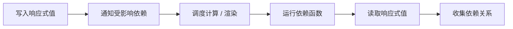

# Vue 响应式：依赖收集、更新触发与双向绑定

> 审阅日期：2026-10-08。状态：官方原理对照，示例未运行。
> 本章区分 Vue 2 历史机制与 Vue 3；不把简化模型当作框架源码。

## 1. 三件不同的事

响应式系统追踪读写，渲染系统把状态变成 UI，v-model 等约定把用户输入转换成状态更新。Object.defineProperty 或 Proxy 本身都不能单独完成整个双向绑定系统。

## 2. Vue 2 与 Vue 3

| 维度 | Vue 2 典型机制 | Vue 3 典型机制 |
| --- | --- | --- |
| 对象响应式 | getter/setter 转换 | Proxy |
| ref | 不作为相同的核心模型讨论 | .value 的访问追踪 |
| 新增/删除属性 | 存在检测边界，常用 $set 等 | Proxy 能拦截相关操作 |
| 更新 | 依赖追踪与调度 | 依赖追踪与调度，具体实现依版本 |

不能只用“Proxy 替代 defineProperty”概括所有迁移差异。

## 3. 概念流程



真实实现需要处理嵌套 effect、依赖清理、重复调度、循环和资源释放。原笔记的教学实现遗漏这些问题，不应宣称已经完整实现 Vue。

## 4. 最小用法

```js
import { ref, computed } from "vue";

const count = ref(1);
const doubled = computed(() => count.value * 2);
count.value = 2;
console.log(doubled.value); // 预期 4
```

需在已有 Vue 3 环境运行。computed 的计算应避免无关副作用；依赖于未追踪的外部可变对象时，不会自动获得所有更新。

## 5. 常见误区

解构响应式对象的原始值可能断开后续属性读取关联。代理与原对象身份不同，集合、缓存和相等比较需要明确使用哪一个。

deep watch 与对象本身是否响应式不是同一件事。渲染函数使用哪些属性，也不等于只调用一次 getter 后永远保存所有依赖。

## 6. 安全与生命周期

模板字符串加 innerHTML 不是安全的 Vue 模板编译替代品；外部内容仍需安全处理。手动创建的定时器、监听、watcher 或连接需要生命周期管理。

## 7. 练习

修改嵌套对象、替换整个对象、解构一个属性后再更新原对象。解释哪条依赖仍被追踪。再加入取消或组件卸载，检查是否还有迟到写入。

## 8. 来源

- [Vue Reactivity in Depth](https://vuejs.org/guide/extras/reactivity-in-depth.html)
- 历史原始笔记参考：[2017 数据绑定教学](http://shellming.com/2017/08/02/vue-data-binding/)
